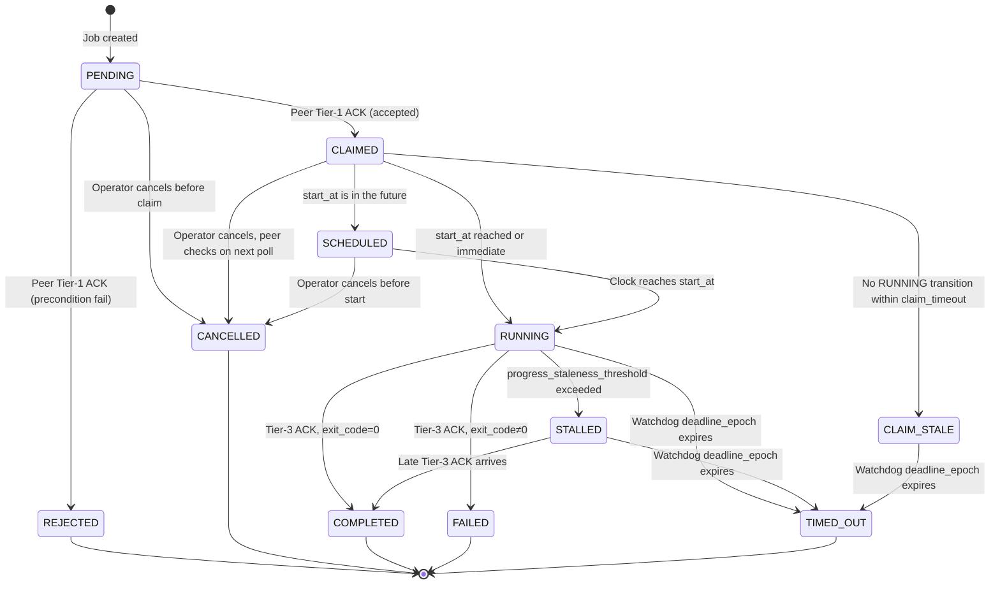
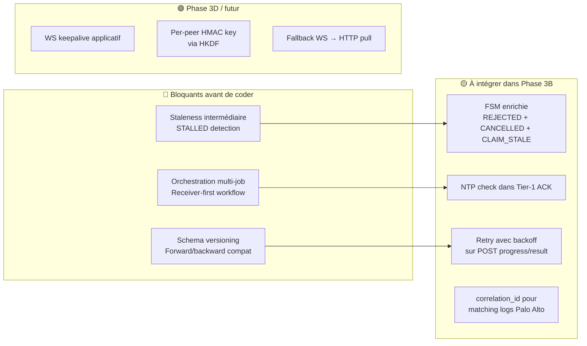

# 🔬 Revue Architecturale — Stigix Multi-Instance Control Plane

**Reviewed Specifications:**
- [SPECIFICATION_MULTI_INSTANCE_CONTROL_PLANE_REVISED.md](file:///Users/jsuzanne/Github/stigix/PRD/SPECIFICATION_MULTI_INSTANCE_CONTROL_PLANE_REVISED.md) (v0.4)
- [FLEET_CONTROL_PLANE_VISUAL_GUIDE.md](file:///Users/jsuzanne/Github/stigix/PRD/FLEET_CONTROL_PLANE_VISUAL_GUIDE.md) (v0.2)
- [PRD_FLEET_GATEWAY_PEER_CONTEXT_SWITCHING.md](file:///Users/jsuzanne/Github/stigix/PRD/PRD_FLEET_GATEWAY_PEER_CONTEXT_SWITCHING.md) (Phase 3D, v0.1)
- [STIGIX_MULTI_INSTANCE_ROADMAP_PA_ENGINEERING.md](file:///Users/jsuzanne/Github/stigix/PRD/STIGIX_MULTI_INSTANCE_ROADMAP_PA_ENGINEERING.md)

**Reviewer Posture:** Principal / Staff Systems Architect — réseaux distribués, SD-WAN, architectures Edge/Control-Plane  
**Date:** 2026-09-26

---

## Verdict global

> [!TIP]
> **La spécification est remarquablement mûre pour un v0.4.** Le choix agent-pull, la séparation Registry / Provisioning / Control Plane, l'isolation par phases, et la posture "off-path controller" sont exactement les bons appels pour un environnement SD-WAN/SASE avec branches derrière NAT. C'est du travail d'ingénierie réseau, pas du travail de développeur web qui aurait lu un tutoriel.

Les remarques ci-dessous sont des **durcissements**, pas des remises en question du modèle.

---

## 1. Robustesse du Cycle de Vie des Jobs

### 1.1 Machine à états — Failles et états bloquants

La FSM déclarée est :

```
PENDING → CLAIMED → SCHEDULED → RUNNING → COMPLETED | FAILED | TIMED_OUT
```

#### ✅ Ce qui est bien fait
- Le 3-Tier ACK (Claim → Progress → Result) est exactement le pattern utilisé par les systèmes de task-queue matures (Celery, Temporal, GCP Cloud Tasks).
- Le watchdog `deadline_epoch` avec grace period couvre le scénario crash/freeze.
- L'idempotency key protège contre la re-exécution.

#### ⚠️ Failles identifiées

| # | Faille | Scénario | Impact | Recommandation |
|---|--------|----------|--------|----------------|
| **F1** | **CLAIMED → ∅ (orphelin)** | Le peer claim le job, mais crash avant d'atteindre `start_at`. Il ne passe jamais RUNNING, donc pas de progress heartbeat. Le watchdog ne tire que sur `deadline_epoch` (= `start_at` + max_duration + 60s). Si `start_at` est dans 45s et `max_duration` est 300s, l'opérateur attend **~6 minutes** avant de savoir que le peer est mort. | UX dégradée, opérateur aveugle pendant la fenêtre d'attente | **Ajouter un `claim_timeout`** : si aucun passage à RUNNING n'est observé dans les N secondes après `start_at` (ex: `start_at + 30s`), le controller flag le sub-job comme `CLAIM_STALE` et alerte l'opérateur. Cela ne remplace pas le watchdog, c'est une **sentinelle intermédiaire**. |
| **F2** | **RUNNING → silence** | Le peer entre en RUNNING, envoie 2-3 progress heartbeats, puis disparaît (crash, OOM, lien coupé). Le controller ne détecte l'absence qu'au `deadline_epoch`. | Même problème que F1 mais plus insidieux car l'UI montre "RUNNING 45%" indéfiniment | **Ajouter un `progress_staleness_threshold`** : si aucun progress heartbeat n'est reçu depuis > 2× l'intervalle fast-poll (ex: 10-15s), marquer le sub-job comme `STALLED` (nouvel état intermédiaire ou simple flag UI). L'opérateur voit immédiatement qu'un peer a décroché. |
| **F3** | **Transition REJECTED manquante dans la FSM** | Le PRD mentionne `REJECTED` dans la description du Tier 1 mais **ne l'inclut pas dans la FSM textuelle** (ligne 302-307). C'est un état terminal distinct de FAILED. | Confusion d'implémentation | Ajouter `REJECTED` comme état terminal explicite dans la FSM. Un job REJECTED n'a jamais démarré, contrairement à FAILED (qui implique une exécution partielle). Cela a un impact sur le retry logic : un REJECTED est potentiellement retriable immédiatement (port occupé temporairement), un FAILED nécessite investigation. |
| **F4** | **Pas de `CANCELLED` explicite côté peer** | Le PRD liste `cancelled` dans la FSM ligne 306 mais ne spécifie pas le mécanisme. Comment le peer apprend-il qu'un job CLAIMED a été annulé par l'opérateur pendant qu'il attend `start_at` ? | Le peer exécute un job annulé | Le peer doit vérifier le statut du job lors de son prochain poll (fast ou standard). Le controller doit pouvoir marquer un job comme `CANCELLED` et le peer doit l'honorer **avant** de démarrer l'exécution à `start_at`. |

#### FSM révisée proposée



### 1.2 Synchronisation `start_at` et dérive NTP

#### Le mécanisme

Le PRD propose un timestamp Unix futur (`start_at = now + 45s`). Les peers claim indépendamment et lancent à `start_at`.

#### ✅ Pourquoi c'est fondamentalement solide
- Dans un lab SD-WAN typique, les boîtiers Linux sont synchronisés via NTP sur le même réseau d'entreprise. La dérive est de l'ordre de **1-10ms**, négligeable pour des tests réseau (convergence = mesure en centaines de ms).
- Le jitter de polling (0-30s) est **entièrement absorbé** par la fenêtre de 45s. C'est le bon pattern.

#### ⚠️ Risques réels à durcir

| Risque | Probabilité | Impact | Mitigation |
|--------|-------------|--------|------------|
| **Pas de NTP sur un boîtier lab** (VM sans ntpd, conteneur Docker sans chrony) | Moyenne | Dérive de plusieurs secondes voire minutes après un reboot. Un test de convergence multi-peer perd toute signification si BR1 démarre à T et BR5 à T+8s. | **Vérification NTP dans le readiness check du Tier 1 ACK.** Le peer reporte `ntp_synced: true/false` et `clock_offset_ms`. Si le décalage dépasse un seuil configurable (ex: 2s), le controller **WARN** l'opérateur dans l'UI mais n'empêche pas l'exécution (car le peer sait mieux localement si sa mesure est valide). |
| **Docker sans `--cap-add SYS_TIME`** | Haute dans un déploiement Docker standard | Le conteneur hérite de l'horloge host, mais si le host n'a pas NTP, même problème | Documenter dans le guide d'installation que le host doit avoir NTP activé. Exposer `clock_offset_ms` dans le heartbeat enrichi de Phase 3A. |
| **Fenêtre `start_at` trop courte pour un peer lent à poll** | Faible (45s > 30s poll max) | Un peer qui vient de poller à T-1s ne re-pollera qu'à T+29s, donc claim à T+29s. Si `start_at` = T+45s, il reste 16s de marge. C'est correct. | Aucune action immédiate. Mais documenter que pour des jobs critiques multi-peer, `start_at` devrait être ≥ `2 × poll_interval` (60s minimum). |

---

## 2. Modèle hybride Pull HTTP vs Reverse Tunnel WebSocket

### 2.1 Progression Pull HTTP (3B) → Reverse WebSocket (3D)

#### ✅ Excellent choix architectural

Le séquencement est parfait :

1. **Phase 3B (Pull HTTP)** — Zéro état de connexion persistant, zéro gestion de WebSocket, zéro problème de reconnexion. Le peer est un simple client HTTP qui fait des GET/POST. C'est **idempotent, stateless, et debuggable** avec `curl`. Pour un MVP c'est exactement ce qu'il faut.

2. **Phase 3D (Reverse WS Tunnel / BFF Gateway)** — C'est un changement de paradigme : on passe du "pull jobs" au "proxy l'intégralité de l'API peer à travers le leader". C'est un **superset fonctionnel** du pull-mode, pas un remplacement. Les deux modes coexisteront.

#### ⚠️ Observations critiques sur la Phase 3D

| # | Observation | Détail | Recommandation |
|---|-------------|--------|----------------|
| **O1** | **Le Gateway BFF (Phase 3D) et le Job Pull (Phase 3B) sont deux transports orthogonaux, pas une évolution linéaire** | Le PRD Phase 3D parle d'un reverse-proxy synchrone (requête → réponse) via le Leader. Le Pull-Mode est un job queue asynchrone. Les deux répondent à des besoins différents : inspection interactive (3D) vs orchestration batch (3B). | Clarifier dans le PRD que la Phase 3D **ne remplace pas** le pull-mode. Les deux transports coexistent : le pull-mode pour les jobs orchestrés, le gateway pour l'inspection interactive temps réel. |
| **O2** | **Le WebSocket reverse tunnel de la Phase 3D est architecturalement risqué derrière certains équipements SD-WAN** | Les proxies SASE (Prisma Access, Zscaler) peuvent terminer les WebSocket sur le path de sortie Internet. Les WAN accelerators peuvent interférer avec le framing WS. Les firewalls stateful ont des timeouts d'inactivité sur les connexions WS (souvent 5-10 min). | Prévoir un **keepalive WS applicatif** (pas juste le WS ping/pong) avec un intervalle < 60s. Prévoir un **fallback automatique** sur le pull-mode HTTP si le tunnel WS ne peut pas s'établir. Ne jamais faire du tunnel WS un hard requirement. |
| **O3** | **HMAC avec `cluster_secret` partagé (Phase 3D §4.1)** | Le PRD Phase 3D utilise `HMAC_SHA256(peerId + timestamp + path, cluster_secret)`. Ce secret partagé est un single point of compromise. Si un seul peer est compromis, le secret l'est pour tous. | À terme, migrer vers un modèle **per-peer key** dérivé (ex: `HKDF(master_secret, peerId)`) ou mTLS. Pour le MVP, le HMAC partagé est acceptable si le secret est distinct du JWT secret et du Cloudflare key. **Vérifier que le PRD interdit explicitement la réutilisation du JWT secret comme cluster_secret.** |

### 2.2 Pièges réseau lors des bascules SD-WAN (failover)

C'est le cœur du sujet pour une plateforme de validation SASE. Voici les scénarios à anticiper :

| # | Piège | Scénario SD-WAN | Impact sur le Control Plane | Mitigation |
|---|-------|-----------------|---------------------------|------------|
| **P1** | **TCP RST sur bascule de lien** | Le SD-WAN (Prisma SD-WAN, Viptela, VeloCloud) bascule le trafic du lien MPLS vers le lien Internet. Les sessions TCP existantes reçoivent un RST ou un timeout silencieux. | Le poll HTTP en cours échoue. Le progress heartbeat en cours est perdu. | **Retry avec backoff exponentiel (1s, 2s, 4s, max 15s)** sur les POST de progress/result. Le pull-mode est naturellement résilient car chaque poll est une nouvelle connexion TCP. C'est un avantage majeur du pull vs push. |
| **P2** | **Changement d'IP source NAT** | Après failover vers le lien 4G/5G, l'IP source publique du peer change. Si le controller fait du rate-limiting ou du session-pinning par IP source, les requêtes sont rejetées. | Poll échoue, peer apparaît offline alors qu'il est fonctionnel. | **Ne jamais binder la session peer à une IP source.** Authentifier par peer identity token, pas par IP. Le PRD fait déjà bien cela (authentification par peer identity), mais il faut le rendre explicite comme invariant. |
| **P3** | **DNS resolution failure pendant le failover** | Si `STIGIX_CONTROLLER_URL` utilise un FQDN et que le DNS du nouveau lien n'est pas encore convergé, le peer ne peut plus résoudre le controller. | Polling et heartbeat échouent silencieusement. | **Cache DNS local du controller FQDN** dans le peer. Résoudre au démarrage et cacher le résultat avec un TTL long (ex: 300s). En cas de failure DNS, utiliser la dernière IP connue. |
| **P4** | **MTU / fragmentation sur le nouveau path** | Le lien de failover (4G, IPsec, GRE) a souvent un MTU plus bas. Les gros payloads de Tier 3 Result (surtout les security suites avec 20+ résultats) peuvent être fragmentés ou droppés. | Le Final ACK ne passe pas, le watchdog tire en TIMED_OUT alors que le test a réussi. | **Limiter les payloads de result à < 1300 bytes** (safe pour tout tunnel). Si le résultat est trop gros, le compresser (gzip) ou le splitter en chunks. Alternativement, envoyer un résumé dans le result et stocker le détail localement sur le peer (récupérable via le gateway Phase 3D). |
| **P5** | **Asymétrie de path (split-brain routing)** | Le peer peut atteindre le controller via le nouveau lien, mais le controller ne peut pas atteindre le peer (si la Phase 3D gateway est active). | Le pull-mode continue de fonctionner (c'est son avantage). Le gateway Phase 3D est down pour ce peer. | **C'est exactement pour ça que le pull-mode doit rester le transport primaire.** Le gateway 3D est un "nice-to-have" interactif, pas le canal de contrôle critique. |

---

## 3. Granularité des Tests et Télémétrie

### 3.1 Isolation des suites de sécurité

#### ✅ Excellente structuration

La séparation en 4 suites distinctes (`url_filtering`, `dns_security`, `eicar_test`, `vulnerability_probe`) est bien pensée :

- Elle mappe directement sur les **profils de sécurité Palo Alto** (URL Filtering Profile, Anti-Spyware/DNS Security, Antivirus/WildFire, Vulnerability Protection).
- Elle permet de **valider chaque composant SASE indépendamment**, ce qui est exactement ce qu'un ingénieur fait pendant un POC.
- Elle évite le piège du "run all security tests" qui produit un blob de résultats inutilisable.

#### ⚠️ Améliorations suggérées

| # | Point | Détail | Recommandation |
|---|-------|--------|----------------|
| **S1** | **Pas de test SSL/TLS Decryption explicite** | `security.run_eicar_test` mentionne "SSL/TLS Decryption" dans sa description mais ne teste pas spécifiquement si le décryptage est actif. Un EICAR qui passe en HTTPS sans décryptage sera livré au client (HTTP 200) — mais le PRD ne distingue pas "EICAR bloqué car décrypté et inspecté" de "EICAR bloqué par un autre mécanisme". | Ajouter un **champ `decryption_observed`** dans le résultat EICAR. Le peer peut détecter si le certificat serveur a été remplacé par un CA de décryptage (signe que le trafic est inspecté). C'est un indicateur critique pour un POC SASE. |
| **S2** | **Pas de corrélation avec les logs SASE** | Le PRD mentionne en Phase 3C "Multi-step security test campaigns with Palo Alto SASE log correlation" mais ne spécifie pas le mécanisme. | C'est correct de différer, mais il faut **structurer les résultats dès la Phase 3B** pour permettre la corrélation future. Ajouter un champ `correlation_id` (UUID) dans chaque requête de test, que le peer injecte comme header HTTP custom (ex: `X-Stigix-Correlation: <uuid>`). Ce header apparaîtra dans les logs Palo Alto et permettra le matching. |

### 3.2 Port 9000 dédié pour XFR

#### ✅ Cohérent et bien justifié

- Séparer le XFR natif (port 9000) de iPerf3 legacy (port 5201) est le bon appel. Ça évite les conflits de binding et permet des politiques de firewall distinctes.
- Le workflow receiver-first (listener → ACK readiness → sender) est correct pour un test multi-peer.

#### ⚠️ Point d'attention

| Point | Détail |
|-------|--------|
| **Le Receiver-First workflow crée une dépendance temporelle entre deux jobs séparés** | Le controller doit dispatcher le listener job, attendre le readiness ACK, **puis** dispatcher le sender job. C'est un workflow à 2 phases qui n'est pas couvert par la FSM simple du job unitaire. Il faut soit un meta-job (orchestration de 2 sub-jobs), soit un mécanisme de dépendance inter-jobs (`depends_on: job_id_listener`). Le PRD ne spécifie pas ce mécanisme. |

### 3.3 Exhaustivité des métriques Final ACK

Les schémas de télémétrie retournés sont **globalement bons** pour diagnostiquer un POC SD-WAN. Voici ce qui manque :

| Métrique manquante | Pourquoi c'est important pour un POC SD-WAN | Suite concernée |
|--------------------|---------------------------------------------|-----------------|
| **`path_id` ou `wan_link` traversé** | Savoir si le trafic de test passe par le lien MPLS, Internet, ou LTE est *la* question fondamentale d'un POC SD-WAN. Sans cette info, un résultat de convergence ou de throughput est interprétable mais pas actionable. | `convergence.*`, `xfr.*`, `traffic.*` |
| **`tcp_mss_observed`** | Le MSS négocié révèle les problèmes de MTU/tunnel. | `xfr.*`, `connectivity.*` |
| **`dns_resolution_time_ms`** | Pour les probes HTTPS, le temps DNS est souvent le premier indicateur de problème SASE (DNS Security, CASB redirect). | `connectivity.*` |
| **`tls_handshake_time_ms`** | Indicateur critique de la latence ajoutée par le proxy SASE (SSL inspection, CASB inline). | `connectivity.*`, `security.*` |
| **`peer_local_timestamp`** | Le timestamp local du peer (pas celui du controller). Essentiel pour le debug quand les horloges dérivent. | Tous |
| **`controller_receive_timestamp`** | Quand le controller a reçu le result. Permet de calculer le délai de remontée. | Tous |

---

## 4. Recommandations Prioritaires — Les 3 Angles Morts Critiques

### 🔴 Angle Mort #1 : Absence de mécanisme de détection de staleness intermédiaire

> **Risque : L'opérateur regarde un dashboard qui ment.**

Le PRD a un watchdog `deadline_epoch` mais **aucun mécanisme de détection rapide** quand un job est RUNNING et que le peer disparaît. Un peer qui crash à 45% de progression va rester affiché "▶ RUNNING 45%" dans l'UI pendant potentiellement 6+ minutes (jusqu'au watchdog).

**Action immédiate avant de coder :**

```
Définir un contrat de progress heartbeat :
- Intervalle garanti : 5s (configurable)
- Staleness threshold : 15s (3× l'intervalle)
- Si le controller ne reçoit pas de heartbeat pendant 15s :
  → UI : badge "⚠️ STALLED — last update 18s ago" 
  → Pas de changement d'état formel (le peer peut revenir)
  → Le watchdog reste la décision terminale
```

### 🔴 Angle Mort #2 : Orchestration multi-job (XFR receiver-first, convergence multi-peer)

> **Risque : On ne peut pas implémenter XFR ou convergence correctement avec la FSM actuelle.**

La FSM actuelle modélise un job atomique sur un peer. Mais les cas d'usage les plus importants de Stigix (XFR speedtest, convergence failover, voice call) sont intrinsèquement **multi-peer et séquencés** :

- XFR : Listener doit être prêt AVANT que le sender démarre.
- Convergence : Les deux endpoints doivent être synchronisés.
- Voice : L'appelant et l'appelé doivent être coordonnés.

**Action immédiate avant de coder :**

```
Introduire le concept de "Job Group" ou "Campaign" :
- Un job group contient N sub-jobs avec des dépendances optionnelles
- Dépendance : "sub-job B ne démarre que quand sub-job A est RUNNING"
- Le start_at peut couvrir la synchronisation temporelle simple
- Mais le receiver-first workflow nécessite un ACK de readiness
  du listener AVANT le dispatch du sender

Option simple pour le MVP :
- Le controller gère la séquence en interne (pas de job group formel)
- Le controller attend le Tier-1 ACK "READY" du listener
- Puis dispatch le sender job avec start_at = now + 10s
- Documenter cette orchestration dans le catalog d'actions
```

### 🔴 Angle Mort #3 : Pas de versioning du contrat de télémétrie

> **Risque : Déploiement hétérogène impossible à maintenir.**

Dans un déploiement réel de 10-50 peers, toutes les instances ne seront **jamais** à la même version en même temps. Le PRD spécifie des schémas de télémétrie précis (Phase 3B) mais ne prévoit pas :

- Que se passe-t-il quand un peer v2.1.0 envoie un result à un controller v2.2.0 qui attend un champ supplémentaire ?
- Que se passe-t-il quand un controller v2.1.0 reçoit un result d'un peer v2.2.0 avec des champs inconnus ?

**Action immédiate avant de coder :**

```
1. Ajouter un champ "schema_version" dans chaque payload de télémétrie :
   { "schema_version": "1.0", "suite": "url_filtering", ... }

2. Le controller doit TOUJOURS accepter les champs inconnus (forward-compatible)
   → JSON parsing en mode "ignore unknown fields"

3. Le controller doit TOUJOURS tolérer les champs manquants (backward-compatible)
   → Valeurs par défaut pour les champs optionnels

4. Le peer doit inclure sa version Stigix dans le Tier-1 ACK
   → Le controller peut adapter le job manifest si nécessaire
```

---

## 5. Bonus — Observations mineures mais utiles

| # | Observation | Recommandation |
|---|-------------|----------------|
| **B1** | Le PRD mentionne SQLite/JSONL comme persistence MVP. SQLite est meilleur car il permet les requêtes sur les jobs et l'audit. | Commencer avec SQLite. Un fichier unique, zéro dépendance, requêtes SQL natives, WAL mode pour la concurrence. |
| **B2** | Le Visual Guide montre `■ Stopped` pour le trafic DC1 mais pas de timestamp "stopped since". | Ajouter `stopped_since` dans le heartbeat pour distinguer "jamais démarré" de "arrêté il y a 2h". |
| **B3** | Le PRD Phase 3D propose `#peer=BR8` comme URL hash pour le context switching. | Utiliser plutôt un query param `?context=BR8` qui est plus portable et permet le bookmarking/sharing. Le hash fragment n'est pas envoyé au serveur. |
| **B4** | Pas de mention de rate-limiting sur le poll endpoint côté controller. | Avec 50 peers en fast-poll (3-5s), ça fait ~10-17 req/s. C'est gérable, mais documenter le ceiling et prévoir un rate-limit par peer-id. |
| **B5** | Le readiness check du Tier 1 ACK ne mentionne pas la vérification de version minimum. | Un job `security.run_vulnerability_probe` qui arrive sur un peer v2.0.x (avant la feature) doit être rejeté proprement, pas crasher. Ajouter `min_version` dans le job manifest. |
| **B6** | Pas de mention de la taille maximale du job manifest ou du result payload. | Définir des limites explicites (ex: manifest < 64KB, result < 256KB). Important pour la résilience réseau (cf. piège P4 — MTU). |

---

## 6. Synthèse des actions



---

> [!IMPORTANT]
> **Mon conseil final :** ne changez rien au modèle fondamental — il est solide. Concentrez les efforts de durcissement sur la **détectabilité des pannes intermédiaires** (l'opérateur doit savoir en < 15s qu'un peer a décroché, pas en 6 minutes) et sur l'**orchestration multi-peer** (sans quoi les features flagship de Stigix — convergence, XFR, voice — ne peuvent pas être correctement pilotées à distance).
