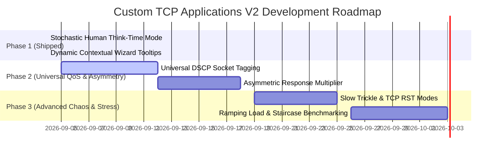

# Stigix Custom TCP Inter-Site Applications V2 — Product Requirements Document (PRD)

> **Document Status**: Approved / In Development  
> **Target Version**: Stigix v2.1.0+  
> **Author**: Stigix Product & Core Engineering  
> **Related Documents**: [V1 PRD](file:///Users/jsuzanne/Github/stigix/PRD/Custom%20TCP%20APP/PRD_Custom_TCP_InterSite_Applications_Stigix.md) | [Architecture Guide](file:///Users/jsuzanne/Github/stigix/docs/CUSTOM_TCP_APPS.md) | [User Guide & Recipes](file:///Users/jsuzanne/Github/stigix/docs/CUSTOM_TCP_APPS_USER_GUIDE.md)

---

## 1. Executive Summary

The **Stigix Custom TCP Applications Engine (V1)** established a robust, bi-directional, stateful Layer 4/7 synthetic emulation framework enabling enterprises to validate SD-WAN path selection, failover SLAs (`looping_delay`), session persistence, and percentile latency metrics ($p50, p95$) across complex WAN overlays.

**Custom TCP Applications V2** elevates Stigix from a functional synthetic emulator into a **carrier-grade, enterprise-realistic WAN chaos and Quality of Experience (QoE) testbed**. V2 focuses on:
1. **Universal QoS / DSCP Socket Marking** across all client workload modes.
2. **Realistic Asymmetric Traffic Modeling** (small requests triggering high-bandwidth responses).
3. **Advanced Security & Inspection Stressing** (Slow trickle streaming, TCP RST injection).
4. **Stochastic & Ramping Traffic Profiles** (human think-time variance, session capacity ramping).
5. **Multi-Hub Weighted Load Distribution** (active/active data center steering).

---

## 2. Feature Matrix: V1 Baseline vs. V2 Evolution

| Capability | V1 Baseline | V2 Evolution | Primary SD-WAN / SASE Value |
| :--- | :--- | :--- | :--- |
| **QoS / DSCP Tagging** | Best-Effort (OS default CS0) | **Universal DSCP Layer-3 Marking** (Dropdown on all client modes) | Validate QoS class priority, queue starvation, and bandwidth reservations during WAN congestion. |
| **Traffic Symmetry** | Symmetric (Echo payload / fixed size) | **Asymmetric Multiplier (`asymmetric_multiplier`)** | Emulate heavy downlink applications (SAP ERP, reporting, video, DB downloads) on asymmetric WAN links (FTTH, Starlink, 5G). |
| **Human Realism** | Fixed interval scheduling (e.g. 1000 ms) | **Stochastic / Human Think-Time (`stochastic`)** *(Shipped)* | Prevent AI-driven analytics (e.g., Palo Alto ADEM) from filtering out robotic synthetic pulses. |
| **Firewall & Proxy Stress** | Instant full-frame response | **Slow Trickle (`slow_trickle`)** | Test NGFW/SASE content inspection buffers, proxy timeouts, and WAN acceleration holding memory. |
| **Socket Teardown** | Clean FIN/ACK (`close_connection`) | **Hard TCP RST (`tcp_rst`)** | Test firewall session table cleanup, DB crash recovery, and client reconnect backoff. |
| **Capacity & Stress** | Constant concurrency (e.g., 2 conns) | **Ramping / Staircase Load (`ramping_load`)** | Determine maximum state table capacity and gateway autoscaling thresholds. |
| **Multi-Peer Steering** | Flat multi-peer broadcast | **Weighted Multi-Hub Mesh (`weighted_mesh`)** | Emulate active/active multi-datacenter traffic steering and ECMP load sharing. |

---

## 3. Detailed Feature Specifications

### 3.1. Universal DSCP / ToS IP Socket Marking (Client Option)

#### 3.1.1. Rationale & Architecture
Quality of Service (QoS) is fundamental to enterprise SD-WAN. DSCP (Differentiated Services Code Point) is an **IP header byte (Layer 3 / ToS)**. Therefore, DSCP must **NOT** be an isolated workload mode, but a **universal client parameter** available across all workload types (`persistent`, `stochastic`, `transactional`, `heartbeat`, `bulk_burst`, `continuous_stream`).

#### 3.1.2. Configuration & Standard DSCP Classes
In the Client Workload Defaults and Wizard Step 3, a **DSCP / QoS Class** selector allows tagging outbound socket packets:

| Class ID | DSCP Value (Hex/Dec) | Binary ToS Byte | Standard Industry Usage |
| :--- | :--- | :--- | :--- |
| `CS0` (Default) | `0` (0x00) | `0x00` | **Best Effort** — Standard internet and non-critical traffic. |
| `EF` | `46` (0x2E) | `0xB8` | **Expedited Forwarding** — Ultra-low latency voice (VoIP) and real-time audio. |
| `AF41` | `34` (0x22) | `0x88` | **Assured Forwarding 41** — Mission-critical interactive video / ERP. |
| `AF31` | `26` (0x1A) | `0x68` | **Assured Forwarding 31** — Core business applications & database transactions. |
| `AF21` | `18` (0x12) | `0x48` | **Assured Forwarding 21** — Standard business transactions. |
| `CS1` / `Scavenger` | `8` (0x08) | `0x20` | **Background / Bulk** — Backups, software updates, YouTube. |

#### 3.1.3. Runtime Socket Implementation
Under Node.js / Linux runtime:
```ts
// Set IP_TOS socket option on connection establishment
const socket = net.connect({ host: peer.host, port: peer.port });
socket.on('connect', () => {
    const dscpDecimal = appConfig.clientDefaults.dscp || 0;
    const tosByte = dscpDecimal << 2; // DSCP occupies the 6 high-order bits of IP ToS
    try {
        // @ts-ignore (setsockopt binding or OS socket helper)
        socket.setTrafficClass?.(tosByte);
    } catch (e) {
        console.warn(`[QOS] Could not set DSCP ${dscpDecimal}: ${e.message}`);
    }
});
```

---

### 3.2. Asymmetric Heavy Response Multiplier (`asymmetric_multiplier` — Server Mode)

#### 3.2.1. Rationale
Real-world enterprise applications are predominantly asymmetric:
- **Client (Branch $\rightarrow$ DC)**: Sends small SQL query / HTTP GET (128 bytes).
- **Server (DC $\rightarrow$ Branch)**: Returns large dataset / invoice PDF / telemetry bundle (100 KB to 5 MB).

#### 3.2.2. Configuration Parameters
- `multiplier`: Factor to multiply request size by (e.g., `50x`, `200x`).
- `fixedResponseBytes`: Alternatively, set an exact response body size (e.g. `65536` for 64 KB).
- `chunkSize`: Streaming chunk size (default `16384` bytes) to prevent memory allocation spikes.

#### 3.2.3. Operational Value
- Validates **Downlink Bandwidth Shapers** and **TCP Receive Window Scaling** on asymmetric broadband/LTE links.
- Emulates large document archiving, database reporting, and image transfer.

---

### 3.3. Slow Trickle & Response Fragmentation (`slow_trickle` — Server Mode)

#### 3.3.1. Rationale
Many firewall inspection engines (Next-Gen Firewalls, Cloud SWG/CASB proxies) buffer HTTP/TCP streams to inspect payload contents. When traffic is delivered in slow, fragmented chunks, inspection engines must manage memory buffers and idle connection timers.

#### 3.3.2. Configuration Parameters
- `chunkBytes`: Number of bytes transmitted per tick (e.g., `128` bytes).
- `tickIntervalMs`: Delay between chunks (e.g., `500` ms).
- `totalPayloadBytes`: Total size of the streamed response (e.g., `4096` bytes).

#### 3.3.3. Operational Value
- Stress tests NGFW proxy holding buffers and timeout resilience.
- Simulates real-time IoT sensors and low-speed satellite terminals.

---

### 3.4. Hard TCP RST Simulation (`tcp_rst` — Server Mode)

#### 3.4.1. Rationale
While `close_connection` sends a standard graceful TCP `FIN/ACK` teardown, hardware failures, kernel crashes, or firewall session drops inject an abrupt `TCP RST` packet.

#### 3.4.2. Configuration Parameters
- `rstAfterRequests`: Number of successful transactions before abruptly resetting the socket (e.g., `5`).
- `rstProbability`: Random chance of RST on incoming connect (`0-100%`).

#### 3.4.3. Runtime Implementation
```ts
// Hard socket destruction sending TCP RST instead of graceful FIN
socket.destroy(); // In Node.js, socket.destroy() without end() aborts with RST
```

---

### 3.5. Stochastic / Human Think-Time Mode (`stochastic` — Client Mode) *(Implemented in v2.0.8)*

#### 3.5.1. Rationale
Predictable, metronomic cadences (e.g., exactly every 1000 ms) are easily identified by SD-WAN AI engines as synthetic tests. The `stochastic` mode applies a Poisson-distributed variation between **0.4x and 2.2x** of the configured base cadence, generating realistic user interaction bursts.

---

### 3.6. Ramping & Staircase Load Generation (`ramping_load` — Client Mode)

#### 3.6.1. Rationale
Enables automated capacity benchmarking and stress testing without manual intervention.

#### 3.6.2. Configuration Parameters
- `initialConns`: Starting concurrent connections (e.g., `1`).
- `maxConns`: Peak concurrency (e.g., `50`).
- `stepConns`: Number of connections added per step (e.g., `+5`).
- `stepDurationSec`: Duration of each plateau (e.g., `30` sec).
- `holdPeakSec`: Duration to hold peak load before ramping down (e.g., `120` sec).

```
Concurrency
  ▲
50│                    ┌──────────────┐ (Hold Peak)
  │                 ┌──┘              └──┐
30│              ┌──┘                    └──┐
10│        ┌─────┘                          └─────┐
 0└────────┴──────────────────────────────────────┴──► Time
```

---

## 4. Schema & Data Model Updates (`types.ts`)

```typescript
// ─── V2 Server Behavior Modes ──────────────────────────────────────────────────
export type ServerBehaviorMode =
    | 'echo'
    | 'acknowledge'
    | 'fixed_delay'
    | 'random_delay'
    | 'looping_delay'
    | 'drop_response'
    | 'close_connection'
    | 'error_response'
    // V2 Extensions:
    | 'asymmetric_multiplier'
    | 'slow_trickle'
    | 'tcp_rst';

// ─── V2 Client Workload Modes ──────────────────────────────────────────────────
export type ClientWorkloadMode =
    | 'persistent_request_reply'
    | 'stochastic'               // Shipped in v2.0.8
    | 'transactional'
    | 'heartbeat'
    | 'bulk_burst'
    | 'continuous_stream'
    // V2 Extensions:
    | 'ramping_load';

// ─── Universal Client Defaults (Applies to all Client Workload Modes) ──────────
export interface ClientWorkloadConfig {
    mode: ClientWorkloadMode;
    connectionsPerPeer: number;
    intervalMs: number;
    payloadBytes: number;
    requestTimeoutMs: number;
    connectTimeoutMs: number;
    autoReconnect: boolean;
    reconnectInitialMs: number;
    reconnectMaxMs: number;
    tcpKeepalive: boolean;
    sourceInterface?: string;
    // V2 Universal Parameters:
    dscp?: number;               // 0 (CS0), 46 (EF), 34 (AF41), 26 (AF31), 8 (CS1), etc.
    dscpLabel?: string;          // e.g. 'AF31 (Critical Business)'
}
```

---

## 5. UI / UX Design Specifications

### 5.1. Universal DSCP Selector (Step 3: Client Defaults)
A 6th input field added to the Client Workload Generation Defaults row:
- **Field Name**: `QoS / DSCP Tag`
- **Component**: Styled `<select>` with standard QoS categories (`CS0 Best Effort`, `EF Voice`, `AF41 Interactive Video`, `AF31 Business Critical`, `CS1 Bulk`).
- **Telemetry Badge**: Displays the active DSCP tag in the session drawer and session tables.

### 5.2. Real-Time Telemetry & Drawer Enhancements
- **Outgoing Sessions Drawer**: Shows applied Layer-3 DSCP mark, transmitted byte distribution, and instant Downlink/Uplink asymmetry ratios ($TX:RX$).

---

## 6. Implementation & Rollout Roadmap



---

## 7. Verification & Acceptance Criteria

1. **DSCP Packet Tag Verification**:
   - Capture live frames with `tcpdump -v -i eth0 'tcp port 8443'` and verify that IP ToS field equals `(dscp << 2)`.
2. **Asymmetric Bandwidth Verification**:
   - When configured with `multiplier: 100` and `payload: 1024`, verify incoming bandwidth on client displays $\sim 100\times$ higher RX bitrate than TX bitrate.
3. **Stochastic Interval Distribution**:
   - Verify that session interval logs follow a natural randomized spread between $0.4\times$ and $2.2\times$ base interval.
4. **Backward Compatibility**:
   - Applications defined in V1 configuration files seamlessly load and execute without schema errors.
