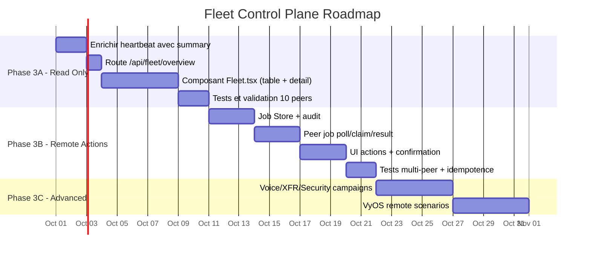

# 🎯 Stigix Fleet — Ce que ça change concrètement

**Last Updated:** 2026-09-25  
**Creation Date:** 2026-09-25  
**Initial Stigix Version:** v2.1 (planned)  
**Status:** Draft  
**Author:** jsuzanne

> Version simplifiée du [PRD Multi-Instance Control Plane](SPECIFICATION_MULTI_INSTANCE_CONTROL_PLANE_REVISED.md)

## Revision History

| Version | Date | Author | Changes |
|---|---|---|---|
| 0.1 | 2026-09-25 | jsuzanne | Initial visual guide — Fleet Overview, Peer Detail, Remote Actions wireframes, data flow diagram, change summary |

---

## Le problème aujourd'hui

```
Aujourd'hui tu as 8 instances Stigix (BR1, BR2, BR5, BR8, DC1, DC2, Cloud, Lab).

Pour voir si les probes sont OK sur BR8 :
  → Ouvrir http://192.168.8.10:8080 → aller sur Connectivity Performance

Pour lancer un test de convergence sur BR5 :
  → Ouvrir http://192.168.5.10:8080 → aller sur Failover → cliquer Start

Pour vérifier que la config est synchro partout :
  → Ouvrir chaque instance une par une → Settings → Provisioning Status

❌ 8 onglets. 8 URLs. 8 logins. Pas de vue globale.
```

---

## Ce que Fleet apporte

```
Avec Fleet, tu restes sur UNE SEULE instance (le Leader / DC1).

Un nouvel onglet "Fleet" apparaît dans la barre de navigation :

  Dashboard | Traffic | Probes | Failover | Voice | Security | IoT | Custom Apps | Fleet ← NOUVEAU
```

---

## Écran 1 : Fleet Overview (Phase 3A — Lecture seule)

C'est une **table de tous tes peers** avec leurs métriques clés, visible d'un coup d'œil :

```
┌──────────────────────────────────────────────────────────────────────────────┐
│  🏢 Fleet Overview                                              [⟳ Refresh] │
├──────────────────────────────────────────────────────────────────────────────┤
│                                                                              │
│   🟢 6 Online    🟡 1 Degraded    🔴 1 Offline                    8 total   │
│                                                                              │
├──────┬──────────┬─────────┬────────────┬───────────┬──────────┬─────────────┤
│ Site │ Status   │ Version │ Probes     │ Voice MOS │ Traffic  │ Config Rev  │
├──────┼──────────┼─────────┼────────────┼───────────┼──────────┼─────────────┤
│ BR1  │ 🟢 Online│ v2.0.66 │ 12/12 ✅   │ 4.35      │ ▶ Active │ r17 ✅      │
│ BR2  │ 🟢 Online│ v2.0.66 │ 11/12 ⚠️   │ —         │ ▶ Active │ r17 ✅      │
│ BR5  │ 🟡 Degr. │ v2.0.65 │ 8/12 ⚠️    │ 3.10 ⚠️   │ ▶ Active │ r16 ⏳      │
│ BR8  │ 🟢 Online│ v2.0.66 │ 12/12 ✅   │ 4.40      │ ▶ Active │ r17 ✅      │
│ DC1  │ 🟢 Online│ v2.0.66 │ 10/10 ✅   │ —         │ ■ Stopped│ r17 ✅      │
│ DC2  │ 🟢 Online│ v2.0.66 │ 10/10 ✅   │ —         │ ▶ Active │ r17 ✅      │
│ Cloud│ 🟢 Online│ v2.0.66 │ 5/5 ✅     │ —         │ ▶ Active │ r17 ✅      │
│ Lab  │ 🔴 Offl. │ v2.0.64 │ — (stale)  │ — (stale) │ — (stale)│ r15 ❌      │
└──────┴──────────┴─────────┴────────────┴───────────┴──────────┴─────────────┘
                                                                 ↑
                                                    Dernière donnée connue
                                                    affichée en grisé pour
                                                    les peers offline
```

### Ce que tu vois d'un coup d'œil :
- **Qui est en ligne** et depuis quand
- **Combien de probes échouent** sur chaque site
- **Le score MOS Voice** en temps réel
- **Le trafic tourne-t-il** ou pas
- **La config est-elle à jour** (révision appliquée vs publiée)
- **Quelle version** tourne sur chaque peer

### D'où viennent ces données ?
Chaque peer les envoie **automatiquement dans son heartbeat** (toutes les 30s). Aucune action manuelle. Le Leader les agrège et les affiche.

---

## Écran 2 : Peer Detail (clic sur une ligne)

Quand tu cliques sur "BR5" dans la table, tu obtiens un panneau de détail :

```
┌──────────────────────────────────────────────────────────────────────────────┐
│  ← Back to Fleet          BR5 — Branch Paris 5                              │
├──────────────────────────────────────────────────────────────────────────────┤
│                                                                              │
│  Status: 🟡 Degraded          IP: 192.168.5.10          Version: v2.0.65    │
│  Last Heartbeat: 12s ago      Role: SPOKE               Uptime: 14d 3h     │
│                                                                              │
│  ─── Capabilities ───────────────────────────────────────────────────────    │
│  ✅ Traffic   ✅ Probes   ✅ Convergence   ✅ Voice   ✅ XFR   ✅ Custom TCP │
│                                                                              │
│  ─── Connectivity Probes ────────────────────────────────────────────────    │
│  Total: 12 | Passing: 8 | Failing: 4                     Score: 67/100     │
│  ⚠️ google.com (HTTPS) — Timeout 5.2s                                       │
│  ⚠️ office365.com (HTTPS) — 503 Error                                       │
│  ⚠️ salesforce.com (DNS) — NXDOMAIN                                         │
│  ⚠️ zoom.us (ICMP) — 100% loss                                              │
│                                                                              │
│  ─── Voice ──────────────────────────────────────────────────────────────    │
│  Last MOS: 3.10 ⚠️       Active Calls: 2       Last Test: 5 min ago        │
│                                                                              │
│  ─── Provisioning ───────────────────────────────────────────────────────    │
│  Status: ⏳ Behind (r16, leader is at r17)                                   │
│  applications: r16 ✅ | connectivity-probes: r16 ✅ | voice-config: r15 ⚠️   │
│  Local Overrides: 3 items                                                    │
│                                                                              │
│  ─── Actions (Phase 3B) ────────────────────────────────────────────────    │
│  [ ▶ Start Traffic ]  [ ■ Stop Traffic ]  [ 🔄 Run Probes ]                 │
│  [ 🔗 Open BR5 Dashboard ]    ← ouvre http://192.168.5.10:8080              │
│                                                                              │
└──────────────────────────────────────────────────────────────────────────────┘
```

---

## Écran 3 : Actions à distance (Phase 3B — Plus tard)

Depuis Fleet, tu pourras **déclencher des actions** sans ouvrir chaque instance :

```
┌──────────────────────────────────────────────────────────────────────────────┐
│  ⚡ New Fleet Action                                                         │
├──────────────────────────────────────────────────────────────────────────────┤
│                                                                              │
│  Action:  [ ▶ Start Traffic        ▼ ]                                       │
│                                                                              │
│  Target Peers:                                                               │
│    ☑ BR1 (🟢 Online, v2.0.66)                                                │
│    ☑ BR2 (🟢 Online, v2.0.66)                                                │
│    ☑ BR5 (🟡 Degraded, v2.0.65)                                              │
│    ☐ BR8 (🟢 Online, v2.0.66)                                                │
│    ☐ Lab (🔴 Offline — sera ignoré)                                          │
│                                                                              │
│  ⚠️ BR5 is running v2.0.65 (older than leader v2.0.66)                      │
│  ⚠️ Lab is offline and will be skipped                                       │
│                                                                              │
│                          [ Cancel ]   [ ✅ Confirm & Execute ]               │
│                                                                              │
└──────────────────────────────────────────────────────────────────────────────┘
```

Après confirmation, le résultat s'affiche en temps réel :

```
  Job #J-20260925-001 — Start Traffic on 3 peers
  ├─ BR1:  ✅ Started (0.3s)
  ├─ BR2:  ✅ Started (0.5s)
  ├─ BR5:  ⏳ Pending (peer will pick up on next poll)
  └─ Lab:  ⏭ Skipped (offline)
```

---

## Comment ça marche sous le capot

```
                          ┌─────────────────────┐
                          │  Leader (DC1)        │
                          │                      │
                          │  Fleet UI            │
                          │  Job Store           │
                          │  Registry            │
                          │  Provisioning        │
                          └──────────▲───────────┘
                                     │
            ┌────────────────────────┼──────────────────────────┐
            │                        │                          │
     ┌──────┴──────┐          ┌──────┴──────┐           ┌──────┴──────┐
     │    BR5      │          │    BR8      │           │    BR1      │
     │             │          │             │           │             │
     │ Toutes les  │          │ Toutes les  │          │ Toutes les  │
     │ 30 secondes │          │ 30 secondes │           │ 30 secondes │
     │ j'envoie :  │          │ j'envoie :  │           │ j'envoie :  │
     │             │          │             │           │             │
     │ • Mon IP    │          │ • Mon IP    │           │ • Mon IP    │
     │ • Mes probes│          │ • Mes probes│           │ • Mes probes│
     │ • Mon MOS   │          │ • Mon MOS   │           │ • Mon MOS   │
     │ • Mon trafic│          │ • Mon trafic│           │ • Mon trafic│
     │ • Ma config │          │ • Ma config │           │ • Ma config │
     │             │          │             │           │             │
     │ Et je       │          │ Et je       │           │ Et je       │
     │ récupère :  │          │ récupère :  │           │ récupère :  │
     │ • Jobs à    │          │ • Jobs à    │           │ • Jobs à    │
     │   exécuter  │          │   exécuter  │           │   exécuter  │
     │ • Config    │          │ • Config    │           │ • Config    │
     │   globale   │          │   globale   │           │   globale   │
     └─────────────┘          └─────────────┘           └─────────────┘

     C'est toujours le PEER qui contacte le Leader.
     Jamais l'inverse.
     → Ça marche même si les branches sont derrière du NAT.
     → Si le Leader tombe, chaque peer continue de fonctionner seul.
```

---

## Ce qui NE CHANGE PAS

| Élément | Impact |
|---|---|
| **Chaque instance reste autonome** | Si le Leader tombe, BR8 continue ses tests localement |
| **L'UI locale de chaque peer** | Dashboard, Traffic, Probes, Voice, etc. — tout reste en place |
| **Le Global Provisioning** | La config est toujours publiée par le Leader et tirée par les Peers |
| **Le mode standalone** | Une instance sans controller fonctionne exactement comme avant |
| **L'autodiscovery Cloudflare** | Continue de fonctionner si pas de `STIGIX_CONTROLLER_URL` |
| **Le MCP / Claude Desktop** | Continue de fonctionner en mode direct (push) pour les labs |

---

## Ce qui CHANGE

| Changement | Phase | Impact visuel |
|---|---|---|
| **Nouvel onglet "Fleet"** dans la navbar | 3A | Un nouvel item de menu apparaît à droite |
| **Table de tous les peers** avec statuts en temps réel | 3A | Page Fleet Overview avec badges online/offline |
| **Panneau de détail peer** avec métriques résumées | 3A | Clic sur un peer → résumé probes, MOS, config |
| **Lien "Open peer UI"** pour accéder à l'instance distante | 3A | Bouton qui ouvre l'URL du peer dans un nouvel onglet |
| **Heartbeat enrichi** avec résumé télémétrie | 3A | Invisible (backend) — les peers envoient plus de données |
| **Actions à distance** (Start/Stop Traffic, Run Probes) | 3B | Boutons d'action sur la fiche peer + modale de confirmation |
| **Job tracker** avec résultats par peer | 3B | Liste des actions en cours/terminées avec statut par site |

---

## Planning de livraison



---

## Résumé en une phrase

> **Fleet = un seul écran sur le Leader pour voir la santé de tous tes sites et déclencher des actions sans ouvrir 8 onglets.**
