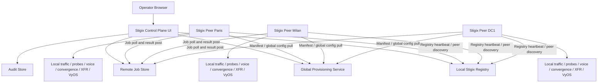

# Prompt for Google Antigravity

You are working in the `jsuzanne/stigix` repository. This document defines **Phase 3** of the multi-instance roadmap: remote fleet observability and remote control from a central Stigix control-plane instance.

Before implementing anything, read these two prerequisite specifications and treat them as architectural contracts:

1. `STIGIX_DIRECT_CONTROLLER_PEER_INSTALLATION_SPEC.md` — Phase 1: one-line installation, direct controller URL, peer registration to local registry, no Cloudflare use in direct mode.
2. `STIGIX_GLOBAL_CONFIGURATION_PROVISIONING_SPEC.md` — Phase 2: leader-published global configuration, peer pull, local overrides, flat active runtime config files, safe opt-in migration.

## Mandatory coherence rules

- This Phase 3 control plane is **not** the registry and is **not** the configuration-provisioning engine.
- Reuse the existing local registry as the authoritative source for peer identity, presence, liveness, capabilities, controller association, and management reachability metadata.
- Reuse Phase 2 provisioning status; do not create another competing configuration push/deploy mechanism.
- A central control-plane instance may be **off-path**. It does not need to generate traffic, host test targets, have a data-plane role, or be reachable as a target from every peer.
- A control-plane instance can be installed in a central site, a DC, a cloud VM, a management network, a POC environment, or another suitable management location.
- Each remote Stigix peer remains autonomous and continues to work locally if the controller is unavailable.
- In the initial remote-control implementation, do not assume the controller can establish inbound HTTPS connectivity to every branch. Prefer an **agent-pull job model** over controller-to-peer direct REST calls, because peers already establish outbound connectivity to the controller for registry heartbeats and provisioning pulls.
- Do not expose or distribute secrets. Do not share the regular Stigix JWT secret across instances.
- Do not implement this Phase 3 work in the same release as Phase 1 or Phase 2. Finish, test, and release each prerequisite separately.

## Required first task

Inspect the actual repository before editing. Verify:

- Current direct-controller registry client/manager and actual local registry routes.
- Actual peer heartbeat payload and persistent identity fields.
- Current Phase 2 provisioning APIs/status model, if present.
- Existing local APIs for traffic, convergence, voice, XFR, VyOS, health, system state, and maintenance.
- Existing MCP distributed orchestration features and whether an existing client abstraction can be reused.
- Existing authentication, audit, persistence, WebSocket/SSE and job-related utilities.

Do not invent endpoint names, payloads, source paths, or authentication mechanisms where current code already has equivalents. Adapt the implementation to the repository.

---

# Stigix — Specification: Multi-Instance Control Plane

**Last Updated:** 2026-09-25  
**Creation Date:** 2026-09-25  
**Initial Stigix Version:** v2.1 (planned)  
**Status:** Revised proposal, aligned with direct peer installation and global configuration provisioning  
**Version:** 0.5  
**Audience:** Stigix development / Google Antigravity  
**Language:** English for implementation clarity

## Revision History

| Version | Date | Author | Changes |
|---|---|---|---|
| 0.1 | 2026-09-25 | jsuzanne | Initial draft — broad Hub-calls-agent model |
| 0.2 | 2026-09-25 | jsuzanne | Revised to agent-pull model, aligned with Phase 1 (Direct Controller) and Phase 2 (Global Provisioning), removed competing Fleet Config APIs |
| 0.3 | 2026-09-25 | jsuzanne | Integrated architectural review recommendations: enriched heartbeat telemetry instead of separate `/api/fleet/telemetry`, last-known-state for offline peers, MCP/Fleet coexistence clarification, WebSocket for Fleet UI updates, adaptive polling for job storm mitigation |
| 0.4 | 2026-09-26 | jsuzanne | Added detailed Pull-Mode Job Lifecycle (3-stage ACKs: Claim, Progress, Result + Watchdog), synchronized `start_at` scheduling, adaptive fast polling (3-5s), explicit port 9000 for XFR speedtest, granular security test suites (URL filtering, DNS security, EICAR AV, CVE probes), and concrete telemetry return schemas |
| 0.5 | 2026-09-26 | jsuzanne | Integrated architectural review hardening: `STALLED` state detection (15s fast-poll staleness), NTP readiness check in Tier-1 ACK, multi-job Receiver-First orchestration workflow for XFR, schema_versioning, SASE `correlation_id`, and failover retry backoff |

## Objective

Add a remote multi-instance control capability to Stigix from one central **Control Plane** instance, also called **Controller** or **Hub** in the UI.

The Control Plane lets an operator:

- See the health and state of all registered Stigix peers.
- View consolidated operational metrics.
- Trigger approved remote actions on one or multiple peers.
- Track execution as durable jobs with per-peer results.
- Review configuration rollout status produced by Phase 2.
- Keep an auditable record of remote actions and failures.

The Control Plane must not replace local Stigix autonomy. Each peer stays usable locally and continues to generate traffic, run tests, retain configuration, and collect local results when the Control Plane is unavailable.

## Scope boundary

This document deliberately narrows the older broad “Hub calls every agent directly” model.

### Registry

Registry answers:

```text
Which peers exist, where are they, which capabilities do they declare, and are they alive?
```

It is already handled by the local registry and direct-controller bootstrap from Phase 1.

### Provisioning

Provisioning answers:

```text
Which global configuration revision should this peer apply, and what local overrides remain?
```

It is handled by Phase 2 through immutable revisions, peer pull, local overrides, atomic apply, status and rollback.

### Control Plane

Control Plane answers:

```text
What do I want remote peers to do now, and what happened on each peer?
```

It creates commands/jobs, peers pull those jobs through their existing outbound controller relationship, execute locally using their existing local APIs/service logic, then report results.

Do not add a second configuration deployment engine under `/api/fleet/config/*`. Configuration rollout must use the Phase 2 provisioning framework.

---

## Why agent-pull is the MVP

A controller can be off-path:

- It may be installed on a management VM, in a DC, in a cloud VPC/VNet, on a central site, or even on a laptop used for a POC.
- It may not be a traffic target or a traffic generator.
- It may have no direct route, NAT traversal, port forwarding, Tailscale access, reverse-proxy reachability, or inbound HTTPS access to remote branches.

The remote peer, however, already contacts the controller in direct-controller mode to register and retrieve peer/provisioning data. The safest and most generally deployable control pattern is therefore:

```text
Control Plane stores a job
        ↓
Peer polls/pulls jobs over its outbound controller connection
        ↓
Peer validates and runs the action locally
        ↓
Peer posts sanitized result to Control Plane
```

This avoids requiring the controller to call directly into branches.

A future direct controller-to-agent REST transport may be added for labs with management reachability, but it must be optional and must not be the required MVP transport.

---

## Roles

| Role | Responsibility |
|---|---|
| **Peer / Agent** | Stigix instance in a branch, DC, cloud location or lab. It generates traffic, runs local probes/tests, applies global configuration, polls jobs, executes allowed commands locally, and reports status/results. |
| **Control Plane / Controller** | Central Stigix instance that receives registry information, stores fleet state, publishes configuration through Phase 2, creates jobs, collects results and provides the Fleet UI. It may be off-path. |
| **Registry** | Existing local registry used for peer identity, heartbeat, discovery, liveness, capability and management metadata. |
| **Operator** | Authenticated user viewing fleet data or requesting permitted remote actions. |

Do not conflate the Control Plane role with a traffic target role. A controller must be able to be deployed without target services or a data-plane test function.

---

## Deployment modes

### Control Plane only

Recommended for central management:

```text
Central Stigix Control Plane
- Registry enabled
- Fleet UI enabled
- Provisioning authority enabled
- Remote job API enabled
- Traffic generation optional/off by default
- Target responder services optional/not required
```

### Combined controller and peer

Useful in a small lab:

```text
One Stigix instance can be both:
- Control Plane for other peers
- A normal local traffic/test instance
```

The implementation must not assume this combined mode. The Fleet feature must work when the controller has no data-plane role.

### Standalone peer

An instance without a controller keeps its existing standalone behavior.

---

## Architecture



No Cloudflare dependency is required in direct-controller mode. Existing hybrid Cloudflare autodiscovery must continue to coexist unchanged for users who do not configure an explicit controller URL.

---

## Functional scope

## Phase 3A — Fleet inventory and observability

Implement this first. It is read-only and validates the control-plane data model before remote action is introduced.

### Fleet view

Add a navigation item such as:

```text
Fleet
```

Show all peers known to the existing registry. For each peer, display only data that is available and fresh enough:

- Site/display name and stable instance ID.
- Online/degraded/offline/unknown state.
- Last heartbeat and data freshness.
- Stigix version.
- Declared capabilities.
- Current traffic status if reported.
- Number of failing probes if reported.
- Latest convergence summary if available.
- Latest voice/MOS summary if available.
- Latest XFR summary if available.
- Provisioning status from Phase 2: enabled/disabled, revisions, last sync, errors, local override count where available.

Do not declare a peer offline just because an optional metric is unavailable. Registry heartbeat/liveness remains the basic presence signal.

### Data collection

For the initial implementation, do not make the controller scrape peer REST APIs directly. Extend the peer’s existing outbound heartbeat or a lightweight periodic telemetry post to include sanitized summary data.

Each peer sends only compact summaries, not raw histories or unbounded logs.

Suggested conceptual telemetry fields:

```json
{
  "instanceId": "existing-stable-id",
  "reportedAt": "timestamp",
  "version": "current-version",
  "capabilities": ["traffic", "connectivity", "convergence"],
  "summary": {
    "traffic": { "active": true, "rate_mbps": 4.57, "tx_mbps": 2.34, "rx_mbps": 2.23 },
    "connectivity": { "failingProbeCount": 1 },
    "convergence": { "status": "good", "lastRunAt": "timestamp" },
    "voice": { "mos": 4.1, "lastRunAt": "timestamp" },
    "xfr": { "status": "success", "lastRunAt": "timestamp" }
  },
  "provisioning": {
    "enabled": true,
    "applicationsRevision": 17,
    "probesRevision": 8,
    "status": "applied"
  }
}
```

Use actual existing fields and endpoint conventions after inspection. The example is semantic only.

### Health state

Keep the first health model explainable and conservative:

| State | Meaning |
|---|---|
| `online` | Recent registry heartbeat; peer is reporting normally. |
| `degraded` | Recent heartbeat but a reported health/probe/config/action issue exists. |
| `offline` | Heartbeat expired according to existing registry liveness thresholds. |
| `unknown` | Peer newly registered or no successful telemetry yet. |

A sophisticated 0–100 health score can be deferred until the normalized telemetry model has been proven across versions.

---

## Phase 3B — Remote actions and jobs

Implement only after Fleet inventory is stable.

### Job model

Any remote action must create one durable central job with independent per-peer sub-results.

Suggested state model:

```text
queued -> available -> claimed -> running -> succeeded
                                        ├-> failed
                                        ├-> timed_out
                                        ├-> cancelled
                                        └-> partially_succeeded
```

Store per peer:

- Stable peer/instance ID.
- Command type and sanitized parameters.
- Creation time, claim time, start time, completion time.
- Status.
- Result summary.
- Local remote reference where available.
- HTTP/application error code or safely summarized error.
- Idempotency key.

### Asynchronous Pull-Mode Job Lifecycle & 3-Tier ACK Architecture

Because remote peers are frequently positioned behind stateful firewalls, branch routers, or NAT, the Control Plane uses an asynchronous **agent-pull model**. To ensure absolute operational visibility, execution synchronization, and fault-tolerance, every job adheres to a **3-Tier ACK and State Machine** lifecycle:

```text
 Controller / Fleet UI                                          Remote Peer (e.g., BR1)
         │                                                                  │
  [Create Job: PENDING]                                                     │
  (start_at = now + 45s)                                                    │
         │                                                                  │
         │◄──────────── Periodic Poll (every 30s) ──────────────────────────│
         │───────────── Delivers Job Manifest ─────────────────────────────►│
         │                                                                  │
         │   [TIER 1 ACK: CLAIM & READINESS VALIDATION]                     │
         │◄── POST /api/fleet/peer-jobs/:id/ack ────────────────────────────│
         │    status: "CLAIMED", readiness: "ACCEPTED" | "REJECTED"         │ (Verifies local capabilities,
  [State: CLAIMED / SCHEDULED]                                              │  module active, port 9000 free)
  (UI: ⏳ Scheduled for 11:20:00)                                          │
         │                                                                  │
         │                                                     [Local clock reaches start_at]
         │                                                     [Process launches]
         │                                                     [Peer enters Fast-Polling: 3-5s]
         │                                                                  │
         │   [TIER 2 ACK: PROGRESS HEARTBEATS]                              │
         │◄── POST /api/fleet/peer-jobs/:id/progress ───────────────────────│
  [State: RUNNING]   status: "RUNNING", progress_pct: 45                    │
  (UI: ▶ Active 45% + live streaming metrics)                               │
         │                                                                  │
         │                                                     [Execution ends or aborts]
         │   [TIER 3 ACK: SANITIZED FINAL RESULT]                           │
         │◄── POST /api/fleet/peer-jobs/:id/result ─────────────────────────│
         │    status: "COMPLETED" | "FAILED", exit_code, metrics payload   │
  [State: COMPLETED]                                                        │ [Peer returns to 30s poll]
  (UI: ✅ Completed + Detailed Telemetry Dialog)                             │
```

#### Job State Definitions & Failure Sentinels:
- `PENDING`: Stored on the Controller, awaiting the peer's next polling cycle.
- `CLAIMED`: Claimed by the target peer with Tier 1 ACK. Peer validates local preconditions (port 9000 free, binaries present, NTP synchronization). If preconditions fail, peer returns `REJECTED`.
- `REJECTED`: Terminal state indicating local refusal to execute; immediately reported to Controller UI.
- `SCHEDULED`: Waiting for synchronized execution epoch (`start_at`).
- `RUNNING`: Actively running locally. Peer streams progress via fast-polling (3–5s).
- `STALLED` *(Intermediate Warning Sentinel)*: Triggered in the Controller UI if no progress heartbeat is received from a `RUNNING` peer for **> 15 seconds** (3× fast-poll interval). Alerts the operator instantly if an agent freezes or suffers sudden link drop, without waiting for the multi-minute watchdog timeout. If a late heartbeat or result arrives, transitions resume normally.
- `CLAIM_STALE`: Controller alert if a peer claimed a job but never transitions to `RUNNING` within `start_at + 30s` (detects peer crash during wait period).
- `CANCELLED`: Explicit operator cancellation before or during execution.
- `COMPLETED`: Finished successfully with exit code 0 and metrics payload returned.
- `FAILED`: Finished with non-zero exit code or execution error; error details captured.
- `TIMED_OUT`: Controller watchdog terminal state triggered if no final result is received before `deadline_epoch`.

#### Synchronized Multi-Node Scheduling (`start_at`) & NTP Guardrails
With a default 30-second polling interval, peers poll with a jitter of 0–30s. For tests that require multiple peers to act in unison (e.g. Traffic saturation, Convergence failovers, Voice calls, or Mesh tests), the Controller specifies a future execution epoch:
```json
"start_at": 1727342445 // Unix epoch (now + 45s)
```
Target peers poll and claim the job independently during their standard cycles, initialize test fixtures locally, and hold until their system clock hits `start_at`, triggering execution at the exact same second across the entire fleet.

**NTP Readiness Invariant:**
In their Tier-1 ACK, peers report their NTP synchronization state:
```json
{ "status": "CLAIMED", "ntp_synced": true, "clock_offset_ms": 4 }
```
If `clock_offset_ms > 2000` (clock drift > 2 seconds), the Controller flags a `CLOCK_DRIFT_WARNING` in the Fleet UI so the operator is aware that multi-node synchronization may experience timing skew.

#### Adaptive Fast Polling
To avoid UI lag while maintaining low overhead at rest:
- **Baseline Polling (Idle):** 30 seconds.
- **Fast Polling (Active Job):** Peers switch to **3–5 seconds** polling interval as soon as a job enters `RUNNING`, streaming real-time metrics back to the Controller.
- **Reversion:** Immediately reverts to 30 seconds upon job termination (`COMPLETED`, `FAILED`, or `REJECTED`).

#### Controller Watchdog & Deadlines
Every job contains a `deadline_epoch`:
```text
deadline_epoch = start_at + max_duration_sec + 60s (grace period)
```
If a peer encounters a hard crash, kernel freeze, or total physical link loss during a test, it will never post its Tier 3 result. The Controller watchdog automatically flags the sub-job as `TIMED_OUT` when `deadline_epoch` expires, informing the operator that peer connectivity was lost during execution.

#### Contract Versioning & Failover Network Resiliency
1. **Schema Versioning:** Every telemetry payload must include `"schema_version": "1.0"`. Controller and peers must accept unknown fields (forward-compatible) and provide default values for missing fields (backward-compatible).
2. **SD-WAN Failover TCP Resiliency:** During SD-WAN link impairment tests (path failovers), active TCP connections may receive TCP RSTs. Peers must implement **exponential retry backoff (1s, 2s, 4s, max 15s)** when posting Tier-2 progress and Tier-3 result payloads.
3. **MTU Limit:** All result JSON payloads must be kept under **1300 bytes** (or compressed) to prevent fragmentation or drop across IPsec / GRE / LTE SD-WAN underlay tunnels.
4. **SASE Correlation ID:** Every job manifest generates a `correlation_id` (UUID). Test engines inject this as an `X-Stigix-Correlation: <uuid>` HTTP header to allow cross-correlation with Palo Alto Prisma Access / NGFW security logs.

---

### Phase 3B & 3C Remote Job Catalog & Return Telemetry Schemas

All remote actions are modular, parameterized, and return strongly-typed telemetry in their Final Result ACK:

#### 1. Traffic Generation (`traffic.*`)
- **Actions:**
  - `traffic.start`: Launch background traffic generation.
  - `traffic.set_rate`: Dynamically adjust generator bandwidth.
  - `traffic.stop`: Halt generation immediately.
- **Parameters:** `bitrate_mbps` (number), `duration_sec` (number, 0=indefinite), `profile` (`enterprise_saas`, `heavy_backup`, `iot_telemetry`), `start_at` (epoch timestamp).
- **Return Telemetry Schema (`result.metrics`):**
  ```json
  {
    "traffic_state": "STOPPED",
    "duration_seconds": 60,
    "tx_bytes": 34500000,
    "rx_bytes": 34100000,
    "tx_mbps": 4.60,
    "rx_mbps": 4.55,
    "packets_sent": 23000,
    "drop_rate_pct": 0.05,
    "exit_code": 0
  }
  ```

#### 2. Connectivity & Probes (`connectivity.*`)
- **Actions:** `connectivity.run_probes`
- **Parameters:** `probe_ids` (optional array of specific probe names), `profile` (`all`, `critical_saas`, `sdwan_underlay`).
- **Return Telemetry Schema (`result.metrics`):**
  ```json
  {
    "total_probes": 12,
    "passing_count": 11,
    "failing_count": 1,
    "health_score": 92,
    "probes": [
      { "id": "google-dns", "target": "8.8.8.8", "protocol": "ICMP", "latency_ms": 14.2, "status": "PASS" },
      { "id": "m365-portal", "target": "portal.office.com", "protocol": "HTTPS", "latency_ms": 28.5, "status": "PASS" },
      { "id": "internal-db", "target": "10.0.0.50", "protocol": "TCP", "port": 5432, "status": "FAIL", "error": "Connection refused" }
    ]
  }
  ```

#### 3. SD-WAN Convergence & Failover (`convergence.*`)
- **Actions:** `convergence.start_test`, `convergence.stop_test`
- **Parameters:** `target_ip` (string), `target_port` (default 6200 UDP), `duration_sec` (number), `start_at` (epoch timestamp).
- **Return Telemetry Schema (`result.metrics`):**
  ```json
  {
    "packets_sent": 5000,
    "packets_received": 4982,
    "packets_lost": 18,
    "convergence_time_ms": 360,
    "packet_loss_pct": 0.36,
    "jitter_ms": 1.4,
    "sla_breached": false,
    "switchover_detected_at": 1727342460
  }
  ```

#### 4. Voice RTP & MOS Simulation (`voice.*`)
- **Actions:** `voice.start_call`, `voice.stop_call`
- **Parameters:** `target_ip` (string), `target_port` (default 6100 UDP), `codec` (`g711u`, `g729`, `opus`), `duration_sec` (number), `start_at` (epoch timestamp).
- **Return Telemetry Schema (`result.metrics`):**
  ```json
  {
    "codec": "g711u",
    "call_duration_seconds": 30,
    "mos_score": 4.38,
    "r_factor": 91.2,
    "jitter_ms": 2.1,
    "round_trip_delay_ms": 24.8,
    "packets_lost_pct": 0.0,
    "quality_rating": "GOOD"
  }
  ```

#### 5. High-Performance XFR Speedtest (`xfr.*`)
- **Architecture Note:** Stigix utilizes a native high-performance multi-stream daemon running on **Port 9000** (TCP/UDP/QUIC). Port 5201 is reserved strictly for legacy iPerf3.
- **Orchestration Workflow (Receiver-First Coordination):**
  1. Controller dispatches listener job to Target Peer on port 9000.
  2. Target Peer binds port 9000 and ACKs readiness.
  3. Controller dispatches sender job to Source Peer targeting Target IP:9000.
- **Actions:** `xfr.run_test`
- **Parameters:** `target_host` (string), `port` (default 9000), `protocol` (`tcp`, `udp`, `quic`), `direction` (`client-to-server`, `server-to-client`, `bidirectional`), `streams` (number, 1-8), `duration_sec` (number).
- **Return Telemetry Schema (`result.metrics`):**
  ```json
  {
    "protocol": "tcp",
    "target_port": 9000,
    "duration_seconds": 10,
    "streams_used": 4,
    "throughput_mbps": 942.5,
    "transferred_megabytes": 1124.8,
    "retransmits": 12,
    "min_rtt_ms": 1.2,
    "max_rtt_ms": 4.8
  }
  ```

#### 6. Granular Security Test Suites (`security.*`)
- **Strict Design Rule:** Do **not** run blind or generic attack campaigns. Every security action is scoped to a specific threat discipline to validate discrete firewall / SASE inspection profiles:
  - `security.run_url_filtering`: Validates URL Categorization, SWG, and block page injection.
  - `security.run_dns_security`: Validates DNS sinkholing, tunneling detection, and malicious domain blocking.
  - `security.run_eicar_test`: Validates Anti-Virus, WildFire, and SSL/TLS Decryption.
  - `security.run_vulnerability_probe`: Validates IPS signature matching and TCP RST injection.
- **Actions & Parameters:**
  - `security.run_url_filtering`: `categories` (array of category strings: `malware`, `phishing`, `gambling`, `adult`), `sample_size_per_cat` (number).
  - `security.run_dns_security`: `tests` (array: `tunneling`, `dga`, `known_malicious`).
  - `security.run_eicar_test`: `protocols` (`["http", "https"]`), `expected_action` (`block`).
  - `security.run_vulnerability_probe`: `cve_signatures` (array of benign test exploits).
- **Return Telemetry Schema (`result.metrics`):**
  ```json
  {
    "schema_version": "1.0",
    "correlation_id": "7f8b9c2a-4d3e-4b6a-9f1c-8e2b5d4a1c3e",
    "suite": "url_filtering",
    "total_tested": 20,
    "blocked_count": 18,
    "permitted_count": 2,
    "detection_rate_pct": 90.0,
    "ssl_decryption_observed": true,
    "results": [
      {
        "target_url": "http://malware-test.stigix.internal/payload",
        "category": "malware",
        "action_observed": "BLOCKED",
        "http_status": 403,
        "block_page_detected": true,
        "palo_alto_response_header": "X-PAN-Threat-ID: 99991"
      }
    ]
  }
  ```

---

### Confirmation requirements

Require explicit confirmation in the controller UI for:

- Stop traffic across one or more peers.
- Any action targeting multiple peers.
- Convergence actions that could materially affect a POC measurement schedule.
- Future network-changing VyOS actions.
- Future maintenance/upgrade actions.

The confirmation dialog must show:

- Exact action.
- Selected peer names and count.
- Sanitized parameters.
- Compatibility/offline warnings.

### Idempotency and retries

- Generate an idempotency key per requested action and peer.
- A peer must recognize a repeat delivery of an already completed idempotency key and return the previous result rather than rerunning an unsafe action.
- The controller may retry delivery only according to clear timeout/retry rules.
- The peer must not execute queued jobs after they expire.

---

## Phase 3C — Advanced controls

Only after 3A and 3B are stable:

- Advanced voice campaigns and multi-codec MOS matrices.
- Coordinated multi-pair XFR orchestration on Port 9000.
- Multi-step security test campaigns with Palo Alto SASE log correlation.
- VyOS declarative scenarios, subject to strict local mappings and confirmation.
- Maintenance/restart/upgrade orchestration.
- Schedules and recurring multi-step campaigns.
- Optional direct controller-to-peer REST transport for environments with secured management reachability.

Do not add these to the first control-plane release.

Do not add these to the first control-plane release.

---

## Configuration integration

The earlier control-plane draft proposed a separate fleet configuration API with diffs and push deployment. That conflicts with the Phase 2 provisioning model and must be removed.

### Required behavior

- The Control Plane displays configuration rollout status created by Phase 2.
- The Control Plane links to existing Global Configuration publishing/history/rollback controls.
- Global configuration remains leader-published and peer-pulled.
- Local overrides remain local and survive future global revisions.
- The Control Plane does not directly overwrite a peer’s active files.
- No configuration is deployed by remote job in the MVP.

### Future extension

If a future UI needs targeted groups, pilot deployments, diffs or dry-run, extend the existing provisioning manifest/bundle framework. Do not create a second `Fleet Config` transport or duplicate revision system.

---

## Authentication and authorization

### Inter-instance authentication

Do not make the Control Plane use end-user JWT credentials to communicate with peers. In the agent-pull model, the peer authenticates outbound to the controller.

Use or introduce a dedicated peer identity/service credential mechanism that is:

- Bound to the existing stable peer identity.
- Issued/stored securely during controlled registration if required.
- Scoped to registry, provisioning, telemetry and job polling/result posting only.
- Rotatable and revocable.
- Never displayed in UI logs, exports or audit events.

A simple initial signed peer token may be acceptable if it follows existing project security conventions. Prefer a future mTLS or stronger identity model as the product matures.

### Operator authorization

Reuse existing user/JWT mechanisms initially, but add authorization checks around Fleet operations.

Minimum conceptual roles:

| Role | Permission |
|---|---|
| `viewer` | Read Fleet, metrics, provisioning status, jobs and audit. |
| `operator` | Create approved low-risk remote test/traffic jobs. |
| `network-admin` | Future permission for network-changing/VyOS actions. |
| `config-admin` | Use existing global provisioning publish/rollback controls. |
| `fleet-admin` | Manage controller, peers, job retention and advanced settings. |

If full RBAC is not already present, implement the smallest safe authorization gate appropriate to current project design. Do not undertake a full enterprise IAM redesign in this phase.

---

## APIs

Use existing API style and endpoint naming after inspecting the codebase. The following names are conceptual only.

### Controller endpoints used by peers

| Purpose | Conceptual endpoint | Method |
|---|---|---:|
| Poll jobs assigned to peer | `/api/fleet/jobs/poll` | `GET` or `POST` |
| Claim a job | `/api/fleet/jobs/:jobId/claim` | `POST` |
| Report a result | `/api/fleet/jobs/:jobId/result` | `POST` |
| Send telemetry | Extend registry heartbeat or `/api/fleet/telemetry` | `POST` |

### Controller endpoints used by operator UI

| Purpose | Conceptual endpoint | Method |
|---|---|---:|
| Fleet summary | `/api/fleet/overview` | `GET` |
| Peer list | `/api/fleet/agents` | `GET` |
| Peer detail | `/api/fleet/agents/:instanceId` | `GET` |
| Create job | `/api/fleet/jobs` | `POST` |
| Read job | `/api/fleet/jobs/:jobId` | `GET` |
| Cancel pending job targets | `/api/fleet/jobs/:jobId/cancel` | `POST` |
| Audit list | `/api/fleet/audit` | `GET` |

Requirements:

- Associate all records with existing registry instance IDs.
- Never place secrets in job parameters, telemetry, errors, response bodies or audit records.
- Validate peer capability and input schema before job creation and again locally before execution.
- Apply rate limits, payload limits and timeouts consistent with current server design.

---

## Management URL handling

The registry may carry a peer management URL as metadata for convenience, such as “Open peer UI”. This field can be useful in the Fleet view.

However:

- It must not be required for the MVP remote-action transport.
- An off-path controller must still manage an agent that can reach the controller outbound but has no publicly routable management URL.
- The UI must distinguish “peer management URL unavailable” from “peer offline.”
- Direct controller-to-peer API calls remain a future optional transport, not a dependency.

---

## Persistence and audit

Persist centrally at least:

- Fleet peer summary/last telemetry as needed beyond registry ephemeral state.
- Jobs and per-peer job outcomes.
- Audit records.
- Job idempotency records/references for a bounded retention period.

Use existing persistence conventions when available. A robust local file/JSONL or SQLite approach may be sufficient initially; do not require an external database for the MVP.

Audit these events:

- Job created, cancelled, expired, succeeded, partially succeeded and failed.
- Operator identity.
- Target peer IDs.
- Action type and sanitized parameters.
- Peer result and timestamps.
- Configuration publication/rollback events should remain in the provisioning audit trail but can be referenced by Fleet.

Never record secrets, JWTs, passwords, full authorization headers, private URLs with embedded credentials, or raw shell-like payloads.

---

## Failure behavior

| Situation | Required behavior |
|---|---|
| Controller unavailable | Peer continues all local functions; it retries heartbeat, provisioning pull, telemetry and job poll later. |
| Peer offline | Controller marks it offline from registry liveness; jobs for other peers continue. |
| Peer comes back online | It resumes normal polling; expired jobs are not executed. |
| One peer fails a group job | Other peers proceed; overall job becomes partially succeeded where appropriate. |
| Controller restarts | Persisted jobs/audit remain visible; retries respect idempotency and expiry. |
| Controller cannot reach peer inbound | No impact in agent-pull MVP. |
| Unsupported capability/version | Controller blocks or clearly skips action; it does not count as generic peer outage. |
| Duplicate job delivery | Peer returns prior outcome rather than repeating the action. |

---

## UI requirements

### Fleet overview

Add a compact fleet page with:

- Peer list/table/cards.
- Online/degraded/offline/unknown counters.
- Search/filter by site, status, version and declared capability.
- Last heartbeat/telemetry freshness.
- Provisioning status/revision summary.
- Recent job list.

Start simple. Do not build a global context switcher that attempts to make every existing local page transparently operate against a remote backend in this phase. That would be invasive and error-prone.

Instead:

- Fleet shows summary information.
- Peer detail shows summarized remote information and remote actions.
- “Open peer UI” can open the peer’s management URL if one is registered and reachable.

### Peer detail

Provide:

- Identity, liveness and capabilities.
- Compact telemetry summary.
- Provisioning state from Phase 2.
- Recent jobs/results.
- Allowed actions based on capabilities and operator permissions.
- Optional management URL link.

### Jobs

Show:

- Overall state.
- Per-peer state.
- Start/end timestamps.
- Safe result/error summaries.
- Retry/expiration state where applicable.

### Action confirmation

Use confirmation UI for impactful actions as described above. Confirmations must display exact targets and parameters.

---

## Compatibility requirements

- Existing standalone Stigix must work unchanged.
- Existing hybrid Cloudflare registry mode must work unchanged when no direct controller URL is configured.
- Direct-controller peers from Phase 1 must work without Cloudflare.
- Phase 2 global provisioning must remain peer-pull and must not be replaced by job pushes.
- Existing local APIs, local UI and local workflows must remain functional.
- A controller can operate off-path and not be a target.
- A combined controller+peer lab deployment remains possible but is not required.

---

## Implementation order

Do not merge the three roadmap items into one release. Use this sequence.

### Release 1 — Direct peer onboarding and direct registry

Use `STIGIX_DIRECT_CONTROLLER_PEER_INSTALLATION_SPEC.md`.

Deliver only:

- Existing installer extended with `--controller <URL>`.
- Leader Settings generates the copy-paste installation command.
- Direct registry mode bypasses Cloudflare entirely.
- Peer registers and obtains peer list through the existing local registry APIs.
- Backward-compatible coexistence with standalone and hybrid autodiscovery modes.

**Exit gate:** install three fresh peers by copy/paste, verify they appear/discover each other through the explicit controller, disconnect Internet/Cloudflare access, and verify direct mode still works.

### Release 2 — Global configuration provisioning

Use `STIGIX_GLOBAL_CONFIGURATION_PROVISIONING_SPEC.md`.

Deliver only:

- Global provisioning framework.
- Applications and Connectivity Probes only.
- Explicit publish on leader.
- Peer pull, checksum, validation, merge, local overrides, atomic apply, status and rollback.
- Existing instances remain opt-in and unchanged until enabled.

**Exit gate:** deploy five peers, publish an applications revision and a probes revision, verify all apply; add a local override on one peer; publish an update; verify local override survives; simulate controller outage; verify peers retain last valid config; test rollback.

### Release 3 — Fleet inventory and read-only observability

Deliver only Phase 3A:

- Fleet page.
- Registry-based peer inventory.
- Outbound peer telemetry summaries.
- Provisioning rollout visibility.
- No remote actions yet.

**Exit gate:** observe at least 10 peers, including online/offline/stale states, and validate that controller outage does not affect local peer functions.

### Release 4 — Remote jobs for low-risk actions

Deliver only Phase 3B:

- Durable job store and audit.
- Peer job poll/claim/result workflow.
- Start/stop traffic plus selected configured connectivity/convergence actions.
- Capability validation, confirmations, expiry and idempotency.

**Exit gate:** run a multi-peer action with one offline peer, one successful peer and one intentional failure; verify partial result, audit, no duplicate execution and correct recovery after controller restart.

### Release 5 — Advanced remote control

Deliver Phase 3C iteratively:

- Voice/XFR/security campaigns.
- Carefully controlled VyOS scenarios.
- Maintenance orchestration.
- Target groups/campaigns.
- Optional direct REST transport where appropriate.

Each advanced category should be its own release or feature flag because it has materially different operational risk.

---

## Acceptance criteria for Release 3

- [ ] Controller lists peers using existing registry stable IDs.
- [ ] Controller can operate with no traffic/target role.
- [ ] Peers report compact telemetry outbound; controller does not require inbound peer management reachability.
- [ ] Fleet distinguishes online, degraded, offline and unknown without false offline states for missing optional metrics.
- [ ] Fleet displays Phase 2 provisioning status when available.
- [ ] Existing local peer behavior continues during controller outage.
- [ ] No Cloudflare use occurs for direct-controller peers.
- [ ] No secrets appear in telemetry, UI or logs.

## Acceptance criteria for Release 4

- [ ] Operator can create a low-risk action job for one or multiple peers.
- [ ] Peer pulls and claims only jobs targeted to its existing identity.
- [ ] Peer validates capability and parameters before local execution.
- [ ] Jobs have expiry, per-peer outcomes and idempotency protection.
- [ ] Multi-peer jobs can complete partially without blocking successful peers.
- [ ] Confirmation is required for multi-peer or impactful actions.
- [ ] Jobs and audit survive controller restart according to selected persistence model.
- [ ] No raw shell execution or secret propagation is possible.

---

## Deliberate changes from the earlier draft

This revision intentionally changes the following points to remain coherent with Phase 1 and Phase 2:

| Earlier concept | Revised decision | Reason |
|---|---|---|
| Hub directly calls each agent API as MVP | Peer pulls jobs as MVP | Controller may be off-path or unable to reach branches inbound; peers already contact controller outbound |
| Fleet config profiles/diff/deploy APIs | Reuse Phase 2 provisioning manifest/bundle framework | Avoid two competing config distribution systems |
| Hub assumed as active participant/target | Controller can be control-plane only | Central management must work from an off-path VM/DC/cloud location |
| Fleet dashboard plus full remote context selector | Start with Fleet and peer detail | Lower implementation risk; avoids making all existing UI pages remote-aware at once |
| Broad action set including VyOS/maintenance | Start with low-risk traffic/connectivity/convergence actions | Build security, jobs, audit and idempotency before network-changing operations |
| Agent management URL required for direct API calls | Management URL optional metadata | Agent-pull works behind NAT and does not require inbound access |

---

## Expected deliverables

For each release, provide:

- Actual files changed.
- Actual APIs added/reused.
- Data model and persistence decisions.
- Authentication/authorization mechanism used.
- Test commands and test results.
- Explicit evidence of backward compatibility.
- A short migration/rollback note.

Do not start Release 3 implementation until Release 1 and Release 2 are individually complete, tested and released.