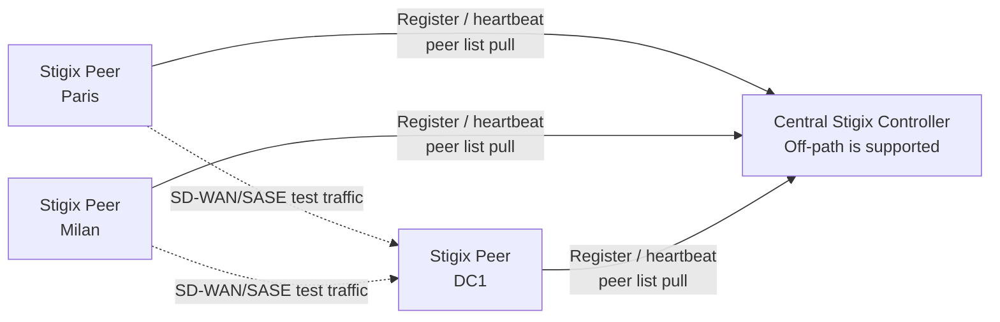

# Stigix
## From a lab tool to a distributed SD-WAN & SASE validation platform

**A practical roadmap for frictionless multi-site POCs, pilots, and labs**

Jean-Louis Suzanne  
Palo Alto Networks Engineering Discussion

---

# Why Stigix is gaining traction

> Stigix was built by a network engineer for network engineers: realistic validation, rapid deployment, and visible results.

- One web platform for **SaaS traffic**, **connectivity probes**, **security validation**, **convergence**, **voice**, **IoT**, **XFR**, and **VyOS-driven impairment scenarios**.
- Built for the reality of SD-WAN and SASE POCs: sites, WAN paths, failover, application experience, and security policy validation.
- Existing Docker-based deployment, auto-generated configuration, smart interface detection, and configuration export/import reduce setup effort.
- Existing registry capabilities already provide peer discovery, heartbeats, leader election, and target visibility. [file:27][file:4]

---

# The customer problem

## A successful POC becomes difficult at scale

A single Stigix instance is easy. A 10–50 site POC introduces repetitive operational work:

- Remote users must install and configure an instance correctly.
- The same probes, SaaS applications, and test profiles must be recreated on every site.
- Central teams need fleet visibility without asking for screenshots or SSH access.
- The controller may sit **off-path** in a DC, cloud VM, management network, or laptop.
- Remote sites may be behind NAT or strict firewalls.

**The goal:** make a multi-site Stigix deployment as simple as one copy-paste command per remote host.

---

# Product vision

## Configure once. Deploy anywhere. Validate everywhere.

```text
Central Stigix Control Plane
        ↓
One copy-paste command per remote Linux host
        ↓
Peer self-installs and joins the central registry
        ↓
Peers discover targets and receive shared configuration
        ↓
Central Fleet view shows health, rollout state, and jobs
        ↓
Controlled distributed validation across the POC
```

The design preserves a core Stigix principle:

> Every remote instance remains fully autonomous when central connectivity is unavailable.

---

# Design principles

| Principle | Meaning |
|---|---|
| **Extreme simplicity** | Remote engineer copies one command; no Git clone, Compose editing, or manual configuration. |
| **Backward compatible** | Existing standalone and Cloudflare/hybrid discovery continue unchanged. |
| **Controller can be off-path** | The leader does not need to generate traffic or act as a test target. |
| **Pull-based resilience** | Peers initiate outbound communication and retain last valid state. |
| **Global + local** | Central standards are shared; site-specific exceptions remain possible. |
| **No secret propagation** | Prisma credentials, VyOS keys, JWT secrets, and host-specific settings remain local. |
| **Incremental delivery** | Bootstrap, configuration, observability, and remote control are released independently. |

---

# Current foundation

## Stigix already has most building blocks

- **Docker Compose deployment** and a one-line Linux/macOS installer.
- Auto-generated configuration and smart physical-interface discovery.
- Export/import support for applications, probes, IoT, and VyOS-related configuration.
- Local APIs and web UI for traffic, connectivity, convergence, voice, security, XFR, and VyOS.
- Hybrid peer registry: Cloudflare bootstrap plus local leader/peer registry.
- Registry heartbeats, discovery cycles, leader election, and bootstrap snapshots.
- Support for `STIGIX_CONTROLLER_URL` in remote orchestration workflows. [file:27][file:4]

The roadmap extends these assets rather than replacing them.

---

# Release 1 — Direct peer onboarding

## One command. No Cloudflare dependency.

The central leader exposes a simple card in **Settings**:

```bash
curl -fsSL https://raw.githubusercontent.com/jsuzanne/stigix/main/install.sh | \
  sudo bash -s -- --controller https://stigix-central.example.net
```

What happens automatically:

1. The existing installer performs the current Docker/Compose deployment.
2. It injects the explicit controller URL into the peer configuration.
3. The peer uses its hostname as its default site identity.
4. The peer registers directly with the leader’s local registry.
5. The peer retrieves the existing peer/target list.

No token, no YAML editing, no interactive questionnaire in the MVP.

---

# Release 1 — Coexisting discovery modes

| Mode | Trigger | Bootstrap path | Cloudflare use |
|---|---|---|---|
| **Direct controller** | `STIGIX_CONTROLLER_URL` is set | Explicit leader URL → local registry | **None** |
| **Existing auto/hybrid** | No controller URL; legacy discovery is enabled | Cloudflare bootstrap → local registry | Existing behavior unchanged |
| **Standalone** | No controller and no registry configuration | None | None |

**Priority rule:** an explicit controller URL always wins.

This lets a POC run without Cloudflare or Prisma-based bootstrap dependencies, while preserving the existing discovery system for current users. [file:35][file:4]

---

# Release 1 — Target architecture



The controller provides coordination and visibility. It does **not** need to be on the traffic path or become a test target.

---

# Release 2 — Global configuration provisioning

## Configure once, publish once, apply everywhere

The administrator configures shared content on the leader and explicitly clicks:

```text
Publish globally
```

Then each eligible peer:

```text
Pulls manifest → downloads changed bundle → validates → merges local overrides → applies atomically → reports status
```

Initial global domains:

- **Applications / traffic profile**: SaaS catalogue, endpoints, categories, weights.
- **Connectivity probes**: HTTP/HTTPS/TCP/UDP/ICMP definitions, targets, timeouts, enabled state.

These are high-value and low-risk configuration domains already represented in structured Stigix configuration. [file:1][file:6]

---

# Release 2 — Global + Local configuration

## Central consistency without removing site flexibility

```text
Effective peer configuration
  = Published global configuration
  + Explicit local overrides
  + Existing default values
```

Example:

| Configuration | Global leader setting | Local peer behavior |
|---|---|---|
| Teams probe | `https://teams.microsoft.com` | Inherited unchanged |
| ERP probe | `https://erp.company.example` | Lyon overrides target to `https://erp-lyon.company.example` |
| Gateway probe | Not globally defined | Paris adds local `192.168.50.1` probe |

Peer UI remains familiar, with only simple source indicators:

```text
Global • Overridden locally • Local • Orphaned local
```

---

# Release 2 — Safe migration

## Existing deployments remain safe

For an upgraded existing instance:

```text
Global provisioning = OFF by default
```

No configuration is changed automatically.

When an operator explicitly enables central provisioning:

1. Stigix backs up the current flat configuration files.
2. Existing configuration is preserved as local baseline/overrides.
3. The peer downloads and validates the global baseline.
4. It writes only the final effective result to the existing active flat files.
5. Existing engines keep reading their current paths and use existing hot reload behavior.

No mandatory filesystem reorganization. No destructive migration.

---

# Release 2 — What is global vs local

| Global candidates | Always local |
|---|---|
| Applications and traffic weights | Network interfaces and source binding |
| Connectivity probes | Site IPs, routes, gateway, DNS, proxy |
| Security profiles — later phase | Controller URL and peer identity |
| Convergence thresholds — later phase | Prisma credentials and service-account secrets |
| Voice/IoT/XFR profiles — later phase | VyOS API keys and management reachability |
| Declarative VyOS scenarios — later phase | `.env`, JWT secrets, certificates, logs, histories |

Stigix already separates structured app/probe settings from host interface configuration; the provisioning model retains that distinction. [file:5][file:33]

---

# Release 3 — Fleet observability

## First observe; then control

Before adding remote actions, add a **Fleet** page to the central control plane.

For every registered peer, show:

- Site name, stable instance ID, version, capabilities, and last heartbeat.
- Status: online, degraded, offline, or unknown.
- Traffic state and a compact connectivity summary.
- Latest convergence, voice, and XFR status when available.
- Global provisioning state: enabled/disabled, applied revisions, sync errors, local override count.
- Freshness indicator so stale information is never confused with a real-time result.

Remote peers send compact telemetry summaries outbound to the controller. The controller does not need inbound connectivity to their management UIs.

---

# Release 4 — Remote actions through jobs

## Safe distributed control, even behind NAT

Use an **agent-pull job model**:

```text
Operator creates a job on central controller
        ↓
Target peer polls / claims its own job
        ↓
Peer validates capabilities and parameters locally
        ↓
Peer executes through existing local Stigix logic
        ↓
Peer posts sanitized result and audit evidence
```

Why this is the right default:

- Works when branches cannot accept inbound connections.
- Keeps the controller off-path.
- Reuses the existing outbound controller relationship.
- Prevents dependence on peer `managementUrl` reachability.
- Enables durable, auditable, per-peer results.

---

# Release 4 — Start with low-risk actions

| First actions | Deferred actions |
|---|---|
| Start traffic | VyOS network-changing sequences |
| Stop traffic with confirmation | Maintenance/restart/upgrade |
| Run selected configured probe sets | Broad security campaigns |
| Start/stop valid configured convergence tests | Raw shell or arbitrary API execution |
| Per-peer job result and audit | Voice/XFR orchestration at scale |

Every group action has:

- Explicit confirmation.
- Capability/version validation.
- Per-peer status.
- Expiry and idempotency protection.
- Partial-success handling.

---

# Why incremental releases matter

## Do not ship all three capabilities together

| Release | Value delivered | Main risk isolated |
|---|---|---|
| **1. Direct onboarding** | Copy/paste peer installation and local-registry joining | Bootstrap, deployment, backward compatibility |
| **2. Global provisioning** | Configure once for many peers with safe local overrides | Configuration merge, migration, rollback |
| **3. Fleet read-only** | Central visibility and operational confidence | Telemetry normalization and scale |
| **4. Remote jobs** | Controlled distributed actions | Authentication, audit, idempotency, safety |
| **5. Advanced control** | VyOS, security, voice, XFR, maintenance, campaigns | Higher operational impact |

Each release is independently demonstrable, testable, and useful in a real POC.

---

# Validation gates

## Practical engineering acceptance tests

### Release 1

- Install three fresh peers using the generated command.
- Verify peer discovery through the explicit controller.
- Block Internet/Cloudflare access and verify direct-controller peers still work.

### Release 2

- Deploy five peers.
- Publish Applications and Probes.
- Apply a local override to one peer.
- Publish a new global revision and confirm the override survives.
- Simulate controller outage and verify last valid config remains active.
- Test rollback.

### Release 3 / 4

- Observe at least ten peers with mixed states.
- Execute a group job with one success, one intentional failure, and one offline peer.
- Verify audit, partial-success status, expiry, and no duplicate execution after restart.

---

# Security and operational boundaries

- **No secret replication** between instances.
- Direct-controller registry mode does not require Cloudflare.
- Peers retain last known configuration and operate autonomously during controller outages.
- Global configuration is immutable, versioned, validated, checksummed, and rollback-capable.
- Remote actions are jobs with confirmation, audit, expiry, idempotency, and per-peer outcomes.
- No raw shell execution in early releases.
- VyOS and maintenance controls are explicitly deferred until the job/auth/audit model is proven.

This is deliberately a practical POC/control-plane model—not an attempt to build a heavyweight SD-WAN orchestrator.

---

# Engineering ask

## What would make this successful?

- Validate the direct-controller model against real SD-WAN/SASE POC deployment patterns.
- Review the lowest-friction authentication model for peer-to-controller communication.
- Help identify existing Prisma SD-WAN / SASE integration points that should remain optional and local.
- Validate operational safety boundaries for security tests, convergence tests, and future VyOS scenarios.
- Prioritize the roadmap as a sequence of small, production-quality releases.

> The goal is not to replace existing Palo Alto Networks management planes. It is to make validation, demonstration, troubleshooting, and distributed POC execution dramatically easier.

---

# Closing

## Stigix can make distributed validation repeatable

```text
One command to deploy a peer.
One place to define shared validation configuration.
One Fleet view to understand the POC.
One safe job model to coordinate tests.
```

**Simple enough for a field POC. Structured enough for engineering.**

Thank you.

---

# Appendix — Existing Stigix capabilities

- Realistic weighted SaaS traffic generation across common enterprise categories.
- Connectivity and performance probes.
- SD-WAN convergence and failover validation.
- Prisma SD-WAN site/interface discovery and flow-path enrichment.
- Security testing: URL filtering, DNS security, EICAR/threat-prevention workflows.
- Voice/RTP simulation and MOS-oriented measurements.
- IoT simulation and security behaviors.
- XFR throughput validation.
- VyOS-driven impairment scenarios.
- Docker deployment, smart network-interface detection, persistent logging, and configuration export/import. [file:27][file:24][file:4]
