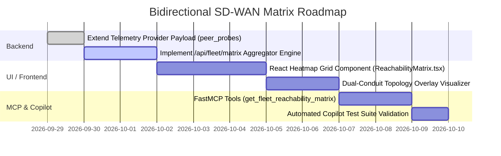

> **Last Updated:** 2026-09-29 | **Created:** 2026-09-29 (v2.0.82)

# PRD: Bidirectional Cross-Instance SD-WAN Reachability Matrix

## 1. Executive Summary & Problem Statement

### 1.1 Context
In distributed Software-Defined WAN (SD-WAN) and SASE environments (e.g., Palo Alto Networks Prisma SD-WAN, Hub-and-Spoke, and Full-Mesh branch topologies), network health is evaluated using synthetic probes (ICMP, TCP, HTTP, UDP, DNS) sent from edge nodes.

Currently, a standalone Stigix node (*Instance A*) generates synthetic probes targeting destination endpoints (e.g., *Instance B*, *Instance C*, or corporate SaaS/Hub targets). Consequently, Instance A can determine if its forward egress path is functional ($A \to B$).

### 1.2 The Problem: Asymmetric Routing & Half-Open Failures
Single-direction probing suffers from critical blind spots inherent to modern enterprise networking:
1. **Asymmetric Path Routing**: Forward traffic ($A \to B$) may traverse an active Internet/MPLS circuit with low latency, while return traffic ($B \to A$) is steered over a degraded backup link or asymmetric VPN tunnel.
2. **Unidirectional Firewall / Policy Blocking**: Security policy changes or NAT misconfigurations can allow $A \to B$ while blocking $B \to A$.
3. **Half-Open Tunnels**: In IPsec/SD-WAN overlays, Phase 2 security associations or routing tables can desynchronize, causing blackholes in one direction.
4. **Lack of Full-Mesh Visibility from a Single Pane of Glass**: An engineer logged into Site A has no immediate knowledge of whether Site B can reach Site C or Site D without opening separate sessions or consoles on each instance.

### 1.3 The Solution
The **Bidirectional Cross-Instance SD-WAN Reachability Matrix** collects probe results from all active Stigix instances in the fleet, correlates forward ($A \to B$) and reverse ($B \to A$) measurements, computes an $N \times N$ reachability matrix, and flags path asymmetry, unidirectional packet loss, and performance divergence.

```
                  ┌─────────────────────────────────────────────────┐
                  │          Stigix Central Fleet Registry          │
                  │   (Aggregates Live Telemetry & Probes Payload)  │
                  └────────┬───────────────────────────────┬────────┘
                           │                               │
                Telemetry  │                               │  Telemetry
                (A's view) │                               │  (B's view)
                           ▼                               ▼
               ┌───────────────────────┐       ┌───────────────────────┐
               │    Stigix Node A      │       │    Stigix Node B      │
               │   (Branch 1 / DC1)    │       │   (Branch 2 / DC2)    │
               └───────────┬───────────┘       └───────────┬───────────┘
                           │   Forward Probe (A ➔ B)       │
                           ├──────────────────────────────►│
                           │                               │
                           │   Return Probe (B ➔ A)        │
                           │◄──────────────────────────────┤
                           │                               │
```

---

## 2. Objectives & Success Criteria

| Objective | Target Metric / Acceptance Criteria |
|---|---|
| **Full-Mesh Visibility ($N \times N$)** | Any Stigix node or centralized dashboard can display bidirectional SLA for all peers in the fleet. |
| **Path Asymmetry Detection** | Automatically flags links where latency delta $|L_{A \to B} - L_{B \to A}| > \text{threshold}$ (default $15\text{ms}$) or where reachability is unidirectional ($A \to B = \text{UP}$, $B \to A = \text{DOWN}$). |
| **Zero Additional Overhead** | Leverages the existing Stigix Registry / Telemetry heartbeat channel ($O(N)$ telemetry pushes, rather than $O(N^2)$ direct HTTP meshes). |
| **Sub-Second API Queries** | Endpoint `GET /api/fleet/matrix` responds in $< 50\text{ms}$ using in-memory cached fleet probe states. |
| **AI Copilot & FastMCP Integration** | Exposes `@mcp.tool()` `get_fleet_matrix` and `diagnose_path_asymmetry` to allow Claude and autonomous assistants to audit fleet SLA. |

---

## 3. Architecture & Data Flow

### 3.1 Source IP & Interface Traversal
- **Probe Execution**: When Stigix Node A pings Node B, it executes `ping -c 1 -I <interface> <target_ip>` (bound to the interface configured in `interfaces.txt`, e.g., `eth1`, `ens192`, `vlan100`, or default LAN interface).
- **Traffic Path**: The probe packet originates from Node A's local LAN IP (e.g., `192.168.10.50`), traverses the local Prisma SD-WAN ION branch device, routes across the SD-WAN VPN Overlay, and terminates on Node B's LAN IP (`192.168.20.50`).
- **Return Path**: Symmetrically, Node B executes its probe from `192.168.20.50` toward `192.168.10.50`.

### 3.2 Telemetry Collection Pipeline
1. **Local Node Telemetry (`telemetryProvider`)**: Every 5 seconds, each Stigix node samples its active synthetic probes (filtered to peer targets or Prisma SD-WAN endpoints) and bundles a compact `peer_probes` array into its registry heartbeat payload:
   ```json
   "peer_probes": [
     { "target_site": "DC1", "target_ip": "192.168.10.254", "type": "PING", "reachable": true, "latency_ms": 12.4, "loss_pct": 0, "score": 98 },
     { "target_site": "BR2", "target_ip": "192.168.22.254", "type": "PING", "reachable": true, "latency_ms": 28.1, "loss_pct": 0, "score": 94 }
   ]
   ```
2. **Central In-Memory Aggregation**: The Registry (Leader node or Cloudflare Worker) maintains an in-memory map of latest probe reports per node.
3. **Matrix Computation Engine**: Upon `GET /api/fleet/matrix`, the server correlates Node $X$'s probe to Node $Y$ with Node $Y$'s probe to Node $X$, assembling the complete bidirectional dataset.

---

## 4. API Specification & Data Model

### 4.1 Endpoint: `GET /api/fleet/matrix`
Returns the aggregated $N \times N$ bidirectional cross-reachability matrix.

#### Query Parameters
- `type` *(optional)*: Filter probe type (`ALL`, `PING`, `HTTP`, `TCP`, `PRISMA`). Default: `ALL`.
- `asymmetry_only` *(optional, boolean)*: When `true`, returns only pairs with detected performance or reachability asymmetry.
- `site` *(optional)*: Filter matrix pairs originating or terminating at a specific site ID.

#### Response Schema (`200 OK`)
```json
{
  "timestamp": 1790666000000,
  "local_node_id": "BR1-SDWAN",
  "nodes": [
    { "id": "DC1-HUB", "name": "DC1 Primary Hub", "ip": "192.168.10.254", "site_type": "HUB" },
    { "id": "BR1-SDWAN", "name": "Branch 1 (Paris)", "ip": "192.168.21.254", "site_type": "BRANCH" },
    { "id": "BR2-SDWAN", "name": "Branch 2 (London)", "ip": "192.168.22.254", "site_type": "BRANCH" },
    { "id": "BR5-SDWAN", "name": "Branch 5 (Frankfurt)", "ip": "192.168.25.254", "site_type": "BRANCH" }
  ],
  "summary": {
    "total_pairs": 6,
    "healthy_bidirectional": 5,
    "asymmetric_degraded": 1,
    "unidirectional_down": 0,
    "full_outage": 0
  },
  "matrix": [
    {
      "source_id": "BR1-SDWAN",
      "target_id": "DC1-HUB",
      "forward": {
        "reachable": true,
        "latency_ms": 11.2,
        "jitter_ms": 0.8,
        "loss_pct": 0.0,
        "score": 99,
        "last_tested": 1790665995000
      },
      "reverse": {
        "reachable": true,
        "latency_ms": 11.5,
        "jitter_ms": 0.9,
        "loss_pct": 0.0,
        "score": 99,
        "last_tested": 1790665994000
      },
      "asymmetry": {
        "is_asymmetric": false,
        "latency_delta_ms": 0.3,
        "status": "OPTIMAL"
      }
    },
    {
      "source_id": "BR1-SDWAN",
      "target_id": "BR2-SDWAN",
      "forward": {
        "reachable": true,
        "latency_ms": 24.5,
        "jitter_ms": 1.2,
        "loss_pct": 0.0,
        "score": 95,
        "last_tested": 1790665992000
      },
      "reverse": {
        "reachable": true,
        "latency_ms": 82.1,
        "jitter_ms": 14.5,
        "loss_pct": 2.5,
        "score": 62,
        "last_tested": 1790665991000
      },
      "asymmetry": {
        "is_asymmetric": true,
        "latency_delta_ms": 57.6,
        "loss_delta_pct": 2.5,
        "reason": "HIGH_RETURN_LATENCY_AND_LOSS",
        "status": "DEGRADED"
      }
    }
  ]
}
```

---

## 5. UI / UX Specifications & Placement

### 5.1 Primary Placement: DEM / Performance View (`Full-Mesh Matrix`)
The matrix will be placed as a high-visibility tab or toggle within **Digital Experience (DEM) / Performance**:
- **Location**: `Performance` page ➔ Sub-tab **"Fleet Reachability Matrix"** (next to *Endpoint Catalog* and *Timing Breakdown*).
- **Component Design**:
  1. **$N \times N$ Interactive Heatmap Grid**:
     - Rows = Source Nodes ($A$), Columns = Destination Nodes ($B$).
     - Diagonal = Self ($A \to A = \text{N/A}$).
     - Cell coloring:
       - 🟢 **Solid Green**: Bidirectionally healthy ($< 5\text{ms}$ delta, score $\ge 90$).
       - 🟡 **Split Amber/Green**: Performance asymmetry (e.g. forward 12ms, return 65ms).
       - 🔴 **Split Red/Green**: Unidirectional drop ($A \to B = \text{OK}$, $B \to A = \text{DOWN}$).
       - ⬛ **Dark Grey / Red**: Full bidirectional outage.
  2. **Hover / Click Detail Popover**: Clicking a cell opens a split inspector showing side-by-side forward vs. reverse packet timings, TTL, and Prisma circuit tags.
  3. **Filter Bar**: Quick toggles for `Show Asymmetric Links Only`, `Filter by Site Type (Hub vs Spoke)`, and `Protocol (PING / TCP / HTTP)`.

### 5.2 Secondary Placement: Topology Overlay Integration
- In the **Topology Overlay** canvas, links connecting two Stigix/Prisma sites render as **dual directional conduits ($A \rightleftarrows B$)**:
  - The top/forward conduit displays $A \to B$ latency and status.
  - The bottom/return conduit displays $B \to A$ latency and status.
  - Asymmetric flows pulse with an animated amber warning beacon.

### 5.3 Quick-Status Bar & Header Alerts
- On the global Stigix top bar / fleet indicator, if any asymmetric path is detected in the fleet, a badge appears: `⚠️ 1 Asymmetric Path (BR1 ⇄ BR2)`.

---

## 6. AI Copilot & FastMCP Tool Integration

The reachability matrix is natively integrated into Stigix AI Copilot and MCP Server tools:

| MCP Tool Name | Description | Response Details |
|---|---|---|
| `get_fleet_reachability_matrix` | Fetches the full $N \times N$ bidirectional probe matrix across all registered Stigix nodes. | Matrix JSON with forward/reverse latencies, loss percentages, and scores. |
| `audit_sdwan_path_asymmetry` | Evaluates all site-to-site pairs and returns an anomaly report detailing one-way outages or latency skews. | High-priority RCA report explaining suspected return-path routing issues or firewall policy blocks. |

---

## 7. Implementation Roadmap & Phasing



---

## 📜 Revision History

| Date | Stigix Version | Author / Trigger | Summary of Changes |
|---|---|---|---|
| 2026-09-29 | `v2.0.82` | Stigix Core Team | Initial creation of the Bidirectional Cross-Instance SD-WAN Reachability Matrix PRD. |
