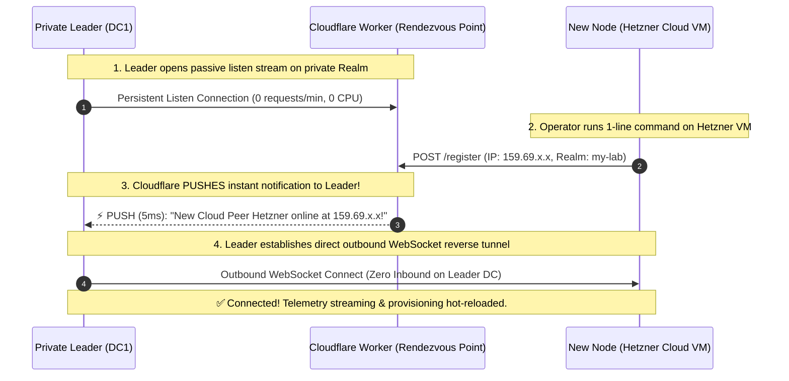

# 📑 PRD — Stigix « Magic Join » : Universal Zero-Touch Onboarding & Multi-Tenant Architecture

> **Document:** Product Requirements Document (PRD)  
> **Author:** Antigravity & Stigix Product Team  
> **Version:** 2.0 (English Edition)  
> **Last Updated:** 2026-09-30  
> **Status:** Approved Draft for Roadmap Planning  
> **Target Audience:** Product Managers, Enterprise Network Architects, and Technical Decision Makers  

---

## 1. 🎯 Vision & Executive Summary

Today, deploying a multi-site SD-WAN and SASE validation mesh with Stigix is already robust and capable. However, the initial onboarding step for adding new nodes (physical branch boxes, Cloud VMs on Hetzner or AWS, or remote home labs) still requires operators to manipulate IP addresses, pass manual CLI flags (`--controller http://...`), or manually add targets in the Leader dashboard.

**The Vision of « Magic Join »:**
Provide a **universal, instantaneous, zero-touch onboarding experience** — matching the consumer-grade simplicity of *Tailscale* or *Docker Swarm* — while guaranteeing **strict cryptographic multi-tenancy** across thousands of independent lab environments worldwide with **zero recurring cloud costs**.

### The Product Promise:
> **1 Single Button on Leader ➔ 1 Single Copy-Pasted Terminal Command ➔ Zero Technical Questions ➔ Automated Connection & Hot-Sync in under 15 seconds.**

---

## 2. 🔍 Current State & Key Pain Points

| Scenario | Current Friction Point | Product & Business Impact |
|---|---|---|
| **On-Premise LAN Node** | Operator must copy Leader IP and execute `install.sh` with `--controller http://192.168.1.120:8080`. | IP typos, manual parameter friction during customer demos. |
| **Public Cloud VM (Hetzner, AWS)** | Operator spins up VM, fetches public IP, opens Leader UI (*Settings ➔ Targets*), and manually creates target so Leader initiates reverse dial. | Asymmetric, multi-step manual workflow. |
| **Multi-Tenancy (Multiple Customer Labs)** | Multiple users sharing the public discovery service could experience namespace overlap if master keys are omitted. | Risk of node cross-discovery or lab configuration collision. |
| **Cloudflare Worker Quotas** | Continuous 30s heartbeats risk exceeding Cloudflare KV free-tier write quotas (1,000 writes/day). | Risk of unexpected infrastructure costs or service throttling. |

---

## 3. ✨ The Product Solution: Stigix « Magic Join »

The Magic Join architecture unifies all deployment modes under a single universal token-driven workflow with transparent, automated network path negotiation.

```text
┌─────────────────────────────────────────────────────────────────────────────┐
│ 1. LEADER DASHBOARD (Central Controller)                                    │
│                                                                             │
│    Operator clicks the top navbar button:     [ 🔗 Add Node ]               │
│                                                                             │
│    A sleek modal displays one single copyable command:                      │
│    ┌───────────────────────────────────────────────────────────────────┐    │
│    │ curl -sSL https://stigix.io/join | sudo bash -s -- STX-7842-K9X   │ 📋 │
│    └───────────────────────────────────────────────────────────────────┘    │
└─────────────────────────────────────────────────────────────────────────────┘
                                      │
                                      ▼ (Paste into ANY remote terminal)
┌─────────────────────────────────────────────────────────────────────────────┐
│ 2. TARGET NODE (Local Lab, Branch Office, Hetzner VM, AWS, or Home Lab)    │
│                                                                             │
│    Container starts instantly. No questions asked. No IP address requested. │
└─────────────────────────────────────────────────────────────────────────────┘
                                      │
                                      ▼ (Under 5 seconds)
┌─────────────────────────────────────────────────────────────────────────────┐
│ 3. LEADER DASHBOARD REAL-TIME REFLECTION                                    │
│                                                                             │
│    New node pops up live in the Fleet Overview with active telemetry:       │
│    🟢 BR-Hetzner (159.69.x.x)  [ ⚡ WS Tunnel Synced ]                      │
└─────────────────────────────────────────────────────────────────────────────┘
```

---

## 4. 🧠 Under the Hood: Transparent Discovery & Push Architecture

### 4.1 What is Inside the Token?
The generated token (`STX-7842-K9X`) is a self-contained, signed cryptographic payload holding:
1. **Known Leader IP Addresses & FQDNs:** (`192.168.1.120`, `192.168.203.100`, `sdwandc1.carenaje.fr`).
2. **Lab Realm Identifier:** Cryptographic hash of the cluster secret (`SHA-256(Cluster Secret)`).
3. **Session Authentication Key & Expiration:** Anti-tamper token valid for 24 hours.

---

### 4.2 The 0-Polling Passive Real-Time Push Channel

Instead of having the Leader constantly poll Cloudflare in a loop, Stigix uses an **instantaneous, event-driven Server-Sent Events / WebSocket listener**:

1. **Passive Listen:** The Leader maintains an idle, zero-CPU listen connection to its private realm on Cloudflare (`WSS registry.stigix.io/realms/:realmHash/stream`).
2. **Instant Push Notification (5ms):** When a new node boots and issues a single `POST /register`, Cloudflare immediately pushes an alert to the Leader.
3. **Direct Outbound Dialing:** The Leader immediately dials the new node directly. Cloudflare steps out of the data path, and 100% of subsequent traffic remains point-to-point.



---

## 5. 🏢 Concrete Workflows Across All Deployment Models

Because the token encapsulates both local addresses and realm metadata, the client runtime negotiates the optimal transport automatically across all 4 environments:

### Scenario 1 — On-Premise Local Lab Peer (e.g. BR1 on same LAN `192.168.122.57`)
1. BR1 decodes the token and reads `192.168.1.120`.
2. BR1 probes `192.168.1.120` ➔ **Immediate Success (< 1ms)** over the local switch.
3. BR1 connects directly to the Leader over LAN HTTP/WS without contacting Cloudflare.
4. **Result:** Appears on dashboard with `🌐 Direct LAN / ⚡ WS`. Zero external dependencies.

### Scenario 2 — Remote Branch behind NAT / CGNAT / 4G (e.g. BR8)
1. BR8 decodes the token and attempts connection to the Leader's reachable public/tunnel endpoint.
2. BR8 opens an **outbound WebSocket reverse tunnel (M5)** to the Leader.
3. **Result:** Traverses branch egress-only firewalls with **zero open ports on the branch**. Appears with `⚡ WS Tunnel Synced`.

### Scenario 3 — Public Cloud VM (e.g. Hetzner / AWS `159.69.x.x`)
1. Hetzner reads `192.168.1.120` from token ➔ **Fails** (private RFC1918 IP unreachable over public Internet).
2. Hetzner registers its public IP (`159.69.x.x`) on Cloudflare Worker under the lab realm.
3. Cloudflare pushes the notification to the private Leader in 5ms.
4. Leader dials outbound to `http://159.69.x.x:8080/fleet-tunnel` (M6).
5. **Result:** Cloud VM connected to private Leader with **zero inbound ports open on the private DC**.

### Scenario 4 — Standalone Single-Node Traffic Generator (No Leader, Zero Tokens)
1. Customer runs standard installer without token: `curl -sSL https://stigix.io/install | sudo bash`.
2. Stigix auto-detects network interfaces, generates 67 application profiles, and starts local DEM synthetic monitoring, SaaS traffic generation, and security test engines.
3. Accessible immediately at `http://localhost:8080` in **100% autonomous standalone mode**.
4. **Hot-Attach Option:** Operator can later navigate to *Settings ➔ Target Controller*, paste a Join Token from a colleague's Leader, and attach the node to a fleet with zero downtime and no container restart.

---

## 6. 🛡️ Multi-Tenancy & Cryptographic Isolation

To ensure that **User A's Leader never discovers or interacts with User B's nodes**, all communication is strictly isolated:

$$\text{Realm Hash} = \text{SHA-256}(\text{Lab Secret Key} \lor \text{Prisma SD-WAN TSG ID})$$

```text
Public Cloudflare Rendezvous (registry.stigix.io)
│
├── 📁 Realm [A89F...21] (Customer A Lab: DC1 Leader + Hetzner VM)
│     └── Completely isolated namespace. Zero cross-visibility.
│
├── 📁 Realm [9B02...7E] (Partner B Lab: AWS Leader + 4 Branch Spokes)
│     └── Completely isolated namespace. Zero cross-visibility.
│
└── 📁 Realm [C410...03] (Community User: Single PC + Home Lab)
      └── Completely isolated namespace. Zero cross-visibility.
```

### Security & Privacy Guarantees:
* **Zero Sensitive Data on Cloudflare:** Cloudflare only stores an ephemeral JSON record (~150 bytes in RAM) containing `public_ip`, `port`, and `timestamp` with a 3-minute TTL.
* **No Secrets or Tokens on Cloudflare:** Test configurations, passwords, VoIP payloads, and traffic stats **never** touch Cloudflare.
* **Point-to-Point Encryption:** All production traffic flows strictly over direct tunnels between customer nodes.

---

## 7. 📈 Product KPIs & Success Metrics

| KPI | Target Goal | Measurement |
|---|---|---|
| **Time-to-Onboard (TTO)** | $< 15\text{ seconds}$ | Duration from clicking "Add Node" to live telemetry streaming on Leader. |
| **User Configuration Errors** | $0\%$ | Elimination of all manual IP and CLI parameter input mistakes. |
| **Visible UI Choices** | **1 Single Action** | Zero technical decision branching imposed on the end user. |
| **Cloud Infrastructure Cost** | **$0.00 / month** | 100% covered by Cloudflare Workers free-tier quotas (0 continuous polling). |
| **Multi-Tenant Leakage** | $0.00\%$ | Mathematically guaranteed cryptographic separation across realms. |

---

## 8. 🗺️ Engineering Feasibility & Phased Delivery

Because **80% of the underlying tunnel multiplexing, dialing, and provisioning logic is already built and validated in Stigix `v2.0.112`**, developing Magic Join is estimated at only **1 to 2 days of engineering effort**:

```text
┌─────────────────────────────────────────────────────────────────────────────┐
│ Milestone 1: Leader Join Token Generator (UI & Backend)          [ 0.5 Day ] │
│ • Top-navbar [ 🔗 Add Node ] button & copyable 1-liner modal.               │
│ • Token serialization (IPs + Realm Hash + 24h JWT expiration).              │
├─────────────────────────────────────────────────────────────────────────────┤
│ Milestone 2: Cloudflare Worker Stateless Rendezvous Relay        [ 0.5 Day ] │
│ • SSE / WebSocket listen endpoint: /realms/:realmHash/stream.               │
│ • Single-shot node registration endpoint: POST /realms/:realmHash/register. │
├─────────────────────────────────────────────────────────────────────────────┤
│ Milestone 3: Universal Client Script (join.sh)                   [ 0.5 Day ] │
│ • Decodes token ➔ Probes direct LAN ➔ Falls back to Cloudflare relay.       │
├─────────────────────────────────────────────────────────────────────────────┤
│ Milestone 4: Leader Dynamic Auto-Dialer                          [ 2 Hours ] │
│ • Triggers dialOutboundPeer() on fleet-tunnel.ts upon push event.           │
└─────────────────────────────────────────────────────────────────────────────┘
```

---

## 9. 🏁 Conclusion

**Stigix « Magic Join »** elevates Stigix from a powerful networking tool to a **world-class enterprise platform with effortless consumer-grade usability**. 

By replacing complex network configuration with an intelligent, self-negotiating token workflow, Stigix eliminates onboarding friction while maintaining strict multi-tenant privacy, enterprise zero-inbound security, and zero external infrastructure costs.
