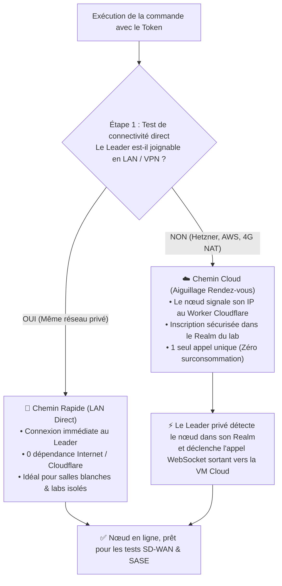

# 📑 PRD — Stigix « Magic Join » : L'Onboarding Universel Zero-Touch & Multi-Tenant

> **Document :** Product Requirements Document (PRD)  
> **Auteur :** Antigravity & Stigix Product Team  
> **Version :** 1.0 (Draft)  
> **Date :** 2026-09-30  
> **Cible :** Product Managers, Architectes Réseau & Décisionnaires Techniques  

---

## 1. 🎯 Vision & Résumé Exécutif

Aujourd'hui, déployer un maillage de test SD-WAN / SASE multi-sites avec Stigix est déjà extrêmement performant. Cependant, l'étape d'onboarding d'un nouveau nœud (agence physique, VM Hetzner, instance AWS) demande encore à l'utilisateur de manipuler des adresses IP, de passer des paramètres en ligne de commande (`--controller http://...`) ou d'ajouter manuellement des cibles dans le dashboard du Leader.

**L'ambition du projet « Magic Join » :**
Offrir une expérience d'onboarding **universelle, instantanée et sans friction (Zero-Touch)**, inspirée de la simplicité de solutions modernes comme *Tailscale* ou *Docker Swarm*, tout en garantissant un **cloisonnement multi-tenant absolu** pour des milliers d'utilisateurs distincts.

### La Promesse Produit :
> **1 Seul Bouton côté Leader ➔ 1 Seule Ligne de commande copiée-collée ➔ Zéro question posée ➔ Connexion et synchronisation automatiques en moins de 15 secondes.**

---

## 2. 🔍 Le Constat & Les Pain Points Actuels

| Situation Actuelle | Pain Point pour l'Utilisateur | Impact Produit |
|---|---|---|
| **Onboarding d'une agence locale (LAN)** | L'ingénieur doit copier l'IP exacte du Leader et exécuter un script avec `--controller http://192.168.1.120:8080`. | Erreurs de frappe d'IP, friction lors des démonstrations. |
| **Ajout d'une VM Cloud (Hetzner / AWS)** | L'ingénieur doit démarrer la VM, récupérer son IP publique, aller dans *Settings ➔ Targets* sur son Leader DC1, et créer manuellement la cible pour que le tunnel s'ouvre. | Processus asymétrique en plusieurs étapes manuelles. |
| **Multi-Tenancy (Plusieurs labs clients)** | Si deux clients utilisent le service public Cloudflare sans isoler leur clé, leurs nœuds pourraient théoriquement se voir. | Risque de confusion ou de mauvaise configuration de lab. |
| **Quotas Cloudflare Worker** | Les heartbeats répétés toutes les 30s risquent de saturer le quota d'écriture gratuit de Cloudflare KV (1 000 écritures/jour). | Risque de surcoût ou de blocage du service gratuit. |

---

## 3. ✨ La Solution Produit : Stigix « Magic Join »

Le concept repose sur un **Join Token universel** et un mécanisme d'**aiguillage intelligent (Auto-Fallback)** totalement invisible pour l'utilisateur.

```text
┌─────────────────────────────────────────────────────────────────────────────┐
│ 1. EXPÉRIENCE SUR LE LEADER (Dashboard Central)                            │
│                                                                             │
│    L'utilisateur clique sur un bouton unique dans la barre du haut :        │
│                               [ 🔗 Add Node ]                               │
│                                                                             │
│    Une modale épurée affiche une seule commande à copier :                  │
│    ┌───────────────────────────────────────────────────────────────────┐    │
│    │ curl -sSL https://stigix.io/join | sudo bash -s -- STX-7842-K9X   │ 📋 │
│    └───────────────────────────────────────────────────────────────────┘    │
└─────────────────────────────────────────────────────────────────────────────┘
                                      │
                                      ▼ (Coller dans le terminal distant)
┌─────────────────────────────────────────────────────────────────────────────┐
│ 2. EXPÉRIENCE SUR LE NOUVEAU NŒUD (Agence, Hetzner, AWS, Home Lab)         │
│                                                                             │
│    L'utilisateur colle la commande. Le conteneur démarre.                  │
│    Aucune question, aucun paramètre IP demandé.                            │
└─────────────────────────────────────────────────────────────────────────────┘
                                      │
                                      ▼ (Résultat en 5 secondes)
┌─────────────────────────────────────────────────────────────────────────────┐
│ 3. RÉSULTAT DANS LE DASHBOARD DU LEADER                                    │
│                                                                             │
│    Le nouveau nœud apparaît instantanément dans la flotte avec son badge :  │
│    🟢 BR-Hetzner (159.69.x.x)  [ ⚡ WS Tunnel Synced ]                      │
└─────────────────────────────────────────────────────────────────────────────┘
```

---

## 4. 🧠 Comment ça marche sous le capot (L'Aiguillage Invisible)

Le Token `STX-7842-K9X` est un conteneur sécurisé éphémère qui encapsule :
1. **Les adresses IP privées et publiques connues du Leader** (`192.168.1.120`, `sdwandc1.carenaje.fr`, etc.).
2. **L'identifiant de Realm unique du lab** (`Realm-Hash` cryptographique).
3. **La clé de session de cluster**.

Le script d'installation exécute alors une négociation en **2 étapes transparentes** :



---

## 5. 🛡️ Cloisonnement Multi-Tenant : Sécurité & Zéro Collision

Pour garantir que **le Lab de l'Entreprise A ne verra jamais les machines de l'Entreprise B**, chaque échange est compartimenté par un **Realm Hash** :

$$\text{Realm ID} = \text{SHA-256}(\text{Clé Secrète du Lab ou TSG ID})$$

```text
Service Public Cloudflare (registry.stigix.io)
│
├── 📁 Realm [A89F...21] (Lab Partenaire Paris : Leader DC1 + VM Hetzner)
│     └── Les machines de Paris ne communiquent qu'entre elles.
│
├── 📁 Realm [9B02...7E] (Lab Client Londres : Leader AWS + 4 Agences)
│     └── Les machines de Londres sont strictement isolées.
│
└── 📁 Realm [C410...03] (Lab Démo Individuel : 1 PC portable + 1 Cloud VM)
      └── Isolation totale garantie.
```

### 🔒 Les garanties de sécurité :
* **Zéro fuite d'adresses IP :** Le Worker ne stocke aucune clé en clair, uniquement des empreintes cryptographiques.
* **Zéro port exposé sur le Leader :** Le Leader dans le datacenter privé n'ouvre **aucun port sur Internet** ; c'est lui qui initie la session sortante vers les VMs Cloud.
* **Zéro impact sur les quotas :** L'enregistrement Cloudflare ne se fait qu'**une seule fois au boot** (ou via le cache mémoire gratuit), puis 100% de la télémétrie passe dans le tunnel WebSocket privé.

---

## 6. 👥 Parcours & Cas d'Usage Métier

### Cas d'usage n°1 : L'ingénieur en Datacenter (Lab 100% Privé)
* **Contexte :** DC1 et BR1 sont sur un réseau d'entreprise isolé sans accès Internet.
* **Expérience :** L'ingénieur clique sur *Add Node*, colle la commande sur BR1.
* **Comportement :** Le test d'étape 1 détecte immédiatement la route LAN locale. BR1 se connecte en direct sans jamais tenter de contacter Cloudflare.

### Cas d'usage n°2 : L'architecte Cloud (Test multi-régions Hetzner / AWS)
* **Contexte :** L'ingénieur a son Leader chez lui ou au bureau, et veut générer du trafic depuis une VM publique en Allemagne (Hetzner) ou aux USA (AWS).
* **Expérience :** Il lance sa VM cloud, colle la même commande universelle.
* **Comportement :** Le test d'étape 1 échoue (pas de LAN direct). L'étape 2 relaie l'IP de la VM via le Realm Cloudflare. Le Leader DC1 appelle la VM en WebSocket sortant. En 10 secondes, la VM Cloud est pilotable depuis DC1.

### Cas d'usage n°3 : Déploiement automatisé (Terraform / Cloud-Init)
* **Contexte :** Déploiement automatique de 10 sondes Stigix dans le monde.
* **Expérience :** L'ingénieur injecte simplement la commande 1-ligne dans son script `cloud-init`.
* **Comportement :** Dès leur démarrage, les 10 sondes s'enregistrent dans le Realm et s'agrègent automatiquement sur le dashboard Leader.

---

## 7. 📈 Critères de Succès & KPI Produit

| KPI | Objectif Cible | Mesure |
|---|---|---|
| **Time-to-Onboard (TTO)** | $< 15\text{ secondes}$ | Temps entre le clic sur "Add Node" et l'apparition du badge vert sur le dashboard. |
| **Taux d'erreur utilisateur** | $0\%$ | Élimination totale des erreurs de saisie d'IP ou d'options CLI. |
| **Nombre d'options visibles** | **1 seule** | Aucune décision technique imposée à l'utilisateur. |
| **Coût d'infrastructure externe** | **0 € / mois** | Utilisation exclusive des tiers gratuits Cloudflare (Edge Cache / 1 boot write). |
| **Étanchéité Multi-Tenant** | $100\%$ | Zéro collision ou fuite de métadonnées entre utilisateurs. |

---

## 8. 🗺️ Plan de Déploiement & Jalons Recommandés

```text
┌─────────────────────────────────────────────────────────────────────────────┐
│ Jalon 1 : Générateur de Join Token dans le Dashboard (UI/UX)                │
│ • Ajout du bouton [ 🔗 Add Node ] dans la barre supérieure du Leader.       │
│ • Génération du token universel chiffré encapsulant les métadonnées.        │
├─────────────────────────────────────────────────────────────────────────────┤
│ Jalon 2 : Script Client Universel (join.sh) avec Auto-Fallback             │
│ • Création du point d'entrée https://stigix.io/join.                        │
│ • Logique de double détection : Test direct LAN ➔ Fallback Cloudflare.       │
├─────────────────────────────────────────────────────────────────────────────┤
│ Jalon 3 : Matchmaking Multi-Tenant sur Cloudflare Worker                    │
│ • Partitionnement par Realm Hash (SHA-256).                                 │
│ • Enregistrement unique au boot sans consommation de quota d'écriture.      │
├─────────────────────────────────────────────────────────────────────────────┤
│ Jalon 4 : Auto-Dialer dynamique sur le Leader                               │
│ • Déclenchement automatique du dialing WebSocket vers les Cloud Peers       │
│   dès leur découverte dans le Realm, sans ajout manuel dans Settings.       │
└─────────────────────────────────────────────────────────────────────────────┘
```

---

## 9. 🏁 Conclusion

Le projet **« Stigix Magic Join »** transforme une suite d'actions techniques complexes (routage réseau, configuration NAT, ajout manuel de cibles, clés de registre) en **une action produit élémentaire et magique**. 

Il positionne Stigix au niveau des meilleurs standards UX de l'industrie (Tailscale, Cloudflare Tunnels), tout en respectant scrupuleusement les contraintes de sécurité des entreprises privées et la gratuité de l'infrastructure open-source.
