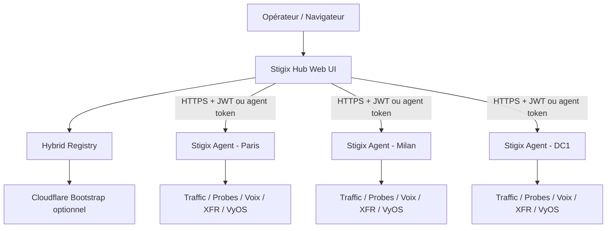

# Stigix — Spécification : Control Plane Multi-Instances

**Statut :** Proposition de spécification  
**Version :** 0.1  
**Public cible :** développement Stigix / Google Antigravity  
**Langue :** Français  

---

## 1. Objectif

Ajouter à Stigix une capacité de **gestion multi-instances** depuis une instance centrale désignée comme **Hub** (ou Leader).

Le Hub doit permettre à un opérateur de :

- Visualiser l’état de toutes les instances Stigix enregistrées.
- Passer d’une instance à une autre depuis une interface unique.
- Afficher des métriques consolidées : trafic, probes, connectivité, convergence, voix, XFR et état système.
- Calculer un score de santé par instance et un score global de flotte.
- Lancer des actions à distance sur une ou plusieurs instances.
- Comparer, prévisualiser et propager des configurations sélectionnées vers une ou plusieurs instances.
- Conserver un audit des actions, résultats et erreurs.

Cette fonctionnalité ne doit pas remplacer l’autonomie d’une instance Stigix : chaque instance reste pleinement utilisable localement lorsque le Hub est indisponible.

---

## 2. Contexte existant

Stigix dispose déjà des fondations nécessaires :

- API REST authentifiées par JWT sur chaque `web-ui`.
- Pages et APIs locales pour le trafic, les statistiques, le laboratoire de convergence, VyOS, XFR, la voix, la sécurité et les probes de connectivité.
- Hybrid Registry pour la découverte de pairs : registre local avec leader et bootstrap Cloudflare.
- Mécanisme MCP multi-agents capable de lister des agents, d’orchestrer des tests et d’appliquer des profils de trafic via API REST.
- Import/export de plusieurs configurations locales.

L’objectif est de réutiliser ces composants, sans créer un second moteur de test ou dupliquer la logique métier déjà présente dans les agents.

---

## 3. Principes d’architecture

### 3.1 Rôles

| Rôle | Responsabilité |
|---|---|
| **Agent** | Une instance Stigix installée dans un site, une agence, un DC ou un lab. Elle produit les métriques et exécute les commandes locales reçues. |
| **Hub** | Une instance Stigix avec le rôle `hub`. Elle découvre ou référence les agents, agrège leur état, envoie des commandes et centralise l’audit. |
| **Registry** | Service de découverte. Il enregistre les heartbeats, l’identité, les capacités et l’URL de management des agents. |
| **Opérateur** | Utilisateur authentifié qui consulte la flotte ou lance des actions selon ses permissions. |

### 3.2 Topologie cible



### 3.3 Modes de communication

Le produit doit supporter deux modes.

#### Mode direct (MVP)

Le Hub appelle l’API HTTPS de chaque agent à partir de son URL de management connue.

- Adapté aux labs, VPN de management, Tailscale, Cloudflare Tunnel ou réseaux privés routés.
- Simple à implémenter.
- Le Hub connaît `managementUrl` pour chaque agent.

#### Mode agent pull (évolution)

Chaque agent ouvre une connexion sortante persistante vers le Hub ou un broker sécurisé.

- Recommandé pour les branches derrière NAT ou firewall strict.
- Évite l’exposition de ports entrants dans les sites.
- Les jobs sont récupérés par polling long, WebSocket ou SSE authentifié.

Le MVP doit être implémenté en mode direct, mais les modèles de données et la couche de transport ne doivent pas empêcher l’ajout ultérieur du mode pull.

---

## 4. Périmètre fonctionnel

### 4.1 Fleet Dashboard

Ajouter un nouvel élément de navigation : **Fleet** ou **Multi-Instances**.

La vue principale affiche une carte ou un tableau de toutes les instances connues.

Chaque carte d’instance doit afficher au minimum :

- Nom lisible du site.
- Identifiant unique de l’instance.
- Statut : `online`, `degraded`, `offline`, `unknown`.
- Dernier heartbeat et âge du heartbeat.
- Version Stigix.
- Site Prisma SD-WAN détecté si disponible.
- État du trafic : actif/inactif.
- Score de santé local sur 100.
- Nombre de probes en erreur.
- Dernier verdict de convergence.
- MOS voix récent si une mesure existe.
- Charge de conteneurs : CPU, mémoire et réseau si disponible.
- État de la dernière synchronisation de configuration.

La page doit inclure :

- Recherche par nom, site, tag ou statut.
- Filtres : online/offline, région, environnement, version, tags.
- Tri par score, dernière activité, perte, latence, version ou nom.
- Rafraîchissement automatique configurable, avec une valeur par défaut de 15 secondes.
- Indication explicite des données obsolètes.

### 4.2 Sélecteur de contexte

Ajouter un sélecteur global dans le header de l’application :

```text
Contexte : [ Global Fleet ▼ ]
             ├── Global Fleet
             ├── Paris Branch
             ├── Milan Branch
             └── DC1
```

Comportement :

- En mode `Global Fleet`, les pages compatibles affichent des données agrégées.
- En mode agent, les pages existantes utilisent l’agent sélectionné comme backend de données et de commandes.
- La sélection doit survivre à la navigation et être stockée dans les préférences UI locales.
- Si l’agent est inaccessible, afficher un état dégradé sans casser l’interface.

Les premières pages supportées en contexte distant doivent être :

1. Dashboard / Traffic.
2. Connectivity Performance.
3. Convergence Lab.
4. Voice.
5. VyOS.
6. System.

Les pages de sécurité, IoT et XFR peuvent être ajoutées dans une phase suivante si les données sont normalisées.

### 4.3 Actions distantes

Le Hub doit permettre des actions sur une instance ou une sélection d’instances.

#### Actions MVP

| Domaine | Action | API agent existante ou cible |
|---|---|---|
| Trafic | Démarrer le trafic | `POST /api/traffic/start` |
| Trafic | Arrêter le trafic | `POST /api/traffic/stop` |
| Convergence | Démarrer un test | `POST /api/convergence/start` |
| Convergence | Arrêter un test | `POST /api/convergence/stop` |
| Voix | Démarrer / arrêter une session | `POST /api/voice/control` |
| XFR | Lancer un test XFR | `POST /api/tests/xfr` |
| VyOS | Lancer, step, pause, resume ou stop d’une séquence | `/api/vyos/sequences/*` |
| Maintenance | Demander le redémarrage de l’UI | `POST /api/admin/maintenance/restart` |

#### Actions groupées

Une commande doit accepter une liste d’agents cibles.

Exemples :

- Démarrer le trafic sur `Paris`, `Milan`, `Lyon`.
- Lancer le scénario VyOS `dual-wan-failover` sur les sites tagués `lab`.
- Lancer un test de convergence vers `DC1` sur tous les sites d’une région.
- Arrêter tous les générateurs d’un test de démonstration.

Chaque action groupée doit générer un job central avec un résultat indépendant par agent.

### 4.4 Confirmation d’actions

Les actions suivantes doivent exiger une confirmation explicite dans l’UI :

- Arrêt de trafic sur plusieurs instances.
- Exécution de commandes VyOS modifiant l’état réseau.
- Push de configuration.
- Maintenance/restart/upgrade.
- Suppression ou reset de statistiques/historiques.

La modal de confirmation doit afficher :

- L’action exacte.
- La liste complète des sites ciblés.
- Les paramètres transmis.
- Le nombre d’instances sélectionnées.
- Un avertissement si un ou plusieurs agents sont offline ou incompatibles.

### 4.5 Jobs et résultats

Toute commande distante doit être représentée par un job central.

États possibles :

```text
queued -> dispatching -> running -> succeeded
                              ├-> partially_succeeded
                              ├-> failed
                              ├-> timed_out
                              └-> cancelled
```

Pour chaque agent, stocker :

- État de l’exécution.
- Heure de début et de fin.
- Requête envoyée, sans secret.
- Code HTTP ou erreur réseau.
- Réponse résumée.
- Identifiant local de test ou de séquence lorsque disponible.

---

## 5. Métriques et score de santé

### 5.1 Sources de métriques

Le Hub doit récupérer et normaliser, selon les capacités de chaque agent :

| Domaine | Données attendues |
|---|---|
| Système | version, health, conteneurs, CPU, mémoire, réseau, uptime |
| Trafic | état actif, requêtes, taux de succès, erreurs |
| Connectivité | ICMP, TCP handshake, HTTP, IP publique, probes Prisma, résultats custom |
| Convergence | dernier verdict, `max_blackout_ms`, pertes TX/RX, jitter, latence, timestamp |
| Voix | MOS, R-value, perte, jitter, latence, sessions actives |
| XFR | débit, RTT, perte, protocole, résultat du dernier test |
| VyOS | routeurs atteignables, séquences actives, taux de succès des actions |

Un agent ne doit jamais être déclaré `offline` uniquement parce qu’une métrique optionnelle n’est pas disponible.

### 5.2 Santé de connectivité

Définir les statuts suivants :

| Statut | Définition initiale |
|---|---|
| `online` | Heartbeat récent et API de santé accessible. |
| `degraded` | Agent accessible mais score sous le seuil, probes en échec, action récente en erreur ou données partiellement indisponibles. |
| `offline` | Heartbeat expiré ou API inaccessible après plusieurs tentatives. |
| `unknown` | Agent nouvellement enregistré ou jamais interrogé avec succès. |

Valeurs initiales configurables :

```json
{
  "heartbeatIntervalSeconds": 30,
  "degradedAfterSeconds": 90,
  "offlineAfterSeconds": 180,
  "apiTimeoutMs": 5000,
  "apiRetries": 2
}
```

### 5.3 Score de santé

Le score doit être explicable, calculé par instance et compris entre 0 et 100.

Formule initiale :

```text
healthScore = availabilityScore * 0.35
            + networkQualityScore * 0.25
            + resilienceScore * 0.25
            + applicationExperienceScore * 0.15
```

#### Disponibilité — 35 %

Basée sur :

- Heartbeat.
- Santé API.
- Ratio de probes actives en succès.
- Disponibilité récente des services essentiels.

#### Qualité réseau — 25 %

Basée sur :

- RTT.
- Jitter.
- Perte de paquets.
- Résultats HTTP/TCP/ICMP.

#### Résilience — 25 %

Basée sur :

- Dernier verdict de convergence.
- `max_blackout_ms`.
- Pertes TX/RX pendant le failover.
- Fraîcheur de la mesure de convergence.

#### Expérience applicative — 15 %

Basée sur :

- MOS et R-value voix si disponibles.
- Succès du trafic généré.
- Résultat XFR récent si disponible.

Règles :

- Une donnée indisponible ne doit pas être traitée comme un échec ; son poids est redistribué entre les sous-scores valides.
- Le détail de calcul doit être consultable depuis chaque carte d’instance.
- Les seuils doivent être configurables dans `Fleet Settings`.

### 5.4 Score global de flotte

Le score global doit être calculé à partir des scores agents, pondérés par priorité.

```text
fleetScore = sum(agentScore * agentWeight) / sum(agentWeight)
```

`agentWeight` doit être configurable, par exemple :

- Site critique : 3.
- Site standard : 1.
- Lab ou démonstration : 0.5.

La page globale doit aussi afficher :

- Nombre d’agents online/degraded/offline.
- Nombre de sites sous un seuil configurable.
- Top 5 des instances les plus dégradées.
- Évolution du score global sur 24 h, 7 jours et 30 jours.

---

## 6. Gestion de configuration

### 6.1 Objectif

Permettre de pousser des configurations depuis le Hub vers une ou plusieurs instances en un clic, sans écraser les éléments propres à chaque site.

### 6.2 Catégories de configuration

#### Configurations réplicables

- Applications et pondérations de trafic.
- Profils de trafic.
- Profils voix et codecs.
- Endpoints de convergence.
- Probes de connectivité custom.
- Seuils de score et de verdict.
- Configurations XFR non sensibles.
- Séquences VyOS génériques, sous réserve d’un mapping d’objets local.

#### Configurations locales protégées

Ces champs ne doivent pas être écrasés par défaut :

- Interfaces réseau.
- URL et identité de management.
- Site Prisma auto-détecté.
- Secrets JWT.
- Credentials Prisma SD-WAN.
- Credentials SSH VyOS.
- Mot de passe utilisateur.
- Adresse IP, hostname et paramètres réseau du site.

### 6.3 Profils versionnés

Ajouter le concept de `Configuration Profile`.

Exemple :

```json
{
  "id": "enterprise-demo-v3",
  "name": "Enterprise Demo v3",
  "description": "Profil trafic, voix, convergence et probes pour démonstration SD-WAN",
  "version": 3,
  "tags": ["demo", "enterprise"],
  "components": {
    "applications": true,
    "voice": true,
    "convergenceEndpoints": true,
    "connectivityProbes": true,
    "vyosSequences": false
  },
  "createdAt": "2026-08-25T10:00:00Z",
  "createdBy": "admin"
}
```

Le contenu d’un profil doit être stocké sous forme de bundle JSON versionné.

### 6.4 Workflow de déploiement

1. L’opérateur sélectionne une instance source ou un profil versionné.
2. Il sélectionne les composants à déployer.
3. Il choisit les instances cibles.
4. Le Hub récupère les configurations actuelles des cibles.
5. Le Hub construit un diff par cible.
6. L’opérateur valide le dry-run.
7. Le Hub applique le bundle vers chaque cible.
8. Le Hub vérifie la réponse et conserve une sauvegarde pré-déploiement.
9. Le Hub affiche un résultat par agent.

### 6.5 Diff attendu

Le diff doit distinguer :

- Ajouts.
- Modifications.
- Suppressions.
- Champs ignorés/protégés.
- Conflits de version ou de capacité.

Exemple simplifié :

```diff
applications-config.json
+ teams.microsoft.com weight: 68
~ outlook.office365.com weight: 40 -> 68
- legacy-app.example.net
! interfaces.txt ignored: site-local configuration
```

### 6.6 Atomicité et rollback

Le déploiement est atomique **par agent**, mais pas nécessairement globalement atomique sur toute la flotte.

Pour chaque agent :

1. Exporter ou sauvegarder la configuration précédente.
2. Valider le bundle reçu.
3. Écrire la nouvelle configuration de manière atomique.
4. Recharger le composant concerné si nécessaire.
5. Effectuer une vérification post-déploiement.

En cas d’échec :

- Marquer l’agent `failed`.
- Conserver l’erreur détaillée.
- Proposer un rollback avec le snapshot précédent.
- Ne jamais lancer un rollback automatique sur les autres agents sans politique explicite.

---

## 7. API

### 7.1 Compatibilité agent

Les APIs existantes de chaque agent doivent être réutilisées autant que possible.

Le Hub doit utiliser un client unique, par exemple :

```text
AgentClient
  - getHealth()
  - getStatus()
  - getMetrics()
  - executeCommand()
  - getConfigBundle()
  - validateConfigBundle()
  - applyConfigBundle()
```

Cette abstraction doit cacher les détails des endpoints REST et permettre l’ajout futur d’un transport pull.

### 7.2 Nouvelles APIs Registry

#### Enregistrement d’agent

```http
POST /api/registry/register
```

```json
{
  "instanceId": "stigix-paris-01",
  "name": "Paris Branch",
  "managementUrl": "https://paris.stigix.example",
  "site": {
    "region": "eu-west",
    "country": "FR",
    "city": "Paris"
  },
  "version": "1.2.1",
  "capabilities": [
    "traffic",
    "connectivity",
    "convergence",
    "voice",
    "xfr",
    "vyos",
    "config-sync"
  ],
  "tags": ["production", "branch"],
  "heartbeatAt": "2026-08-25T10:00:00Z"
}
```

#### Liste d’agents

```http
GET /api/fleet/agents
```

Filtres :

```text
?status=online&tag=production&region=eu-west
```

#### Détail agent

```http
GET /api/fleet/agents/:instanceId
```

#### Métriques consolidées

```http
GET /api/fleet/overview
```

Réponse minimale :

```json
{
  "fleetScore": 87,
  "agents": {
    "total": 12,
    "online": 9,
    "degraded": 2,
    "offline": 1,
    "unknown": 0
  },
  "updatedAt": "2026-08-25T10:00:00Z"
}
```

### 7.3 API Jobs

#### Création d’un job

```http
POST /api/fleet/jobs
```

```json
{
  "type": "traffic.start",
  "targets": ["stigix-paris-01", "stigix-milan-01"],
  "parameters": {},
  "idempotencyKey": "fcb334c1-6f50-4c57-a3e6-5ce46e9863fa"
}
```

#### Consultation d’un job

```http
GET /api/fleet/jobs/:jobId
```

#### Annulation d’un job

```http
POST /api/fleet/jobs/:jobId/cancel
```

L’annulation ne doit concerner que les sous-tâches qui ne sont pas encore en cours ou terminées.

### 7.4 API de configuration fédérée

```http
GET  /api/fleet/config/profiles
POST /api/fleet/config/profiles
GET  /api/fleet/config/profiles/:profileId
POST /api/fleet/config/diff
POST /api/fleet/config/deploy
POST /api/fleet/config/rollback
```

Exemple de demande de diff :

```json
{
  "source": {
    "type": "profile",
    "id": "enterprise-demo-v3"
  },
  "targets": ["stigix-paris-01", "stigix-milan-01"],
  "components": ["applications", "voice", "connectivityProbes"]
}
```

Exemple de déploiement :

```json
{
  "profileId": "enterprise-demo-v3",
  "targets": ["stigix-paris-01", "stigix-milan-01"],
  "components": ["applications", "voice", "connectivityProbes"],
  "dryRunId": "dryrun-abc123",
  "confirmed": true
}
```

---

## 8. Modèle de données

### 8.1 Agent

```ts
interface FleetAgent {
  instanceId: string;
  name: string;
  managementUrl?: string;
  status: 'online' | 'degraded' | 'offline' | 'unknown';
  version?: string;
  site?: {
    prismaSiteName?: string;
    region?: string;
    country?: string;
    city?: string;
  };
  tags: string[];
  capabilities: string[];
  weight: number;
  lastHeartbeatAt?: string;
  lastSeenAt?: string;
  healthScore?: number;
  healthDetails?: HealthScoreDetails;
  lastConfigSync?: ConfigSyncStatus;
}
```

### 8.2 Score

```ts
interface HealthScoreDetails {
  score: number;
  status: 'healthy' | 'warning' | 'critical' | 'unknown';
  availability?: number;
  networkQuality?: number;
  resilience?: number;
  applicationExperience?: number;
  dataFreshness: {
    system?: string;
    connectivity?: string;
    convergence?: string;
    voice?: string;
  };
  reasons: string[];
}
```

### 8.3 Job

```ts
interface FleetJob {
  id: string;
  type: string;
  createdAt: string;
  createdBy: string;
  status: 'queued' | 'dispatching' | 'running' | 'succeeded' | 'partially_succeeded' | 'failed' | 'timed_out' | 'cancelled';
  parameters: Record<string, unknown>;
  targets: FleetJobTarget[];
}

interface FleetJobTarget {
  instanceId: string;
  status: 'queued' | 'running' | 'succeeded' | 'failed' | 'timed_out' | 'cancelled';
  startedAt?: string;
  completedAt?: string;
  remoteReference?: string;
  httpStatus?: number;
  result?: Record<string, unknown>;
  error?: string;
}
```

### 8.4 Audit

```ts
interface FleetAuditEvent {
  id: string;
  timestamp: string;
  actor: string;
  action: string;
  targetType: 'agent' | 'fleet' | 'profile' | 'job';
  targetIds: string[];
  parametersSanitized: Record<string, unknown>;
  result: 'success' | 'partial' | 'failure';
  jobId?: string;
}
```

---

## 9. Interface utilisateur

### 9.1 Navigation

Ajouter :

```text
Dashboard
Fleet                 <-- nouveau
Traffic
Connectivity
Convergence
Voice
VyOS
XFR
Security
IoT
Configuration
System
```

### 9.2 Fleet Overview

Sections :

1. **Résumé global** : score de flotte, compteurs online/degraded/offline, actions rapides.
2. **Alertes** : agents offline, score faible, configuration en dérive, incompatibilité de version, erreurs récentes.
3. **Liste des instances** : cartes ou tableau dense avec filtres.
4. **Tendances** : score global, disponibilité, perte moyenne, nombre d’actions en erreur.
5. **Dernières actions** : jobs et audit.

### 9.3 Détail d’instance

Ouvrir un panneau latéral ou une page dédiée avec :

- Résumé de santé et explication du score.
- Graphiques de métriques récentes.
- Derniers tests convergence/voix/XFR.
- Probes en erreur.
- Configuration et état de synchronisation.
- Historique des jobs exécutés.
- Boutons d’actions autorisées.
- Lien « Ouvrir l’instance » vers l’UI locale, si l’URL est accessible.

### 9.4 Indicateurs de sécurité UX

- Badge `REMOTE` lorsque le contexte sélectionné est un agent distant.
- Badge `READ ONLY` lorsqu’un utilisateur ne possède pas de permission d’action.
- Badge `STALE` lorsque les métriques dépassent le seuil de fraîcheur.
- Diff de configuration lisible avant tout push.
- Aucune donnée sensible ne doit apparaître dans les diffs, logs ou exports affichés dans l’UI.

---

## 10. Sécurité

### 10.1 Authentification inter-instances

Pour le MVP :

- Chaque agent possède un secret ou token de service dédié au Hub.
- Le Hub chiffre les credentials au repos.
- Les tokens doivent avoir un scope minimal par agent.
- Le trafic entre Hub et agents doit passer par HTTPS ou un overlay chiffré de management.

Éviter de partager le `JWT_SECRET` principal entre les instances lorsque cela est possible. Préférer un mécanisme de token de service ou une paire de credentials dédiée au Hub.

### 10.2 RBAC

Rôles minimum :

| Rôle | Droits |
|---|---|
| `viewer` | Consulter flotte, métriques, jobs et audit. |
| `operator` | Lancer/arrêter trafic et tests non destructifs. |
| `network-admin` | Exécuter les séquences VyOS et opérations réseau. |
| `config-admin` | Créer, modifier et déployer des profils de configuration. |
| `fleet-admin` | Gérer agents, secrets, rôles, registry et maintenance. |

### 10.3 Protection réseau

- Ne pas exposer les APIs Stigix publiquement sans protection.
- Privilégier Tailscale, Cloudflare Tunnel, ZTNA ou reverse proxy HTTPS.
- Restreindre l’accès à une VRF/VLAN de management si disponible.
- Mettre en place des limites de débit et des timeouts sur les endpoints Fleet.
- Vérifier les certificats TLS côté Hub.

### 10.4 Journalisation

Auditer systématiquement :

- Création, modification, suppression d’agent.
- Changement de rôle.
- Lancement et annulation de job.
- Déploiement, rollback et import de configuration.
- Commandes VyOS.
- Erreurs d’authentification agent/Hub.

Ne jamais stocker en clair dans l’audit : secrets, JWT, mots de passe ou credentials SSH.

---

## 11. Résilience et compatibilité

### 11.1 Tolérance aux pannes

- Une panne du Hub ne doit pas arrêter les générateurs ou tests locaux des agents.
- Un agent offline ne doit pas bloquer les actions vers les autres agents.
- Les jobs doivent pouvoir reprendre après redémarrage du Hub lorsque cela est sûr.
- Les opérations doivent utiliser une clé d’idempotence pour éviter des doubles lancements après retry.

### 11.2 Compatibilité de version

Chaque agent déclare :

- Sa version Stigix.
- Ses capacités fonctionnelles.
- La version du schéma de configuration supportée.

Le Hub doit :

- Masquer les actions non supportées.
- Signaler les incompatibilités avant un push de configuration.
- Ne pas considérer une absence de feature comme une erreur de santé générale.

---

## 12. Plan d’implémentation

### Phase 1 — Inventory et observabilité

Objectif : visualiser la flotte sans action distante.

- Ajouter modèle `FleetAgent`.
- Exploiter ou étendre le Registry existant.
- Heartbeat et découverte des instances.
- Ajouter client API agent.
- Ajouter page Fleet avec cartes/tableau.
- Ajouter agrégation d’état, version, trafic et health.
- Ajouter score de santé initial.
- Ajouter audit de consultation critique et erreurs de polling.

**Critères d’acceptation :**

- Une instance Hub liste au moins 20 agents.
- Un agent inaccessible devient `offline` après le seuil configuré.
- La page reste utilisable si plusieurs agents sont indisponibles.
- Le score et ses causes sont affichables par agent.

### Phase 2 — Actions distantes et jobs

Objectif : contrôler les fonctions non destructives depuis le Hub.

- Ajouter `FleetJob` et persistance des jobs.
- Démarrer/arrêter trafic à distance.
- Lancer convergence, voix et XFR.
- Afficher résultat par agent.
- Ajouter confirmations UI et permissions `operator`.
- Ajouter temps réel via Socket.IO ou SSE.

**Critères d’acceptation :**

- Une action sur plusieurs agents retourne un résultat par cible.
- Une erreur sur un agent ne bloque pas les autres.
- Un job est toujours visible après rechargement de la page.
- Toutes les actions apparaissent dans l’audit.

### Phase 3 — Gestion de configuration

Objectif : déployer des profils de manière contrôlée.

- Profils versionnés.
- Bundles exportables/importables.
- Diff par cible.
- Dry-run obligatoire.
- Déploiement atomique par agent.
- Snapshots et rollback manuel.
- Permissions `config-admin`.

**Critères d’acceptation :**

- Le diff masque les données sensibles.
- Les paramètres locaux protégés ne sont pas modifiés par défaut.
- Un rollback restaure le snapshot de l’agent ciblé.
- Le résultat de déploiement est traçable par agent.

### Phase 4 — Contrôle réseau avancé

Objectif : intégration complète des actions VyOS et mode agent pull.

- Séquences VyOS fédérées.
- Planning de campagnes multi-sites.
- Dépendances entre actions et tests de validation.
- Mode agent pull pour les sites derrière NAT.
- Politiques d’approbation et de fenêtres de maintenance.

---

## 13. Tests attendus

### Tests unitaires

- Calcul de score avec données complètes, partielles et absentes.
- Normalisation des réponses API d’agents de versions différentes.
- Gestion de timeout, retry et backoff.
- Idempotence des jobs.
- Filtrage des champs secrets dans les logs, diffs et audits.
- Validation de bundles de configuration.

### Tests d’intégration

- Hub avec 1, 5, 20 et 100 agents simulés.
- Agent online, degraded, offline et incompatible.
- Action groupe avec succès partiel.
- Redémarrage du Hub pendant un job.
- Déploiement de config avec échec sur une cible et rollback.
- Accès RBAC viewer/operator/config-admin.

### Tests E2E

- Création automatique ou manuelle d’un agent.
- Affichage dans Fleet Dashboard.
- Changement de contexte vers un agent.
- Lancement de trafic sur plusieurs agents.
- Consultation de convergence consolidée.
- Création d’un profil, dry-run, confirmation, push et vérification.

---

## 14. Hors périmètre initial

Les éléments suivants ne font pas partie du MVP :

- Gestion complète de l’infrastructure Docker distante au-delà des actions de maintenance déjà sécurisées.
- Synchronisation automatique et permanente de toutes les configurations entre sites.
- Réplication de secrets entre instances.
- Base de données centralisée obligatoire ; une persistance fichier/SQLite peut suffire au démarrage si elle est robuste.
- Remplacement de Prisma SD-WAN, de ses APIs ou de son orchestrateur.
- Modification automatique de politique SD-WAN de production sans workflow d’approbation dédié.

---

## 15. Décisions à valider

Avant implémentation, valider :

1. Le nom de la fonctionnalité : `Fleet`, `Control Plane`, `Multi-Site` ou `Orchestrator`.
2. Le modèle de connectivité MVP : Tailscale, Cloudflare Tunnel, reverse proxy ou réseau privé.
3. Le mécanisme d’authentification Hub → Agent : service tokens recommandés versus JWT partagé.
4. La persistance des agents, jobs et audit : JSONL, SQLite ou base externe.
5. Les seuils par défaut du score de santé.
6. Les types de configuration autorisés pour le premier push.
7. La politique de rollback et de validation post-déploiement.
8. Les actions qui nécessitent une confirmation renforcée ou une approbation à deux personnes.

---

## 16. Résultat attendu

À l’issue des phases 1 à 3, un opérateur doit pouvoir ouvrir une seule instance Stigix Hub, voir en temps réel l’état de l’ensemble des instances, identifier rapidement un site dégradé, basculer vers son contexte opérationnel, lancer des tests coordonnés, puis propager un profil de test validé vers les sites autorisés avec une visibilité complète sur le diff, l’exécution et l’audit.
