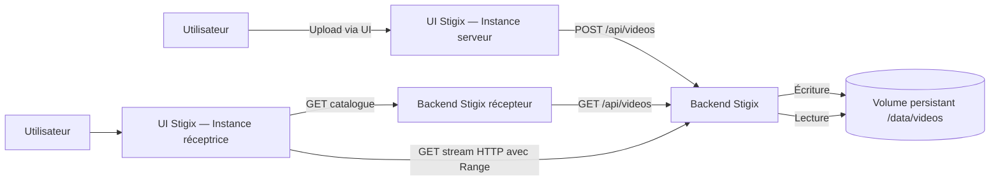

# Video Streaming Validation — Spécification fonctionnelle et technique

**Statut :** Proposition MVP  
**Projet :** Stigix  
**Version :** 0.1  
**Objectif :** Ajouter une validation visuelle simple de la diffusion vidéo entre deux instances Stigix, sans architecture média complexe.

---

## 1. Objectif

Permettre à un opérateur de :

1. déposer une vidéo sur une instance Stigix jouant le rôle de **serveur vidéo** ;
2. consulter la bibliothèque de vidéos disponible sur cette instance ;
3. depuis une seconde instance Stigix jouant le rôle de **récepteur**, lire cette vidéo dans l'interface Web ;
4. observer visuellement l'impact d'un chemin SD-WAN, d'un basculement, d'une congestion ou d'une dégradation réseau sur la lecture.

Le périmètre vise un flux HTTP classique, lu par le navigateur via la balise HTML5 `<video>`. Il ne comprend ni transcodage, ni HLS/DASH, ni WebRTC, ni gestion de catalogue centralisée.

> La fonctionnalité est une **validation visuelle de livraison applicative**. Elle ne doit pas être présentée comme une mesure réseau de précision ni comme un outil de MOS vidéo.

---

## 2. Principes de conception

- **Simplicité :** un fichier vidéo est servi directement, sans pipeline média.
- **Aucune topologie dédiée :** le flux utilise la connectivité IP habituelle entre deux instances Stigix.
- **Trafic réel :** la vidéo est téléchargée via HTTP depuis l'instance serveur vers le navigateur qui consulte l'UI de l'instance réceptrice.
- **Persistance locale :** les fichiers sont stockés dans un volume Docker persistant sur l'instance serveur.
- **Sécurité par défaut :** format limité, taille limitée, quota local, noms de fichiers non exposés comme chemins systèmes.
- **MVP sans dépendance externe :** pas de CDN, de stockage objet, de base de données, ni de service vidéo distinct.

---

## 3. Architecture cible



### 3.1 Rôles

| Rôle | Responsabilité |
|---|---|
| Instance serveur | Reçoit les uploads, stocke les vidéos, expose catalogue et streaming HTTP |
| Instance réceptrice | Configure l'adresse du serveur, consulte le catalogue, affiche le player HTML5 |
| Navigateur utilisateur | Télécharge et décode le flux vidéo depuis le serveur |

Une même instance peut remplir les deux rôles si nécessaire, mais le cas d'usage principal implique deux instances distinctes.

### 3.2 Chemin réseau

Le navigateur de l'opérateur chargé sur l'instance réceptrice accède directement à l'URL de streaming de l'instance serveur. Le flux HTTP traverse donc le réseau SD-WAN entre les deux sites selon le routage et les politiques en place.

Aucun tunnel, réseau Docker additionnel, proxy média, mécanisme de découverte automatique ou configuration d'interface spécifique ne doit être requis pour le MVP.

---

## 4. Périmètre fonctionnel

### 4.1 Bibliothèque vidéo — instance serveur

Ajouter une vue ou une section `Video Library` dans l'interface Stigix.

Fonctionnalités attendues :

- bouton **Upload video** ;
- sélection d'un fichier local ;
- affichage de la progression d'upload ;
- validation côté navigateur et côté serveur ;
- liste des vidéos stockées ;
- affichage du nom logique, de la taille et de la date d'ajout ;
- bouton de suppression par vidéo ;
- message clair lorsque le stockage est plein, que le fichier est invalide ou que la taille maximale est dépassée.

La liste est locale à l'instance serveur. Aucun partage, réplication ou synchronisation inter-instance n'est requis.

### 4.2 Réception / lecture — instance réceptrice

Ajouter une vue ou une section `Video Receiver` dans l'interface Stigix.

Fonctionnalités attendues :

- champ `Video server address` acceptant une IP ou un hostname ;
- port configurable, avec valeur par défaut ;
- bouton **Connect** ou **Load library** ;
- récupération du catalogue exposé par le serveur ;
- liste de vidéos sélectionnables ;
- lecteur HTML5 intégré avec contrôles standard ;
- affichage minimal d'état : `Idle`, `Loading`, `Playing`, `Buffering`, `Ended`, `Error` ;
- bouton **Stop** ;
- message exploitable lorsque le serveur est inaccessible, que le catalogue est vide ou qu'une lecture échoue.

Le navigateur doit établir le flux directement avec l'instance serveur. Le backend de l'instance réceptrice peut relayer le catalogue si cela simplifie les contraintes CORS, mais ne doit pas proxyfier le flux vidéo dans le MVP.

### 4.3 Validation visuelle

Aucune métrique avancée n'est requise pour la première version. L'opérateur doit cependant pouvoir constater visuellement :

- démarrage de la lecture ;
- arrêt / reprise ;
- attente de données (`Buffering`) ;
- erreur de lecture ;
- impact d'une interruption ou d'une dégradation du réseau.

Le statut `Buffering` doit être dérivé des événements HTML5 pertinents, notamment `waiting`, `playing`, `stalled`, `error` et `ended`.

---

## 5. Contraintes média et stockage

### 5.1 Format accepté

Le MVP accepte uniquement des fichiers MP4.

| Élément | Exigence MVP |
|---|---|
| Extension | `.mp4` |
| Type MIME attendu | `video/mp4` |
| Codec vidéo recommandé | H.264 / AVC |
| Codec audio recommandé | AAC |
| Transcodage serveur | Non |
| Génération de miniature | Non |
| Extraction de métadonnées | Optionnelle, non bloquante |

L'extension et le type MIME déclarés par le client ne constituent pas une preuve suffisante. Le serveur doit effectuer une validation minimale du contenu ou refuser tout fichier ambigu.

### 5.2 Limites par défaut

| Paramètre | Valeur par défaut | Comportement |
|---|---:|---|
| Taille maximale par fichier | 250 MiB | Refus de l'upload avant écriture complète |
| Quota total de stockage | 1 GiB | Refus de tout upload dépassant le quota |
| Nombre maximal de vidéos | 10 | Refus lorsque la limite est atteinte |
| Durée conseillée | 30 secondes à 5 minutes | Recommandation UI, pas un blocage MVP |

Ces valeurs doivent être configurables par variables d'environnement.

### 5.3 Stockage persistant

Le répertoire vidéo doit être monté en volume Docker persistant.

Exemple conceptuel :

```yaml
services:
  web-ui:
    volumes:
      - stigix-video-data:/data/videos

volumes:
  stigix-video-data:
```

Les données doivent survivre au redémarrage ou à la recréation du conteneur, tant que le volume n'est pas explicitement supprimé.

---

## 6. API HTTP

Le préfixe proposé est `/api/videos`.

Toutes les réponses API sont JSON, à l'exception du endpoint de streaming qui retourne le média.

### 6.1 Modèle de vidéo

```json
{
  "id": "vid_01J...",
  "name": "demo-branch-to-dc.mp4",
  "size_bytes": 52428800,
  "created_at": "2026-08-22T10:00:00.000Z",
  "mime_type": "video/mp4",
  "stream_url": "/api/videos/vid_01J.../stream"
}
```

`id` est opaque, généré côté serveur et utilisé pour toutes les opérations. Les chemins de fichiers réels ne doivent jamais être retournés à l'UI ni acceptés depuis le client.

### 6.2 Endpoints

| Méthode | Endpoint | Description |
|---|---|---|
| `GET` | `/api/videos/health` | Vérifie que le module vidéo est actif et retourne les limites configurées |
| `GET` | `/api/videos` | Retourne le catalogue local |
| `POST` | `/api/videos` | Upload multipart d'une vidéo MP4 |
| `GET` | `/api/videos/:id/stream` | Retourne le fichier MP4 avec support HTTP Range |
| `DELETE` | `/api/videos/:id` | Supprime une vidéo |

### 6.3 Health response

```json
{
  "enabled": true,
  "max_file_size_mb": 250,
  "storage_limit_mb": 1024,
  "max_files": 10,
  "used_bytes": 104857600,
  "video_count": 2
}
```

### 6.4 Upload

**Requête :** `POST /api/videos`

- Content-Type : `multipart/form-data`
- Champ requis : `file`

**Réponse succès :** `201 Created`

```json
{
  "success": true,
  "video": {
    "id": "vid_01J...",
    "name": "demo-branch-to-dc.mp4",
    "size_bytes": 52428800,
    "created_at": "2026-08-22T10:00:00.000Z",
    "mime_type": "video/mp4",
    "stream_url": "/api/videos/vid_01J.../stream"
  }
}
```

**Erreurs attendues :**

| Code | Erreur | Cause |
|---:|---|---|
| `400` | `INVALID_FILE` | Fichier absent ou nom invalide |
| `413` | `FILE_TOO_LARGE` | Taille par fichier dépassée |
| `415` | `UNSUPPORTED_MEDIA_TYPE` | Fichier non MP4 / type non supporté |
| `409` | `VIDEO_LIMIT_REACHED` | Nombre maximal de vidéos atteint |
| `507` | `STORAGE_QUOTA_EXCEEDED` | Quota de stockage insuffisant |
| `503` | `VIDEO_FEATURE_DISABLED` | Fonctionnalité désactivée |

### 6.5 Catalogue

**Requête :** `GET /api/videos`

**Réponse :** `200 OK`

```json
{
  "videos": [
    {
      "id": "vid_01J...",
      "name": "demo-branch-to-dc.mp4",
      "size_bytes": 52428800,
      "created_at": "2026-08-22T10:00:00.000Z",
      "mime_type": "video/mp4",
      "stream_url": "/api/videos/vid_01J.../stream"
    }
  ],
  "count": 1
}
```

### 6.6 Streaming

**Requête :** `GET /api/videos/:id/stream`

Exigences :

- retourner `Content-Type: video/mp4` ;
- accepter et traiter l'en-tête `Range` ;
- retourner `206 Partial Content` lorsqu'une plage est demandée ;
- retourner les en-têtes `Accept-Ranges`, `Content-Range` et `Content-Length` appropriés ;
- retourner `404` si l'identifiant n'existe pas ;
- ne jamais accepter un chemin fourni par l'utilisateur ;
- ne pas charger le fichier complet en mémoire ; diffuser le contenu par stream.

Le support `Range` est obligatoire : il permet au navigateur de démarrer rapidement, de se positionner dans la vidéo et de reprendre la lecture de manière standard.

### 6.7 Suppression

**Requête :** `DELETE /api/videos/:id`

**Réponse :** `204 No Content`

La suppression supprime le fichier média et son éventuelle métadonnée locale. L'UI doit demander une confirmation explicite avant l'appel API.

---

## 7. Configuration

Ajouter les variables suivantes à la configuration Docker / `.env` :

```bash
# Active ou désactive le module vidéo.
VIDEO_ENABLED=true

# Port HTTP exposant l'API vidéo et le streaming.
VIDEO_PORT=8084

# Répertoire persistant de stockage des vidéos.
VIDEO_STORAGE_PATH=/data/videos

# Limites de stockage.
VIDEO_MAX_FILE_SIZE_MB=250
VIDEO_STORAGE_LIMIT_MB=1024
VIDEO_MAX_FILES=10

# Origines autorisées pour le navigateur, si CORS est nécessaire.
# Valeur vide : même origine uniquement / configuration par défaut du backend.
VIDEO_CORS_ORIGINS=
```

### 7.1 Port

Le port par défaut proposé est `8084`, distinct des services HTTP target déjà utilisés. Le port doit rester configurable pour éviter les conflits en host mode.

### 7.2 Désactivation

Si `VIDEO_ENABLED=false` :

- l'UI masque ou désactive les sections vidéo ;
- les endpoints retournent `503 VIDEO_FEATURE_DISABLED` ;
- les fichiers existants ne sont pas supprimés ;
- le module ne doit pas ouvrir de port vidéo dédié.

---

## 8. Interface utilisateur

### 8.1 Serveur : Video Library

La page doit contenir :

- un en-tête `Video Library` ;
- l'état du stockage, par exemple `120 MiB / 1 GiB used` ;
- un bouton `Upload video` ;
- une zone de sélection de fichier ;
- une barre de progression pendant l'envoi ;
- un tableau ou une liste de vidéos ;
- pour chaque vidéo : nom, taille, date, bouton `Delete` ;
- un état vide : `No videos uploaded yet.`

L'upload doit être désactivé de façon préventive si le nombre maximal de fichiers est atteint. Le serveur reste l'autorité finale pour la validation.

### 8.2 Récepteur : Video Receiver

La page doit contenir :

- un en-tête `Video Receiver` ;
- champ `Video server address` ;
- champ `Port`, pré-rempli à `8084` ;
- bouton `Load library` ;
- indication de connectivité ou message d'erreur ;
- liste de vidéos du serveur distant ;
- un lecteur HTML5 avec `controls` ;
- statut de lecture ;
- bouton `Stop` qui vide la source et appelle `video.pause()`.

Le champ adresse doit accepter :

- une adresse IPv4 ;
- une adresse IPv6 sous une forme compatible URL ;
- un hostname ou FQDN ;
- éventuellement une URL HTTP complète si l'implémentation le simplifie.

L'UI doit normaliser l'adresse avant usage et ne doit jamais construire une URL à partir d'une valeur non validée sans encodage adapté.

### 8.3 États de lecture

| État | Déclencheur indicatif | Texte UI |
|---|---|---|
| Idle | Aucun média sélectionné | `Select a video to start.` |
| Loading | `loadstart` | `Loading video…` |
| Playing | `playing` | `Playing` |
| Buffering | `waiting` ou `stalled` | `Buffering…` |
| Ended | `ended` | `Playback completed.` |
| Error | `error` | `Playback failed. Check server reachability and media format.` |

Il n'est pas nécessaire de conserver l'historique de ces événements dans le MVP.

---

## 9. Sécurité et robustesse

### 9.1 Upload

Le backend doit :

- imposer la taille maximale pendant la réception, et pas seulement après réception ;
- refuser les extensions autres que `.mp4` ;
- vérifier le type média autant que le runtime le permet ;
- générer un identifiant de fichier serveur ;
- ignorer les chemins et noms fournis par le client pour le stockage ;
- neutraliser les caractères de chemin et conserver au besoin un nom d'affichage assaini ;
- écrire dans un emplacement temporaire avant validation et renommage atomique ;
- supprimer le fichier temporaire en cas d'échec ou d'interruption ;
- ne jamais exécuter, décompresser ou analyser comme archive le contenu uploadé.

### 9.2 API et réseau

Le MVP est destiné à un environnement de lab ou d'administration Stigix. Il doit néanmoins :

- s'appuyer sur le mécanisme d'authentification UI/API existant, s'il est activé ;
- ne pas exposer les chemins du système de fichiers ;
- limiter CORS aux origines utiles si le lecteur est chargé depuis une instance différente ;
- retourner des erreurs JSON sans stack trace ;
- journaliser les erreurs techniques côté serveur sans journaliser de contenu vidéo ni données sensibles ;
- limiter la taille de réponse et la concurrence de manière raisonnable si le framework le permet.

### 9.3 Suppression

La suppression doit nécessiter une confirmation UI. Elle ne doit supprimer que la ressource identifiée par l'identifiant opaque enregistré dans le catalogue local.

---

## 10. Non-objectifs MVP

Les éléments suivants sont explicitement hors périmètre :

- transcodage des vidéos ;
- adaptation dynamique de bitrate ;
- HLS, MPEG-DASH, RTSP, RTP, WebRTC ou multicast ;
- upload multi-fichiers ;
- upload par glisser-déposer obligatoire ;
- conversion automatique vers H.264/AAC ;
- génération de miniature ou prévisualisation ;
- métriques vidéo avancées telles que MOS, VMAF, PSNR ou SSIM ;
- corrélation automatique avec les chemins Prisma SD-WAN ;
- proxy du flux via l'instance réceptrice ;
- réplication de vidéos entre instances ;
- authentification dédiée par vidéo ou URL signée ;
- catalogue centralisé, tags, recherche ou dossiers.

Ces fonctions pourront faire l'objet d'une évolution ultérieure, après validation de l'usage et de la simplicité du MVP.

---

## 11. Critères d'acceptation

### 11.1 Upload et stockage

- [ ] Avec `VIDEO_ENABLED=true`, l'opérateur peut envoyer un MP4 inférieur ou égal à la limite configurée.
- [ ] Une vidéo envoyée apparaît dans le catalogue avec nom, taille et date.
- [ ] Une vidéo supérieure à la limite est refusée avec le code `413` et un message UI explicite.
- [ ] Un fichier non MP4 est refusé avec le code `415`.
- [ ] L'upload est refusé si le quota total serait dépassé, sans créer de fichier résiduel.
- [ ] L'upload est refusé si le nombre maximal de vidéos est atteint.
- [ ] Les vidéos sont toujours présentes après redémarrage du conteneur avec le volume persistant.
- [ ] Une vidéo peut être supprimée après confirmation ; elle disparaît du catalogue et libère l'espace correspondant.

### 11.2 Streaming

- [ ] Le catalogue est accessible depuis une autre instance Stigix via adresse IP/hostname et port configuré.
- [ ] La sélection d'une vidéo démarre la lecture dans un navigateur compatible avec le MP4 fourni.
- [ ] L'endpoint de streaming traite les requêtes `Range` et retourne `206 Partial Content` lorsque requis.
- [ ] L'utilisateur peut avancer dans la vidéo avec les contrôles natifs du player.
- [ ] Une erreur d'accès, de réseau ou de média est visible dans l'UI sous une forme compréhensible.
- [ ] Le flux est téléchargé directement depuis l'instance serveur ; il n'est pas relayé par le backend de l'instance réceptrice.

### 11.3 Compatibilité et exploitation

- [ ] La fonctionnalité est désactivable avec `VIDEO_ENABLED=false`.
- [ ] Le port est configurable et ne crée pas de conflit avec les ports Stigix existants.
- [ ] Le stockage ne dépend pas du filesystem éphémère du conteneur.
- [ ] Aucune configuration réseau spécialisée n'est nécessaire pour démarrer un test, en dehors de la connectivité IP entre instances.

---

## 12. Scénario de démonstration

1. Sur l'instance Stigix du datacenter, l'opérateur ouvre `Video Library`.
2. Il upload `demo-1080p.mp4`, un fichier MP4 H.264/AAC de 80 MiB.
3. Sur l'instance Stigix de la branche, l'opérateur ouvre `Video Receiver`.
4. Il renseigne l'IP de l'instance datacenter et le port `8084`, puis charge la bibliothèque.
5. Il sélectionne `demo-1080p.mp4` et lance la lecture.
6. Une action de dégradation ou de failover SD-WAN est déclenchée dans le lab.
7. L'opérateur observe la continuité de lecture, un éventuel état `Buffering`, puis la reprise après retour à la normale.

---

## 13. Plan d'implémentation suggéré

1. Créer le module backend de stockage et catalogue local.
2. Implémenter `GET /health`, `GET /`, `POST /`, `DELETE /:id`.
3. Implémenter `GET /:id/stream` avec gestion HTTP Range et streaming disque.
4. Ajouter les variables d'environnement et le volume Docker persistant.
5. Créer la vue `Video Library` et l'upload avec gestion d'erreurs.
6. Créer la vue `Video Receiver`, le chargement de catalogue distant et le player HTML5.
7. Tester localement, puis entre deux instances à travers le SD-WAN.
8. Ajouter tests automatisés API : upload valide, type invalide, taille dépassée, quota, catalogue, suppression, Range et fichier absent.

---

## 14. Évolutions possibles

Après validation du MVP, les évolutions les plus utiles seraient :

- télémétrie de lecture minimale : temps de démarrage, nombre et durée des bufferisations ;
- profils de vidéos de démonstration embarqués ou téléchargeables ;
- métriques de débit observé par le navigateur ;
- sélection de target via les données de site déjà disponibles dans Stigix ;
- corrélation optionnelle avec les informations de chemin SD-WAN ;
- authentification ou contrôle d'accès renforcé pour les déploiements non-lab ;
- profils HLS adaptatifs, uniquement si le besoin dépasse la validation visuelle simple.
