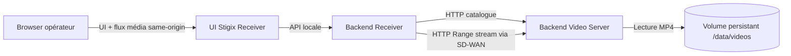

# Prompt d’implémentation — Stigix Video Streaming via Receiver Proxy

Tu dois implémenter la fonctionnalité **Video Streaming Validation** dans Stigix conformément au PRD ci-dessous.

## Intention produit prioritaire

Cette fonctionnalité est destinée avant tout aux **labs multi-instances SD-WAN**, aux démonstrations de failover et aux validations visuelles de livraison applicative.

Le flux vidéo doit être récupéré par l’instance Stigix réceptrice à travers sa connectivité IP/SD-WAN normale, puis relayé en streaming vers le navigateur de l’opérateur. Ce choix garantit que le flux significatif du test est bien :

```text
Instance Stigix Receiver (ex. BR8)
    ⇄ chemin SD-WAN / politiques / failover ⇄
Instance Stigix Video Server (ex. BR5)
```

Le navigateur peut se trouver sur un VLAN management, un jump host ou un environnement sandboxé : il accède uniquement à l’instance Receiver. Il ne doit pas avoir besoin d’atteindre directement l’instance Video Server.

Exemple de démonstration :

```text
Browser (VLAN management)
    → Stigix BR8 / Receiver :8080
    → route proxy same-origin sur BR8
    → BR8 récupère le média sur BR5 :8084 via le SD-WAN
    → BR5 retourne le MP4 vers BR8
    → BR8 relaie le flux au browser
```

L’implémentation doit être un **proxy HTTP de streaming ciblé**, et non un système média complet :

- ne jamais télécharger le MP4 entièrement avant de répondre au browser ;
- ne jamais mettre le fichier entier en mémoire ;
- préserver la sémantique HTTP Range ;
- relayer les octets au fil de l’eau ;
- conserver un comportement lisible lors de pertes, congestion, coupure ou failover SD-WAN ;
- ne pas introduire HLS, DASH, WebRTC, transcodage, cache média ou service externe.

## Règles obligatoires

1. Le player HTML5 du browser doit cibler une URL **same-origin sur l’instance Receiver**, jamais directement l’IP/FQDN du Video Server.
2. L’instance Receiver doit établir la connexion HTTP vers le Video Server avec sa propre table de routage et donc son chemin SD-WAN.
3. La route proxy ne doit accepter ni URL arbitraire, ni IP arbitraire venant du client. Elle doit utiliser un `serverId` connu et validé dans une configuration locale.
4. L’en-tête HTTP `Range` doit être transmis au serveur amont et les headers de réponse pertinents doivent être propagés au browser.
5. Le flux amont doit être annulé lorsque le client browser ferme la connexion, arrête la vidéo ou change de média.
6. Les erreurs amont doivent être traduites proprement en erreurs HTTP et affichées dans l’UI sans stack trace.
7. L’UI doit afficher clairement que le mode utilisé est `Receiver proxy via SD-WAN` et indiquer la source vidéo sélectionnée.
8. Le module doit rester adapté à un lab : simple, déterministe, sans infrastructure média dédiée.

---

# Video Streaming Validation — PRD fonctionnel et technique

**Projet :** Stigix  
**Statut :** Proposition MVP révisée — Receiver Proxy par défaut  
**Version :** 0.2  

---

## 1. Objectif

Permettre à un opérateur de :

1. déposer une vidéo sur une instance Stigix jouant le rôle de **Video Server** ;
2. administrer la bibliothèque locale de vidéos de cette instance ;
3. depuis une seconde instance Stigix jouant le rôle de **Video Receiver**, sélectionner ce serveur et consulter son catalogue ;
4. lire la vidéo dans l’interface Web de l’instance Receiver ;
5. observer visuellement les conséquences d’une dégradation, congestion, interruption ou d’un failover SD-WAN sur la continuité de lecture.

Le périmètre est volontairement limité à un fichier MP4 servi par HTTP et lu via un player HTML5. Il ne comprend ni transcodage, ni HLS/DASH, ni WebRTC, ni RTP vidéo, ni catalogue centralisé.

> Cette fonctionnalité est une validation visuelle de livraison applicative à travers le SD-WAN. Elle ne doit pas être présentée comme un outil de mesure réseau de précision, ni comme une mesure de Video MOS, VMAF, PSNR ou SSIM.

---

## 2. Principes de conception

### 2.1 Receiver Proxy par défaut

Le mode de lecture par défaut est **Receiver Proxy via SD-WAN** :

```text
Browser
  ↓ HTTP(S), same-origin
Stigix Receiver (BR8)
  ↓ HTTP(S), chemin IP normal de BR8
SD-WAN / overlay / politique de routage
  ↓
Stigix Video Server (BR5)
```

Le browser télécharge la vidéo depuis l’instance Receiver ; cette dernière récupère le flux depuis le Video Server et le relaie immédiatement.

Ce modèle garantit que :

- le flux significatif BR8 ↔ BR5 utilise le routage de BR8 ;
- un browser sur VLAN management ne peut pas contourner accidentellement le SD-WAN vers BR5 ;
- le scénario reste reproductible dans un lab virtualisé ou sandboxé ;
- les contraintes CORS intersite disparaissent pour le player, car le browser utilise la même origine que l’UI Receiver ;
- BR5 peut être limité aux connexions provenant des instances Stigix Receiver, sans être accessible depuis tous les postes d’administration.

### 2.2 Streaming transparent

Le Receiver est un relais HTTP streaming ciblé, pas un cache ni un serveur média :

- il transmet les octets au fil de l’eau ;
- il ne stocke pas les vidéos distantes ;
- il ne télécharge pas le MP4 intégralement avant transmission ;
- il ne décode, ne modifie et ne transcode jamais le média ;
- il transmet les requêtes `Range` et préserve les réponses `206 Partial Content` ;
- il relaie les erreurs pertinentes du serveur amont.

### 2.3 Portée de la démo

La démo doit être comprise comme suit :

> L’instance Receiver télécharge la vidéo depuis le Video Server au travers de son chemin SD-WAN. Le navigateur de l’opérateur affiche le résultat de cette livraison applicative et les événements du player.

Le segment Receiver → browser contribue potentiellement à l’expérience affichée, mais, dans un lab, il est attendu stable et local. Le chemin de test est celui entre les instances Stigix.

---

## 3. Architecture cible



### 3.1 Exemple BR8 / BR5

```text
Browser sur VLAN management
      │
      │ GET http://192.168.123.102:8080/api/video-receiver/servers/br5/videos/vid_.../stream
      ▼
Stigix BR8 — 192.168.123.102
      │
      │ GET http://192.168.123.101:8084/api/videos/vid_.../stream
      │ Range: bytes=...
      ▼
      chemin BR8 → BR5 via SD-WAN
      ▼
Stigix BR5 — 192.168.123.101
```

Le browser ne doit pas recevoir dans le `src` du tag `<video>` l’URL directe de BR5. Il doit recevoir une URL locale à BR8.

### 3.2 Rôles

| Rôle | Responsabilités |
|---|---|
| Video Server | Reçoit les uploads, stocke les MP4, expose le catalogue et le streaming HTTP Range |
| Video Receiver | Conserve la configuration des serveurs autorisés, charge les catalogues distants, proxyfie les streams vers le browser, expose l’UI de lecture |
| Browser | Accède à l’UI et au flux proxifié de l’instance Receiver, décode la vidéo et affiche les états de lecture |

Une même instance peut assumer les deux rôles pour un test local, mais le cas d’usage principal est multi-instance.

---

## 4. Scénarios et résultat attendu

### 4.1 Lecture nominale

1. L’opérateur ouvre l’UI de BR8.
2. Il sélectionne le serveur configuré `BR5`.
3. BR8 charge le catalogue de BR5 via son chemin réseau.
4. L’opérateur sélectionne un MP4 et lance la lecture.
5. Le browser demande le flux proxifié à BR8.
6. BR8 demande et reçoit les portions MP4 de BR5, puis les relaie au browser.
7. Le player affiche `Playing`.

### 4.2 Pertes ou congestion SD-WAN

Lorsque le chemin BR8 ↔ BR5 subit des drops ou de la congestion :

- le TCP BR8 ↔ BR5 retransmet les segments perdus ;
- le débit utile peut diminuer ;
- le browser continue tant que son buffer contient des données ;
- lorsque le buffer est vide, l’image se fige et le player affiche `Buffering…` ;
- lorsque BR8 reçoit de nouveau suffisamment de données, le player revient à `Playing`.

Quelques pertes isolées peuvent être invisibles, car TCP et le buffer vidéo les absorbent. Une dégradation prolongée ou un débit durablement inférieur au bitrate vidéo doit provoquer une bufferisation observable.

### 4.3 Failover SD-WAN

| Situation | Résultat attendu dans le browser |
|---|---|
| Failover plus court que le buffer disponible | Lecture potentiellement continue, sans impact visible |
| Failover court mais supérieur au buffer | Image figée, état `Buffering…`, puis reprise `Playing` |
| Failover conservant la session TCP BR8↔BR5 | Reprise naturelle du flux après convergence |
| Failover interrompant la session TCP | Le proxy peut retourner une erreur ; le player affiche `Error` si aucune nouvelle requête Range ne permet de reprendre |
| Coupure longue ou BR5 inaccessible | `Buffering…` puis `Playback failed. Video server unreachable or stream interrupted.` |

Le comportement observé dépend du buffer du navigateur, de la durée de la coupure, de la capacité du chemin secondaire, de la survie de la session TCP et de la capacité du player à relancer une requête Range.

---

## 5. Périmètre fonctionnel

### 5.1 Video Library — Video Server

Sur une instance jouant le rôle de Video Server, proposer une vue `Video Library` avec :

- upload d’un fichier MP4 ;
- progression d’upload ;
- validation côté browser et côté serveur ;
- liste locale des vidéos ;
- nom logique, taille et date d’ajout ;
- suppression avec confirmation explicite ;
- indicateur de quota et messages d’erreur exploitables.

La bibliothèque est locale à l’instance serveur. Elle n’est ni répliquée ni synchronisée entre instances.

### 5.2 Video Receiver — Receiver Proxy

Sur une instance Receiver, proposer une vue `Video Receiver` avec :

- liste de `Video Servers` configurés et autorisés ;
- ajout, modification et suppression d’un serveur source configuré ;
- champs : label, hostname/IP, port, protocole et état de connectivité ;
- bouton `Load library` ;
- catalogue du serveur sélectionné ;
- player HTML5 intégré ;
- source lisible, par exemple `Source: BR5 — 192.168.123.101:8084` ;
- mode affiché : `Receiver proxy via SD-WAN` ;
- états de lecture : `Idle`, `Loading`, `Playing`, `Buffering`, `Ended`, `Error` ;
- bouton `Stop` ;
- messages distincts pour serveur inaccessible, catalogue vide, média absent, erreur Range ou flux interrompu.

L’UI doit pointer le player vers une route locale du Receiver, par exemple :

```text
/api/video-receiver/servers/br5/videos/vid_01J.../stream
```

Elle ne doit jamais affecter directement au tag `<video>` une URL de BR5.

### 5.3 Mode direct optionnel

Le mode `Direct browser to video server` est hors du MVP par défaut. Il pourra être ajouté plus tard comme option avancée, clairement signalée : le routage du browser devient alors partie intégrante du résultat observé.

---

## 6. Contraintes vidéo et stockage

### 6.1 Format MVP

| Élément | Exigence |
|---|---|
| Extension acceptée | `.mp4` |
| MIME type | `video/mp4` |
| Codec vidéo recommandé | H.264 / AVC |
| Codec audio recommandé | AAC |
| Transcodage | Non |
| HLS/DASH/WebRTC/RTP | Non |
| Génération de miniature | Non |

L’extension et le MIME fournis par le client ne suffisent pas à prouver le type de contenu ; le serveur applique une validation minimale et refuse les fichiers ambigus.

### 6.2 Limites par défaut

| Paramètre | Valeur par défaut |
|---|---:|
| Taille maximale par fichier | 250 MiB |
| Quota total local | 1 GiB |
| Nombre maximal de vidéos | 10 |
| Durée recommandée | 30 secondes à 5 minutes |

Les limites doivent être configurables via variables d’environnement.

### 6.3 Persistance

Le Video Server stocke les fichiers dans un volume Docker persistant :

```yaml
services:
  web-ui:
    volumes:
      - stigix-video-data:/data/videos

volumes:
  stigix-video-data:
```

Le Receiver ne conserve pas une copie complète des vidéos distantes dans le MVP.

---

## 7. API

### 7.1 API du Video Server

Préfixe : `/api/videos`

| Méthode | Endpoint | Description |
|---|---|---|
| `GET` | `/api/videos/health` | État du module et limites configurées |
| `GET` | `/api/videos` | Catalogue local |
| `POST` | `/api/videos` | Upload multipart MP4 |
| `GET` | `/api/videos/:id/stream` | Streaming MP4 avec support HTTP Range |
| `DELETE` | `/api/videos/:id` | Suppression d’une vidéo |

Le streaming doit :

- retourner `Content-Type: video/mp4` ;
- accepter `Range` ;
- retourner `206 Partial Content` lorsqu’une plage est demandée ;
- retourner `Accept-Ranges`, `Content-Range` et `Content-Length` ;
- streamer le fichier depuis le disque sans chargement intégral en mémoire ;
- utiliser exclusivement un identifiant opaque pour référencer le fichier.

### 7.2 Configuration Receiver

Préfixe : `/api/video-receiver`

| Méthode | Endpoint | Description |
|---|---|---|
| `GET` | `/api/video-receiver/servers` | Liste des serveurs vidéo autorisés |
| `POST` | `/api/video-receiver/servers` | Ajoute ou met à jour un serveur autorisé |
| `DELETE` | `/api/video-receiver/servers/:serverId` | Supprime un serveur configuré |
| `GET` | `/api/video-receiver/servers/:serverId/health` | Vérifie la connectivité au Video Server depuis le Receiver |
| `GET` | `/api/video-receiver/servers/:serverId/videos` | Retourne le catalogue distant via le Receiver |
| `GET` | `/api/video-receiver/servers/:serverId/videos/:videoId/stream` | Proxy streaming same-origin Receiver → Video Server |

### 7.3 Route proxy : exigences détaillées

La route :

```text
GET /api/video-receiver/servers/:serverId/videos/:videoId/stream
```

doit :

1. authentifier et autoriser l’utilisateur selon le mécanisme Stigix existant ;
2. résoudre `serverId` dans une configuration locale validée ;
3. refuser tout `serverId` inconnu ;
4. ne jamais accepter une URL arbitraire, une IP arbitraire ou un chemin amont fourni par le client ;
5. construire l’URL amont uniquement à partir de `baseUrl` configurée et de `videoId` encodé ;
6. transmettre l’en-tête `Range` du browser au Video Server quand il est présent ;
7. transmettre au browser, quand ils existent, les en-têtes :
   - `Content-Type`
   - `Content-Length`
   - `Content-Range`
   - `Accept-Ranges`
   - `Cache-Control`
   - `ETag`
   - `Last-Modified`
8. propager le statut HTTP amont, notamment `200`, `206`, `404`, `416`, `401`, `403` et `5xx` ;
9. transmettre le corps de réponse comme stream, sans buffer complet ;
10. annuler la requête amont si le browser se déconnecte ;
11. retourner `502 Bad Gateway` si le serveur amont est injoignable et `504 Gateway Timeout` si la connexion amont ne peut pas s’établir dans le timeout de connexion configuré ;
12. ne pas imposer un timeout court pendant une lecture déjà active ;
13. journaliser les événements techniques sans contenu vidéo et sans données sensibles.

Exemple de comportement :

```text
Browser → BR8
GET /api/video-receiver/servers/br5/videos/vid_01J/stream
Range: bytes=10485760-

BR8 → BR5
GET /api/videos/vid_01J/stream
Range: bytes=10485760-

BR5 → BR8 → Browser
HTTP/1.1 206 Partial Content
Content-Type: video/mp4
Accept-Ranges: bytes
Content-Range: bytes 10485760-52428799/52428800
Content-Length: 41943040
```

---

## 8. Configuration

### 8.1 Video Server

```bash
VIDEO_ENABLED=true
VIDEO_PORT=8084
VIDEO_STORAGE_PATH=/data/videos
VIDEO_MAX_FILE_SIZE_MB=250
VIDEO_STORAGE_LIMIT_MB=1024
VIDEO_MAX_FILES=10
```

### 8.2 Video Receiver

```bash
VIDEO_RECEIVER_ENABLED=true
VIDEO_PROXY_CONNECT_TIMEOUT_MS=10000
VIDEO_PROXY_IDLE_TIMEOUT_MS=0
VIDEO_PROXY_MAX_CONCURRENT_STREAMS=5
VIDEO_PROXY_ALLOWED_PROTOCOLS=http,https
```

`VIDEO_PROXY_IDLE_TIMEOUT_MS=0` signifie qu’aucun timeout applicatif arbitraire ne coupe une lecture active. Les mécanismes TCP et les erreurs réelles du flux restent applicables.

### 8.3 Configuration persistante des sources

Exemple de fichier local : `config/video-servers.json`

```json
{
  "servers": [
    {
      "id": "br5-video",
      "label": "BR5 — Video Server",
      "protocol": "http",
      "host": "192.168.123.101",
      "port": 8084,
      "enabled": true
    }
  ]
}
```

Le `serverId` est la seule référence autorisée dans les routes de proxy. La source est validée côté backend avant utilisation.

---

## 9. États UI et observabilité

### 9.1 États du player

| État | Déclencheur indicatif | Texte UI |
|---|---|---|
| Idle | Aucun média sélectionné | `Select a video to start.` |
| Loading | `loadstart` | `Loading video…` |
| Playing | `playing` | `Playing` |
| Buffering | `waiting` ou `stalled` | `Buffering — awaiting video data from the receiver.` |
| Ended | `ended` | `Playback completed.` |
| Error | `error` | `Playback failed. Check receiver-to-server connectivity and media format.` |

### 9.2 Informations de démo

Afficher dans l’UI Receiver :

```text
Video source: BR5 — 192.168.123.101:8084
Receiver: BR8
Playback path: Receiver proxy via SD-WAN
Player state: Playing
```

### 9.3 Logs Receiver

Pour chaque session de proxy, journaliser au minimum :

- timestamp de début et de fin ;
- `serverId` et label de la source ;
- `videoId` ;
- statut HTTP amont ;
- présence de `Range` ;
- octets relayés ;
- durée ;
- cause de terminaison : complétée, client fermé, erreur amont, timeout de connexion ou limite de concurrence.

L’historique détaillé de métriques vidéo, MOS/VMAF ou corrélation automatique avec Prisma SD-WAN reste hors MVP.

---

## 10. Sécurité et robustesse

### 10.1 Upload et stockage serveur

Le Video Server doit :

- imposer les limites de taille pendant la réception ;
- refuser les extensions non MP4 ;
- valider le contenu de façon minimale ;
- générer des identifiants opaques ;
- ne jamais exposer ni accepter un chemin de système de fichiers venant du client ;
- écrire temporairement puis renommer de façon atomique après validation ;
- nettoyer les fichiers temporaires en cas d’échec ;
- ne jamais exécuter, décompresser ou traiter comme archive le fichier uploadé.

### 10.2 Proxy Receiver

Le Receiver doit :

- utiliser uniquement des serveurs configurés localement ;
- empêcher SSRF et redirections non contrôlées ;
- limiter la concurrence selon `VIDEO_PROXY_MAX_CONCURRENT_STREAMS` ;
- retourner des erreurs JSON sans stack trace pour les routes API ;
- préserver le flux média sans l’enregistrer ;
- utiliser l’authentification Stigix existante pour les endpoints Receiver ;
- supprimer les connexions amont abandonnées par le browser ;
- éviter de mettre en log les cookies, headers d’autorisation ou le contenu du média.

### 10.3 Suppression

La suppression d’une vidéo exige une confirmation UI et ne peut viser qu’un identifiant opaque existant dans le catalogue local du Video Server.

---

## 11. Non-objectifs MVP

Les éléments suivants sont explicitement hors périmètre :

- transcodage vidéo ;
- adaptation dynamique de bitrate ;
- HLS, MPEG-DASH, RTSP, RTP, multicast ou WebRTC ;
- cache complet ou stockage local des vidéos distantes sur le Receiver ;
- téléchargement complet avant lecture ;
- upload multi-fichiers ;
- conversion automatique vers H.264/AAC ;
- génération de miniatures ;
- métriques avancées : MOS vidéo, VMAF, PSNR, SSIM ;
- corrélation automatique avec les chemins Prisma SD-WAN ;
- reprise applicative sophistiquée par le proxy à un offset interne après rupture d’un flux déjà ouvert ;
- URLs arbitraires ou proxy HTTP générique ;
- authentification dédiée par vidéo ou URL signée ;
- catalogue centralisé, tags, recherche, réplication ou dossiers ;
- mode direct browser → Video Server dans le parcours MVP standard.

---

## 12. Critères d’acceptation

### 12.1 Video Server

- [ ] Avec `VIDEO_ENABLED=true`, un MP4 inférieur ou égal à la limite peut être uploadé.
- [ ] Un MP4 uploadé apparaît dans le catalogue avec nom, taille et date.
- [ ] Un fichier trop grand retourne `413` et un message UI exploitable.
- [ ] Un fichier non MP4 retourne `415`.
- [ ] Le quota et le nombre maximal de vidéos sont appliqués.
- [ ] Les vidéos survivent au redémarrage avec le volume persistant.
- [ ] La suppression confirmée retire la vidéo et libère le quota.
- [ ] Le serveur supporte `Range` et retourne `206 Partial Content` lorsque requis.

### 12.2 Receiver Proxy

- [ ] Le Receiver peut charger le catalogue d’un Video Server configuré.
- [ ] Le browser ne contacte pas directement le Video Server pendant la lecture.
- [ ] Le `src` du player pointe vers une route same-origin de l’instance Receiver.
- [ ] Le Receiver contacte le Video Server avec son propre chemin IP/routage.
- [ ] Une requête `Range` du browser est transmise au Video Server.
- [ ] Les réponses `206`, `Content-Range`, `Content-Length`, `Content-Type` et `Accept-Ranges` sont correctement relayées.
- [ ] Le fichier n’est jamais chargé entièrement en mémoire ni téléchargé intégralement avant lecture.
- [ ] L’arrêt du player ou la fermeture de l’onglet annule la requête amont.
- [ ] Un Video Server inaccessible produit une erreur explicite côté UI.
- [ ] Une vidéo absente ou un Range invalide retourne un statut cohérent au browser.
- [ ] Une source non configurée ne peut pas être utilisée via l’API.
- [ ] Le Receiver limite les sessions simultanées selon la configuration.

### 12.3 Démonstration SD-WAN

- [ ] Dans un lab BR8 → BR5, BR8 récupère effectivement le flux depuis BR5 via le chemin SD-WAN attendu.
- [ ] Un browser sur VLAN management peut visualiser la vidéo via BR8 sans accès direct requis à BR5.
- [ ] Une perte ou congestion prolongée entre BR8 et BR5 peut provoquer l’état `Buffering…` lorsque le buffer browser est vidé.
- [ ] Un failover rapide peut être absorbé par le buffer et préserver une lecture fluide.
- [ ] Une coupure longue ou la rupture de session provoque un état `Error` exploitable si la lecture ne peut pas reprendre.
- [ ] L’UI identifie la source et affiche `Receiver proxy via SD-WAN`.

---

## 13. Scénario de démonstration

1. Déployer Stigix BR5 avec le rôle Video Server et un volume persistant.
2. Uploader un MP4 H.264/AAC, par exemple `demo-1080p.mp4`.
3. Déployer Stigix BR8 avec le rôle Video Receiver.
4. Configurer sur BR8 la source autorisée : `BR5 — 192.168.123.101:8084`.
5. Depuis un browser sur le VLAN management, ouvrir l’UI BR8 : `http://192.168.123.102:8080`.
6. Dans `Video Receiver`, sélectionner `BR5`, charger la bibliothèque puis choisir la vidéo.
7. Le browser demande le flux à BR8 ; BR8 ouvre le flux BR8 → BR5 via le SD-WAN et relaie le média.
8. Lancer une séquence de dégradation ou de failover SD-WAN.
9. Observer le player : continuité, `Buffering…`, reprise ou `Error` selon le scénario.
10. Corréler visuellement, si disponible, avec la topologie et les données de flux SD-WAN existantes de Stigix.

---

## 14. Plan d’implémentation

1. Implémenter le module Video Server : volume, upload, catalogue, suppression, streaming disque avec `Range`.
2. Ajouter la configuration persistante des Video Servers autorisés sur le Receiver.
3. Ajouter les endpoints Receiver de health et catalogue distant.
4. Implémenter la route proxy streaming en Node.js/TypeScript : résolution `serverId`, forward `Range`, propagation des headers/statuts, pipe stream et abort amont.
5. Ajouter les limites de timeout de connexion et de concurrence.
6. Créer l’UI `Video Library`.
7. Créer l’UI `Video Receiver` avec liste des sources configurées, catalogue, player same-origin, états de lecture et informations de chemin.
8. Ajouter les logs de session de proxy.
9. Ajouter les tests automatisés : upload, type, taille, quota, catalogue, suppression, Range direct, Range proxy, headers proxy, source inconnue, Video Server indisponible, annulation browser et limite de concurrence.
10. Tester localement, puis dans un lab multi-instance BR8 ↔ BR5 avec failover et dégradation.

---

## 15. Évolutions ultérieures

Après validation du MVP, les évolutions envisageables sont :

- métriques minimales de lecture : délai de démarrage, nombre de bufferisations, durée cumulée de buffering ;
- corrélation optionnelle d’une session proxy avec un chemin Prisma SD-WAN ;
- indicateur de débit reçu par BR8 depuis BR5 ;
- détection de reprise après failover et affichage `Reconnecting to video source…` ;
- mode direct browser → Video Server comme mode avancé ;
- authentification renforcée entre Receiver et Video Server ;
- HTTPS/mTLS pour les déploiements hors lab ;
- sélection de cibles à partir des données de site Stigix/Prisma ;
- HLS adaptatif uniquement si le besoin dépasse la validation visuelle simple.
