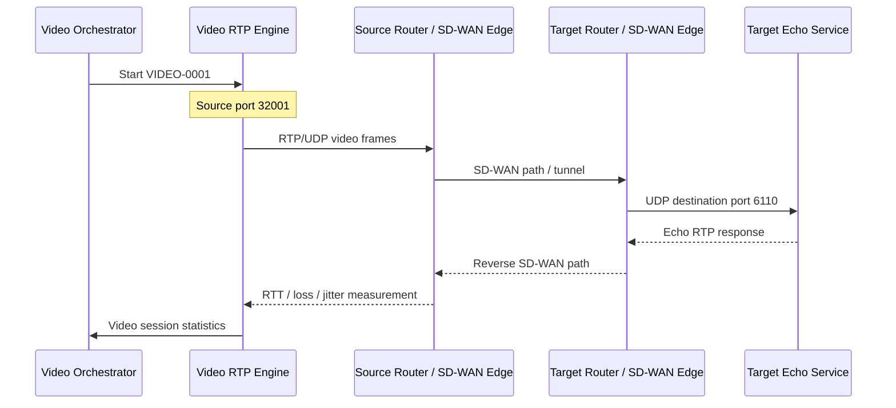

# PRD — Video Conference Simulation (RTP)

**Produit :** Stigix / SD-WAN Traffic Generator  
**Statut :** Proposition MVP  
**Auteur :** Jean-Louis Suzanne / Stigix  
**Date :** 3 septembre 2026  
**Version :** 0.1

---

## 1. Résumé

Stigix dispose déjà d’un module **Voice Simulation (RTP)** permettant de lancer des appels VoIP synthétiques vers un conteneur cible `sdwan-voice-echo`, avec suivi des appels, mesure du RTT, de la perte, de la gigue RTP et calcul d’un MOS.

Ce PRD définit l’ajout d’une capacité **Video Conference Simulation**, conçue pour être cohérente avec l’architecture, les conventions de configuration, l’expérience UI et les mécanismes d’observabilité du module Voice existant.

Le produit ne vise pas, dans le MVP, à créer une vraie session WebRTC, à encoder un flux vidéo réel ou à reproduire les mécanismes complets de négociation navigateur (ICE, DTLS, SRTP, STUN/TURN). Il vise à produire un trafic réseau suffisamment réaliste pour tester les politiques SD-WAN/SASE, notamment :

- Classification applicative et règles QoS/DSCP.
- SLA de lien : latence, jitter, perte et brownout.
- Application-aware routing et steering WAN.
- Réaction aux rafales, à la congestion, aux pertes et au réordonnancement.
- Capacité à isoler et corréler chaque flux dans un orchestrateur SD-WAN.

Le trafic généré sera du **RTP sur UDP synthétique**, organisé en frames vidéo, avec un débit configurable, une variabilité de taille, des keyframes périodiques et un pacing configurable.

---

## 2. Problème

La simulation Voice actuelle représente bien une charge temps réel audio : petits paquets RTP réguliers, cadence stable et sensibilité à la gigue et à la perte. Elle ne représente cependant pas la réalité d’un appel vidéo moderne :

- Les flux vidéo consomment significativement plus de bande passante que la voix.
- Les données sont naturellement variables selon l’activité visuelle.
- Une image vidéo est fragmentée en plusieurs paquets RTP.
- Les images clés (I-frames / keyframes) provoquent des pics de débit importants.
- Les pertes de paquets peuvent causer une dégradation visible prolongée jusqu’à la prochaine keyframe.
- Les applications réelles lissent en général les envois avec du packet pacing, tout en subissant des micro-bursts.

Pour valider un design SD-WAN/SASE, un flux `iperf` constant est insuffisant : il ne met pas en évidence les comportements critiques d’un appel vidéo lors d’une congestion, d’une perte intermittente ou d’un changement de chemin.

---

## 3. Objectifs

### 3.1 Objectifs produit

1. Ajouter un module **Video** comparable au module **Voice** dans Stigix.
2. Réutiliser autant que possible les composants, conventions et patterns existants : orchestrateur, fichier de configuration, API REST, dashboard, logs, IDs de session, ports déterministes et echo target.
3. Générer un trafic RTP/UDP représentant la forme réseau d’un appel vidéo interactif.
4. Permettre des démonstrations reproductibles de QoS, path steering et restauration après brownout.
5. Exposer des métriques utiles pour un ingénieur réseau, sans prétendre fournir une mesure de QoE vidéo réellement décodée.

### 3.2 Objectifs techniques

- Gérer plusieurs sessions vidéo simultanées.
- Générer des flux vidéo synthétiques dans les deux sens via un mécanisme d’écho.
- Faire varier les tailles de frames et de paquets à partir d’un profil configurable.
- Injecter des keyframes périodiques et, ultérieurement, une keyframe de récupération.
- Capturer les retours echo et calculer RTT, perte et jitter avec les principes déjà utilisés par Voice.
- Permettre la traçabilité du flux sur le réseau par un `VIDEO-ID` et un port source déterministe.
- Fonctionner en `network_mode: host` sous Linux, selon le modèle Smart Networking existant.

---

## 4. Non-objectifs MVP

Les éléments suivants sont explicitement hors périmètre de la première version :

- Codec vidéo réel ou flux décodable par VLC / navigateur.
- WebRTC complet : ICE, STUN, TURN, DTLS, SRTP et SDP.
- Connexion à Teams, Zoom, Google Meet ou Webex.
- Émulation précise de chaque codec (H.264, VP8, VP9, AV1).
- Analyse de qualité basée sur le contenu vidéo, PSNR, VMAF ou frames réellement décodées.
- Simulcast et SVC.
- Réponse complète aux feedbacks RTCP de type Transport-CC, REMB, NACK, PLI ou FIR.

Ces évolutions pourront faire l’objet de versions ultérieures lorsque le MVP de trafic synthétique, de mesure réseau et de visualisation sera validé.

---

## 5. Utilisateurs et cas d’usage

### 5.1 Utilisateurs cibles

- Ingénieur SD-WAN/SASE construisant un lab de démonstration.
- Architecte réseau validant les seuils SLA et les politiques de steering.
- Avant-vente démontrant la valeur du traitement applicatif et de la QoS.
- Équipe de test reproduisant un brownout WAN avec trafic sensible à la qualité.

### 5.2 Cas d’usage prioritaires

| ID | Cas d’usage | Résultat attendu |
|---|---|---|
| UC-01 | Lancer un appel vidéo SD entre deux sites | Le dashboard affiche une session vidéo RTP active et ses métriques réseau |
| UC-02 | Générer plusieurs appels HD simultanés | Chaque appel devient un flux distinct, identifiable et corrélable dans le SD-WAN |
| UC-03 | Tester une policy QoS | Le trafic vidéo est identifiable par ports, DSCP et metadata RTP |
| UC-04 | Dégrader le lien primaire | Les métriques vidéo se dégradent de manière visible avant ou pendant le steering |
| UC-05 | Valider un failover/failback | La session reste suivie, le RTT/jitter/perte montrent l’impact puis la récupération |
| UC-06 | Comparer Voice et Video | L’utilisateur voit simultanément les effets d’un brownout sur les deux types de média |
| UC-07 | Tester un partage d’écran synthétique | Le générateur produit une charge variable avec de gros bursts lors de changements simulés |

---

## 6. Principes de cohérence Voice

Le module Video doit adopter les mêmes principes de conception que le module Voice existant.

| Domaine | Voice existant | Exigence Video |
|---|---|---|
| Moteur | `rtp.py`, Scapy / UDP-RTP | `video_rtp.py`, même approche Scapy / UDP-RTP |
| Orchestration | `voice_orchestrator.py` | `video_orchestrator.py`, modèle de cycle de vie identique |
| Cibles | `voice-servers.txt` | `video-servers.txt`, format compatible enrichi |
| Echo | `sdwan-voice-echo` | Évolution du même target container avec écoute vidéo dédiée |
| Ports cible | UDP 6100–6101 | UDP 6110–6111 par défaut |
| UI | Onglet Voice + Active Calls + Recent History | Onglet Video + Active Sessions + Recent History |
| Contrôle API | `/api/voice/*` | `/api/video/*` |
| Identité | `CALL-0001` injecté dans payload RTP | `VIDEO-0001` injecté dans payload RTP |
| Port source | 31000 + Call ID, fallback dynamique | 32000 + Video ID, fallback dynamique |
| Statistiques | RTT, perte, jitter, MOS | RTT, perte, jitter, débit, FPS simulé, keyframes et indicateur de qualité |
| Réinitialisation | Logs/counter/reset dashboard | Même comportement, totalement indépendant de Voice |
| Réseau | Interface Smart Networking / host mode | Même mécanisme et même priorité de sélection d’interface |

Aucune modification intrusive du module Voice existant ne doit être nécessaire pour introduire Video. Les deux modules doivent pouvoir être activés indépendamment et fonctionner simultanément.

---

## 7. Proposition fonctionnelle MVP

### 7.1 Architecture

Le système repose sur trois composants :

1. **Video Orchestrator**
   - Lance et arrête les sessions selon la configuration.
   - Choisit une cible par pondération.
   - Applique les limites de simultanéité.
   - Écrit les événements et les statistiques dans les fichiers/structures consommés par l’API et le dashboard.
   - Réalise un pre-flight check de joignabilité de la cible, à l’image de Voice.

2. **Video RTP Engine**
   - Forge et émet des paquets IP/UDP/RTP.
   - Regroupe les paquets en frames vidéo synthétiques.
   - Applique un débit cible et un mécanisme de pacing.
   - Injecte un `VIDEO-ID` dans le payload afin que la cible puisse identifier la session.
   - Écoute les paquets echo et calcule les métriques de transport.

3. **Video Echo Service**
   - Écoute les ports UDP vidéo.
   - Identifie une session par tuple réseau et `VIDEO-ID`.
   - Retourne les paquets au générateur avec un marquage d’écho minimal.
   - Maintient l’état des sessions et les clôture après timeout de silence.

Le MVP peut être hébergé dans l’image `sdwan-voice-echo` existante, renommée conceptuellement en target appliance, ou dans une image dédiée `sdwan-video-echo`. La recommandation est de réutiliser l’image existante pour limiter l’installation sur les sites cibles.

### 7.2 Chemin réseau



### 7.3 Modèle de flux

Chaque session représente une caméra vidéo dans une direction. Pour maintenir la simplicité du module Voice, le MVP peut utiliser un echo bidirectionnel : le générateur envoie le flux vers la cible, et l’echo renvoie ces paquets au générateur. Cette architecture fournit des métriques de transport de bout en bout avec une seule configuration de cible.

Une évolution ultérieure pourra introduire deux émetteurs actifs par session ou un mode conférence multipoints.

---

## 8. Caractéristiques du trafic

### 8.1 RTP vidéo synthétique

Le moteur génère des paquets RTP avec :

- RTP v2.
- Numéro de séquence incrémenté pour chaque paquet.
- Timestamp RTP cohérent pour toutes les fragments d’une frame.
- Horloge RTP vidéo de 90 kHz.
- SSRC unique par session.
- Bit `Marker` positionné sur le dernier paquet d’une frame.
- Payload synthétique contenant le type de frame et le `VIDEO-ID`.

Le payload ne doit pas être présenté comme un bitstream H.264/VP8 valide. Le champ `codec` sert à choisir un profil de trafic et à afficher une désignation compréhensible dans l’UI.

### 8.2 Frames et fragmentation

Une frame vidéo est représentée par un ensemble de paquets RTP. Sa taille est déterminée par :

- Le débit moyen demandé.
- Le nombre d’images par seconde.
- Un facteur de variation aléatoire borné.
- Le type de frame : delta frame ou keyframe.

La taille moyenne d’une frame peut être approximée par :

\[
\text{frame\_bytes} = \frac{\text{bitrate\_bps}}{8 \times \text{fps}}
\]

Exemple : pour 1 500 kb/s à 30 fps, la taille moyenne est d’environ 6 250 octets par frame. Avec un payload de 1 100 octets, une frame représente typiquement 6 paquets RTP. Une keyframe avec multiplicateur x6 représente environ 34 à 35 paquets.

### 8.3 Pacing

Le moteur doit fournir trois comportements de pacing :

| Mode | Comportement | Usage |
|---|---|---|
| `paced` | Répartit les paquets d’une frame sur la durée entre deux frames | Comportement par défaut et démos réalistes |
| `frame-burst` | Envoie les paquets d’une frame dans une fenêtre très courte | Test micro-bursts, buffers et files QoS |
| `hybrid` | Burst court, mais limité par une fenêtre de pacing configurable | Compromis réaliste pour les tests WAN |

Le mode par défaut est `paced`.

### 8.4 Variabilité

Le moteur doit éviter un débit parfaitement constant. Il applique une variation de taille de frame autour de la moyenne, par exemple ±30 % par défaut. Cette variation doit être configurable et reproductible en mode test avec une seed optionnelle.

### 8.5 Keyframes

Une keyframe doit être générée à intervalle régulier, par défaut toutes les 2 secondes. Sa taille est calculée via un multiplicateur configurable, par défaut x6 de la taille moyenne d’une frame.

À titre de MVP, la keyframe est une charge RTP plus grande ; elle n’a pas besoin d’être un flux vidéo décodable. Elle doit être visible dans la télémétrie, l’historique et les logs.

---

## 9. Profils fournis

Stigix doit inclure des profils prédéfinis afin d’éviter à l’utilisateur de devoir comprendre tous les paramètres RTP pour démarrer.

| Profil | Codec affiché | Débit moyen | Débit min/max | FPS | Payload | Keyframe | Usage |
|---|---|---:|---:|---:|---:|---:|---|
| `video-low` | H.264 Low | 400 kb/s | 200 / 700 kb/s | 15 | 900 B | 2 s, x4 | Réseau limité / dégradation |
| `video-sd` | H.264 SD | 1 000 kb/s | 500 / 1 500 kb/s | 30 | 1 100 B | 2 s, x5 | Réunion standard, profil par défaut |
| `video-hd` | H.264 HD | 2 000 kb/s | 1 000 / 3 500 kb/s | 30 | 1 100 B | 2 s, x6 | Caméra HD / validation QoS |
| `video-screen-share` | Screen Share | 2 000 kb/s | 300 / 8 000 kb/s | 10 | 1 100 B | 5 s, x10 | Slides, IDE, dashboard, trafic très variable |

Les valeurs sont des profils de génération Stigix, non des promesses de débit pour un codec réel ou un produit de visioconférence particulier.

---

## 10. Configuration

### 10.1 Fichier de serveurs

Créer `config/video-servers.txt` sur le modèle de `voice-servers.txt`.

Format proposé :

```text
<target_ip>:<port>|<profile>|<weight>|<duration_sec>
```

Exemple :

```text
192.168.100.10:6110|video-sd|100|60
192.168.100.11:6110|video-hd|50|120
192.168.100.12:6110|video-screen-share|25|90
```

Règles :

- `target_ip:port` est l’adresse du target echo.
- `profile` référence un profil standard ou une définition personnalisée connue du générateur.
- `weight` définit la probabilité de sélection de la cible.
- `duration_sec` représente la durée d’une session.

Pour maximiser l’alignement Voice, les quatre premiers champs doivent rester strictement identiques dans leur sémantique.

### 10.2 Fichier JSON exposé à l’UI

Créer `config/video-config.json` avec une structure volontairement similaire à `voice-config.json` :

```json
{
  "control": {
    "enabled": false,
    "max_simultaneous_sessions": 3,
    "sleep_between_sessions": 1,
    "interface": "enp2s2",
    "pacing_mode": "paced",
    "success": true
  },
  "servers": [
    {
      "target": "192.168.203.100:6110",
      "profile": "video-sd",
      "weight": 100,
      "duration": 60
    }
  ],
  "state": {
    "counter": 0
  }
}
```

### 10.3 Définitions de profils

Les profils peuvent initialement être embarqués dans le moteur Python. Une évolution pourra introduire `config/video-profiles.json` afin de permettre leur personnalisation sans reconstruire l’image.

Structure indicative :

```json
{
  "video-sd": {
    "display_name": "H.264 SD",
    "bitrate_kbps": 1000,
    "min_bitrate_kbps": 500,
    "max_bitrate_kbps": 1500,
    "fps": 30,
    "payload_bytes": 1100,
    "frame_variation_pct": 30,
    "keyframe_interval_sec": 2,
    "keyframe_multiplier": 5,
    "pacing_mode": "paced",
    "dscp": "AF41"
  }
}
```

---

## 11. API

L’API doit suivre la convention du module Voice.

| API | Méthode | Description |
|---|---|---|
| `/api/video/status` | GET | État du module, sessions actives et synthèse des métriques |
| `/api/video/config` | GET | Lecture de la configuration actuelle |
| `/api/video/config` | POST | Mise à jour de la configuration et persistance de `video-config.json` |
| `/api/video/servers` | GET | Liste des cibles configurées |
| `/api/video/servers` | POST | Ajout ou mise à jour d’une cible |
| `/api/video/servers/:id` | DELETE | Suppression d’une cible |
| `/api/video/enable` | POST | Active le générateur |
| `/api/video/disable` | POST | Désactive proprement le générateur |
| `/api/video/reset` | POST | Efface les métriques/historique et remet le compteur à zéro |
| `/api/video/history` | GET | Retourne les événements et sessions récentes |
| `/api/video/profiles` | GET | Retourne les profils disponibles |

Les noms exacts peuvent être alignés sur les routes Voice existantes lors de l’implémentation. La priorité est la symétrie UX/API, non l’introduction d’un modèle d’API distinct.

---

## 12. Expérience utilisateur

### 12.1 Nouvel onglet Video

Ajouter un onglet **Video** dans l’application, adjacent à Voice. Il doit reprendre les codes visuels du module Voice afin que l’utilisateur n’ait pas à réapprendre une nouvelle interface.

Le dashboard comprend :

1. **Video Controls**
   - Enable/Disable.
   - Maximum simultaneous sessions.
   - Sleep between sessions.
   - Source interface, alimentée par Smart Networking.
   - Pacing mode.
   - Reset Statistics.

2. **Video Targets**
   - Tableau des cibles : Target, Profile, Weight, Duration, Status.
   - Ajout, édition et suppression d’une cible.
   - Test de joignabilité / pre-flight status.

3. **Live QoS Summary**
   - Sessions actives.
   - Débit émis et reçu moyen/instantané.
   - RTT moyen, min, max.
   - Jitter moyen, min, max.
   - Packet loss moyen.
   - Frames simulées et keyframes envoyées.
   - Indicateur global de qualité.

4. **Active Video Sessions**
   - `VIDEO-ID`.
   - Target.
   - Profile.
   - Duration / elapsed time.
   - Source port.
   - Current bitrate.
   - RTT, jitter, loss.
   - Last keyframe.

5. **Recent History**
   - Au moins 500 événements, du plus récent au plus ancien.
   - Recherche par `VIDEO-ID`, IP cible, profil ou port source.
   - Événements : STARTED, KEYFRAME, DEGRADED, RECOVERED, ENDED, SKIPPED, ERROR.

### 12.2 États et couleurs

| État | Couleur indicative | Définition MVP |
|---|---|---|
| Excellent | Vert | Perte < 0,5 %, jitter < 20 ms, RTT < 150 ms |
| Good | Vert clair / bleu | Perte < 1 %, jitter < 30 ms, RTT < 200 ms |
| Fair | Orange | Perte < 3 %, jitter < 50 ms ou RTT < 300 ms |
| Poor | Rouge | Perte >= 3 %, jitter >= 50 ms ou RTT >= 300 ms |
| Unknown | Gris | Pas assez de paquets echo ou session non encore mesurable |

Ces seuils sont des indicateurs Stigix de santé de transport et ne doivent pas être qualifiés de MOS vidéo, ni de score de qualité certifié.

---

## 13. Mesures et télémétrie

### 13.1 Métriques obligatoires MVP

Le module Video doit calculer et exposer :

- `packets_sent`
- `packets_received`
- `packet_loss_pct`
- `rtt_ms_avg`
- `rtt_ms_min`
- `rtt_ms_max`
- `jitter_ms`
- `bitrate_tx_kbps`
- `bitrate_rx_kbps`
- `frames_sent`
- `keyframes_sent`
- `fps_target`
- `fps_effective`
- `source_port`
- `target`
- `profile`
- `session_id`
- `video_id`

### 13.2 Calcul de jitter

Le calcul de jitter doit réutiliser l’algorithme RTP RFC 3550 déjà employé par Voice :

\[
J = J + \frac{|D(i-1,i)| - J}{16}
\]

L’implémentation doit rester commune ou factorisée autant que possible pour éviter que Voice et Video divergent sur la définition du jitter.

### 13.3 Indicateur qualité

Le MVP ne doit pas calculer un MOS de type audio. Il doit présenter un `video_quality_indicator` heuristique : `excellent`, `good`, `fair`, `poor` ou `unknown`.

L’algorithme doit être documenté dans le code et ne pas être présenté comme une mesure subjective réelle de qualité vidéo.

---

## 14. Identification et traçabilité

### 14.1 Video ID

Chaque session reçoit un identifiant monotone :

```text
VIDEO-0001
VIDEO-0002
VIDEO-0003
```

Cet identifiant est injecté dans le payload RTP synthétique, selon le principe de `CALL-ID` utilisé par Voice.

### 14.2 Ports source

Chaque session utilise un port source déterministe :

```text
VIDEO-0001 -> 32001
VIDEO-0015 -> 32015
```

En cas d’indisponibilité, le moteur utilise un fallback aléatoire dans une plage haute configurable, par défaut `40000-65535`.

La plage 32000+ évite une collision logique avec Voice, qui utilise la plage 31000+.

### 14.3 Bénéfices

- Recherche directe d’un flux dans un flow browser SD-WAN.
- Vérification des règles de steering par port/tuple.
- Corrélation entre dashboard Stigix, logs du target et capture Wireshark.
- Distinction nette de sessions concurrentes sur une même cible.

---

## 15. Echo target

### 15.1 Ports

Le service target doit écouter par défaut :

| Service | Ports UDP | Rôle |
|---|---:|---|
| Voice Echo | 6100–6101 | Service existant RTP voice |
| Video Echo | 6110–6111 | Nouveau service RTP video |

Le choix d’une plage voisine facilite le déploiement et le troubleshooting tout en séparant clairement les deux modules.

### 15.2 Déploiement cible

La solution recommandée est d’enrichir le conteneur existant `sdwan-voice-echo` pour qu’il héberge également Video Echo. Un seul déploiement cible reste ainsi suffisant pour Voice, Video, Convergence, iperf3 et HTTP target.

Exemple d’exposition Docker :

```bash
docker run -d --name sdwan-traffic-echo \
  -p 6100-6101:6100-6101/udp \
  -p 6110-6111:6110-6111/udp \
  --restart unless-stopped \
  jsuzanne/sdwan-voice-echo:stable
```

Le nom historique de l’image peut être conservé pour éviter de casser les déploiements existants. Une évolution de naming pourra être étudiée séparément.

### 15.3 Gestion de session

Le Video Echo doit :

- Extraire le `VIDEO-ID` du payload.
- Journaliser l’arrivée de la session.
- Répondre au paquet vers l’adresse/port source reçu.
- Considérer une session terminée après 5 secondes de silence par défaut.
- Journaliser la fin de session.

Exemples de logs attendus :

```text
🎥 [14:22:00] Incoming video session: VIDEO-0012 from 192.168.217.5:32012 | video-hd
✅ [14:23:00] Video session VIDEO-0012 finished (last from 192.168.217.5:32012)
```

---

## 16. Logs et persistance

Le module reprend les garanties du module Voice :

- À chaque restart du conteneur générateur, le module démarre désactivé.
- Les statistiques et l’historique Video sont remis à zéro au démarrage, sauf décision explicite ultérieure de persistance.
- Le compteur `VIDEO-ID` repart à `VIDEO-0001`.
- Les logs Video sont séparés des logs Voice.
- Le dashboard ne doit pas afficher de sessions fantômes après un redémarrage.
- Une session active est liée à un `session_id` de run, comme le module Voice.

Fichiers indicatifs :

```text
/data/video-control.json
/data/video-stats.json
/data/video-events.jsonl
/data/video-session.json
```

Les chemins finaux doivent suivre les conventions de persistance déjà utilisées par Voice dans le repository.

---

## 17. Exigences non fonctionnelles

### 17.1 Performance

- Le MVP doit soutenir au moins 3 sessions `video-hd` simultanées sur une machine Linux de lab moderne, sans bloquer l’UI ou les autres générateurs Stigix.
- La limite par défaut de sessions vidéo doit être prudente : 3.
- La limite maximale affichée dans l’UI doit initialement être 10, avec un avertissement de capacité.
- Le moteur doit éviter les boucles occupées et utiliser un timing monotone haute précision.

### 17.2 Compatibilité

- Linux + Docker host mode : cible principale et comportement recommandé.
- macOS / Windows Docker Desktop : mode best effort, selon les limites existantes de host networking et de Scapy.
- L’interface réseau doit suivre le mécanisme Smart Networking et `config/interfaces.txt` existant.

### 17.3 Sécurité et sûreté

- Le générateur est désactivé par défaut au démarrage.
- Aucun trafic ne doit être généré sans activation explicite dans l’UI ou API.
- Les cibles doivent être configurées explicitement.
- Le logiciel ne doit pas tenter de contacter des destinations non configurées.
- Les paquets générés doivent être strictement limités à UDP/RTP synthétique vers les ports configurés.

### 17.4 Observabilité

- Logging lisible et peu bruyant en fonctionnement nominal.
- Niveau DEBUG permettant de montrer port source, profil, bitrate, frame/keyframe et erreurs de capture.
- Compteurs fiables après reset.
- API et UI cohérentes même en cas de restart de l’orchestrateur.

---

## 18. Critères d’acceptation MVP

### 18.1 Fonctionnement de base

- [ ] L’onglet Video est visible dans l’UI Stigix.
- [ ] Le module est désactivé par défaut après un démarrage/restart.
- [ ] L’utilisateur peut activer/désactiver le module depuis l’UI.
- [ ] L’utilisateur peut créer, modifier et supprimer une cible Video.
- [ ] L’utilisateur peut choisir un profil parmi `video-low`, `video-sd`, `video-hd` et `video-screen-share`.
- [ ] Le générateur vérifie la joignabilité de la cible avant le lancement d’une session.
- [ ] Une cible non joignable produit un événement `SKIPPED` clair sans session fantôme.

### 18.2 Trafic

- [ ] Une session `video-sd` envoie du RTP/UDP vers le target configuré.
- [ ] Les paquets portent un SSRC et une séquence RTP cohérents.
- [ ] Le timestamp RTP est stable pour les fragments d’une même frame et progresse entre frames avec une horloge 90 kHz.
- [ ] Le bit Marker est positionné sur le dernier paquet de chaque frame.
- [ ] Le trafic présente des tailles de frame variables.
- [ ] Une keyframe surdimensionnée est émise à l’intervalle configuré.
- [ ] Le mode `paced` réduit les rafales par rapport à `frame-burst`.
- [ ] Chaque session utilise un port source déterministe basé sur son `VIDEO-ID`.
- [ ] En cas de conflit de port, le fallback est documenté et visible dans les logs DEBUG.

### 18.3 Echo et mesures

- [ ] Le target Video Echo reçoit, identifie et retourne les paquets.
- [ ] Les logs cible montrent le `VIDEO-ID` reçu.
- [ ] Le générateur calcule RTT, perte et jitter à partir du trafic de retour.
- [ ] Le dashboard affiche les compteurs de débit, frames et keyframes.
- [ ] Le dashboard affiche un indicateur de qualité transport avec ses seuils documentés.
- [ ] La page History conserve au moins 500 événements et permet une recherche.

### 18.4 Cohérence système

- [ ] Voice et Video peuvent être actifs simultanément.
- [ ] Les plages de ports source Voice et Video ne se chevauchent pas.
- [ ] Les données et resets Video n’affectent jamais le module Voice.
- [ ] Les deux modules utilisent l’interface sélectionnée par Smart Networking.
- [ ] Les API Video ont une structure et une gestion d’erreur comparables aux API Voice.

---

## 19. Plan de réalisation

### Phase 1 — Fondation moteur

- Créer `video_rtp.py` en réutilisant/factorisant les primitives RTP et métriques de `rtp.py`.
- Créer `video_orchestrator.py` en reprenant la logique de `voice_orchestrator.py`.
- Définir `video-servers.txt`, `video-config.json` et les profils embarqués.
- Ajouter la génération de frames, fragmentation RTP, pacing et keyframes.
- Ajouter `VIDEO-ID`, SSRC et port source déterministe 32000+.

### Phase 2 — Target et métriques

- Étendre l’echo server pour l’écoute UDP 6110–6111.
- Ajouter détection, logs et timeout de sessions Video.
- Mettre en place la capture des réponses et les statistiques RTT/perte/jitter.
- Ajouter persistance des événements et stats dans des fichiers séparés.

### Phase 3 — API et UI

- Ajouter les routes `/api/video/*` dans `server.ts`.
- Créer `Video.tsx` sur le modèle de `Voice.tsx`.
- Ajouter la navigation dans `App.tsx`.
- Implémenter contrôles, tableaux de sessions, targets, QoS summary et history.
- Ajouter le reset de statistiques.

### Phase 4 — Validation lab et documentation

- Mettre à jour le compose et les ports target.
- Tester en host mode Linux sur au moins deux sites.
- Vérifier les flux avec Wireshark et un flow browser SD-WAN.
- Valider fonctionnement concurrent Voice + Video.
- Créer `VIDEO_SIMULATION.md` et mettre à jour la documentation cible.

---

## 20. Évolutions futures

Les évolutions suivantes ne bloquent pas le MVP :

1. **RTCP minimal** : Sender Reports, Receiver Reports et statistiques plus proches des sessions réelles.
2. **Réaction synthétique aux pertes** : événements NACK, PLI et keyframe de récupération.
3. **Adaptation de bitrate** : réduction rapide du débit au-delà d’un seuil de perte/jitter puis remontée progressive.
4. **Mode bidirectionnel actif** : deux caméras synthétiques indépendantes plutôt qu’un simple echo.
5. **Mode conférence** : plusieurs participants, streams multiples et active speaker simulé.
6. **Mode WebRTC réel** : endpoints navigateur ou GStreamer, SRTP/DTLS/ICE et collecte de statistiques WebRTC.
7. **Simulcast/SVC** : couches de qualité distinctes pour tester les politiques de bandwidth management.
8. **Scénarios de replay** : scripts d’activité visuelle, screen share, keyframe storms et congestion contrôlée.
9. **Export télémétrie** : Prometheus, CSV ou webhook vers une plateforme d’observabilité.

---

## 21. Décisions à confirmer

Les décisions suivantes doivent être validées avant développement :

1. **Image target** : confirmer l’extension de `sdwan-voice-echo` plutôt que la création d’une image `sdwan-video-echo`.
2. **Port cible** : confirmer UDP 6110–6111 pour le Video Echo.
3. **Méthode de capture retour** : factoriser la logique RTP de Voice ou créer une abstraction commune `rtp_metrics.py`.
4. **DSCP par défaut** : choisir `AF41`, `CS4` ou aucune valeur par défaut afin de ne pas imposer une convention QoS.
5. **Reset au restart** : conserver la philosophie Clean Slate de Voice pour Video dans le MVP.
6. **Limite par défaut** : 3 sessions vidéo concurrentes, ajustable dans l’UI, avec maximum initial de 10.

---

## 22. Définition de succès

La feature est considérée comme réussie lorsqu’un ingénieur peut, en moins de cinq minutes :

1. Déployer ou utiliser le target Stigix existant sur un site distant.
2. Ajouter une cible Video depuis l’interface.
3. Démarrer plusieurs sessions `video-sd` ou `video-hd`.
4. Observer des flux RTP distincts dans le SD-WAN grâce aux ports source et `VIDEO-ID`.
5. Dégrader un underlay et observer l’impact dans les métriques de RTT, jitter, perte et débit.
6. Valider le steering/failover et constater la récupération de la qualité transport.
7. Répéter le test sans casser ni reconfigurer le module Voice existant.
