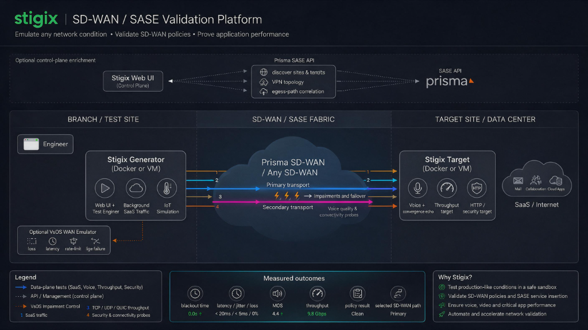
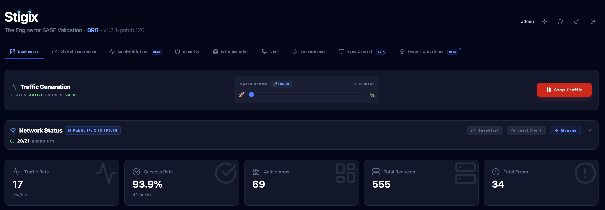
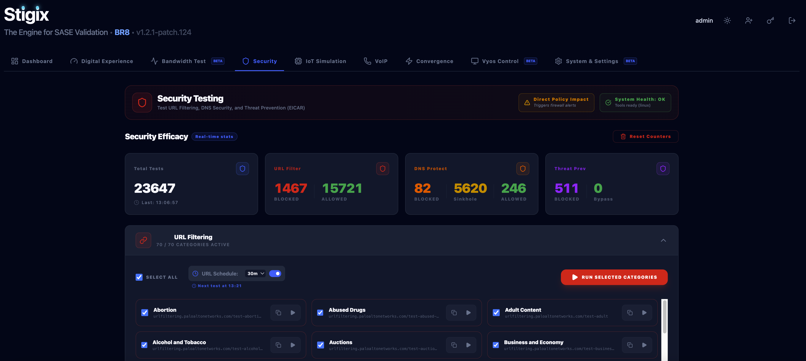
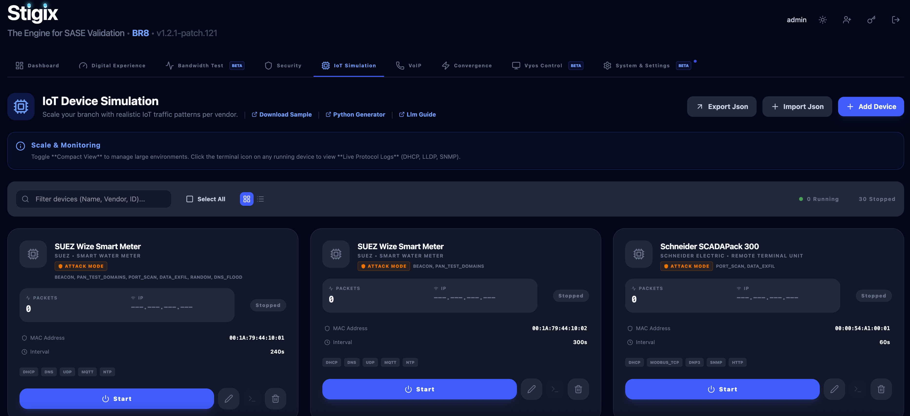
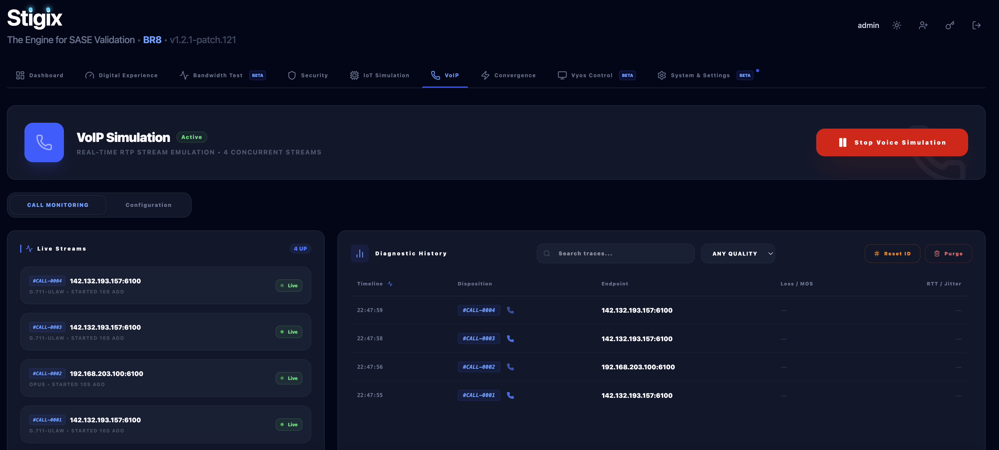
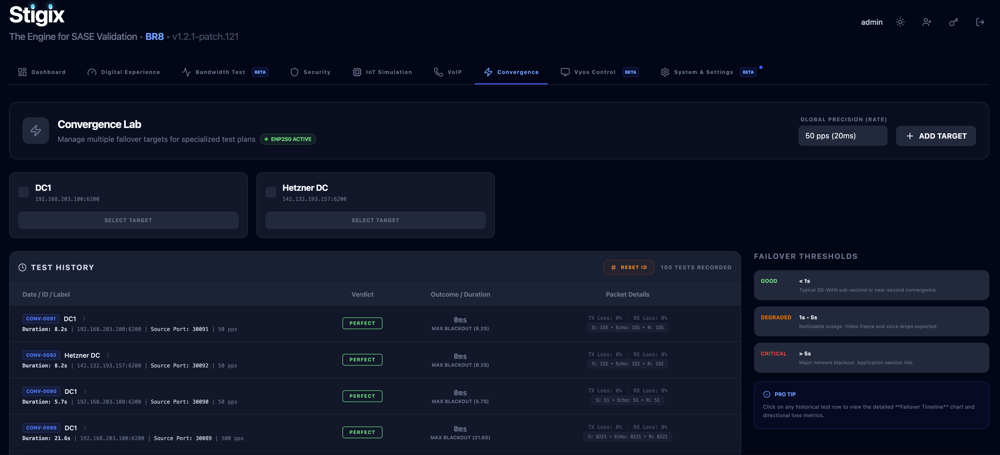
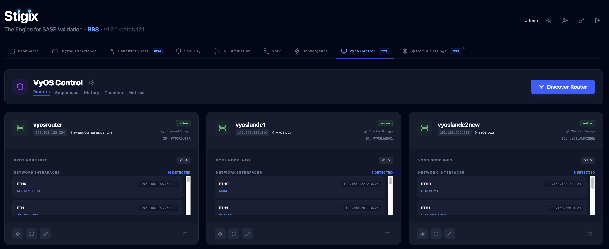

# 🕸️ Stigix — Advanced Networking & Security Simulation Environment

[](https://github.com/jsuzanne/stigix/releases)
[](https://hub.docker.com/r/jlsuzanne/stigix)
[](LICENSE)

A modern web-based SD-WAN traffic generator with real-time monitoring, customizable traffic patterns, and comprehensive security testing. Perfect for testing SD-WAN deployments, network QoS policies, and application performance.



---

## 📑 Table of Contents

- [Features](#-features)
- [Screenshots Gallery](#-screenshots-gallery)
- [Platform Support](#️-platform-support)
- [Prerequisites](#-prerequisites)
- [Quick Start](#-quick-start)
- [Verify Installation](#-verify-installation)
- [What Happens on First Start?](#-what-happens-on-first-start)
- [Usage](#-usage)
- [Configuration](#-configuration)
- [Useful Commands](#️-useful-commands)
- [Architecture](#️-architecture)
- [Troubleshooting](#-troubleshooting)
- [Security](#-security)
- [Key Concepts](#-key-concepts)
- [Docker Images](#-docker-images)
- [Documentation](#-documentation)
- [Use Cases](#-use-cases)
- [Contributing](#-contributing)
- [Roadmap](#-roadmap)
- [License](#-license)
- [Support](#-support)

---

## Why I built Stigix tool ?

I built this tool after years of writing one-off scripts for SD-WAN and security POCs, and never finding a single lab platform that really matched what I see in the field.
With a long background in networking and security, I wanted something that could generate realistic mixes of web/SaaS, voice and IoT traffic, tie in security use cases, and still be simple enough for engineers, partners and customers to run on their own.
This project is my way to turn all that lab and demo experience into an open-source tool that helps people design, validate and troubleshoot modern SASE/SD-WAN deployments more effectively.

---

## ✨ Features

### 🚀 Traffic Generation
- **67 Pre-configured Applications** - Popular SaaS apps (Google, Microsoft 365, Salesforce, Zoom, etc.).
- **Realistic Traffic Patterns** - Authentic HTTP requests with proper headers, User-Agents, and Referers
- **Real-time Dashboard** - Live traffic visualization, metrics, and status monitoring
- **Weighted Distribution** - Configure application traffic ratios using a visual Group/App percentage system
- **Traffic Rate Control** - Dynamically adjust generation speed from 0.1s to 5s delay via a slider
- **Protocol & IP Flexibility** - Support for explicit `http://` or `https://` and full IP address identification
- **Multi-interface Support** - Bind to specific network interfaces
- **Voice Simulation (RTP)** - Simulate real-time voice calls (G.711, G.729) with Scapy-based packet forging. [Read more](docs/VOICE_SIMULATION.md)
- **Speedtest (XFR)**: High-performance throughput and latency validation with real-time telemetry. [Learn more about XFR testing](docs/XFR_TESTING.md). 🚀
- **IoT/SaaS Emulation**: Pre-populated application targets for SD-WAN policy verification.
- **IoT Simulation** - Simulate a variety of IoT devices (Cameras, Sensors, Raspberry Pi, Industrial controllers) with Scapy-based DHCP and ARP support for "Real-on-the-Wire" physical network presence. Includes **Security Testing / Attack Mode** to validate malicious behavior detection (DNS Flood, C2 Beacon, Port Scan, Data Exfiltration). Import from **Palo Alto Device Security CSV** or **Vulnerability Report CSV** (CVE-based, Danger Score ranking, APT attribution, ICS-CERT detection). MAC-address device names are automatically resolved to human-readable profile-based names on import. [Read more](docs/IOT_SIMULATION.md)
- **Unified Source/Target Architecture** - Every Stigix instance is versatile. It can simultaneously act as a **Source** (generating traffic) and a **Target** (responding to echo/bandwidth/SLA probes). 
- **Active by Default** - High-precision traffic and responsive services (Voice Echo, XFR, HTTP SLA) are started automatically upon deployment. Any instance can be used as a test target by any other instance.
- **Prisma SD-WAN Integration** - Automatic discovery of sites and LAN interfaces via API for "Zero-Config" connectivity probes and path validation. [Read more](docs/PRISMA-SDWAN_INTEGRATION.md)
- **Convergence Lab (Performance)** - High-precision UDP failover monitoring (up to 1000 PPS) to measure SD-WAN tunnel transition times. [Read more](docs/CONVERGENCE_LAB.md)
- **Smart Networking** - Auto-detection of default gateways and interfaces (enp2s0, eth0) for a "Zero-Config" experience on physical Linux boxes. [Read more](docs/SMART_NETWORKING.md)
- **VyOS Control** - Orchestrate network events and perturbations (latency, loss, rate-limiting, ip blocking) on VyOS routers via Vyos API. [Read more](docs/VYOS_CONTROL.md)
- **Autodiscovery & Registry** - Automatic peer-to-peer discovery using Cloudflare Workers. "Zero-Config" multi-node setup with stateless authentication. [Read more](docs/AUTODISCOVERY_GUIDE.md) 📡✨
- **Smart Identity** - Automatic instance identification using system hostname. Simplifies deployment by reducing environment variables. 🆔
- **Target Site Mode** - Standalone container acting as a branch/hub target with HTTP, Voice, Failover tests and Bandwidth services (IPerf AND XFR speedtest). [Read more](docs/TARGET_CAPABILITIES.md)

### 🛡️ Security
- **URL Filtering Tests** - Validate 66 different URL categories (malware, phishing, gambling, adult content, etc.)
- **DNS Security Tests** - Test DNS security policies with 24 domains (malware, phishing, DGA, etc.)
- **Threat Prevention** - EICAR file download testing for IPS validation
- **C2 Attack Scenarios** - 7 real-traffic attack simulations (SQL Injection, DNS C2, Greyware DNS, Compromised DNS, Sliver C2, EICAR over HTTPS, DNS Tunneling) with Enforced / Bypass / Inconclusive verdicts. [Read more](docs/SECURITY_TESTING.md)
- **AI Security Tests (AISA)** - 5 Palo Alto AI Security simulation scenarios targeting live AI apps (ChatGPT, Grok, Gemini, Perplexity): DLP, Prompt Injection, CVE-2014-9222, EICAR Upload, and AI Volume Traffic (24 apps). [Read more](docs/SECURITY_TESTING.md)
- **Security Score Dashboard** - Per-module security scoring (URL, DNS, Threat, C2) with trend charts, baseline pinning, gap analysis, and Latest Changes diff view. 📊
- **Scheduled Testing** - Automated security tests at configurable intervals per module (URL, DNS, C2, AI Security)
- **EDL** - IP, URL, DNS urls with sequential or random execution
- **Test Results History** - Persistent logging with search, filtering, export, and per-type badge filtering (URL / DNS / THREAT / C2S / AIS)

### 🤖 AI & MCP Integration (Claude Desktop)
- **Natural Language Network Control** — Control the entire Stigix mesh from Claude Desktop in plain English: run tests, simulate failures, check posture across any node — no UI required. [Read more](docs/MCP_SERVER.md)
- **VyOS Chaos Engineering via Claude** — *"Add 150ms latency on the MPLS link of BR8"* → Claude discovers all routers, lists chaos-eligible interfaces (those with descriptions), proposes the exact target, waits for your confirmation, then executes. Supports multiple VyOS routers per node.
- **Propose & Confirm Flow** — For any VyOS action Claude presents the resolved router + interface and asks for confirmation. Destructive actions (interface-down, deny-traffic) require mandatory confirmation.
- **MCP Live Interaction Feed** — Settings → MCP Server shows a real-time color-coded feed of every Claude tool call: category icons, duration mini-bar (green/amber/red), node badge, relative timestamps, LIVE pulse. Refreshes every 3 seconds.
- **MCP Interaction Logging** — Every Claude tool call is transparently logged server-side to `mcp-history.jsonl` (tool name, target node, duration, status) with zero impact on the MCP protocol.
- **Accurate Security Scores** — Claude now reports real weighted posture scores (URL Filter, DNS Security, Threat Prevention out of 100) matching the dashboard, plus a 24-run trend for evolution analysis.

### 📊 Monitoring & Analytics
- **Real-time Logs** - Live log streaming with WebSocket updates
- **Statistics Dashboard** - Success/failure rates, latency metrics, bandwidth tracking
- **Security Score Dashboard** - Multi-module security posture scoring with 24h trend charts, min/max tracking, and run markers
- **Live VPN Topology Overlay** - Real-time visualization of SD-WAN tunnels with path status (Active/Backup/Down) and HUB-specific filtering. Directly from Prisma SASE API.
- **Persistent Logging** - JSONL storage with 10,000 lines retention and auto-rotation
- **Search & Filter** - Find specific tests quickly with powerful search
- **Export Capabilities** - Download results in JSON, CSV, or JSONL format
- **Traffic Density Scaling** - Multi-client parallel traffic generation (1–10 concurrent workers) with dynamic scaling

### 🔧 Zero-Config Deployment
- **Auto-detection** - Automatically detects network interfaces on first start
- **Auto-generated Config** - Creates `applications-config.json` with 67 apps automatically
- **One-liner Install** - Ready in 30 seconds with single command (Linux/macOS). Supports **Dashboard** or **Target Site** modes.
- **Docker-based** - Pre-built multi-platform images (AMD64 + ARM64).
- **Export/Import config capability** - to clone appplications, probes, IOT , Vyos configurations
- **One-Click Upgrade (Beta)** - Built-in maintenance UI to pull latest images and restart services with a single click.
- **State Persistence** - Per-service toggle (Settings → System Info) to preserve the running state of Traffic, Probes, IoT, and Voice across reboots and upgrades. Each service resumes exactly its pre-reboot state — only services that were running before the restart will come back up.

  
### 🔒 Production Ready
- **JWT Authentication** - Secure login with token-based auth
- **Log Rotation** - Automatic cleanup with configurable retention
- **Health Monitoring** - Built-in healthchecks and dependency management
- **Resource Limits** - Optional CPU and memory constraints

---

## 🆕 What's New

The project is evolving rapidly with new features and refinements added in every release.

### MCP Server highlights *(v1.4.0-patch.106–109)*
- **VyOS Natural Language Control** 🤖 — `get_vyos_interfaces` + `vyos_execute_action`: propose+confirm flow, management interfaces silently excluded, multi-router disambiguation.
- **MCP Live Interaction Feed** ✨ — Real-time color-coded feed in Settings → MCP (category icons, duration bar, node badge, LIVE pulse, 3s refresh).
- **MCP Interaction Logging** 📊 — Tool calls logged to `mcp-history.jsonl` server-side; API at `/api/admin/mcp/history`.
- **Security Score Fix** 🐛 — `get_security_results_stats` now returns real weighted posture scores (URL/DNS/Threat 0–100) + 24-run trend. Eliminates wrong raw-ratio reporting.
- **MCP Docs** 📖 — `docs/MCP_SERVER.md` updated: upgrade/reconnect workflow, natural language translation explained.

### Highlights in v1.4.0 *(current)*
- **Vulnerability Report Import** 🧨 — New import option in the IoT toolbar for Palo Alto IoT Security **Vulnerability CSV** exports (one row per CVE per device). Aggregates by device, computes a **Danger Score** (Risk Score + Critical CVEs×15 + High CVEs×8 + APT groups×5 + ICS-CERT×10 + Max CVSS×2), and selects the top N most dangerous devices. APT groups → `beacon`, ICS-CERT → `port_scan`, Critical/High CVEs → `pan_test_domains`. [Read docs](docs/IOT_SIMULATION.md#4-vulnerability-report-import)
- **CVE Threat Intel on Device Cards** 🔍 — Vuln-imported device cards now show an orange threat panel with Danger Score, CVE count/severity, Max CVSS, APT groups, ICS-CERT badge, and top CVE pills directly in the IoT grid.
- **Smart Device Naming** 🏷️ — When a CSV export contains MAC addresses as device names (common in large Prisma exports), both importers automatically generate human-readable names from the `Profile` field (e.g. `Raspberry Pi Device #1`, `Raspberry Pi Device #2`).
- **Throttled Attack Traffic** ⚡ — All bad behavior attack cycles reduced (beacon 10s→45s, dns_flood 15s→60s, port_scan 30s→120s) to prevent Scapy raw socket pressure and Python D-state accumulation under concurrent device load.
- **Device Sequence Numbers** 🔢 — Persistent `#N` index on every device card, sorted consistently across all filter states (All / Active / Queued / Idle / Stopped).
- **IoT Advanced Debug Monitor** 📊 — New collapsible diagnostics section in Settings → System with 4 time-series charts: Device States, System Health (CPU/D-state), Traffic Rate (pps/ppm), and Experience Score. 15m / 1h / 6h time window.
- **FIFO Concurrency Scheduler** 🔄 — Replaced non-deterministic map iteration with a proper FIFO queue — devices at end of list no longer starve. Concurrency throttle prevents Scapy overload.

### Highlights in v1.3.0
- **State Persistence** 💾 — New **Settings → System Info** panel with per-service toggles (Traffic, Probes, IoT, Voice). Each service restores its exact pre-reboot state: only services that were active before shutdown resume automatically. Defaults: Traffic ON, Probes ON, IoT OFF (requires config), Voice OFF (requires server config). [Read docs](docs/IOT_SIMULATION.md#-state-persistence) [Voice docs](docs/VOICE_SIMULATION.md#-state-persistence)
- **IoT DHCP Lease Persistence** 📡 — Devices reclaim their previous IP via RFC 2131 INIT-REBOOT after a container restart, without a full DISCOVER cycle. [Read docs](docs/IOT_SIMULATION.md)
- **C2 Attack Scenarios** 🎯 — 7 real-traffic attack simulation tests (SQL Injection, DNS C2 Infiltration, Greyware DNS, Compromised DNS, Sliver C2 Emulation, EICAR over HTTPS, DNS Tunneling Burst) with inverted verdict logic, inline badges, and a dedicated C2 scheduler. [Read docs](docs/SECURITY_TESTING.md)
- **AI Security Tests (AISA)** 🤖 — 5 Palo Alto AI Security simulation scenarios based on a real-world PowerShell POC script. Targets ChatGPT, Grok, Gemini, Perplexity + 24 AI apps for volume telemetry. Includes a dedicated AI scheduler. [Read docs](docs/SECURITY_TESTING.md)
- **Security Score Dashboard** 📊 — Per-module security posture scoring (URL, DNS, Threat Prevention) with 24h trend charts, baseline pinning, gap analysis, and Latest Changes diff between consecutive runs.
- **IoT Daemon Architecture** ⚡ — Migrated from N-processes to a single threaded Python daemon. RAM drops from ~600MB to ~50MB for 30 devices. Supports 100+ devices. New Global Bad Behavior toggle, BPF kernel filter for DHCP, and gratuitous ARP for IoT classification.
- **Prisma CSV Importer** 📥 — `import_prisma_devices.py` converts a real Palo Alto IoT Security CSV export into a Stigix emulator config with real MAC addresses, risk-based bad behavior (auto on Critical/High), and per-vendor DHCP fingerprints. [Read docs](docs/IOT_DEVICE_GENERATOR.md#-prisma--iot-security-csv-import)
- **VyOS Orchestration** 🔌 — Full sequence management with Clone-to-Reverse, intelligent sorting, dynamic search/filter, and comprehensive history.
- **Multi-Client Traffic Scaling** 📈 — Dynamically spawn 1–10 parallel traffic workers. Live density slider in the Traffic Control panel.
- **Security Test Headers** 🏷️ — Renamed table columns for clarity: Test ID → Type, Disposition → Result for better readability at a glance.
- **Beta Install Script** 🧪 — New `install-latest-beta.sh` script for testing pre-release deployments using the `latest` Docker image tag.
- **UI Readability** 🎨 — Dark-mode contrast improvements (`--text-muted` token brightened), SF Pro/Segoe UI font stack, proportional font scale (base 16→17px) for better legibility across all widgets.
- **Configurable Port** 🔧 — `PORT` environment variable now correctly overrides the default 8080 port across all internal services.

[View full changelog with all version details →](CHANGELOG.md)

---

## 📸 Screenshots Gallery

Explore the application interface organized by feature area. Each category contains detailed screenshots showcasing the functionality.

### 🏠 Main Dashboard
Real-time monitoring, traffic control, and system health overview.



**[View all Main Dashboard screenshots →](docs/screenshots/00-Main-Dashboard)** (2 images)

---

### ⚙️ Configuration
Network interfaces, traffic distribution, synthetic probes, and application management.


**[View all Configuration screenshots →](docs/screenshots/01-Configuration)** (5 images)


---

### 📊 Convergence Lab & Statistics
Detailed analytics, historical data, and sub-second convergence measurement.


**[View all Statistics & Convergence screenshots →](docs/screenshots/02-Statistics)** (8 images)


---

### 🛡️ Security Testing
URL filtering, DNS security, threat prevention, C2 attack simulations, AI Security (AISA) tests, and security posture scoring.




**[View all Security screenshots →](docs/screenshots/03-security)** (11 images)

---

### 🎯 Performance Monitoring
Connectivity performance, synthetic probes, and endpoint health tracking.


**[View all Performance screenshots →](docs/screenshots/04-Performance)** (11 images)


---

### 🔌 IoT Simulation
Layer-2/3 device simulation with DHCP and ARP support.



**[View all IoT screenshots →](docs/screenshots/05-IOT)** (10 images)


---

### 🎙️ Voice Simulation
RTP packet generation, QoS analytics, and MOS scoring.



**[View all VoIP screenshots →](docs/screenshots/06-Voice)** (7 images)


---

### 🔄 Failover Lab
High-precision UDP failover monitoring and convergence testing.



**[View all Failover screenshots →](docs/screenshots/07-Failover)** (3 images)

---

### 🌐 VyOS Control
Network impairment orchestration (latency, loss, rate-limiting) on VyOS routers.



**[View all VyOS Control screenshots →](docs/screenshots/08-Vyos-Control)** (5 images)

---

### 🌐 VPN Topology
Real-time visualization of SD-WAN overlay paths with intelligent peer device mapping and HUB filtering.


**[View all Topology screenshots →](docs/screenshots/10-Topology)** (3 images)

---

## 🖥️ Platform Support

This application runs on:

- **🐧 Linux** - Docker Engine (Ubuntu, Debian, CentOS, etc.)
- **🍎 macOS** - Docker Desktop for Mac (macOS 11+)
- **🪟 Windows** - Docker Desktop with WSL 2 (Windows 10/11)

> **Windows Users:** The one-liner installation script is not supported in PowerShell.  
> Please follow the **[Windows Installation Guide](docs/WINDOWS_INSTALL.md)** for step-by-step instructions.

---

## 📋 Prerequisites

### Docker Installation Required

This application runs in Docker containers. You **must** have Docker installed and running before installation.

#### 🐳 macOS
- **Install Docker Desktop for Mac**
  - Download from: https://www.docker.com/products/docker-desktop/
  - Requires macOS 11 or later
  - **Important:** Launch Docker Desktop and wait until it's running (🐳 icon in menu bar)
- **Alternatives:** [OrbStack](https://orbstack.dev/) or [Colima](https://github.com/abiosoft/colima) (lightweight alternatives for macOS)

#### 🪟 Windows
- **Install Docker Desktop for Windows with WSL 2**
  - **Complete guide:** [Windows Installation Guide](docs/WINDOWS_INSTALL.md)
  - Requires Windows 10/11 64-bit
  - **Important:** WSL 2 must be enabled and Docker Desktop must be running

#### 🐧 Linux (Ubuntu/Debian)
- **Install Docker Engine**
  - Follow official guide: https://docs.docker.com/engine/install/ubuntu/
  - Or quick install:
    ```bash
    curl -fsSL https://get.docker.com -o get-docker.sh
    sudo sh get-docker.sh
    sudo usermod -aG docker $USER
    # Logout and login again
    ```

#### ✅ Verify Docker Installation

```bash
# Check Docker is running
docker --version
docker ps

# Expected output:
# Docker version 24.x.x or later
# CONTAINER ID   IMAGE     COMMAND   CREATED   STATUS   PORTS   NAMES
```

---

## 🚀 Quick Start

### One-Liner Install (Linux/macOS) ⭐

**Requirements:** Docker must be running (see [Prerequisites](#-prerequisites) above)

We provide an interactive installation script that configures the **Stigix All-in-One** container for your environment.

```bash
curl -sSL https://raw.githubusercontent.com/jsuzanne/stigix/main/install.sh | bash
```

**What to expect:**
```text
🚀 Stigix (All-in-One) - Installation
==========================================
✅ Docker is running.
🐧 Platform: Native Linux detected. (Using host mode for full features)

📌 Choose Deployment Mode:
1) Both (Source + Target) [Default] - Runs Dashboard, Traffic Gen, and Echo targets
2) Target Only - Deploys only the Echo/XFR targets
3) Source Only - Deploys only the Dashboard and Traffic Gen
Select an option [1-3] (Default: 1): 1
🎯 Selected Mode: both
📦 Downloading Base Configuration from GitHub...
✅ Files prepared in /path/to/stigix
🔧 Pulling images and starting Stigix All-in-One...
```


This will:
- ✅ Check if Docker is installed and running
- ✅ Detect your OS to configure networking (Host for Linux, Bridge for Mac/WSL)
- ✅ Let you choose your deployment mode (Interactive)
- ✅ Pull the single, optimized `jsuzanne/stigix:stable` image
- ✅ Start all necessary services automatically
- ✅ Auto-generate configuration

**Access:** http://localhost:8080  
**Credentials:** `admin` / `admin` (change after first login)

> **Advanced flags:** You can bypass interactivity using `--mode <both|source|target>` or simulate the install with `--dry-run`. Example:
> `curl -sSL https://raw.githubusercontent.com/jsuzanne/stigix/main/install.sh | bash -s -- --mode target`

> **Windows Users:** The one-liner installation script is not supported in PowerShell. Please follow the **[Windows Installation Guide](docs/WINDOWS_INSTALL.md)** for step-by-step instructions.

---

### Manual Install (Advanced)

If you prefer not to use the install script, you can download the compose file manually.

```bash
mkdir -p stigix && cd stigix
# Download the consolidated compose file
curl -sSL -o docker-compose.yml https://raw.githubusercontent.com/jsuzanne/stigix/main/docker-compose.yml
# Start the All-in-One container
docker compose up -d
```

> **Consolidated Architecture:** Stigix is now distributed as a single All-in-One image (`jsuzanne/stigix`) managed by supervisord. This simplifies deployment and ensures all components (Dashboard, Traffic Gen, Voice, Echo, XFR, MCP) are always in sync.


**Windows (PowerShell):**
```powershell
# Create directory
mkdir C:\stigix
cd C:\stigix

# Download bridge mode compose file
curl.exe -L https://raw.githubusercontent.com/jsuzanne/stigix/main/docker-compose.example.bridge.yml -o docker-compose.yml

# Start services
docker compose up -d
```

**Default credentials:** `admin` / `admin`

**For detailed Windows instructions, see [Windows Installation Guide](docs/WINDOWS_INSTALL.md)**

---

## 📊 Verify Installation

After starting Stigix, you can easily verify that the system is running and healthy by performing a few quick checks:

### 1. Check Container Status
Verify that the Stigix container is up and running and is marked as healthy:
```bash
docker compose ps
```
**Expected Output:**
```text
NAME                IMAGE                      COMMAND                  SERVICE             CREATED             STATUS                    PORTS
stigix              stigix-all-in-one:latest   "/app/entrypoint.sh"     stigix              2 minutes ago       Up 2 minutes (healthy)    0.0.0.0:8080->8080/tcp
```

### 2. Query System Health Endpoint
Test the API health endpoint directly to make sure the backend is responding and fully initialized:
```bash
curl http://localhost:8080/api/health
```
**Expected Response:**
```json
{"status":"healthy","version":"1.1.0-patch.7"}
```

### 3. Check System Logs
Monitor the startup logs. The output should be clean of any exceptions or `[ERROR]` messages:
```bash
docker compose logs -f
```

### 4. Verify via Interactive Console (Recommended) 🛠️
Stigix has a built-in interactive CLI console (currently in **Beta**) to inspect and control the running state:

1. **Open the interactive console:**
   ```bash
   docker exec -it stigix stigix-cli
   ```
2. **Log in to the local instance:**
   Run the `auth login` command and enter the default admin credentials:
   ```text
   auth login
   Username [admin]: admin
   Password: admin
   ```
3. **Inspect the status:**
   Verify backend connection, traffic state, and public IP detection:
   ```text
   status
   ```
   **Expected Output:**
   ```text
   ━━ Stigix Status ━━━━━━━━━━━━━━━━━━━━━━━━━━━
   ✓ Backend    [UP]  uptime 120s
   → Version    1.1.0-patch.7
   Traffic      [STOPPED]
   → Public IP  198.51.100.42
   ```
   *(Type `exit` or press `Ctrl + C` to leave the CLI when done)*

### 5. Check Auto-Generated Configuration
Confirm that the initialization scripts have successfully generated default environment configurations:
```bash
# Check generated files
ls -la config/

# View the auto-detected primary network interface
cat config/interfaces.txt

# Inspect the loaded application definitions (67 default apps)
jq '.applications[]' config/applications-config.json | head -5
```

---

## 🎯 What Happens on First Start?

The system auto-generates everything you need:

1. **`config/applications-config.json`** - 67 popular SaaS applications (Google, Microsoft 365, Salesforce, etc.) and traffic control settings.
2. **`config/interfaces.txt`** - Auto-detected network interface (eth0, en0, ens4, etc.)
3. **`config/users.json`** - Default admin user with bcrypt-hashed password

**No manual configuration needed!** 🎉

Simply start the containers and access the dashboard at http://localhost:8080

---

## 📖 Usage

### Managing Traffic Generation

1. **Login** to the web dashboard at `http://localhost:8080`
2. **Dashboard Tab**: View real-time statistics and control traffic generation
3. **Configuration Tab**: 
   - Add network interfaces (e.g., `eth0`, `wlan0`)
   - Adjust traffic distribution percentages for different application categories
   - Use explicit `http://` or `https://` prefixes for internal or specific servers
4. **Logs Tab**: View real-time traffic logs and statistics
5. **Security Tab**: Run URL filtering, DNS security, and threat prevention tests
6. **Start/Stop**: Use the toggle button on the dashboard

### Running Security Tests

Navigate to the **Security** tab to:
- Test URL categories (malware, phishing, gambling, etc.)
- Validate DNS security policies
- Test IPS/threat prevention with EICAR downloads
- Schedule automated tests
- View and export test results

---

## 🔧 Configuration

### 🌐 Prisma SD-WAN Integration (Auto-detect)

The tool supports auto-detection of your Prisma SD-WAN site name for lab visibility.

1. Create a service account in Prisma SASE (TSG) with **Read Only** permissions.
2. Add the following to your `.env` file:
   ```bash
   PRISMA_SDWAN_CLIENT_ID=your-client-id@tsgid.iam.panserviceaccount.com
   PRISMA_SDWAN_CLIENT_SECRET=your-client-secret
   PRISMA_SDWAN_TSG_ID=your-tsg-id
   ```
3. Restart the container. The detected site name will appear in the dashboard header.

### Change Port


```yaml
# docker-compose.yml
ports:
  - "8081:8080"  # Use port 8081 instead of 8080
```

Or use environment variables:
```bash
echo "WEB_UI_PORT=8081" > .env
```

### Add Custom Connectivity Tests

```yaml
# docker-compose.yml - web-ui environment section
environment:
  # HTTP/HTTPS endpoints
  - CONNECTIVITY_HTTP_1=Production-App:https://myapp.company.com
  - CONNECTIVITY_HTTP_2=Staging-App:https://staging.company.com

  # PING tests (ICMP)
  - CONNECTIVITY_PING_1=HQ-Gateway:10.0.0.1
  - CONNECTIVITY_PING_2=Branch-Gateway:192.168.100.1

  # TCP port checks
  - CONNECTIVITY_TCP_1=SSH-Bastion:10.0.0.100:22
  - CONNECTIVITY_TCP_2=Database:10.0.0.50:3306
```

### Adjust Traffic Frequency

```yaml
# docker-compose.yml - traffic-gen environment section
environment:
  - SLEEP_BETWEEN_REQUESTS=2  # 1 request every 2 seconds (0.5 req/sec)
```

### Change Log Retention

```yaml
# docker-compose.yml - web-ui environment section
environment:
  - LOG_RETENTION_DAYS=30  # Keep logs for 30 days
  - LOG_MAX_SIZE_MB=500    # Max 500 MB per log file
```

---

## 🛠️ Useful Commands

```bash
# View logs in real-time
docker compose logs -f

# View logs for a specific service
docker compose logs -f web-ui
docker compose logs -f traffic-gen

# Restart services
docker compose restart

# Stop services
docker compose stop

# Stop and remove containers
docker compose down

# Rebuild after code changes
docker compose up -d --build

# Check resource usage
docker stats stigix

# Access container shell
docker compose exec web-ui sh
docker compose exec traffic-gen sh

# Export logs
docker compose logs --no-color > logs-export.txt
```

---

## 🏗️ Architecture

```
┌─────────────────────────────────────────────────────────────┐
│                     User Browser                            │
│                  http://localhost:8080                      │
└────────────────────────┬────────────────────────────────────┘
                         │
                         ▼
        ┌────────────────────────────────────────┐
        │        Stigix All-in-One Container     │
        │   ┌──────────────────────────────┐     │
        │   │    Web Dashboard (React)     │     │
        │   └──────────────┬───────────────┘     │
        │                  ▼                     │
        │   ┌──────────────────────────────┐     │
        │   │  Backend API (Node.js/Exp)   │     │
        │   └──────────────┬───────────────┘     │
        │                  ▼                     │
        │   ┌──────────────────────────────┐     │
        │   │   Traffic Generator (Python) │     │
        │   └──────────────┬───────────────┘     │
        │                  ▼                     │
        │   ┌──────────────────────────────┐     │
        │   │   Target Services (HTTP/XFR) │     │
        │   └──────────────┬───────────────┘     │
        └──────────────────┼─────────────────────┘
                           │
                           ▼
        ┌────────────────────────────────────────┐
        │         Internet / SD-WAN              │
        └────────────────────────────────────────┘

Shared Volumes:
  • config/  - Unified configuration (apps, probes, prisma, vyos)
  • logs/    - Traffic logs and statistics
  • mcp-data/ - Persistence for MCP server state
```

---

## 🐛 Troubleshooting

### Docker Not Running

**Error:** `Cannot connect to the Docker daemon`

**Solution:**
- **macOS/Windows:** Launch Docker Desktop and wait until the 🐳 icon appears
- **Linux:** `sudo systemctl start docker`
- **Windows specific issues:** See [Windows Installation Guide](docs/WINDOWS_INSTALL.md#troubleshooting)

### Docker Pull Timeout

**Error:** `context deadline exceeded`

**Solution:**
```bash
# Retry the pull
docker compose pull

# Or manually pull images
docker pull jsuzanne/stigix:stable
```

### Port 8080 already in use

```yaml
# Change port in docker-compose.yml
ports:
  - "8081:8080"
```

Or:
```bash
echo "WEB_UI_PORT=8081" > .env
docker compose up -d
```

### Cannot connect to dashboard

```bash
# Check containers are running
docker compose ps

# Check logs for errors
docker compose logs web-ui
docker compose logs traffic-gen

# Check firewall (Linux)
sudo ufw allow 8080/tcp
```

### Traffic not generating

```bash
# Check network interface configuration
docker compose exec traffic-gen cat /opt/sdwan-traffic-gen/config/interfaces.txt

# Should show your interface (eth0, en0, ens4, etc.)
# If incorrect, edit config/interfaces.txt and restart
docker compose restart
```

### [ERROR] Configuration file not found

This error should **NOT** appear in v1.1.0-patch.7 or later. If you see it:

```bash
# Update to latest version
docker compose pull
docker compose down
docker compose up -d
```

### Logs filling up disk space

```yaml
# Reduce retention in docker-compose.yml
environment:
  - LOG_RETENTION_DAYS=3
  - LOG_MAX_SIZE_MB=50
```

### No Traffic Being Generated

1. Check that network interfaces are configured in the Configuration tab
2. Verify traffic generation is started (green "Active" status on dashboard)
3. Check logs: `docker compose logs -f traffic-gen`

---

### Traffic Fails in Proxmox/LXC/Host Mode

**Issue:** Stigix traffic fails to start or network operations (like Voice/IoT simulation) fail when running in Host Network mode on certain virtualized stacks (Proxmox → LXC → Ubuntu → Docker).

**Solution:** This is often due to insufficient container privileges for low-level network operations (NET_ADMIN, NET_RAW).
- **Trusted Lab Fix:** Enable `privileged: true` in your `docker-compose.yml` for the Stigix container.
- **Alternative:** Add specific capabilities:
  ```yaml
  cap_add:
    - NET_ADMIN
    - NET_RAW
  ```
> **Warning:** Use `privileged: true` only in trusted lab setups, as it significantly reduces container isolation and increases host security risk.

---

## 🔒 Security

### Production Deployment Checklist

- [ ] Change default admin password (Dashboard → Settings)
- [ ] Set strong JWT_SECRET in docker-compose.yml
- [ ] Use HTTPS with a reverse proxy (nginx, Traefik, Caddy)
- [ ] Restrict access with firewall rules
- [ ] Enable Docker resource limits
- [ ] Review and customize application list
- [ ] Set appropriate log retention policies

### JWT Secret

```yaml
# docker-compose.yml - web-ui environment
environment:
  - JWT_SECRET=your-super-secure-random-string-here
```

Generate a secure secret:
```bash
openssl rand -base64 32
```

---

## 🔑 Key Concepts

### Traffic Generator vs Security Tests

The Stigix has **two separate systems**:

| Feature | Traffic Generator | Security Tests |
|---------|------------------|----------------|
| **Purpose** | Simulate user traffic | Test security policies |
| **Source** | `config/applications-config.json` | Hardcoded test URLs |
| **Execution** | Continuous background | On-demand or scheduled |
| **Logs** | `/var/log/sdwan-traffic-gen/traffic.log` | `test-results.jsonl` |
| **Examples** | google.com, office365.com | urlfiltering.paloaltonetworks.com |

**Traffic Generator** creates realistic application traffic for SD-WAN demos.  
**Security Tests** validate URL filtering, DNS security, and threat prevention policies.

---

## 📦 Docker Images

### Official Image (All-in-One)
The recommended deployment method uses a single unified image encompassing all components:
- **Stigix All-in-One:** [`jsuzanne/stigix:stable`](https://hub.docker.com/r/jsuzanne/stigix)

All images are automatically built for **AMD64** and **ARM64** architectures.

---

## 📚 Documentation

Comprehensive guides organized by your journey with the Stigix.

### 🚀 Getting Started
- **[Installation Guide](INSTALLATION.md)** - Complete setup instructions with troubleshooting
- **[Windows Installation Guide](docs/WINDOWS_INSTALL.md)** - Step-by-step guide for Windows 10/11
- **[Quick Start Guide](docs/QUICK_START.md)** - Get up and running in 5 minutes
- **[Configuration Guide](docs/CONFIGURATION.md)** - Advanced configuration options

### 🎯 Core Features
- **[Traffic Generator Guide](docs/TRAFFIC_GENERATOR.md)** - Configure `applications-config.json` and traffic weights.
- **[Security Testing Guide](docs/SECURITY_TESTING.md)** - Comprehensive security testing documentation
  - [Security Quick Reference](docs/SECURITY_QUICK_REFERENCE.md) - Quick reference for security tests
  - [Security FAQ](docs/SECURITY_TESTING_FAQ.md) - Frequently asked questions
- **[Digital Experience Testing](docs/DIGITAL_EXPERIENCE_TESTING.md)** - System health monitoring and synthetic probes

### 🔬 Advanced Features
- **[Voice Simulation Guide](docs/VOICE_SIMULATION.md)** - RTP packet forging and MOS scoring theory
- **[IoT Simulation Guide](docs/IOT_SIMULATION.md)** - Layer-2/3 device simulation and Scapy networking
- **[Convergence Lab Guide](docs/CONVERGENCE_LAB.md)** - High-precision failover & RX/TX loss theory
- **[VyOS Control Guide](docs/VYOS_CONTROL.md)** - Orchestrating SD-WAN impairments on VyOS nodes
- **[Smart Networking Guide](docs/SMART_NETWORKING.md)** - Host Mode and auto-detection architecture
- **[Target Capabilities](docs/TARGET_CAPABILITIES.md)** - Standalone target site deployment

### 🔧 Operations & Maintenance
- **[Persistent Logging](docs/PERSISTENT_LOGGING.md)** - Test results storage, search, and export
- **[Maintenance & Update Guide](docs/MAINTENANCE.md)** - How to update via UI, script, or manually
- **[Remote Access Guide](docs/REMOTE_ACCESS.md)** - Guidelines for Tailscale, Cloudflare Tunnels, and Reverse Proxies
- **[Troubleshooting Guide](docs/TROUBLESHOOTING.md)** - Common issues and solutions

### 📖 Technical Reference
- **[MCP Server](docs/MCP_SERVER.md)** - Model Context Protocol integration
- **[Architecture Overview](docs/ARCHITECTURE_OVERVIEW.md)** - System architecture and design
- **[Technical Diagram](docs/TECHNICAL_DIAGRAM.md)** - Visual architecture diagrams

---

## 🎯 Use Cases

- **SD-WAN Testing** - Validate traffic routing, QoS policies, and failover scenarios
- **Security Policy Testing** - Test URL filtering, DNS security, and threat prevention
- **Network Performance** - Measure latency, bandwidth, and reliability
- **Firewall Validation** - Verify firewall rules and application awareness
- **Load Testing** - Generate sustained traffic for capacity planning
- **Demo & Training** - Educational tool for network engineers and sales demonstrations
- **Compliance** - Verify network policies and application access controls

---

## 🤝 Contributing

Contributions are welcome! Please feel free to submit a Pull Request.

### Development Setup

```bash
# Clone repository
git clone https://github.com/jsuzanne/stigix.git
cd stigix

# Install web dashboard dependencies
cd web-dashboard
npm install

# Run in development mode
npm run dev

# Build for production
npm run build
```

---

## 📈 Roadmap

- [ ] Multi-region deployment support
- [ ] Advanced traffic patterns (burst, gradual ramp-up)
- [ ] Custom protocol support (FTP, SMTP, etc.)
- [ ] Grafana/Prometheus integration
- [ ] Traffic replay from PCAP files
- [ ] Cloud provider integrations (AWS, Azure, GCP)
- [ ] WebRTC and video streaming simulation
- [ ] PowerShell installation script for Windows
- [ ] Additional AI Security scenario targets (Copilot, Bard, Claude)
- [ ] SLS / Prisma SASE log enrichment re-integration for security test verdicts

---

## Disclaimer

This is a personal, community-driven project maintained in my own name.
It is **not** an official Palo Alto Networks product, feature, or tool, and it is
not supported by Palo Alto Networks in any way.

All opinions, configurations, and examples in this repository are my own and do
not represent the views of my employer. Use this software at your own risk and
always validate behavior in a lab environment before using it in production.

This project is provided "as is", without any warranty of any kind, express or
implied, including but not limited to fitness for a particular purpose or
non-infringement.

---

## 📝 License

This project is licensed under the MIT License - see the [LICENSE](LICENSE) file for details.

---

## 🆘 Support

- **Documentation:** [INSTALLATION.md](INSTALLATION.md) | [Windows Guide](docs/WINDOWS_INSTALL.md)
- **Issues:** [GitHub Issues](https://github.com/jsuzanne/stigix/issues)
- **Discussions:** [GitHub Discussions](https://github.com/jsuzanne/stigix/discussions)

---

## 🙏 Acknowledgments

- Built with [React](https://reactjs.org/), [TypeScript](https://www.typescriptlang.org/), and [Vite](https://vitejs.dev/)
- UI components from [shadcn/ui](https://ui.shadcn.com/)
- Icons from [Lucide](https://lucide.dev/)
- Traffic generation powered by Python [requests](https://requests.readthedocs.io/)

---

**Made with ❤️ for SD-WAN testing and demonstrations**

For detailed installation instructions, see [INSTALLATION.md](INSTALLATION.md)  
For Windows-specific setup, see [Windows Installation Guide](docs/WINDOWS_INSTALL.md)
