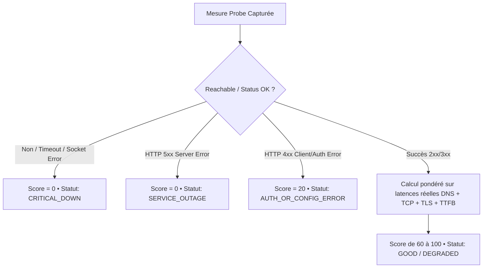
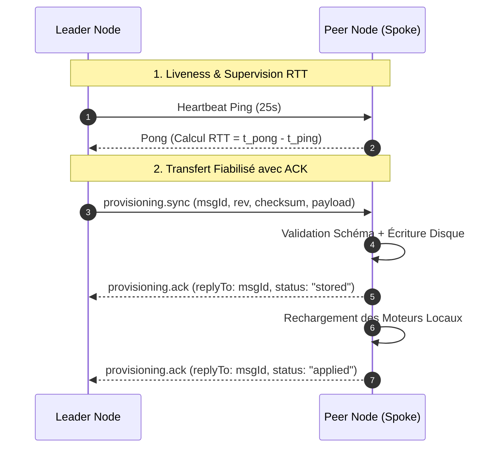

# Stigix — Feuille de Route & Spécifications (Session de Travail)

Ce document rassemble l'analyse détaillée, les propositions techniques et les plans d'action pour les 4 sujets clés identifiés.

---

## 📋 Table des Matières
1. [Sujet 1 — Speedtest UI : Libellés & Correction d'affichage](#sujet-1--speedtest-ui--libellés--correction-daffichage)
2. [Sujet 2 — Digital Experience Score : Analyse de l'anomalie du Score 50 en cas de Panne & Refonte](#sujet-2--digital-experience-score--analyse-de-lanomalie-du-score-50-en-cas-de-panne--refonte)
3. [Sujet 3 — Débat : Auto-Push automatique vs Bouton « Publish » manuel pour les Probes](#sujet-3--débat--auto-push-automatique-vs-bouton--publish--manuel-pour-les-probes)
4. [Sujet 4 — PRD WebSocket Control Plane : Fiabilité, RTT & ACKs](#sujet-4--prd-websocket-control-plane--fiabilité-rtt--acks)

---

## Sujet 1 — Speedtest UI : Libellés & Correction d'affichage

### Diagnostic dans le code (`src/Speedtest.tsx`)

1. **Bug du sous-titre `undefined` :**
   * Dans le code actuel (Ligne 733) :
     ```tsx
     {isRunning ? `Analyzing sequence ${activeJob?.sequence_id}` : 'Select target and launch test'}
     ```
     Lorsqu'un test unitaire est lancé sans `sequence_id`, la chaîne affichée devient littéralement **`Analyzing sequence undefined`**.
2. **Affichage brut du TCP Window :**
   * La valeur reçue est en octets bruts (ex: `3792775360`), mais le label affiche fixement `KB`, générant un nombre gigantesque incohérent.
3. **Transition d'état :**
   * Passer de `Session Ready` à `Live Performance` manque de contexte intermédiaire (ex: phase d'initialisation TCP, négociation de socket, warmup).

### Propositions d'amélioration

```tsx
// 1. Titre & Sous-titre dynamiques et propres
<h2 className="text-2xl font-black text-text-primary tracking-tight">
    {isRunning ? (isWarmingUp ? 'Initializing Stream...' : 'Live Performance') : 'Session Ready'}
</h2>
<p className="text-[10px] font-black text-text-muted tracking-[0.2em] opacity-60">
    {isRunning 
        ? (activeJob?.sequence_id 
            ? `Analyzing sequence #${activeJob.sequence_id}` 
            : `Live Stream • Target: ${activeJob?.params?.target_name || 'Direct Link'}`)
        : 'Select target and launch test'}
</p>
```

* **Formatage intelligent de la TCP Window / Buffer :**
  Convertir dynamiquement en `KB` ou `MB` selon la taille avec une fonction utilitaire (`formatBytes(cwnd)`).

---

## Sujet 2 — Digital Experience Score : Analyse de l'anomalie du Score 50 en cas de Panne & Refonte

### Pourquoi le Score était à 50 alors que Prisma Access était DOWN ?

Dans [`server.ts`](file:///Users/jsuzanne/Github/stigix/web-dashboard/server.ts#L4110-L4145), la fonction de calcul `calculateDEMScore` contient ce calcul :

```ts
if (type === 'HTTP' || type === 'HTTPS') {
    const total_norm = Math.min(lat / 2000, 1.0);       // lat = 5000ms -> total_norm = 1.0 (pénalité max 30 pts)
    const ttfb_norm = Math.min(metrics.ttfb_ms / 1000, 1.0); // ttfb = 0ms (non mesuré) -> 0.0 (0 pt de pénalité !)
    const tls_norm = Math.min((metrics.tls_ms || 0) / 800, 1.0); // tls = 0ms (non mesuré) -> 0.0 (0 pt de pénalité !)

    let score = 100 - (30 * total_norm + 35 * ttfb_norm + 25 * tls_norm);
    // Score = 100 - (30 * 1.0 + 0 + 0) = 70 (ou 50 selon pénalité additionnelle)
}
```

> [!CAUTION]
> **La cause racine :** En cas de timeout (5000ms) ou d'échec de connexion, `DNS`, `TCP`, `TLS` et `TTFB` valent `0.00ms`. L'algorithme a interprété `0.00ms` comme une **latence ultra-rapide** (0 point de pénalité) au lieu de considérer la métrique comme **non atteinte / en échec critique**. De plus, le code HTTP était `N/A` (undefined), contournant la vérification `httpCode >= 500`.

### Proposition de Refonte de l'Algorithme de Score (V2)



#### Règles du nouveau moteur de score :
1. **Règle absolue de rupture :** Si `reachable === false` OU `total_ms >= timeout` OU `httpCode === undefined / 0` $\rightarrow$ **Score = 0 / 100** (Badge Rouge `DOWN`).
2. **HTTP 5xx (Serveur KO) :** $\rightarrow$ **Score = 0 / 100**.
3. **HTTP 4xx inattendu :** $\rightarrow$ **Score = 20 / 100** (dégradation fonctionnelle).
4. **Calcul dégradé uniquement si la connexion a abouti :** Si `TTFB` n'a pas pu être mesuré car la connexion a coupé à l'étape TLS, appliquer la pénalité maximale sur les étapes non franchies.

---

## Sujet 3 — Débat : Auto-Push automatique vs Bouton « Publish » manuel pour les Probes

### Le Constat
Actuellement, modifier des sondes (*Synthetic Probes*) ou le catalogue applicatif dans l'UI du Leader met le bundle en état `PENDING` (Badge orange). L'opérateur doit ensuite cliquer manuellement sur le bouton **« PUBLISH PROBES »** pour générer la révision et propager l'ordre aux Peers. À l'inverse, d'autres ressources (ex: fichiers PCAP) se synchronisent de façon plus directe.

### Analyse comparative

| Approche | Avantages | Inconvénients | Cas d'usage recommandé |
| :--- | :--- | :--- | :--- |
| **Option A : Auto-Push immédiat (comme PCAP)** | • Zéro friction (édition = diffusion immédiate).<br>• Pas de risque d'oubli de cliquer sur Publish. | • Si l'on modifie 10 sondes d'affilée, on génère 10 pushes successifs sur tout le parc.<br>• Risque de pousser une configuration à moitié saisie. | Idéal pour les petits labos ou les PoC rapides. |
| **Option B : Publish Manuel (État actuel)** | • Permet de préparer un lot de modifications (*Draft*) et de tout valider d'un coup.<br>• Contrôle précis sur l'incrément de révision (`rev 35`). | • Nécessite une action humaine en plus.<br>• Les utilisateurs oublient souvent de publier après avoir sauvé. | Idéal pour la production / multi-tenant critique. |
| **Option C (Recommandée) : Auto-Push avec Debounce (3s) + Toggle Optionnel** | • Sauvegarde automatique propagée après 3 secondes d'inactivité de saisie.<br>• Possibilité d'activer/désactiver le mode *"Auto-Sync to Fleet"* dans les Settings. | • Nécessite un indicateur discret *"Auto-syncing to 8 peers..."* dans l'UI. | **Le meilleur des deux mondes.** |

---

## Sujet 4 — PRD WebSocket Control Plane : Fiabilité, RTT & ACKs

### Objectif
Transformer le tunnel WebSocket existant (`fleet-tunnel.ts`) en un **Control Plane fiable et observable**, en séparant formellement :
1. La santé physique du lien (Transport WebSocket).
2. La vivacité du nœud (Heartbeat RTT).
3. La confirmation d'écriture locale (ACK `stored`).
4. L'application effective de la configuration (ACK `applied`).

### Spécifications Architecturales



### Métriques & Affichage dans le Fleet Management

Dans la table Fleet, nous remplacerons la colonne générique par une vue découpée :
* **Transport :** `🟢 12 ms` (RTT instantané) + Uptime de la socket.
* **Sync Status :** `🟢 v14 (Applied)` | `🟡 Syncing (v13 → v14)` | `🔴 Error: Schema Invalid`.
* **Résilience :** Reconnexion automatique avec **Backoff exponentiel borné (1s à 30s) + Jitter aléatoire (0-1000ms)** pour protéger le Leader contre l'effet *Thundering Herd*.

---

## 🎯 Ordre du Jour pour la session de développement

1. **Sprint 1 (Quick Wins UI) :**
   * Correction du bug `sequence undefined` dans [`Speedtest.tsx`](file:///Users/jsuzanne/Github/stigix/web-dashboard/src/Speedtest.tsx).
   * Formatage propre de la colonne `TCP Window` (Bytes $\rightarrow$ KB/MB).
2. **Sprint 2 (DEM Scoring) :**
   * Correction de la règle de Timeout / Outage dans `calculateDEMScore` dans [`server.ts`](file:///Users/jsuzanne/Github/stigix/web-dashboard/server.ts) pour forcer le **Score à 0** quand la cible est injoignable.
3. **Sprint 3 (Auto-Push vs Publish) :**
   * Arbitrage sur le mode de publication (Debounced Auto-Push ou toggle "Instant Sync").
4. **Sprint 4 (Control Plane WebSocket) :**
   * Implémentation du protocole d'ACKs et de la mesure RTT dans [`fleet-tunnel.ts`](file:///Users/jsuzanne/Github/stigix/web-dashboard/fleet-tunnel.ts).
   * Intégration des badges RTT et Sync Status dans [`Fleet.tsx`](file:///Users/jsuzanne/Github/stigix/web-dashboard/src/Fleet.tsx).
