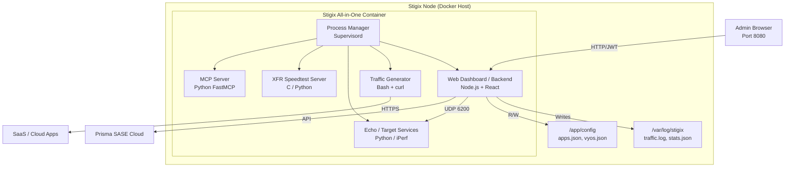

# SD-WAN Traffic Generator — Technical Specification

**Version**: `v1.2.1-patch.246`
**Last Updated**: March 2026

---

## Executive Summary

The **SD-WAN Traffic Generator (Stigix)** is a realistic enterprise network simulation platform designed for SD-WAN testing, demonstrations, and lab validation. Following the **All-in-One** architecture, the entire suite runs as a single, optimized Docker container managed by `supervisord`.

The platform covers four core pillars:
1. **Traffic Simulation** — Weighted HTTP/HTTPS requests to 60+ enterprise SaaS applications.
2. **Network Impairment** — VyOS router orchestration for programmatic failover scenarios.
3. **Measurement & Validation** — Convergence testing, Voice MOS scoring, and XFR throughput.
4. **Security Testing** — URL filtering, DNS sinkhole detection, and threat simulation.

---

## Key Capabilities

| Capability | Description |
|---|---|
| **All-in-One Deployment** | Simplified single-container architecture running all services via `supervisord` |
| **Realistic Traffic** | HTTP/HTTPS to 60+ SaaS apps with weighted distribution and exponential backoff |
| **Convergence Lab** | Sub-millisecond UDP echo testing with full failover timeline and history |
| **VyOS Control** | SSH-based orchestration of VyOS routers with sequence modes |
| **XFR Speedtest** | High-performance throughput testing (TCP/UDP/QUIC) with deterministic ports |
| **Voice/VoIP Testing** | RTP packet generation with MOS score (R-value) simulation |
| **Security Testing** | URL filtering, DNS sinkhole detection, EICAR threat tests, and EDL management |
| **Prisma Integration** | Auto site-detection and flow browser egress path enrichment |

---

## System Architecture

### High-Level Topology



### Component Process Management

Stigix uses `supervisord` to manage the lifecycle of all internal services within the `stigix` container:

| Process | Role | Language |
|---|---|---|
| **web-ui** | Dashboard & API Backend | Node.js / TypeScript |
| **traffic-gen** | Continuous SaaS Traffic | Bash |
| **echo-server** | UDP/RTP Echo Targets | Python |
| **xfr-server** | Bandwidth Test Target | Python / C |
| **mcp-server** | Natural Language Bridge | Python |
| **log-fwd** | Internal log aggregation | Shell |

---

## Shared Resources & Persistence

### Persistence Volumes

| Local Directory | Container Path | Purpose |
|---|---|---|
| `./config` | `/app/config` | Applications, users, VyOS sequences, and probe targets |
| `./logs` | `/var/log/stigix` | Real-time traffic logs, test history, and statistics |
| `./mcp-data` | `/app/mcp-data` | Persistence for the MCP server state |

### Configuration Files (`config/`)

- `applications-config.json`: SaaS weights and traffic control status.
- `vyos-config.json`: Router inventory and impairment sequences.
- `security-config.json`: History of URL/DNS/Threat tests.
- `users.json`: JWT authentication database (bcrypt).
- `convergence-history.jsonl`: Append-only log of failover measurements.

---

## Deployment & Networking

### Host Mode (Recommended for Linux)
Stigix defaults to `network_mode: host` on Linux. This allows the internal services to bind directly to the host's physical interfaces, ensuring:
- Accurate latency measurements without NAT jitter.
- Ability to bind traffic to specific WAN interfaces (vlan, etc).
- Direct access for L2 IoT simulation (ARP/DHCP).

### Bridge Mode (macOS / Windows / Non-Root)
On platforms where host networking is restricted, Stigix falls back to standard Docker Bridge mode. Ports are mapped individually (8080, 8082, 3100, 9000).

---

## Development & Build

### Multistage Build
The Stigix Dockerfile uses a multistage build process:
1. **Frontend Build**: React SPA is compiled using Vite/Node.js.
2. **Backend Prep**: Node.js dependencies are bundled.
3. **Final Assembly**: All components (Bash, Python, Node, C binaries) are combined into a final `debian` or `alpine` based image.

### Local Development
To run in development mode with hot-reloading:
```bash
# In web-dashboard/
npm run dev

# In root/
./traffic-generator.sh
```

---

**Stigix Project — 2026**
