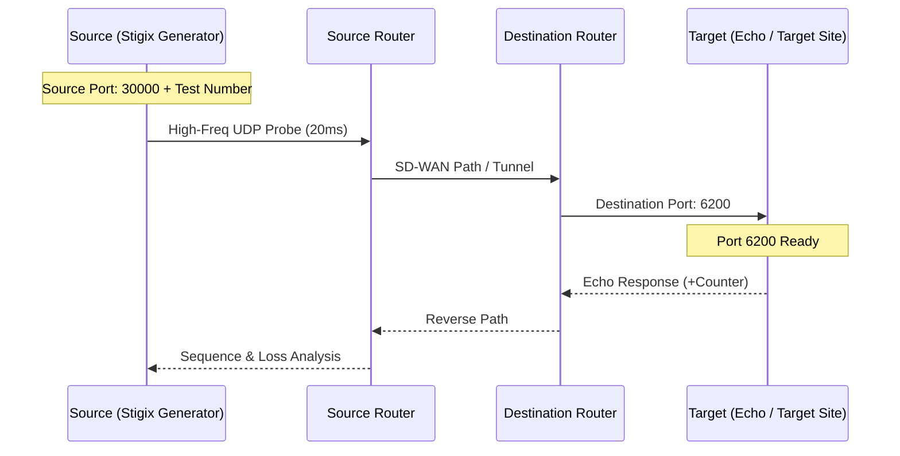

# Convergence Lab: SD-WAN Failover & Performance Probing

The **Convergence Lab** is a high-precision diagnostic tool designed to measure network failover times (convergence) and directional packet loss. It is specifically optimized for validating SD-WAN tunnel steering and circuit transition performance.

---

## 🔬 How it Works

The tool uses a **High-Frequency UDP Probe** strategy to identify sub-second network interruptions that traditional monitoring tools (like standard ICMP) often miss.

### 1. High-Frequency Probing
- **Default Rate**: 50 PPS (Packets Per Second), meaning a packet is sent every **20ms**.
- **Default Port**: **UDP 6200** (Target Site Echo Service).
- **Source Port**: Deterministic based on Test ID (Range **30000+**).
    - `CONV-001` → Source Port `30001`
    - `CONV-042` → Source Port `30042`
- **Payload**: Each packet contains a unique **Sequence Number** and a high-resolution **Timestamp**.
- **Echo Mechanism**: The destination `echo_server.py` receives the packet and echoes it back, appending its own reception counter to allow for directional loss analysis.

### 2. Network Topology & Port Mapping

The following diagram illustrates the flow of high-frequency UDP probes and how source/destination ports are utilized for tracking.

### 3. Sequence Gap Analysis
The core logic resides in the `convergence_orchestrator.py`. It detects "Blackouts" by monitoring gaps in the received sequence numbers:
- When a packet arrives, the orchestrator calculates the difference between the current sequence and the last received sequence.
- **Formula**: `Gap = (Current_Seq - Last_Seq - 1) * (1000 / PPS)`
- If `PPS = 50`, a gap of 5 missing packets equals a **100ms blackout**.

### 3. Directional Loss Calculation
Unlike standard "Round Trip" loss, the Convergence Lab breaks down loss by direction:
- **TX Loss (Uplink)**: Calculated by comparing the number of packets sent by the generator vs. the number received by the echo server (reported in the echoed payload).
- **RX Loss (Downlink)**: Calculated by comparing the number of packets echoed by the server vs. the number actually received back by the generator.

### 4. Packet Details Display
The history view shows comprehensive packet statistics for each test:
- **S (Sent)**: Total packets transmitted by the client.
- **Echo**: Server-side receive counter (requires `echo_server.py` or `target_host.py` on destination).
  - If using a standard UDP echo (like `socat`), this will show `-` as the server doesn't report its counter.
- **R (Received)**: Total echo packets received back by the client.
- **TX Loss**: Percentage and color-coded indicator (Red) for uplink packet loss.
- **RX Loss**: Percentage and color-coded indicator (Blue) for downlink packet loss.

---

## 📊 Visual Indicators

### Real-Time Sequence Monitoring
During active tests, a live timeline displays the last 100 packets:
- **Blue Bars (Full Height)**: Packet successfully sent and echo received.
- **Red Bars (Short & Pulsing)**: Packet sent but echo not yet received (potential drop or high latency). 
  - If the echo arrives late (within the 100-packet window), the bar will turn from red to blue.
  - Persistent red bars indicate confirmed packet loss or a blackout period.

### Historical Failover Timeline
Expanded test results show a compact 100-packet history:
- **Blue**: Successful round-trip.
- **Red**: Confirmed drop or timeout.

### Directional Loss Analysis
The history view provides detailed directional metrics:
- **TX Loss**: Uplink loss (Client → Server). Shown in Red. Displays percentage and calculated duration (ms).
- **RX Loss**: Downlink loss (Server → Client). Shown in Blue. Displays percentage and calculated duration (ms).
- **Packet Counters**: 
  - **S**: Total Sent.
  - **Echo**: Received by Server (if supported).
  - **R**: Received by Client.

---

## ⚖️ Scoring & Verdicts (Dynamic)

The "Verdict" of a test is determined by the **Maximum Blackout Duration** relative to the user-configured thresholds in **Settings > Convergence**. 

The system uses a 4-zone classification:

| Verdict | Color | Range | Meaning |
|:-------:|:-----:|:-----:|:--------|
| **EXCELLENT** | Green | 0ms | No measurable sequence gaps detected. |
| **GOOD** | Green | < T1 | Typical sub-second or near-second convergence. |
| **DEGRADED** | Yellow | T1 - T2 | Noticeable outage. Video freeze / voice drops possible. |
| **BAD** | Orange | T2 - T3 | Significant outage. Application health impacted. |
| **CRITICAL** | Red | > T3 | Major blackout. Application sessions will disconnect. |

> [!TIP]
> **T1, T2, and T3** are configurable (1-100s) in the **Convergence Settings** submenu. By default, these are set to **1s**, **5s**, and **100s**.

> [!NOTE]
> Even if total packet loss is low, a single high "Max Blackout" indicates a specific event (like a hard circuit failover) that impacted the real-time flow.
>
> **Understanding Red Bars**: If you see red bars during a test but the final result shows 0% loss, those packets were delayed (jitter) but eventually arrived. This is normal for network paths with variable latency.

---

## 🛠️ Operational Tips

### Global Precision (Rate)
You can adjust the probe frequency based on your testing goals:
- **100 PPS (10ms)**: Ultra-high precision for voice-sensitive tunnel transitions.
- **50 PPS (20ms)**: Standard SD-WAN validation (Default).
- **1 PPS / 5 PPS**: Long-term "heartbeat" monitoring with minimal bandwidth impact.

### Correlation with Infrastructure
Each test is assigned a unique **Test ID** (e.g., `[CONV-042]`). 
- When a probe is active, the orchestrator binds to a **deterministic Source Port** (30000 + Test Number).
- **Benefit**: You can filter by source port directly in your SD-WAN flow browser (Viptela, Prisma Access, etc.) to isolate exactly which tunnel or circuit was used during a specific failover event.
- **Graceful Fallback**: If the deterministic port is already in use by the OS, the tool automatically falls back to a random port in the **40000-60000** range to ensure the test starts.

### Warmup Period
To ensure accurate "Failover" measurements, the tool implements a **5-second warmup period**. 
- During this window, the generator sends a burst of initial packets to stabilize the path.
- Sequence gaps occurring during the first 5 seconds are **ignored** in the Max Blackout calculation to prevent false positives from initial flow setup.
