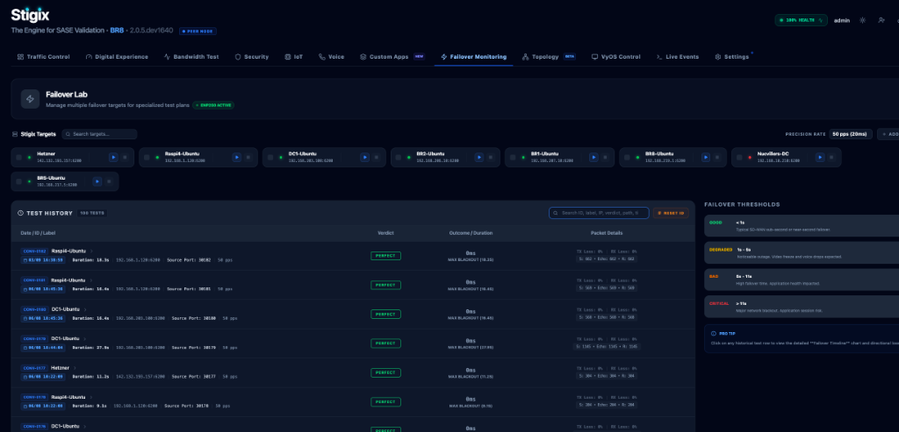
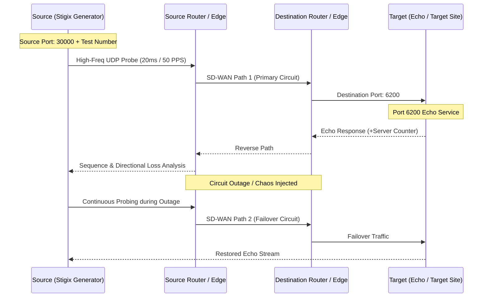
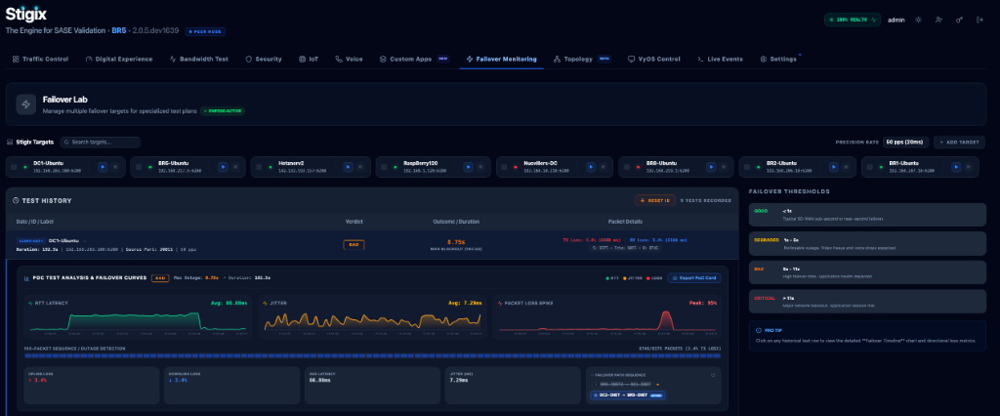

# Convergence Lab: SD-WAN Failover & Performance Probing

The **Convergence Lab (Failover Monitoring)** is a high-precision diagnostic and PoC validation engine designed to measure network failover times (convergence), sub-second blackouts, and directional packet loss. It is specifically optimized for validating SD-WAN tunnel steering, circuit transitions, and SASE policy failover.

---

*Main interface to manage multi-target failover plans, precision rates, and real-time search:*

---

## 🔬 How it Works

The tool uses a **High-Frequency UDP Probe** strategy to identify sub-second network interruptions that traditional monitoring tools (like standard ICMP) often miss.

### 1. High-Frequency Probing
- **Default Rate**: 50 PPS (Packets Per Second), meaning a packet is sent every **20ms** (adjustable from 1 PPS up to 1000 PPS).
- **Default Port**: **UDP 6200** (Target Site Echo Service).
- **Source Port**: Deterministic based on Test ID (Range **30000+**).
    - `CONV-0001` → Source Port `30001`
    - `CONV-0014` → Source Port `30014`
- **Payload**: Each packet contains a unique **Sequence Number** and a high-resolution **Timestamp**.
- **Echo Mechanism**: The destination `echo_server.py` receives the packet and echoes it back, appending its own reception counter to allow for directional loss analysis.

### 2. Network Topology & Port Mapping

```mermaid
sequenceDiagram
    participant S as Source (Stigix Generator)
    participant RA as Source Router / Edge
    participant RB as Destination Router / Edge
    participant T as Target (Echo / Target Site)

    Note over S: Source Port: 30000 + Test Number
    S->>RA: High-Freq UDP Probe (20ms / 50 PPS)
    RA->>RB: SD-WAN Path 1 (Primary Circuit)
    RB->>T: Destination Port: 6200
    
    Note over T: Port 6200 Echo Service
    T-->>RB: Echo Response (+Server Counter)
    RB-->>RA: Reverse Path
    RA-->>S: Sequence & Directional Loss Analysis
    
    Note over RA,RB: Circuit Outage / Chaos Injected
    S->>RA: Continuous Probing during Outage
    RA->>RB: SD-WAN Path 2 (Failover Circuit)
    RB->>T: Failover Traffic
    T-->>S: Restored Echo Stream
```

---

## 📈 Real-Time & Historical Outage Analytics

*PoC Test Analysis showing historical RTT latency, Jitter, Loss spikes, and multi-path failover sequence:*

### 1. Tri-Metric Area Charts & Adaptive Scaling
- **RTT Latency**: Instantaneous round-trip time in milliseconds, showing path latency changes when traffic shifts from a fast link (e.g. Fiber 14ms) to a backup link (e.g. LTE 65ms).
- **Jitter**: High-frequency inter-packet variation tracked via RFC-standard exponentially weighted moving average.
- **Packet Loss Spike**: Live and historical instantaneous packet drop rate with **Adaptive Y-Axis Scaling** (`0 - Math.max(10, maxLoss)`). Even subtle 3-5% dips or microsecond hiccups are rendered with full vertical resolution.

### 2. Interactive Time Scrubber & Window Zoom
During live test execution:
- **Window Zoom Presets**: Switch instantly between `1m`, `5m`, `15m`, and `ALL` to zoom into specific failover transients.
- **Interactive Scrubber Slider**: Drag the time scrubber across the test duration to inspect synchronized metrics and outage states at any given second.

### 3. SCM Multi-Path Sequence Tracking
Integrates directly with the Prisma SD-WAN / SCM flow indexing engine:
- **Sequential Flow Evolution**: Displays the exact path journey (e.g. `1 BR5-INET2 → DC1-INET` ➔ `2 DC2-INET → BR3-INET [ACTIVE]`).
- **Dynamic Indexing Countdown**: Displays a real-time countdown ticker (`SCM flow indexing (60-Xs)` and `2nd SCM check (180-Xs)`) reflecting cloud flow indexing windows without congesting APIs.

### 4. 📸 1-Click PoC Card HD PNG Export
- Export publication-ready, dark-themed **PoC Test Analysis Cards** (`pixelRatio: 2`) directly into PNG format.
- Interactive controls (scrubbers, export buttons, audio toggles) are automatically stripped from the exported image via `data-no-export="true"`.
- Ideal for inserting directly into customer reports, technical validation slides, and executive summaries.

---

## 📊 Test History & Search Filter

*Test History table with date/time stamps, full-text search, and color-coded verdicts:*

### 1. Precision Date & Time Badges
- Every recorded test row displays a prominent timestamp badge (e.g. `📅 05/09 11:32:15` with the full locale date on hover).
- The expanded PoC Card displays `Recorded at DD/MM/YYYY, HH:MM:SS` right alongside the verdict and blackout duration.

### 2. Real-Time Full-Text Search
- Filter hundreds of historical tests instantly by typing any criterion:
  - **Test ID**: `CONV-0013`, `14`
  - **Target / Host**: `BR5-Ubuntu`, `DC1-Ubuntu`, `192.168.217.5`
  - **Ports**: `6200`, `38013`
  - **Verdict**: `PERFECT`, `GOOD`, `DEGRADED`, `BAD`, `CRITICAL`
  - **Egress Path**: `BR5-INET2`, `DC1-INET`
  - **Date / Time**: `11:32`, `05/09`, `2026`

---

## ⚖️ Scoring & Verdicts (Dynamic)

The **Verdict** of a test is determined by the **Maximum Blackout Duration** relative to the user-configured thresholds in **Settings > Convergence**:

| Verdict | Color | Default Range | Meaning |
|:-------:|:-----:|:-------------:|:--------|
| **PERFECT** | Green | 0ms | No measurable packet drops or sequence gaps detected. |
| **GOOD** | Green | < 1s | Typical SD-WAN sub-second or near-second failover. Sessions stay intact. |
| **DEGRADED** | Yellow | 1s - 5s | Noticeable outage. Video freeze and voice drops expected. |
| **BAD** | Orange | 5s - 11s | High failover time. Application health and user experience impacted. |
| **CRITICAL** | Red | > 11s | Major blackout. Application sessions will disconnect / reset. |

> [!TIP]
> **Thresholds** are fully customizable in the **Failover Settings** panel or `/api/config/convergence`.

---

## 🛠️ Operational Tips

### Global Precision (Rate)
- **100 PPS (10ms)**: Ultra-high precision for voice and video RTP failover tests.
- **50 PPS (20ms)**: Standard enterprise SD-WAN SLA validation (Default).
- **10 PPS / 1 PPS**: Long-term background heartbeat monitoring.

### Deterministic Source Port Correlation
Each test generates a dedicated **Source Port** (`30000 + Test Number`):
- Filter by source port in your SD-WAN flow browser (Prisma SD-WAN, Viptela, Velocloud, Fortinet) to track the exact ingress interface, active tunnel, and failover policy applied.
- The **Test ID** counter can be reset anytime using the `RESET ID` button in the Test History toolbar.

