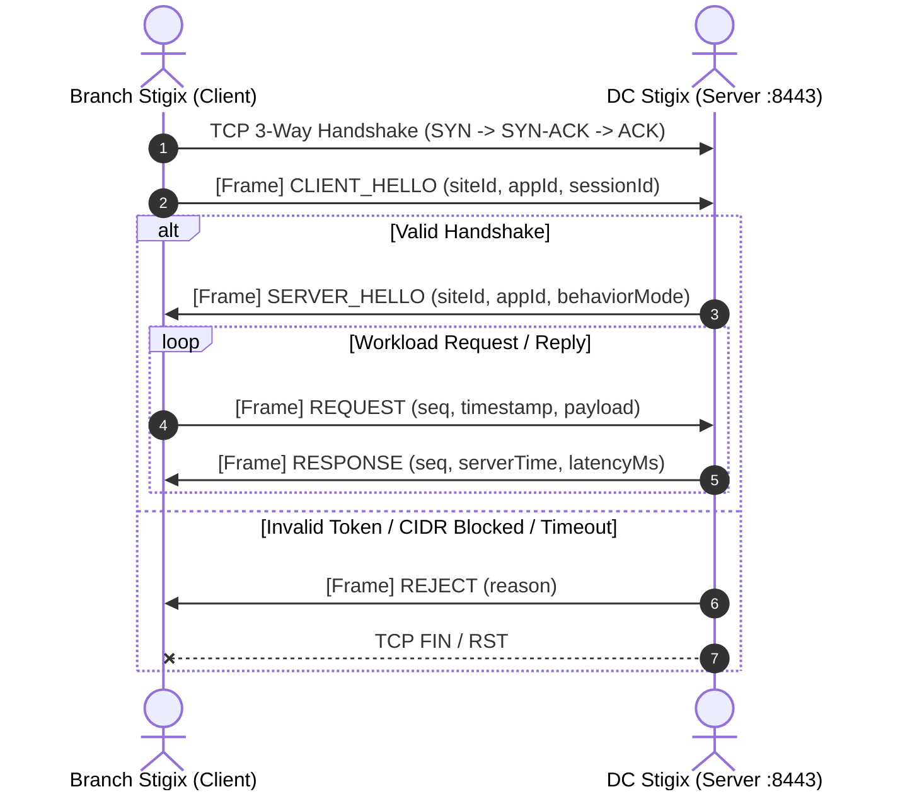

# Stigix Custom TCP Inter-Site Applications

> 📘 **Looking for the practical step-by-step User Guide?**  
> Check out the [📖 Custom TCP Apps User Guide & Recipes](file:///Users/jsuzanne/Github/stigix/docs/CUSTOM_TCP_APPS_USER_GUIDE.md) with deployment blueprints, chaos recipes (ERP, POS, DB, SD-WAN failover), and troubleshooting.

## Overview

**Stigix Custom TCP Inter-Site Applications** is a real-time, customizable **Any-to-Any (North-South & East-West)** TCP workload simulation and verification framework designed specifically for SD-WAN, SASE, and Next-Generation Enterprise Network testbeds.

Traditional network testing tools typically emulate generic synthetic traffic (e.g. iPerf or simple HTTP GET loops). However, real enterprise line-of-business applications (such as SAP ERP, Point-of-Sale checkout terminals, Core Banking messaging, database sync, and industrial SCADA) rely on **custom, persistent, long-lived TCP connections** with application-level request/reply transactions and distinct application-level behaviors.

### Topology Flexibility: North-South & East-West
With Stigix Custom TCP Apps, every node operates simultaneously as a **Server Listener** and a **Client Workload Generator**, supporting:
- **North-South (Vertical / Hub-and-Spoke)**: Branch $\longleftrightarrow$ Datacenter / HQ, simulating remote users accessing centralized corporate databases and application servers.
- **East-West (Horizontal / Site-to-Site)**: Branch $\longleftrightarrow$ Branch, Plant $\longleftrightarrow$ Plant, or inter-cloud VPC tunnels exchanging lateral transactional flows without traversing the datacenter hub.
- **Full Mesh (N-to-N Any-to-Any)**: Multi-site collaborative mesh networks where all nodes simultaneously generate and receive traffic.

---

## Understanding Latency Percentiles ($p50, p95$)

In enterprise SD-WAN and APM monitoring, a simple **Average (`Avg`)** metric is notoriously misleading:

> ⚠️ **The Average Trap**: If 99 requests take **10 ms** and 1 request takes **1,000 ms** (due to a transient brownout, packet loss, or tunnel failover), the average displays **~19.9 ms**, masking the 1-second freeze experienced by the user!

To provide true SLA visibility, Stigix calculates **Rolling Percentiles** on all active TCP sessions:

| Metric | Definition | Practical Purpose in SD-WAN Testing |
| :--- | :--- | :--- |
| **`Avg` (Mean)** | Arithmetic mean across the rolling sample window. | Baseline macro performance indicator. |
| **`p50` (Median)** | **50% of transactions** completed faster than this threshold. | Represents the typical, daily user experience. Immune to isolated outliers. |
| **`p95` (95th Percentile)** | **95% of transactions** completed faster than this threshold (top 5% worst cases). | **The gold standard for SD-WAN SLA validation**. Captures jitter, queueing, brownouts, and TCP retransmissions during failover. |
| **`Max`** | Peak highest RTT recorded in the window. | Identifies worst-case failover spikes and timeout events. |

```
RTT Samples Sorted: [ 10ms, 10ms, 11ms, 12ms ... 15ms ... 45ms ... 1000ms ]
                                       ▲             ▲          ▲
                                      p50           p95        Max
                                  (Median User)   (SLA Tail)  (Worst Spike)
```

- **Stable Path**: $p50 \approx p95$ (e.g., $p50 = 12\text{ ms}$, $p95 = 14\text{ ms}$) indicates a rock-solid, jitter-free WAN path.
- **Impaired / Failover Path**: $p50 = 15\text{ ms}$, $p95 = 250\text{ ms}$ immediately highlights micro-drops, bufferbloat, or route flapping even if `Avg` appears acceptable.

---

## Key Features

- **Multi-Application Engine**: Run multiple custom TCP application profiles simultaneously on independent TCP ports (e.g., `:8443` for ERP, `:9100` for POS, `:5432` for DB sync).
- **Dual Server / Client Architecture**: Every Stigix node acts concurrently as a server and client.
- **Robust Framing & Stream Parser**: Length-prefixed binary framing (`UInt32BE` length prefix + JSON payload) immune to TCP chunk fragmentation, buffer splitting, and stream concatenation.
- **Rich Server Simulation Behaviors**:
  - `echo`: Immediate full payload reflection.
  - `acknowledge`: Ultra-fast minimal ACK response without payload reflection.
  - `fixed_delay`: Deterministic response latency injection (e.g., simulating remote DB indexing).
  - `random_delay`: Jittered response latency between configurable min and max thresholds.
  - `looping_delay`: Periodic cycling between normal performance and degraded slow-response phases.
  - `drop_response`: Simulates application-level timeout or silent packet loss while keeping the underlying TCP connection open.
  - `close_connection`: Simulates intermittent server crash or socket teardown after $N$ requests.
  - `error_response`: Injects application-level error codes with configurable failure probabilities.
- **Flexible Client Workload Modes**:
  - `persistent_request_reply`: Long-lived TCP connections sending continuous request/reply cycles.
  - `transactional`: Open TCP connection, transmit 1..N transactions, close connection cleanly.
  - `heartbeat`: Lightweight keepalive pings with low network footprint.
  - `bulk_burst`: High-density bursts of transactions followed by idle intervals.
  - `continuous_stream`: Uninterrupted unidirectional/bidirectional streaming.
- **Intelligent Peer Discovery**: Seamless integration with Stigix Dynamic Peer Registry and Target Controller.
- **Security & Access Control**:
  - Optional IPv4 CIDR subnet allowlist (`allowCidrs`).
  - Strict 5-second handshake timeout (`CLIENT_HELLO` $\rightarrow$ `SERVER_HELLO`).
  - Pre-shared authentication tokens (`auth.token`).
- **Real-Time Operational Dashboard**:
  - Live charts and rolling percentile RTT metrics ($p50, p95, \text{min}, \text{avg}, \text{max}$).
  - Live table of incoming client sessions displaying Declared Site ID vs Socket Remote IP.
  - Outgoing session status, instant handshake diagnostics, and non-destructive port availability checks.
- **Interactive CLI & REST APIs**: Full control via `stigix-cli` (`tcp-app` subcommands) and REST API `/api/custom-tcp-apps`.

---

## Framing & Protocol Specification

All communication occurs over standard stream-oriented TCP sockets using 4-byte Big-Endian Length Prefixes:

```
+-----------------------------+------------------------------------+
| 4-byte UInt32BE Payload Len | JSON Encoded Protocol Frame (UTF-8)|
+-----------------------------+------------------------------------+
```

### Handshake Sequence

When a client establishes a TCP connection to a Stigix application port, it **must** issue a `CLIENT_HELLO` within 5,000 ms. If no valid `CLIENT_HELLO` is received within 5 seconds, or if authentication / CIDR validation fails, the server sends a `REJECT` frame and closes the socket.



### Protocol Message Types

| Type | Direction | Description |
| :--- | :--- | :--- |
| `CLIENT_HELLO` | Client $\rightarrow$ Server | Initial handshake with client Site ID, Application ID, and optional Auth token. |
| `SERVER_HELLO` | Server $\rightarrow$ Client | Handshake acceptance acknowledging server Site ID and active behavior mode. |
| `REJECT` | Server $\rightarrow$ Client | Rejection notice with diagnostic reason code before session termination. |
| `REQUEST` | Client $\rightarrow$ Server | Application payload request carrying sequence number and client timestamp. |
| `RESPONSE` | Server $\rightarrow$ Client | Application payload response carrying matching sequence number. |
| `ERROR` | Server $\rightarrow$ Client | Application-level error frame (e.g., simulated DB timeout). |
| `PING` / `PONG` | Bi-directional | Stream keepalive probe. |
| `CLIENT_CLOSE` | Client $\rightarrow$ Server | Graceful client teardown notice. |
| `SERVER_CLOSE` | Server $\rightarrow$ Client | Graceful server teardown notice. |

---

## Configuration & Storage

Custom TCP Application profiles are persisted in `config/custom-tcp-applications.json` with automatic backup and atomic write semantics:

```json
{
  "version": 1,
  "updatedAt": "2026-09-02T12:00:00.000Z",
  "applications": [
    {
      "id": "erp-main",
      "name": "ERP-TCP",
      "description": "Core ERP transactional workload between Branch and DC",
      "enabled": true,
      "listener": {
        "bindAddress": "0.0.0.0",
        "port": 8443,
        "maxConnections": 100,
        "idleTimeoutMs": 60000,
        "maxPayloadBytes": 1048576,
        "tcpKeepalive": true,
        "allowCidrs": ["10.0.0.0/8", "192.168.0.0/16"],
        "auth": { "enabled": false }
      },
      "serverBehavior": {
        "mode": "fixed_delay",
        "fixedDelayMs": 250,
        "dropProbability": 0,
        "errorProbability": 0
      },
      "clientDefaults": {
        "mode": "persistent_request_reply",
        "connectionsPerPeer": 2,
        "intervalMs": 1000,
        "payloadBytes": 1024,
        "requestTimeoutMs": 5000,
        "autoReconnect": true,
        "reconnectInitialMs": 1000,
        "reconnectMaxMs": 30000
      },
      "peers": [
        {
          "id": "peer-dc-lyon",
          "name": "DC-LYON",
          "siteName": "DC-LYON",
          "host": "10.20.30.40",
          "port": 8443,
          "enabled": true
        }
      ],
      "startup": {
        "startListener": true,
        "startClientWorkload": false
      }
    }
  ]
}
```

---

## Client Workload Modes Reference

The Client Workload Generator simulates realistic application traffic patterns transmitted across the network to target peer listeners:

| Mode | Identifier | Connection Behavior | Cadence & Flow | Primary Use Case & SD-WAN Testing Goal |
| :--- | :--- | :--- | :--- | :--- |
| **Persistent Sessions** | `persistent_request_reply` | **Long-lived TCP Sockets**: Opens $N$ concurrent TCP connections per peer. Reuses established sockets without closing. | Periodic request/reply at configurable interval (`intervalMs`). Measures round-trip time ($p50/p95$). | Simulates interactive enterprise apps (SAP, Oracle ERP, POS terminals, Bloomberg/FIX trading). Tests path stability, session affinity, and asymmetric routing. |
| **Transactional** | `transactional` | **Short-lived TCP Sockets**: For each transaction, performs full TCP 3-way handshake (`SYN` $\rightarrow$ `SYN-ACK` $\rightarrow$ `ACK`), sends request, receives reply, and closes socket (`FIN` / `RST`). | Configurable delay between successive connections. | Simulates REST/RPC APIs without HTTP keep-alive, DNS, and legacy database queries. Tests firewall session setup rate (CPS - Connections Per Second) and NAT table capacity. |
| **Heartbeat** | `heartbeat` | **Low-footprint Keep-alive**: Opens persistent connection and sends small ping/pong frames (32–64 bytes) at regular cadence (e.g., 5s). | Ultra-low bandwidth footprint ($< 1 \text{ KB/s}$). | Keeps SD-WAN IPsec/NAT translation state alive while continuously monitoring round-trip path latency and jitter. |
| **Bulk Burst** | `bulk_burst` | **High-Volume Bursts**: Transmits high-density batches of large payload frames (e.g. 64 KB – 1 MB) followed by quiet intervals. | Configurable burst size, payload bytes, and idle sleep intervals (e.g. 5–30s). | Simulates batch database replication, log shipping, and backup jobs. Tests SD-WAN QoS priority queuing, bandwidth policing, and bufferbloat. |
| **Continuous Stream** | `continuous_stream` | **Back-to-Back Framing**: Sends an uninterrupted back-to-back stream of protocol frames without pause between requests. | Maximum throughput bound only by network bandwidth and TCP window size. | Simulates high-frequency industrial telemetry, video ingestion streams, and live sensor data. Tests WAN link saturation and packet drop behavior under load. |

---

## Server Simulation Behaviors Reference

The Host TCP Listener can emulate diverse application backend characteristics and chaos injection scenarios:

| Behavior Mode | Identifier | Description & Simulation Parameters | Realistic Scenario |
| :--- | :--- | :--- | :--- |
| **Echo** | `echo` | Immediately reflects the client's request payload back in the response frame with zero added delay. | Ideal baseline latency and throughput measurement. |
| **Acknowledge** | `acknowledge` | Returns an ultra-lightweight status ACK response without echoing the client payload. | High-frequency telemetry or transactional database write confirmation. |
| **Fixed Delay** | `fixed_delay` | Injects an exact deterministic processing delay (`fixedDelayMs`, e.g., 250 ms) before replying. | Simulates heavy backend computation, complex SQL database queries, or legacy mainframe transactions. |
| **Random Delay** | `random_delay` | Injects uniform random jitter between `randomDelayMinMs` and `randomDelayMaxMs` (e.g., 50–300 ms). | Simulates multi-tenant cloud microservices or variable load on application servers. |
| **Looping Delay** | `looping_delay` | Cycles through 3 configurable phases: Normal Latency $\rightarrow$ Degraded High Latency $\rightarrow$ Normal Latency. | Tests whether SD-WAN Dynamic Path Selection (DPS) detects transient degradation and reroutes traffic over a cleaner MPLS/Internet link. |
| **Drop Response** | `drop_response` | Silently discards the request and never sends a response, while keeping the TCP socket open until client timeout. | Simulates application deadlock, unhandled exceptions, or backend service crashes. |
| **Close Connection** | `close_connection` | Accepts the TCP connection, optionally replies, and abruptly terminates the socket (`closeAfterRequests: N`). | Simulates unstable legacy servers, crash loops, and tests client reconnection backoff. |
| **Error Response** | `error_response` | Returns application-level error frames (`500 INTERNAL_ERROR`, `503 SERVICE_UNAVAILABLE`) with configurable error rate (0–100%). | Validates application-aware SD-WAN telemetry and SASE DLP/CASB inspection rules. |

---

## Web Dashboard Usage

### 1. Dedicated "Custom Apps" Navigation Tab
Navigate to **Custom Apps** in the top navigation bar to open the Operational Control Center.
- **Top Bar**: Select the active application profile, view listener/client badges, and trigger instant Start/Stop/Test actions.
- **Overview Cards**: Monitor live transaction rates, active connections, RTT ($p50/p95/\text{avg}$), and total transferred bytes.
- **Incoming Client Sessions**: Inspect remote connection sockets, declared Site IDs, and handshake states.
- **Outgoing Peer Workloads**: View real-time RTT measurements and request status for each remote destination node.

### 2. Creation & Edition Wizard (4 Steps)
Click **Create Application** (or **Edit** in Settings $\rightarrow$ Custom TCP Apps):
1. **Identity & Listener**: Define App Name, ID, host TCP port (1024–65535), and optional CIDR allowlists.
2. **Server Behavior**: Choose simulation mode (`echo`, `fixed_delay`, `random_delay`, `looping_delay`, `drop_response`, `error_response`).
3. **Client Behavior, Peers & Zero-Touch Auto-Start**: Configure workload cadence, concurrency per peer, payload size, remote peer IP addresses, and toggle **Zero-Touch Auto-Start** (`startup.startClientWorkload: true`) to automatically generate traffic upon peer synchronization or boot.
4. **Review & Validate**: Run real-time host port availability test and persist configuration.

### 3. Zero-Touch Provisioning (ZTP) Client Auto-Start
When deploying applications from a central **Leader** node via Global Provisioning:
- **Default Behavior (`startup.startClientWorkload: false`)**: Peers pull the application and open their host listeners, leaving client workload in `IDLE` state for manual on-demand triggering.
- **Auto-Start Enabled (`startup.startClientWorkload: true`)**: As soon as branch peers pull the configuration bundle, the client workload automatically transitions to `RUNNING` and generates continuous synthetic traffic against configured peer servers (e.g. Datacenter hosts) without requiring any manual action on the branch nodes.

---

## CLI Management (`stigix-cli`)

Stigix CLI provides direct terminal-based control over Custom TCP Applications via the `tcp-app` (alias `custom-app` / `app`) command:

### Command Reference

```bash
# List all configured applications and their listener/client status
stigix-cli --exec "tcp-app list"

# View comprehensive runtime metrics and latency percentiles
stigix-cli --exec "tcp-app status erp-main"

# Start or stop the local host TCP listener
stigix-cli --exec "tcp-app start-listener erp-main"
stigix-cli --exec "tcp-app stop-listener erp-main"

# Start or stop outbound client workload generation
stigix-cli --exec "tcp-app start-client erp-main"
stigix-cli --exec "tcp-app stop-client erp-main"

# Run an instant roundtrip handshake test towards remote peers
stigix-cli --exec "tcp-app test erp-main"

# Inspect active inbound sockets and outbound peer sessions
stigix-cli --exec "tcp-app sessions erp-main"

# Reset application metrics counters
stigix-cli --exec "tcp-app reset-metrics erp-main"
```

---

---

## Prisma SD-WAN Flow Browser Integration

Stigix Custom TCP Applications include native, automated synchronization with **Palo Alto Networks Prisma SD-WAN** (formerly CloudGenix).

```
+------------------------------------+          +--------------------------------------+
|          Stigix Instance           |          |         Prisma SD-WAN Tenant         |
|  - Custom App: Onprem8084 (:8084)  |  ----->  |  - Custom AppDef: STX_Onprem8084     |
|  - Real-time TCP Traffic Gen       |          |  - Flow Browser / Analytics Aware    |
+------------------------------------+          +--------------------------------------+
```

### Why It Matters
When testing custom TCP applications over an SD-WAN overlay, ION branch and datacenter appliances identify unclassified TCP traffic as generic `unknown` or `tcp`. By provisioning matching **Application Definitions (`appdefs`)** into your Prisma SD-WAN tenant:
1. **Flow Browser Visibility**: All synthetic TCP flows between Stigix branch and DC nodes automatically resolve to their declared application name (e.g. `STX_Onprem8084`, `STX_SAP-ERP`).
2. **Bandwidth Analytics & Reports**: Live application traffic is measured in Prisma SD-WAN Bandwidth & Performance Analytics widgets.
3. **App-Based QoS & Path Policies**: Traffic can be steered using fine-grained application-aware forwarding policies (e.g., MPLS primary, Internet backup).

### How to Use
1. Open **Settings** $\rightarrow$ **Custom TCP Apps** in the Stigix Web Dashboard.
2. Click **Prisma SD-WAN Integration** (or the Cloud icon).
3. The modal displays:
   - Live Tenant Connection state and TSG ID.
   - List of all Stigix applications and their synchronization status (`SYNCED` vs `NOT SYNCED`).
   - **Register in Prisma**: 1-click provisioning of individual applications into the tenant.
   - **Sync All to Prisma**: Delta sync of all active custom applications in a single pass.
   - **Clean All**: Safely removes all Stigix-created (`STX_`) definitions when tearing down a lab.

---

## REST API Reference

| Endpoint | Method | Description |
| :--- | :--- | :--- |
| `/api/custom-tcp-apps` | `GET` | Retrieve list of all configured applications. |
| `/api/custom-tcp-apps` | `POST` | Create or update a custom application profile. |
| `/api/custom-tcp-apps/:id` | `GET` | Get details and status for a specific application. |
| `/api/custom-tcp-apps/:id` | `DELETE` | Delete an application profile and stop its services. |
| `/api/custom-tcp-apps/:id/duplicate` | `POST` | Duplicate an existing application profile. |
| `/api/custom-tcp-apps/:id/status` | `GET` | Get live runtime metrics, sessions, and listener status. |
| `/api/custom-tcp-apps/:id/listener/start` | `POST` | Start the local TCP listener on the host port. |
| `/api/custom-tcp-apps/:id/listener/stop` | `POST` | Stop the local TCP listener. |
| `/api/custom-tcp-apps/:id/client/start` | `POST` | Start outbound client workload towards peers. |
| `/api/custom-tcp-apps/:id/client/stop` | `POST` | Stop outbound client workload. |
| `/api/custom-tcp-apps/:id/test-peer/:peerId`| `POST` | Execute instant one-off TCP handshake test to a peer. |
| `/api/custom-tcp-apps/:id/metrics/reset` | `POST` | Reset live metrics counters for the application. |
| `/api/custom-tcp-apps/validate` | `POST` | Validate configuration and check host port availability. |
| `/api/custom-tcp-apps/export/config` | `GET` | Export complete custom TCP applications JSON file. |
| `/api/custom-tcp-apps/import/config` | `POST` | Import custom TCP applications configuration. |
| `/api/custom-tcp-apps/prisma/status` | `GET` | Query tenant connection and list existing Prisma custom appdefs. |
| `/api/custom-tcp-apps/prisma/sync-app/:id` | `POST` | Provision single custom application definition to Prisma SD-WAN. |
| `/api/custom-tcp-apps/prisma/delete-app/:id` | `POST` | Remove custom application definition from Prisma SD-WAN. |
| `/api/custom-tcp-apps/prisma/sync-all` | `POST` | Delta sync all Stigix applications to Prisma SD-WAN in a single batch. |
| `/api/custom-tcp-apps/prisma/clean-all` | `POST` | Remove all Stigix-created application definitions from tenant. |

---

## Roadmap & Future Extensions (V2)

For deep design specifications and architectural proposals, refer to the [Custom TCP Applications V2 PRD](file:///Users/jsuzanne/Github/stigix/PRD/Custom%20TCP%20APP/PRD_Custom_TCP_InterSite_Applications_V2_Stigix.md).

### Upcoming V2 Capabilities

| Capability | Scope | Description & SD-WAN Testing Value |
| :--- | :--- | :--- |
| **Universal DSCP / QoS Marking** | Client Option (Universal) | Layer-3 IP ToS marking (`CS0`, `AF31`, `AF41`, `EF`, `CS1`) applied universally across all workload modes to test priority queues and bandwidth reservations during WAN link saturation. |
| **Asymmetric Multiplier (`asymmetric_multiplier`)** | Server Behavior | Small request in (e.g., 128 bytes) triggering heavy response out (e.g., 50x-500x multiplier or 1 MB payload). Accurately emulates download-heavy enterprise workloads (ERP, DB reporting) on asymmetric WAN links (FTTH, Starlink, 5G). |
| **Stochastic / Human Think-Time (`stochastic`)** | Client Workload | *(Shipped in v2.0.8)* Injects realistic Poisson-distributed think-time variations between requests (0.4x to 2.2x base cadence) to simulate authentic human interactive sessions. |
| **Slow Trickle (`slow_trickle`)** | Server Behavior | Fragmented chunk-by-chunk delivery over time to stress test Next-Gen Firewall (NGFW) content inspection buffers, SSL decryption proxies, and WAN acceleration cache memory. |
| **Hard TCP RST Injection (`tcp_rst`)** | Server Behavior | Abrupt socket termination with TCP RST packets to validate client recovery, connection pooling resilience, and firewall state-table teardown logging. |
| **Ramping / Staircase Load (`ramping_load`)** | Client Workload | Automated incremental step-up and step-down connection ramping to benchmark gateway concurrent session capacity limits. |

---

## Related Documentation

- [Product Requirements Document V2 (PRD)](file:///Users/jsuzanne/Github/stigix/PRD/Custom%20TCP%20APP/PRD_Custom_TCP_InterSite_Applications_V2_Stigix.md): Detailed specifications for upcoming Custom TCP Applications V2 features.
- [Network Impairment & SD-WAN Failover Validation Guide](./CUSTOM_TCP_NETWORK_IMPAIRMENTS.md): Deep dive into validating VyOS netem impairments, packet loss, jitter, and sub-second failover recovery using Custom TCP Apps.
- [Central Global Provisioning Guide](./GLOBAL_PROVISIONING_AND_PEER_ONBOARDING.md): Multi-node distribution and Zero-Touch Auto-Start orchestration.
- [CLI Reference Manual](./STIGIX_CLI.md): Terminal management with `stigix-cli`.

