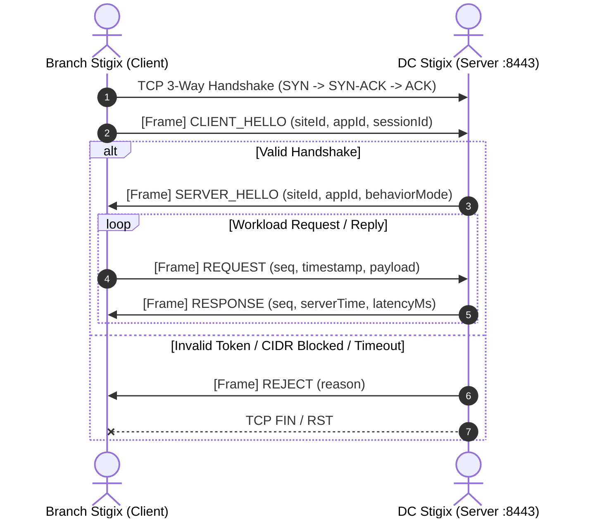

# Stigix Custom TCP Inter-Site Applications

## Overview

**Stigix Custom TCP Inter-Site Applications** is a real-time, customizable East-West TCP workload simulation and verification framework designed specifically for SD-WAN, SASE, and Next-Generation Enterprise Network testbeds.

Traditional network testing tools typically emulate generic synthetic traffic (e.g. iPerf or simple HTTP GET loops). However, real enterprise line-of-business applications (such as SAP ERP, Point-of-Sale checkout terminals, Core Banking messaging, database sync, and industrial SCADA) rely on **custom, persistent, long-lived TCP connections** with application-level request/reply transactions and distinct application-level behaviors.

With Stigix Custom TCP Apps, every Stigix instance simultaneously operates as:
1. A **TCP Server Listener** bound to a dedicated host port, executing realistic server simulation patterns (e.g., fixed delay, jitter, looping degradation, simulated packet drops, error responses).
2. A **TCP Client Workload Generator** initiating concurrent sessions to remote Stigix branch or data center instances across SD-WAN tunnels, measuring round-trip latency (RTT min/avg/p50/p95/max), transaction rates, throughput, and error states.

---

## Key Features

- **Multi-Application Engine**: Run multiple custom TCP application profiles simultaneously on independent TCP ports (e.g., `:8443` for ERP, `:9100` for POS, `:5432` for DB sync).
- **Dual Server / Client Architecture**: Every Stigix node acts concurrently as a server and client.
- **Robust Framing & Stream Parser**: Length-prefixed binary framing (`UInt32BE` length prefix + JSON payload) immune to TCP chunk fragmentation, buffer splitting, and stream concatenation.
- **Rich Server Simulation Behaviors**:
  - `echo`: Immediate full payload reflection.
  - `acknowledge`: Ultra-fast minimal ACK response without payload reflection.
  - `fixed_delay`: Deterministic response latency injection (e.g., simulating remote DB indexing).
  - `random_delay`: Jittered response latency between configurable min and max thresholds.
  - `looping_delay`: Periodic cycling between normal performance and degraded slow-response phases.
  - `drop_response`: Simulates application-level timeout or silent packet loss while keeping the underlying TCP connection open.
  - `close_connection`: Simulates intermittent server crash or socket teardown after $N$ requests.
  - `error_response`: Injects application-level error codes with configurable failure probabilities.
- **Flexible Client Workload Modes**:
  - `persistent_request_reply`: Long-lived TCP connections sending continuous request/reply cycles.
  - `transactional`: Open TCP connection, transmit 1..N transactions, close connection cleanly.
  - `heartbeat`: Lightweight keepalive pings with low network footprint.
  - `bulk_burst`: High-density bursts of transactions followed by idle intervals.
  - `continuous_stream`: Uninterrupted unidirectional/bidirectional streaming.
- **Intelligent Peer Discovery**: Seamless integration with Stigix Dynamic Peer Registry and Target Controller.
- **Security & Access Control**:
  - Optional IPv4 CIDR subnet allowlist (`allowCidrs`).
  - Strict 5-second handshake timeout (`CLIENT_HELLO` $\rightarrow$ `SERVER_HELLO`).
  - Pre-shared authentication tokens (`auth.token`).
- **Real-Time Operational Dashboard**:
  - Live charts and rolling percentile RTT metrics ($p50, p95, \text{min}, \text{avg}, \text{max}$).
  - Live table of incoming client sessions displaying Declared Site ID vs Socket Remote IP.
  - Outgoing session status, instant handshake diagnostics, and non-destructive port availability checks.
- **Interactive CLI & REST APIs**: Full control via `stigix-cli` (`tcp-app` subcommands) and REST API `/api/custom-tcp-apps`.

---

## Framing & Protocol Specification

All communication occurs over standard stream-oriented TCP sockets using 4-byte Big-Endian Length Prefixes:

```
+-----------------------------+------------------------------------+
| 4-byte UInt32BE Payload Len | JSON Encoded Protocol Frame (UTF-8)|
+-----------------------------+------------------------------------+
```

### Handshake Sequence

When a client establishes a TCP connection to a Stigix application port, it **must** issue a `CLIENT_HELLO` within 5,000 ms. If no valid `CLIENT_HELLO` is received within 5 seconds, or if authentication / CIDR validation fails, the server sends a `REJECT` frame and closes the socket.



### Protocol Message Types

| Type | Direction | Description |
| :--- | :--- | :--- |
| `CLIENT_HELLO` | Client $\rightarrow$ Server | Initial handshake with client Site ID, Application ID, and optional Auth token. |
| `SERVER_HELLO` | Server $\rightarrow$ Client | Handshake acceptance acknowledging server Site ID and active behavior mode. |
| `REJECT` | Server $\rightarrow$ Client | Rejection notice with diagnostic reason code before session termination. |
| `REQUEST` | Client $\rightarrow$ Server | Application payload request carrying sequence number and client timestamp. |
| `RESPONSE` | Server $\rightarrow$ Client | Application payload response carrying matching sequence number. |
| `ERROR` | Server $\rightarrow$ Client | Application-level error frame (e.g., simulated DB timeout). |
| `PING` / `PONG` | Bi-directional | Stream keepalive probe. |
| `CLIENT_CLOSE` | Client $\rightarrow$ Server | Graceful client teardown notice. |
| `SERVER_CLOSE` | Server $\rightarrow$ Client | Graceful server teardown notice. |

---

## Configuration & Storage

Custom TCP Application profiles are persisted in `config/custom-tcp-applications.json` with automatic backup and atomic write semantics:

```json
{
  "version": 1,
  "updatedAt": "2026-09-02T12:00:00.000Z",
  "applications": [
    {
      "id": "erp-main",
      "name": "ERP-TCP",
      "description": "Core ERP transactional workload between Branch and DC",
      "enabled": true,
      "listener": {
        "bindAddress": "0.0.0.0",
        "port": 8443,
        "maxConnections": 100,
        "idleTimeoutMs": 60000,
        "maxPayloadBytes": 1048576,
        "tcpKeepalive": true,
        "allowCidrs": ["10.0.0.0/8", "192.168.0.0/16"],
        "auth": { "enabled": false }
      },
      "serverBehavior": {
        "mode": "fixed_delay",
        "fixedDelayMs": 250,
        "dropProbability": 0,
        "errorProbability": 0
      },
      "clientDefaults": {
        "mode": "persistent_request_reply",
        "connectionsPerPeer": 2,
        "intervalMs": 1000,
        "payloadBytes": 1024,
        "requestTimeoutMs": 5000,
        "autoReconnect": true,
        "reconnectInitialMs": 1000,
        "reconnectMaxMs": 30000
      },
      "peers": [
        {
          "id": "peer-dc-lyon",
          "name": "DC-LYON",
          "siteName": "DC-LYON",
          "host": "10.20.30.40",
          "port": 8443,
          "enabled": true
        }
      ],
      "startup": {
        "startListener": true,
        "startClientWorkload": false
      }
    }
  ]
}
```

---

## Web Dashboard Usage

### 1. Dedicated "Custom Apps" Navigation Tab
Navigate to **Custom Apps** in the top navigation bar to open the Operational Control Center.
- **Top Bar**: Select the active application profile, view listener/client badges, and trigger instant Start/Stop/Test actions.
- **Overview Cards**: Monitor live transaction rates, active connections, RTT ($p50/p95/\text{avg}$), and total transferred bytes.
- **Incoming Client Sessions**: Inspect remote connection sockets, declared Site IDs, and handshake states.
- **Outgoing Peer Workloads**: View real-time RTT measurements and request status for each remote destination node.

### 2. Creation & Edition Wizard (4 Steps)
Click **Create Application** (or **Edit** in Settings $\rightarrow$ Custom TCP Apps):
1. **Identity & Listener**: Define App Name, ID, host TCP port (1024–65535), and optional CIDR allowlists.
2. **Server Behavior**: Choose simulation mode (`echo`, `fixed_delay`, `random_delay`, `looping_delay`, `drop_response`, `error_response`).
3. **Client Behavior & Peers**: Configure workload cadence, concurrency per peer, payload size, and remote peer IP addresses.
4. **Review & Validate**: Run real-time host port availability test and persist configuration.

---

## CLI Management (`stigix-cli`)

Stigix CLI provides direct terminal-based control over Custom TCP Applications via the `tcp-app` (alias `custom-app` / `app`) command:

### Command Reference

```bash
# List all configured applications and their listener/client status
stigix-cli --exec "tcp-app list"

# View comprehensive runtime metrics and latency percentiles
stigix-cli --exec "tcp-app status erp-main"

# Start or stop the local host TCP listener
stigix-cli --exec "tcp-app start-listener erp-main"
stigix-cli --exec "tcp-app stop-listener erp-main"

# Start or stop outbound client workload generation
stigix-cli --exec "tcp-app start-client erp-main"
stigix-cli --exec "tcp-app stop-client erp-main"

# Run an instant roundtrip handshake test towards remote peers
stigix-cli --exec "tcp-app test erp-main"

# Inspect active inbound sockets and outbound peer sessions
stigix-cli --exec "tcp-app sessions erp-main"

# Reset application metrics counters
stigix-cli --exec "tcp-app reset-metrics erp-main"
```

---

## REST API Reference

| Endpoint | Method | Description |
| :--- | :--- | :--- |
| `/api/custom-tcp-apps` | `GET` | Retrieve list of all configured applications. |
| `/api/custom-tcp-apps` | `POST` | Create or update a custom application profile. |
| `/api/custom-tcp-apps/:id` | `GET` | Get details and status for a specific application. |
| `/api/custom-tcp-apps/:id` | `DELETE` | Delete an application profile and stop its services. |
| `/api/custom-tcp-apps/:id/duplicate` | `POST` | Duplicate an existing application profile. |
| `/api/custom-tcp-apps/:id/status` | `GET` | Get live runtime metrics, sessions, and listener status. |
| `/api/custom-tcp-apps/:id/listener/start` | `POST` | Start the local TCP listener on the host port. |
| `/api/custom-tcp-apps/:id/listener/stop` | `POST` | Stop the local TCP listener. |
| `/api/custom-tcp-apps/:id/client/start` | `POST` | Start outbound client workload towards peers. |
| `/api/custom-tcp-apps/:id/client/stop` | `POST` | Stop outbound client workload. |
| `/api/custom-tcp-apps/:id/test-peer/:peerId`| `POST` | Execute instant one-off TCP handshake test to a peer. |
| `/api/custom-tcp-apps/:id/metrics/reset` | `POST` | Reset live metrics counters for the application. |
| `/api/custom-tcp-apps/validate` | `POST` | Validate configuration and check host port availability. |
| `/api/custom-tcp-apps/export/config` | `GET` | Export complete custom TCP applications JSON file. |
| `/api/custom-tcp-apps/import/config` | `POST` | Import custom TCP applications configuration. |
