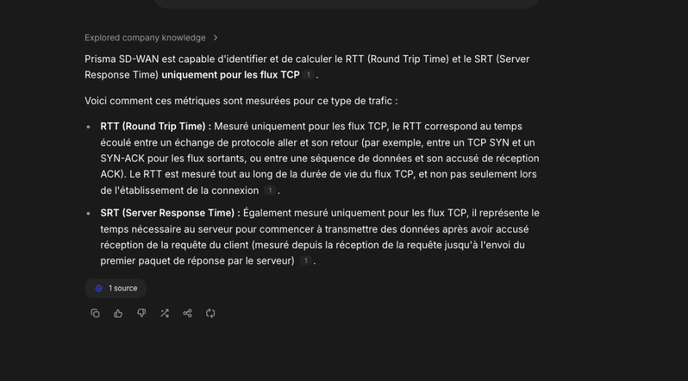
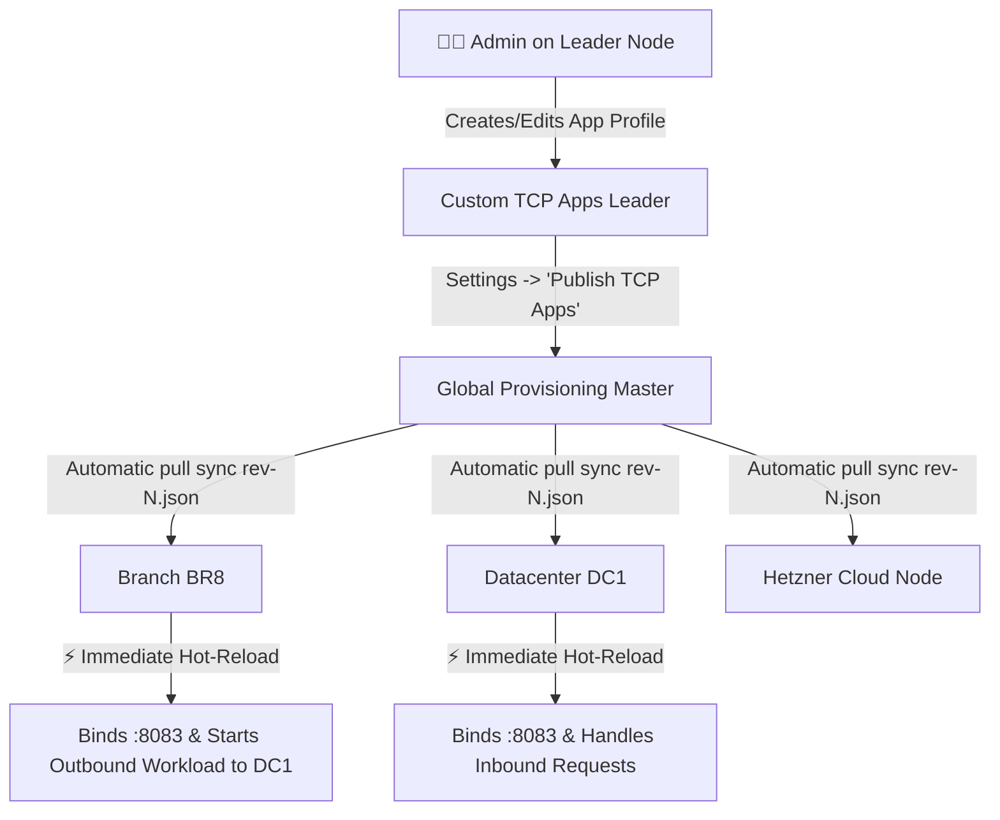
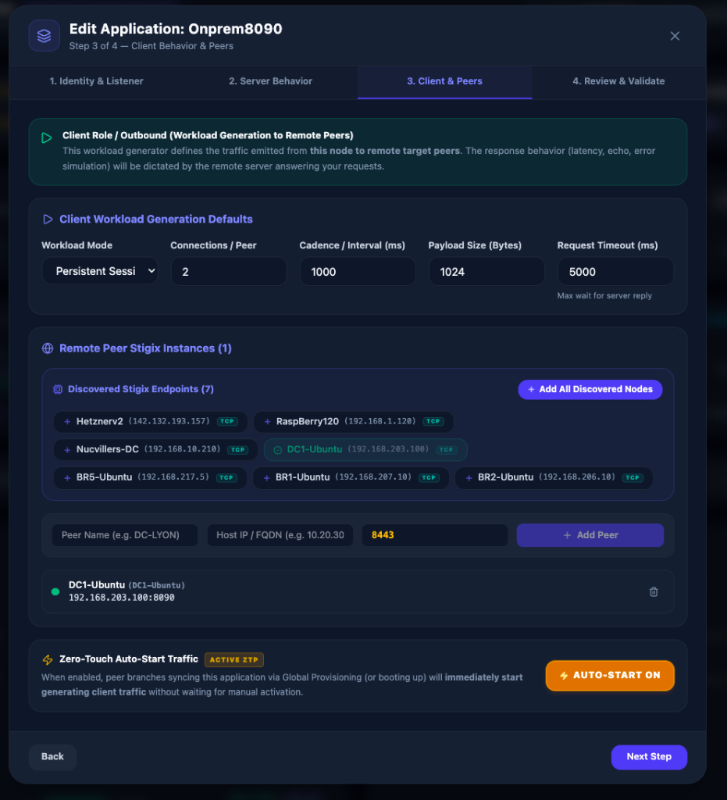
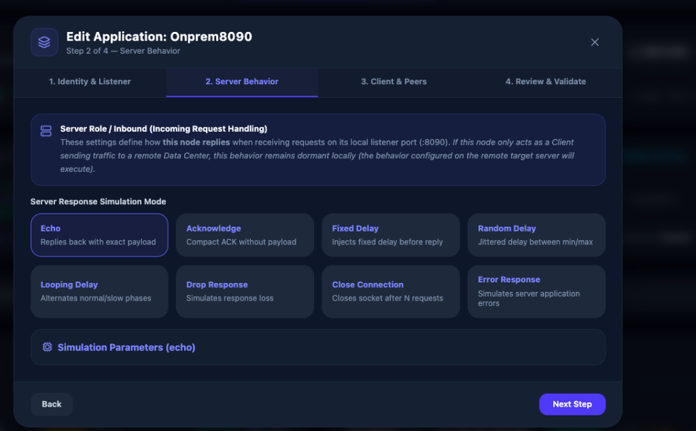
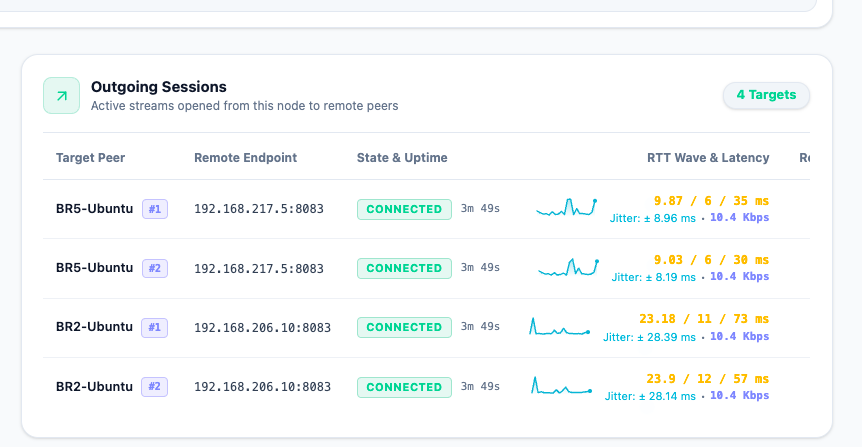

# 📖 User Guide — Stigix Custom TCP Applications
## *East-West Enterprise Traffic Simulation & SD-WAN Chaos Injection*

---

## 📑 Table of Contents
1. [Why Custom TCP Applications? (iPerf vs Real Apps)](#1-why-custom-tcp-applications-iperf-vs-real-apps)
2. [Core Concepts & Dual-Role Architecture](#2-core-concepts--dual-role-architecture)
3. [Network Deployment Blueprints](#3-network-deployment-blueprints)
4. [Step-by-Step Guide: Creating an Application](#4-step-by-step-guide-creating-an-application)
   - [Step 1: Identity & Wire Protocol](#step-1-identity--host-listening-port-server)
   - [Step 2: Server Behaviors & Chaos Injection](#step-2-server-behaviors--chaos-injection)
   - [Step 3: Client Workload & Target Peers](#step-3-client-workload-generation--peers)
   - [Step 4: Port Review & Validation](#step-4-port-review--validation)
5. [Centralized Deployment via Global Provisioning](#5-centralized-deployment-via-global-provisioning)
6. [Dashboard Monitoring & Health Score (0-100)](#6-dashboard-monitoring--health-score-0-100)
7. [Deep Dive: Layer 4 TCP vs Layer 7 HTTP & SD-WAN SRT Mechanics](#7-deep-dive-layer-4-tcp-vs-layer-7-http--sd-wan-srt-mechanics)
8. [7 Ready-to-Use Recipes (Real-World Use Cases)](#8-7-ready-to-use-recipes-real-world-use-cases)
   - [Recipe 1: Transactional ERP (SAP / Oracle)](#recipe-1-transactional-erp-sap--oracle-port-8443)
   - [Recipe 2: Retail POS Checkout Terminals](#recipe-2-retail-pos-checkout-terminals-port-9100)
   - [Recipe 3: Database Replication](#recipe-3-database-replication-port-5432)
   - [Recipe 4: SD-WAN SLA Failover by Degradation (Chaos Looping)](#recipe-4-sd-wan-sla-failover-by-degradation-chaos-looping-port-8083)
   - [Recipe 5: Industrial Telemetry / SCADA (Lightweight Heartbeat)](#recipe-5-industrial-telemetry--scada-port-8883)
   - [Recipe 6: L7 Web API & SD-WAN SRT Degradation Simulation (Prisma SD-WAN Flow Browser)](#recipe-6-l7-web-api--sd-wan-srt-degradation-simulation-port-8095)
   - [Recipe 7: Next-Gen Firewall / SASE EICAR Antivirus Block Test](#recipe-7-next-gen-firewall--sase-eicar-antivirus-block-test-port-8096)
9. [Command-Line Control (`stigix-cli`)](#9-command-line-control-stigix-cli)
10. [FAQ & Troubleshooting](#10-faq--troubleshooting)

---

## 1. Why Custom TCP Applications? (iPerf vs Real Apps)

In corporate enterprise networks, traditional network testing tools (like **iPerf** or raw **HTTP GET** loops) do not accurately reflect real application traffic dynamics:
* **iPerf** generates a continuous, unidirectional saturation flood to measure maximum raw link throughput.
* **Ping / ICMP** measures Layer 3 IP latency, but completely ignores Layer 7 application socket behavior, TCP handshakes, and response processing.

Real enterprise applications (**SAP, Oracle ERP, POS checkout systems, CRM, Core Banking messaging, SCADA PLC controllers**) work fundamentally differently:
1. They establish **long-lived, persistent TCP connections** traversing SD-WAN tunnels (IPsec, MPLS, Direct Internet).
2. They exchange discrete **Request/Reply transactions** with pacing intervals and variable payload sizes.
3. They experience **server-side application delays** (database compute time, heavy queries, socket stalls) that directly drive dynamic SD-WAN routing decisions.

> **The Stigix Custom TCP Apps module** lets you build faithful digital replicas of line-of-business applications, measure user-perceived $p50/p95$ latency in real time, and inject controlled chaos (delays, errors, packet drops) to evaluate how your SD-WAN controller triggers path failovers!

---

## 2. Core Concepts & Dual-Role Architecture

Every Stigix instance (deployed in a Data Center, Hetzner Cloud, or on a Branch Raspberry Pi / VM) operates as **both a Server and a Client**:

```
  ┌─────────────────────────────────────────────────────────────────────────────┐
  │                           STIGIX NODE (e.g. BR8)                            │
  │                                                                             │
  │  ┌─────────────────────────┐                   ┌─────────────────────────┐  │
  │  │   SERVER (LISTENER)     │                   │   CLIENT (WORKLOAD GEN) │  │
  │  │ Listens on port :8083   │                   │ Opens TCP streams to    │  │
  │  │ Applies Chaos Behavior  │                   │ remote sites (e.g. DC1) │  │
  │  │ (Echo, Delays, Drops)   │                   │ Measures RTT & SLA      │  │
  │  └────────────▲────────────┘                   └────────────┬────────────┘  │
  └───────────────┼─────────────────────────────────────────────┼───────────────┘
                  │ Inbound Traffic                             │ Outbound Traffic
                  │                                             ▼
       ┌──────────┴──────────┐                       ┌─────────────────────┐
       │     OTHER SITES     │                       │     OTHER SITES     │
       │ (Raspi4, Hetzner...)│                       │    (DC1, DC2...)    │
       └─────────────────────┘                       └─────────────────────┘
```

* **Server Role (Listener)**: Binds to a dedicated host TCP port (e.g., `:8083`) and responds to incoming requests according to its configured response behavior mode.
* **Client Role (Workload Generator)**: Emits structured frames toward remote target peers at designated intervals, continuously calculating performance metrics (RTT min, avg, $p50$, $p95$, max, reconnects).
* **Reliable Binary Framing**: All frame exchanges use a 4-byte Big-Endian length prefix (`UInt32BE`), guaranteeing that messages are never corrupted by IP MTU fragmentation across SD-WAN tunnels.

> 💡 **Golden Rule: Who Executes What?**
> * **On a Client-Only Node (e.g., Branch / Spoke)**: The client only executes its **Client Defaults** and targets its **Peers**. The local `Server Behavior` configured on the branch remains dormant unless another node connects to it.
> * **On the Server Node (e.g., Data Center / Hub)**: The `Server Behavior` configured on that remote server executes to reply to branch requests (e.g., it is the DC that injects simulated DB processing time or error responses).
> * **State Persistence**: Listener and Client workload running states are automatically preserved across reboots via the **Settings → State Persistence** switch (`auto_restart_custom_tcp`).

---

## 3. Network Deployment Blueprints

Depending on your test objectives and network topology, you can deploy applications using 3 standard patterns:

### 🏢 Blueprint A: Hub-and-Spoke (Branches $\rightarrow$ Central Data Center) — *Most Common*
* **Use Case**: Simulating 10 branch offices or retail stores continuously querying a centralized ERP database at the Data Center.
* **Setup**:
  * In the application profile, add **only the DC endpoint (`DC1 [192.168.203.100]`)** to the Peers list.
  * Publish the profile via **Global Provisioning**.
  * **Result**: All branch nodes open outbound client streams to `DC1:8083`. The DC node listens and replies with the configured server behavior. *(Stigix automatically filters its own IP address so `DC1` does not connect to itself).*

### 🌐 Blueprint B: Full-Mesh (All-to-All Interconnection)
* **Use Case**: Simulating distributed peer-to-peer traffic between all sites (e.g., VoIP, video conferencing, database replication clusters).
* **Setup**:
  * Click **`⚡ Add All Discovered Nodes`** to include all network sites (`DC1`, `BR8`, `Raspi4`, `Hetzner`).
  * Every site will maintain active TCP sessions toward all other network peers.

### 👂 Blueprint C: Server Only (Passive Listener)
* **Use Case**: Hosting a passive test listener ready to receive connections from external scripts, 3rd-party clients, or load generators.
* **Setup**:
  * Leave the **Peers list empty**. The application will strictly operate as an incoming TCP listener.

---

## 4. Step-by-Step Guide: Creating an Application

To create an application, open the **Custom Apps** page in the Stigix dashboard and click the purple **`+ New App`** button (or navigate to *Settings $\rightarrow$ Custom TCP Apps*).

An interactive 4-step wizard will guide you:

---

### Step 1: Identity & Host Listening Port (Server)

| Field | Description | Example |
| :--- | :--- | :--- |
| **Application Name** | Human-readable name for your business service. | `ERP-Production`, `Retail-POS-Checkout` |
| **Application ID** | Unique system identifier (auto-generated from name). | `erp-prod`, `pos-checkout` |
| **Wire Protocol** | Transport framing format: **`Stigix Native TCP`** (L4) or **`HTTP/1.1 REST API`** (L7). | `http_1_1` (for SD-WAN SRT & NGFW) |
| **TCP Port (Host)** | TCP port on which the Stigix host listener binds *(1024 - 65535)*. | `8443`, `8083`, `9100`, `5432`, `8095` |
| **Bind Address** | Local listening IP address (`0.0.0.0` to listen on all interfaces). | `0.0.0.0` |
| **Max Connections** | Maximum concurrent client TCP sessions accepted. | `100` |
| **Idle Timeout (ms)** | Inactivity timeout before closing idle sockets (0 = disabled). | `60000` (60 sec) |
| **Allowed CIDRs (Optional)** | IPv4 subnet allowlist restricting allowed client IP addresses. | `192.168.0.0/16, 10.0.0.0/8` |
| **Pre-shared Auth Token** | Secret token for secure inter-site validation. | *(Leave empty or specify secret)* |

#### 🌐 Choosing the Wire Protocol:
* **⚡ `Stigix Native TCP (L4 Binary)`**: Ultra-compact 4-byte length-prefixed binary framing. Zero HTTP overhead. Best for pure underlay bandwidth, transport stress, and millisecond failover testing.
* **🌐 `HTTP/1.1 REST API (L7 Native & SRT)`**: Standard HTTP/1.1 Request/Response format with `X-Stigix-*` telemetry headers. **Required if you want SD-WAN appliances (Prisma SD-WAN Flow Browser, ADEM, ThousandEyes) to calculate Server Response Time (SRT)** or NGFWs to inspect payloads.

---

### Step 2: Server Behaviors & Chaos Injection

This step defines **how the server replies** when receiving client requests. Stigix includes **9 realistic simulation modes**:

```
                                  SERVER RESPONSE MODES
  ┌─────────────────┬─────────────────────────────────────────────────────────────────────────────┐
  │ Mode            │ Description & Real-World Use Case                                           │
  ├─────────────────┼─────────────────────────────────────────────────────────────────────────────┤
  │ 🔁 Echo         │ Immediately mirrors back the request payload without added delay.           │
  │ ⚡ Acknowledge   │ Replies with a minimal application ACK frame (12 bytes, zero payload).      │
  │ ⏱️ Fixed Delay   │ Injects a constant server processing latency (e.g. 200 ms).                 │
  │ 🎲 Random Delay  │ Injects a jittered delay between Min and Max thresholds (e.g. 50–300 ms).   │
  │ 🔄 Looping Delay │ Cycles periodically between normal latency (10ms) and slow phase (1500ms).  │
  │ 🕳️ Drop Response │ Receives request but sends no reply (simulates application timeout/freeze). │
  │ 💥 Close Conn    │ Abruptly resets/closes socket after N requests (simulates server crash).    │
  │ ❌ Error Resp    │ Replies with an application error frame (e.g. `DB_CONNECTION_LOST`).        │
  │ 🛡️ EICAR Test    │ Returns standard EICAR anti-malware string to test NGFW / AV interception.  │
  └─────────────────┴─────────────────────────────────────────────────────────────────────────────┘
```

> 💡 **SD-WAN Tip**: The **`Looping Delay`** mode is ideal for verifying SLA-based dynamic routing policies: configure 60 seconds of normal phase (10 ms latency) followed by 60 seconds of degraded phase (1500 ms latency) and observe your SD-WAN router switch paths seamlessly!
>
> 💡 **Prisma SD-WAN Tip**: Combine **`HTTP/1.1 REST API`** with **`Fixed Delay`** (e.g. 800 ms) to observe Prisma SD-WAN Flow Browser immediately record **`SRT: ~800 ms`** while keeping **`RTT: ~8 ms`**!

*Interactive Server Behaviors and Chaos Configuration Wizard:*


---

### Step 3: Client Workload Generation & Peers

This section configures **how the client generates outgoing traffic** toward other nodes:

#### 1. Workload Generator Settings:
* **Workload Mode**:
  * `Persistent Request Reply`: Keeps connection open and transmits requests at regular intervals (e.g., every 1000 ms).
  * `Transactional`: Opens TCP connection $\rightarrow$ sends transaction $\rightarrow$ cleanly closes connection.
  * `Heartbeat`: Lightweight keepalive probes every 5 to 30 seconds to monitor path liveness.
  * `Bulk Burst`: High-density bursts of requests (e.g., 50 requests in rapid succession) followed by idle pause.
  * `Continuous Stream`: Continuous high-rate data transfer.
* **Connections per Peer**: Number of parallel TCP streams per target site (e.g., `1` for basic traffic, `2` or `4` to simulate multiple concurrent users).
* **Payload Size (Bytes)**: Data size per request (e.g., `512` bytes for text commands, `65536` for heavy database blocks).
* **Interval (ms)**: Pacing delay between requests (e.g., `1000` ms = 1 transaction/second).

#### 2. Peer Selection (1-Click Discovered Nodes):
Above the peer table, the **"Discovered Stigix Endpoints"** toolbar displays all detected network instances:
* Click **`[+ DC1 (192.168.203.100)]`** to instantly add an endpoint.
* Click **`⚡ Add All Discovered Nodes`** to add all detected branch and DC nodes in one click!
* Target destination port automatically syncs with the application port (`:8083`).

---

### Step 4: Port Review & Validation

Before saving:
* Click **`Test Port Availability`**: Stigix validates on the underlying Linux host that the selected TCP port is not already occupied by another process.
* Click **`Create Application`** (or *Save Changes*).

---

## 5. Centralized Deployment via Global Provisioning

You don't need to manually configure each site! With **Global Provisioning (Bundle #8 `custom-tcp-apps`)**, all configuration is distributed centrally from the Leader node:



### How to Publish in 2 Clicks:
1. On the Stigix Leader, create or update your applications in **Custom Apps**.
2. Go to **Settings $\rightarrow$ Global Provisioning**.
3. Locate the **"Custom TCP Apps"** card with the yellow **`⚠️ Pending`** badge.
4. Click **`Publish TCP Apps`** (or via CLI: `stigix-cli --exec "provision publish custom-tcp-apps"`).
5. **Done!** Within seconds, all branch and DC nodes hot-apply the updated profiles without restarting containers or interrupting other services.

---

## 6. Dashboard Monitoring & Health Score (0-100)

The main **Custom Apps** screen provides comprehensive real-time visibility:

### 1. Multi-App Matrix Toolbar
If multiple application profiles exist (e.g., `ERP :8123`, `OnPremAPP :8083`, `POS :8084`), the top bar lets you switch between profiles in 1 click, showing live indicators (`🟢 Listener Active`, `TX Client Workload`).

### 2. Global Health & Experience Score (0 to 100)
The **0–100 score** synthesizes overall application health into a single operational indicator:

$$\text{Score} = \text{Listener Active}(25\text{ pts}) + \text{Sessions Established}(35\text{ pts}) + \text{Success Rate}(25\text{ pts}) + \text{Latency SLA}(15\text{ pts})$$

* 🟢 **90 - 100 [OPTIMAL]**: Port open, 100% streams healthy, excellent RTT ($<50$ ms).
* 🟢 **75 - 89 [HEALTHY]**: Nominal operation, low latency.
* 🟡 **50 - 74 [DEGRADED]**: Elevated latency ($>150$ ms), simulated degradation, or partial reconnects.
* 🔴 **0 - 49 [CRITICAL]**: **`🔴 25/100 CRITICAL (Outbound Peers Unreachable)`** — Immediately detects if target peer is down, unreachable, or port is blocked by firewall.
* *Hovering over the badge displays a breakdown explaining the score factors.*

### 3. Inbound & Outbound Session Tables
* **Incoming Client Sessions**: Displays all clients connected to the local listener. Compares **Declared Site ID** vs **Underlying TCP Remote IP** (helpful to verify IPsec tunnel routing vs NAT).
* **Outgoing Client Workload**: Lists active connections to remote peers. If `connectionsPerPeer: 2`, streams are identified as **`DC1 (Stream #1)`** and **`DC1 (Stream #2)`**. The lightning button **`⚡`** triggers a 1-shot handshake test.

*Live Operational Dashboard showing real-time latency percentiles (p50/p95), multi-app profiles, and Health Score:*


*Incoming and Outgoing Session Tables with live RTT sparklines, site correlation, and instant diagnostic trigger:*


---

---

## 7. Deep Dive: Layer 4 TCP vs Layer 7 HTTP & SD-WAN SRT Mechanics

A common point of confusion for network engineers testing with SD-WAN appliances (e.g., **Palo Alto Networks Prisma SD-WAN / CloudGenix**, ThousandEyes, Cisco Catalyst SD-WAN) is why server-side delay is not always visible as **SRT (Server Response Time)**.

### 🧠 Why SD-WAN Engines Cannot Measure SRT on Raw TCP (L4)
When a client sends data over a raw TCP stream, the server host's Linux kernel TCP stack immediately acknowledges the packet with a `TCP ACK (Len=0)` within **< 1–2 ms**.

```text
1. Client -> Server  [PSH, ACK] (Payload 1 KB)   --> Client sends request
2. Server -> Client  [ACK]      (Len=0)          --> Server OS kernel ACKs immediately (< 2 ms)
                                                     (SD-WAN router measures RTT ~ 10 ms)
   ... ⏳ Server application processing for 800 ms ...
3. Server -> Client  [PSH, ACK] (Payload 2 KB)   --> Server application returns response
```

* **The Problem**: At Layer 4, TCP is an opaque, bidirectional byte stream. Without knowing the application protocol, the SD-WAN router **cannot know whether packet #3 is a response to packet #1, an unsolicited server push, or part of a continuous streaming flow**.
* Therefore, in raw TCP mode, the SD-WAN router only measures **Network RTT** (the round-trip time of the kernel TCP ACK) and cannot populate the **SRT** metric.

### 🌐 How `HTTP/1.1 REST API` Solves This for SD-WAN & DEM
When you select **`HTTP/1.1 REST API`** in Step 1 of the Stigix Wizard:
1. **L7 Transaction Boundaries**: The client emits standard `POST /api/stigix/v2/custom-app HTTP/1.1` and the server replies with `HTTP/1.1 200 OK`.
2. **App-ID Inspection**: The SD-WAN engine (Prisma SD-WAN Flow Browser) recognizes the HTTP transaction boundaries:
   $$\text{SRT} = (\text{Time of HTTP 200 OK}) - (\text{Time of HTTP Request}) - \text{Network RTT} \approx \mathbf{800\text{ ms}}$$
3. **Identity Preservation**: Stigix injects `X-Stigix-Site-Name`, `X-Stigix-Instance-Id`, and `X-Stigix-App-Id` headers into every HTTP request, preserving 100% of the mesh telemetry and topology mapping.

---

## 8. 7 Ready-to-Use Recipes (Real-World Use Cases)

Here are standard configuration blueprints you can directly apply:

### Recipe 1: Transactional ERP (SAP / Oracle) — Port :8443
* **Objective**: Simulate enterprise users performing ERP transactions with a 150 ms server processing delay.
* **Configuration**:
  * **Wire Protocol**: `stigix_tcp`
  * **Port**: `8443`
  * **Server Behavior**: `fixed_delay` with `fixedDelayMs: 150`
  * **Client Mode**: `persistent_request_reply`
  * **Interval**: `1000 ms` (1 req/sec) | **Payload**: `1024 bytes`
  * **Peers**: `DC1`

### Recipe 2: Retail POS Checkout Terminals — Port :9100
* **Objective**: Simulate cash registers opening a new connection for each credit card transaction.
* **Configuration**:
  * **Wire Protocol**: `stigix_tcp`
  * **Port**: `9100`
  * **Server Behavior**: `acknowledge` (fast ACK response)
  * **Client Mode**: `transactional` (Open TCP $\rightarrow$ 1 transaction $\rightarrow$ Close TCP)
  * **Interval**: `2000 ms` | **Payload**: `256 bytes`
  * **Peers**: `DC1`

### Recipe 3: Database Replication — Port :5432
* **Objective**: Simulate high-throughput data replication between two data centers.
* **Configuration**:
  * **Wire Protocol**: `stigix_tcp`
  * **Port**: `5432`
  * **Server Behavior**: `echo`
  * **Client Mode**: `continuous_stream`
  * **Connections per Peer**: `4` (4 parallel streams)
  * **Payload**: `65536 bytes` (64 KB chunks)
  * **Peers**: `DC2`

### Recipe 4: SD-WAN SLA Failover by Degradation (Chaos Looping) — Port :8083
* **Objective**: Verify that your SD-WAN gateway fails over to backup LTE/5G or MPLS when the primary link experiences application degradation.
* **Configuration**:
  * **Wire Protocol**: `stigix_tcp`
  * **Port**: `8083`
  * **Server Behavior**: `looping_delay`
    * *Normal phase*: `60 seconds` (normal latency: 5 ms)
    * *Slow phase*: `60 seconds` (injected degradation: `1200 ms`)
  * **Client Mode**: `persistent_request_reply` | **Interval**: `500 ms`
  * **Peers**: `DC1`

### Recipe 5: Industrial Telemetry / SCADA — Port :8883
* **Objective**: Simulate IoT sensors or industrial PLCs sending periodic health keepalives.
* **Configuration**:
  * **Wire Protocol**: `stigix_tcp`
  * **Port**: `8883`
  * **Server Behavior**: `acknowledge`
  * **Client Mode**: `heartbeat`
  * **Interval**: `5000 ms` (every 5 seconds) | **Payload**: `64 bytes`
  * **Peers**: All network nodes (`Add All Discovered`)

### Recipe 6: L7 Web API & SD-WAN SRT Degradation Simulation — Port :8095
* **Objective**: Populate **Server Response Time (SRT)** in Prisma SD-WAN Flow Browser / ADEM and test application-level SLA routing policies.
* **Configuration**:
  * **Wire Protocol**: `http_1_1` (HTTP/1.1 REST API)
  * **Port**: `8095`
  * **Server Behavior**: `fixed_delay` (`800 ms`) or `looping_delay`
  * **Client Mode**: `persistent_request_reply` | **Interval**: `1000 ms`
  * **Peers**: `DC1` (`192.168.203.100:8095`)
* **Expected Result in Prisma SD-WAN**:
  * `SRT: ~800 ms` (Server Response Time)
  * `RTT: ~10 ms` (Transport Round-Trip Time)

*Prisma SD-WAN Integration Modal — 1-click Application Definitions synchronization with Prisma tenant:*


### Recipe 7: Next-Gen Firewall / SASE EICAR Antivirus Block Test — Port :8096
* **Objective**: Validate that Next-Gen Firewalls (Palo Alto Networks Antivirus / WildFire, Prisma Access) inspect inline traffic, block the malware payload, and trigger security threat logs.
* **Configuration**:
  * **Wire Protocol**: `http_1_1`
  * **Port**: `8096`
  * **Server Behavior**: `eicar_response` (EICAR Security Anti-Malware Test)
  * **Client Mode**: `persistent_request_reply` | **Interval**: `2000 ms`
  * **Peers**: `DC1`
* **Expected Result**:
  * The firewall detects the EICAR signature in the HTTP body, resets the TCP connection (`ECONNRESET`), and logs a **Threat / Virus** event in the security management console.

---

## 9. Command-Line Control (`stigix-cli`)

All dashboard actions can be automated via the Stigix CLI:

```bash
# 1. List configured applications and their operational status
stigix-cli --exec "tcp-app list"

# 2. Display real-time status and Health Score for an application
stigix-cli --exec "tcp-app status onprem-8083"

# 3. Start or stop the server listener
stigix-cli --exec "tcp-app start-listener onprem-8083"
stigix-cli --exec "tcp-app stop-listener onprem-8083"

# 4. Start or stop client workload generation
stigix-cli --exec "tcp-app start-client onprem-8083"
stigix-cli --exec "tcp-app stop-client onprem-8083"

# 5. Run a 1-shot handshake test toward a remote peer
stigix-cli --exec "tcp-app test onprem-8083 dc1"

# 6. Display incoming and outgoing active sessions
stigix-cli --exec "tcp-app sessions onprem-8083"

# 7. Publish configuration changes to all nodes via Global Provisioning
stigix-cli --exec "provision publish custom-tcp-apps"
```

---

## 10. FAQ & Troubleshooting

### Q: Why do I see low RTT in Prisma SD-WAN Flow Browser when using raw TCP with simulated delay?
* As explained in [Section 7](#7-deep-dive-layer-4-tcp-vs-layer-7-http--sd-wan-srt-mechanics), SD-WAN appliances measure kernel TCP ACKs (RTT) and cannot compute **SRT** without Layer 7 transaction framing. Switch the application's **Wire Protocol** to **`HTTP/1.1 REST API`** in Step 1 of the wizard.

### Q: Outgoing sessions show `RECONNECTING` in a loop with a `25/100 CRITICAL` score. Why?
1. **Is the remote server listening?** Check that on the target node (`DC1`), the application listener is running on the matching port (e.g. `:8095`).
2. **Did you configure the correct peer port?** Ensure the Target Peer port in Step 3 matches the destination application's listener port (not `:8443` if the app runs on `:8095`).
3. **Is the firewall or router blocking the port?** Ensure security rules on your firewall / VyOS router allow TCP traffic on that port.
4. **Is the SD-WAN tunnel up?** Check the *Topology* or *Failover* tabs to confirm IP reachability to `192.168.203.100`.
5. **Diagnostic Test**: Click the lightning bolt **`⚡`** icon on the session row to inspect the system error code (`ECONNREFUSED`, `ETIMEDOUT`, or `HANDSHAKE_TIMEOUT`).

### Q: Why does port `:8083` fail to start (*EADDRINUSE*)?
* Another service or another application profile on the host is already using that port. Change the port number (e.g. `:8084`, `:8095`, `:8123`) in Step 1 of the wizard.

### Q: Do offline branches receive configuration updates once they reconnect?
* **Yes!** As soon as a branch reconnects to the Leader, it compares its local revision against the latest published revision (`rev-N.json`) and automatically synchronizes with zero manual intervention.

---

*Official Stigix Documentation — Version 2.0*
