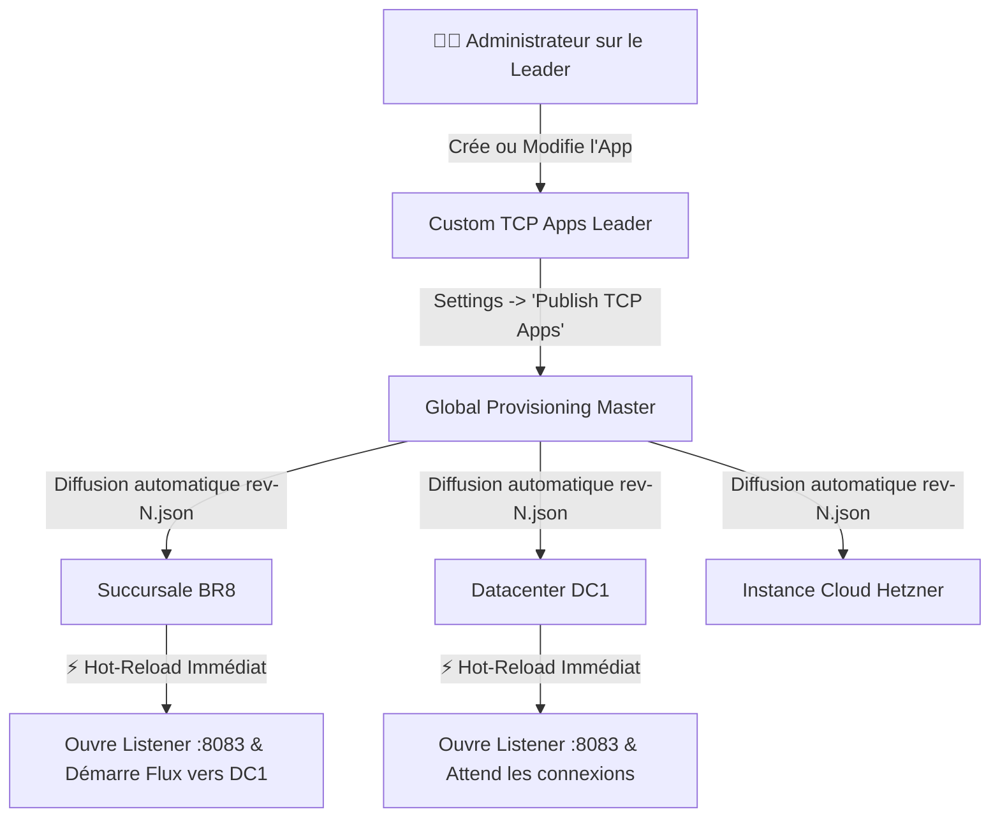

# 📖 Guide Utilisateur — Stigix Custom TCP Applications
## *Simulateur de Trafic Applicatif Métier East-West & Injection de Chaos SD-WAN*

---

## 📑 Sommaire
1. [Pourquoi ce module ? (iPerf vs Vraies Applications)](#1-pourquoi-ce-module--iperf-vs-vraies-applications)
2. [Concepts Fondamentaux & Architecture Duale](#2-concepts-fondamentaux--architecture-duale)
3. [Les 3 Schémas de Déploiement Réseau](#3-les-3-schémas-de-déploiement-réseau)
4. [Guide Pas-à-Pas : Créer une Application](#4-guide-pas-à-pas--créer-une-application)
   - [Étape 1 : Identité & Port d'Écoute](#étape-1--identité--port-découte-serveur)
   - [Étape 2 : Comportements Serveur & Chaos](#étape-2--comportements-serveur--simulation-de-chaos)
   - [Étape 3 : Flux Client & Sélection des Peers](#étape-3--génération-de-charge-client--peers)
   - [Étape 4 : Validation & Test](#étape-4--revue--test-de-port)
5. [Déploiement Centralisé (Global Provisioning)](#5-déploiement-centralisé-via-global-provisioning)
6. [Comprendre le Dashboard & le Score de Santé (0-100)](#6-comprendre-le-dashboard--le-score-de-santé-0-100)
7. [5 Recettes Prêtes à l'Emploi (Cas d'Usage Réels)](#7-5-recettes-prêtes-à-lemploi-cas-dusage-réels)
   - [Recette 1 : ERP Transactionnel (SAP / Oracle)](#recette-1--erp-transactionnel-sap--oracle-port-8443)
   - [Recette 2 : TPE & Caisses de Magasin (POS Retail)](#recette-2--tpe--caisses-de-magasin-pos-retail-port-9100)
   - [Recette 3 : Réplication de Base de Données (PostgreSQL / MySQL)](#recette-3--réplication-de-base-de-données-port-5432)
   - [Recette 4 : Test de Bascule SD-WAN par Dégradation (Chaos Looping)](#recette-4--test-de-bascule-sd-wan-par-dégradation-chaos-looping-port-8083)
   - [Recette 5 : Télémétrie Industrielle / SCADA (Heartbeat Léger)](#recette-5--télémétrie-industrielle--scada-port-8883)
8. [Pilotage en Ligne de Commande (`stigix-cli`)](#8-pilotage-en-ligne-de-commande-stigix-cli)
9. [FAQ & Dépannage (Troubleshooting)](#9-faq--dépannage-troubleshooting)

---

## 1. Pourquoi ce module ? (iPerf vs Vraies Applications)

Dans un réseau d'entreprise, les outils traditionnels de test réseau (comme **iPerf** ou les boucles **HTTP GET**) ne reflètent pas la réalité du trafic applicatif :
* **iPerf** génère un flux saturant continu unidirectionnel pour mesurer la bande passante maximale brute.
* **Le Ping / ICMP** mesure la latence réseau couche 3, mais ignore le comportement des sockets TCP applicatives.

Les véritables logiciels métier (**SAP, Oracle, logiciels de caisse, CRM, applications bancaires, automates SCADA**) fonctionnent très différemment :
1. Ils établissent des **connexions TCP persistantes de longue durée** à travers les tunnels SD-WAN (IPsec / MPLS / Direct Internet).
2. Ils échangent des **transactions Requête/Réponse** avec des intervalles réguliers.
3. Ils subissent des **lenteurs applicatives serveur** (temps de calcul DB, requêtes lourdes) qui influencent les décisions de routage dynamique SD-WAN.

> **Le module Stigix Custom TCP Apps** vous permet de créer en quelques clics des répliques fidèles de vos applications métier, de mesurer en temps réel la latence $p50/p95$ perçue par l'utilisateur, et d'injecter des pannes ou des lenteurs pour observer comment votre contrôleur SD-WAN réagit !

---

## 2. Concepts Fondamentaux & Architecture Duale

Chaque instance Stigix (qu'elle soit déployée dans un Datacenter, en Cloud Hetzner ou sur une Raspberry Pi / VM en succursale) est **simultanément Serveur et Client** :

```
  ┌─────────────────────────────────────────────────────────────────────────────┐
  │                           INSTANCE STIGIX (ex: BR8)                         │
  │                                                                             │
  │  ┌─────────────────────────┐                   ┌─────────────────────────┐  │
  │  │   SERVEUR (LISTENER)    │                   │   CLIENT (GÉNÉRATEUR)   │  │
  │  │ Écoute sur le port :8083│                   │ Ouvre des flux vers     │  │
  │  │ Applique le mode Chaos  │                   │ les autres sites (DC1)  │  │
  │  │ (Echo, Délais, Pertes)  │                   │ Mesure le RTT et le SLA │  │
  │  └────────────▲────────────┘                   └────────────┬────────────┘  │
  └───────────────┼─────────────────────────────────────────────┼───────────────┘
                  │ Flux Entrants (Inbound)                     │ Flux Sortants (Outbound)
                  │                                             ▼
       ┌──────────┴──────────┐                       ┌─────────────────────┐
       │     AUTRES SITES    │                       │     AUTRES SITES    │
       │ (Raspi4, Hetzner...)│                       │    (DC1, DC2...)    │
       └─────────────────────┘                       └─────────────────────┘
```

* **Le Serveur (Listener)** : Ouvre un port TCP dédié sur la machine hôte (ex: `:8083`) et répond aux requêtes entrantes selon le profil comportemental choisi.
* **Le Client (Workload Generator)** : Émet des paquets vers les cibles configurées (Peers) à intervalle régulier et calcule les statistiques de performance (RTT minimum, moyen, $p50$, $p95$, maximum, reconnexions).
* **Protocole Binaire Fiable** : Tous les échanges utilisent un préfixe binaire 4-octets (`UInt32BE`) garantissant qu'aucune trame n'est corrompue par la fragmentation des paquets IP sur les tunnels SD-WAN.

> 💡 **Règle d'or : Qui exécute quoi ?**
> * **Sur un nœud purement Client (ex: Agence / Branch)** : Le client n'utilise que la section **Client Defaults** et la liste des **Peers**. Le `Server Behavior` configuré sur l'agence reste dormant tant qu'aucun autre nœud ne se connecte à elle.
> * **Sur le nœud Serveur (ex: Data Center / Hub)** : C'est le `Server Behavior` configuré sur ce serveur distant qui s'exécute pour répondre aux requêtes de l'agence (ex: c'est le DC qui injecte la latence ou les erreurs de base de données).

---

## 3. Les 3 Schémas de Déploiement Réseau

Selon votre topologie et votre objectif de test, vous pouvez déployer une application selon 3 schémas :

### 🏢 Schéma A : Hub-and-Spoke (Succursales $\rightarrow$ Datacenter Central) — *Le plus courant*
* **Cas d'usage** : Simuler 10 agences bancaires ou magasins qui interrogent en continu le serveur ERP ou la base de données située au Datacenter.
* **Configuration** :
  * Dans l'application, vous ajoutez **uniquement le serveur DC (`DC1 [192.168.203.100]`)** dans la liste des Peers.
  * Vous publiez la configuration via le **Global Provisioning**.
  * **Résultat** : Toutes les branches ouvrent leurs flux clients vers `DC1:8083`. Le DC écoute et répond avec les délais configurés. *(Stigix filtre automatiquement sa propre adresse IP pour que `DC1` ne se connecte pas à lui-même).*

### 🌐 Schéma B : Full-Mesh (Interconnexion Totale de tous les Sites)
* **Cas d'usage** : Simuler des échanges distribués entre tous les sites (ex: VoIP, visioconférence, réplication inter-sites).
* **Configuration** :
  * Cliquez sur **`⚡ Add All Discovered Nodes`** pour inclure tous les sites (`DC1`, `BR8`, `Raspi4`, `Hetzner`).
  * Chaque site testera et maintiendra des sessions TCP actives vers tous les autres sites de votre réseau.

### 👂 Schéma C : Server Only (Écoute Passive)
* **Cas d'usage** : Préparer un serveur d'écoute passif qui attend que des clients externes ou des scripts tiers viennent se connecter.
* **Configuration** :
  * Ne déclarez **aucun peer**. L'application démarre uniquement son socket d'écoute.

---

## 4. Guide Pas-à-Pas : Créer une Application

Pour créer une nouvelle application, rendez-vous dans l'onglet **Custom Apps** du menu Stigix et cliquez sur le bouton violet **`+ New App`** (ou dans *Settings $\rightarrow$ Custom TCP Apps*).

Un assistant interactif en 4 étapes s'affiche :

---

### Étape 1 : Identité & Port d'Écoute (Serveur)

| Champ | Description | Exemple |
| :--- | :--- | :--- |
| **Application Name** | Nom lisible de votre application métier. | `ERP-Production`, `Caisse-Magasin-POS` |
| **Application ID** | Identifiant technique unique (généré automatiquement). | `erp-prod`, `pos-checkout` |
| **TCP Port (Host)** | Port TCP sur lequel le serveur Stigix écoutera. *(Doit être entre 1024 et 65535)*. | `8443`, `8083`, `9100`, `5432` |
| **Bind Address** | Adresse IP locale d'écoute (`0.0.0.0` pour écouter sur toutes les interfaces). | `0.0.0.0` |
| **Max Connections** | Nombre maximal de sessions TCP clientes acceptées simultanément. | `100` |
| **Idle Timeout (ms)** | Délai d'inactivité avant fermeture automatique d'une socket (0 = infini). | `60000` (60 sec) |
| **Allowed CIDRs (Optionnel)** | Liste d'adresses ou sous-réseaux IPv4 autorisés à se connecter. | `192.168.0.0/16, 10.0.0.0/8` |
| **Pre-shared Auth Token** | Jeton secret pour sécuriser l'accès inter-sites. | *(Laisser vide ou saisir un token)* |

---

### Étape 2 : Comportements Serveur & Simulation de Chaos

C'est ici que vous définissez **comment le serveur réagit** lorsqu'il reçoit un message du client. Stigix propose **8 modes réalistes** :

```
                                  MODES COMPORTEMENTAUX SERVEUR
  ┌─────────────────┬─────────────────────────────────────────────────────────────────────────────┐
  │ Mode            │ Description & Utilisation                                                   │
  ├─────────────────┼─────────────────────────────────────────────────────────────────────────────┤
  │ 🔁 Echo         │ Renvoie immédiatement le contenu du paquet (mode miroir sans latence).      │
  │ ⚡ Acknowledge   │ Répond par un simple ACK applicatif ultra-léger (12 octets).                │
  │ ⏱️ Fixed Delay   │ Injecte un temps de traitement serveur fixe (ex: 200 ms).                   │
  │ 🎲 Random Delay  │ Injecte une latence variable aléatoire entre Min et Max (ex: 50 à 300 ms).  │
  │ 🔄 Looping Delay │ Alterne cycliquement entre phase normale (ex: 10ms) et phase lente (1500ms).│
  │ 🕳️ Drop Response │ Reçoit la requête mais ne répond pas (simule un timeout applicatif).        │
  │ 💥 Close Conn    │ Coupe brutalement la socket après N requêtes (simule un crash serveur).     │
  │ ❌ Error Resp    │ Renvoie une trame d'erreur applicative (ex: `DB_CONNECTION_LOST`).          │
  └─────────────────┴─────────────────────────────────────────────────────────────────────────────┘
```

> 💡 **Astuce SD-WAN** : Le mode **`Looping Delay`** est l'outil parfait pour tester les politiques de bascule SD-WAN basées sur le SLA applicatif : configurez 60 secondes en phase normale (latence 10 ms), puis 60 secondes en phase lente (latence 1500 ms) et observez votre routeur basculer le trafic automatiquement sur le lien de secours !

---

### Étape 3 : Génération de Charge Client & Peers

Cette section configure **comment le client émet son trafic** vers les autres sites :

#### 1. Paramètres du générateur client :
* **Workload Mode** :
  * `Persistent Request Reply` : Maintient la connexion ouverte et émet une requête à intervalle fixe (ex: toutes les 1000 ms).
  * `Transactional` : Ouvre la connexion TCP $\rightarrow$ envoie la transaction $\rightarrow$ ferme la connexion proprement.
  * `Heartbeat` : Pings légers toutes les 5 à 30 secondes pour surveiller la connectivité.
  * `Bulk Burst` : Envoie des rafales denses de paquets (ex: 50 requêtes d'un coup) puis attend.
  * `Continuous Stream` : Flux ininterrompu à haut débit.
* **Connections per Peer** : Nombre de sockets parallèles ouvertes vers chaque site (ex: `1` pour du trafic standard, `2` ou `4` pour simuler plusieurs utilisateurs).
* **Payload Size (Bytes)** : Taille des données applicatives (ex: `512` octets pour du texte, `65536` pour un fichier/DB).
* **Interval (ms)** : Délai entre deux requêtes (ex: `1000` ms = 1 transaction/seconde).

#### 2. Sélection des Peers Stigix (1-Click Discovered Nodes) :
Au-dessus du tableau des pairs, le bandeau **"Discovered Stigix Endpoints"** affiche toutes les machines découvertes automatiquement sur votre réseau :
* Cliquez sur **`[+ DC1 (192.168.203.100)]`** pour l'ajouter instantanément.
* Cliquez sur **`⚡ Add All Discovered Nodes`** pour ajouter l'ensemble des sites distants d'un coup !
* Le port de destination est automatiquement synchronisé avec le port de l'application (`:8083`).

---

### Étape 4 : Revue & Test de Port

Avant de sauvegarder :
* Cliquez sur **`Test Port Availability`** : Stigix vérifie immédiatement sur le système Linux que le port TCP choisi n'est pas déjà occupé par un autre processus.
* Cliquez sur **`Create Application`** (ou *Save Changes*).

---

## 5. Déploiement Centralisé via Global Provisioning

Vous n'avez pas besoin de reconfigurer chaque machine une par une ! Grâce au **Global Provisioning (8ème bundle `custom-tcp-apps`)**, tout se pilote depuis le Leader central :



### Comment publier en 2 clics :
1. Sur le Leader Stigix, créez ou modifiez vos applications dans **Custom Apps**.
2. Allez dans **Settings $\rightarrow$ Global Provisioning**.
3. Vous verrez la carte **"Custom TCP Apps"** avec un badge jaune clignotant **`⚠️ Pending`**.
4. Cliquez sur **`Publish TCP Apps`** (ou en CLI : `stigix-cli --exec "provision publish custom-tcp-apps"`).
5. **C'est tout !** En quelques secondes, toutes vos agences et datacenters appliquent la nouvelle configuration à chaud, sans interruption de service ni redémarrage de conteneur.

---

## 6. Comprendre le Dashboard & le Score de Santé (0-100)

L'écran principal **Custom Apps** vous donne une visibilité complète en temps réel :

### 1. La Bannière Multi-App Matrix
Si vous avez plusieurs applications (ex: `ERP :8123`, `OnPremAPP :8083`, `POS :8084`), la barre en haut vous permet de basculer instantanément d'une application à l'autre en 1 clic, tout en visualisant l'état de chaque serveur (`🟢 Écoute active`, `TX Trafic client`).

### 2. Le Score de Santé Applicatif Global (Health & Experience Score)
Le score de **0 à 100** synthétise en un seul indicateur la qualité réelle de votre application :

$$\text{Score} = \text{Serveur Actif}(25\text{ pts}) + \text{Sessions Établies}(35\text{ pts}) + \text{Taux de Réussite}(25\text{ pts}) + \text{SLA Latence}(15\text{ pts})$$

* 🟢 **90 - 100 [OPTIMAL]** : Port ouvert, 100% des flux connectés, RTT excellent ($<50$ ms).
* 🟢 **75 - 89 [HEALTHY]** : Fonctionnement nominal, faible latence.
* 🟡 **50 - 74 [DEGRADED]** : Latence élevée ($>150$ ms), dégradation simulée ou reconnexions partielles.
* 🔴 **0 - 49 [CRITICAL]** : **`🔴 25/100 CRITICAL (Outbound Peers Unreachable)`** — Détecte immédiatement si la cible distante ne répond pas (port fermé ou coupure tunnel SD-WAN).
* *Au survol du badge, une bulle d'aide détaille la raison exacte de la note.*

### 3. Les Tableaux de Sessions Entrantes et Sortantes
* **Incoming Client Sessions** : Affiche qui est connecté à votre serveur local. Vous pouvez comparer l'**IP déclarée par le site** avec l'**IP réelle de la socket TCP** (utile pour vérifier si le trafic passe bien dans le tunnel IPsec ou s'il subit du NAT).
* **Outgoing Client Workload** : Liste vos sessions vers les pairs distants. Si vous avez configuré `connectionsPerPeer: 2`, les flux sont identifiés par **`DC1 (Stream #1)`** et **`DC1 (Stream #2)`**. Le bouton éclair **`⚡`** permet de tester un handshake instantané unitaire.

---

## 7. 5 Recettes Prêtes à l'Emploi (Cas d'Usage Réels)

Voici des profils types que vous pouvez copier directement selon votre scénario :

### Recette 1 : ERP Transactionnel (SAP / Oracle) — Port :8443
* **Objectif** : Simuler des utilisateurs sur un progiciel de gestion avec un temps de réponse serveur de 150 ms.
* **Configuration** :
  * **Port** : `8443`
  * **Server Behavior** : `fixed_delay` avec `fixedDelayMs: 150`
  * **Client Mode** : `persistent_request_reply`
  * **Interval** : `1000 ms` (1 requête/seconde) | **Payload** : `1024 octets`
  * **Peers** : `DC1`

### Recette 2 : TPE & Caisses de Magasin (POS Retail) — Port :9100
* **Objectif** : Simuler des caisses enregistreuses qui ouvrent une nouvelle socket à chaque paiement par carte.
* **Configuration** :
  * **Port** : `9100`
  * **Server Behavior** : `acknowledge` (réponse ACK rapide)
  * **Client Mode** : `transactional` (Ouvre TCP $\rightarrow$ 1 transaction $\rightarrow$ Ferme TCP)
  * **Interval** : `2000 ms` | **Payload** : `256 octets`
  * **Peers** : `DC1`

### Recette 3 : Réplication de Base de Données — Port :5432
* **Objectif** : Simuler un flux de réplication lourd entre deux datacenters avec de gros volumes de données.
* **Configuration** :
  * **Port** : `5432`
  * **Server Behavior** : `echo`
  * **Client Mode** : `continuous_stream`
  * **Connections per Peer** : `4` (4 streams parallèles)
  * **Payload** : `65536 octets` (64 KB par bloc)
  * **Peers** : `DC2`

### Recette 4 : Test de Bascule SD-WAN par Dégradation (Chaos Looping) — Port :8083
* **Objectif** : Vérifier que votre passerelle SD-WAN bascule automatiquement sur la liaison 4G/5G ou MPLS dès que l'application principale ralentit.
* **Configuration** :
  * **Port** : `8083`
  * **Server Behavior** : `looping_delay`
    * *Phase normale* : `60 secondes` (latence normale : 5 ms)
    * *Phase lente* : `60 secondes` (latence lente injectée : `1200 ms`)
  * **Client Mode** : `persistent_request_reply` | **Interval** : `500 ms`
  * **Peers** : `DC1`

### Recette 5 : Télémétrie Industrielle / SCADA — Port :8883
* **Objectif** : Simuler des automates industriels ou capteurs IoT qui envoient un état régulier de santé.
* **Configuration** :
  * **Port** : `8883`
  * **Server Behavior** : `acknowledge`
  * **Client Mode** : `heartbeat`
  * **Interval** : `5000 ms` (toutes les 5 secondes) | **Payload** : `64 octets`
  * **Peers** : Tous les nœuds (`Add All Discovered`)

---

## 8. Pilotage en Ligne de Commande (`stigix-cli`)

Toutes les actions de l'interface graphique sont également pilotables en CLI pour vos scripts d'automatisation et pipelines CI/CD :

```bash
# 1. Lister les applications configurées et leur état
stigix-cli --exec "tcp-app list"

# 2. Afficher le statut temps réel et le Health Score d'une app
stigix-cli --exec "tcp-app status onprem-8083"

# 3. Démarrer ou arrêter le listener serveur
stigix-cli --exec "tcp-app start-listener onprem-8083"
stigix-cli --exec "tcp-app stop-listener onprem-8083"

# 4. Démarrer ou arrêter le générateur de charge client
stigix-cli --exec "tcp-app start-client onprem-8083"
stigix-cli --exec "tcp-app stop-client onprem-8083"

# 5. Tester un handshake unitaire vers un pair
stigix-cli --exec "tcp-app test onprem-8083 dc1"

# 6. Afficher les sessions actives entrantes et sortantes
stigix-cli --exec "tcp-app sessions onprem-8083"

# 7. Publier les modifications vers tout le parc via Global Provisioning
stigix-cli --exec "provision publish custom-tcp-apps"
```

---

## 9. FAQ & Dépannage (Troubleshooting)

### Q : Mes sessions sortantes affichent `RECONNECTING` en boucle avec un score de `25/100 CRITICAL`. Pourquoi ?
1. **Le serveur distant écoute-t-il sur le port ?** Vérifiez que sur le site cible (`DC1`), le listener de l'application est bien démarré sur le port `:8083`.
2. **Le pare-feu ou le routeur bloque-t-il le port ?** Assurez-vous que les règles de sécurité de votre pare-feu / routeur VyOS autorisent le trafic TCP sur ce port.
3. **Le tunnel SD-WAN est-il monté ?** Vérifiez dans l'onglet *Topology* ou *Failover* que la connectivité IP vers `192.168.203.100` est fonctionnelle.
4. **Test unitaire** : Cliquez sur le bouton éclair **`⚡`** en face de la session pour afficher le message d'erreur précis retourné par le système (`ECONNREFUSED`, `ETIMEDOUT`, ou `HANDSHAKE_TIMEOUT`).

### Q : Pourquoi le port `:8083` refuse-t-il de démarrer (*EADDRINUSE*) ?
* Un autre service ou un autre profil d'application utilise déjà ce port sur la machine hôte. Changez le numéro de port (ex: `:8084`, `:8123`, `:8443`) dans l'étape 1 du wizard.

### Q : Les branches reçoivent-elles les modifications si elles sont hors-ligne au moment de la publication ?
* **Oui !** Dès qu'une branche retrouve sa connexion avec le Leader, elle compare sa révision locale avec la dernière révision publiée (`rev-N.json`) et applique automatiquement la mise à jour sans aucune intervention manuelle.

---

*Documentation officielle Stigix — Version 2.0*
