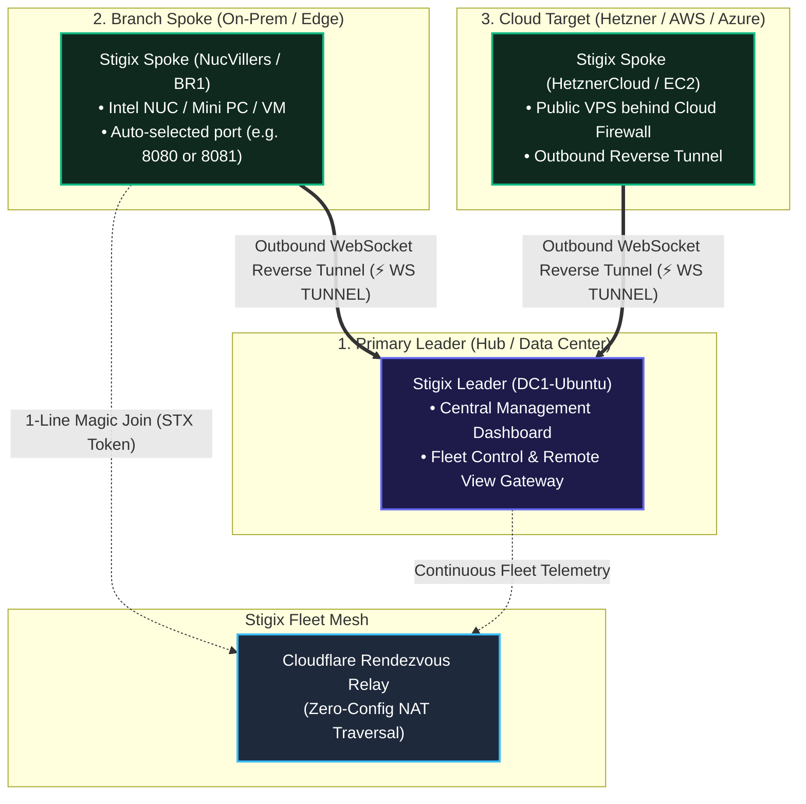
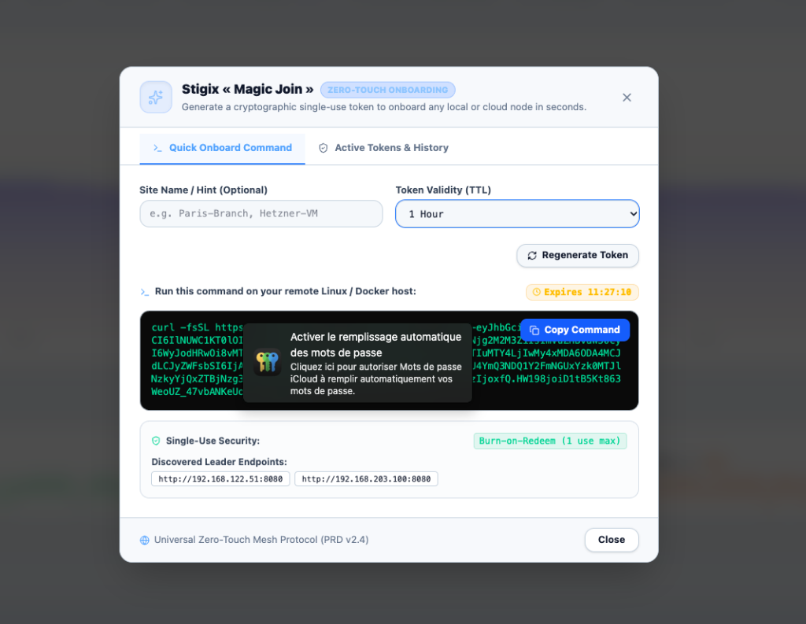
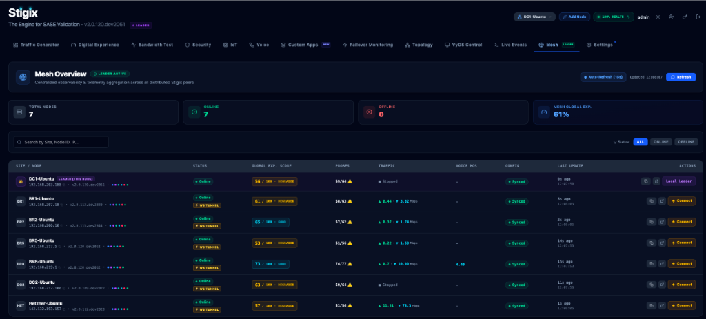
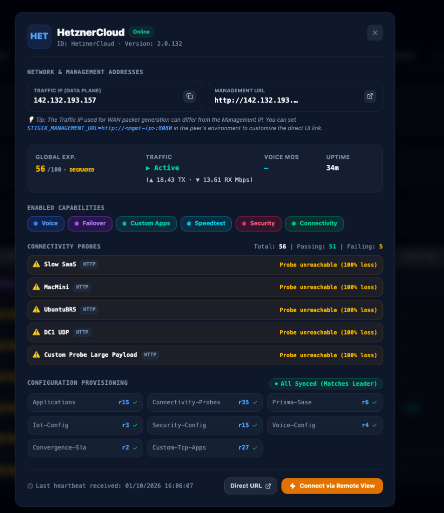

> **Last Updated:** 2026-10-01 | **Created:** 2026-06-02 (v1.4.0-patch.145)

# Stigix Deployment Guide

Stigix is built for **100% zero-touch, 1-line installation**. You never need to write or manage `docker-compose.yml` files manually. 

A single command automatically detects your environment, resolves port conflicts, configures networking, pulls the unified container, and connects your node to the Stigix Fleet Mesh.

---

## 🗺️ Deployment Topology Overview

Every Stigix node runs the same **unified container image** (`jsuzanne/stigix:stable`) that operates simultaneously as a traffic generator, probe responder, security audit engine, and AI Copilot.



---

## 🎯 The 3 Real-World Deployment Scenarios

| Scenario | Location / Hardware | How to Deploy | Key Capabilities |
|---|---|---|---|
| **Scenario 1: Primary Leader** | Central Data Center, Primary Lab, or HQ VM | Standard 1-Line Installer | Central Web Dashboard, Fleet Overview, Remote View Gateway, Target Management |
| **Scenario 2: Branch Spoke (On-Prem)** | Intel NUC, Mini PC, Raspberry Pi 5, Branch VM | **1-Line Magic Join** (`STX-...` Token) | LAN/WAN Path Testing, VoIP RTP MOS, Convergence SLA, IoT Device Emulation |
| **Scenario 3: Cloud Target / VPS** | Hetzner, AWS EC2, Azure VM, Scaleway | **1-Line Magic Join** (`STX-...` Token) | Direct Internet Access (DIA) audits, SASE/SSE inspection, Cloud Mesh Benchmarking |

---

## 🚀 Step-by-Step Installation Procedures

### 🔹 Scenario 1: Deploying the Primary Leader (Central Hub)

Deploy this node first on your main hub, data center VM, or primary lab machine.

#### Step 1: Run the 1-Line Installer
```bash
curl -fsSL https://raw.githubusercontent.com/jsuzanne/stigix/v2/install.sh | sudo bash
```

#### Step 2: Access the Dashboard
Once the installation completes (~30 seconds), open your browser:
* **URL**: `http://<YOUR_LEADER_IP>:8080`
* **Default Login**: `admin` / `admin`

---

### 🔹 Scenario 2: Deploying a Branch Spoke (Zero-Touch « Magic Join »)

This is the fastest, recommended way to onboard branch appliances, Intel NUCs, or remote edge hosts without typing IP addresses or editing configs.

#### Step 1: Generate the Token on the Leader
1. In the Leader Web UI, click the **`[ 🔗 Add Node ]`** button in the top navigation bar.
2. Enter a **Site Name / Hint** (e.g. `NucVillers OnPrem` or `BR2-Branch`).
3. Click **Copy** to grab the one-line command.

> **📸 Figure 1 — Magic Join Token Dialog**
> The Leader generates a **cryptographic single-use token** (burn-on-redeem, 1 use max, configurable TTL). The complete `curl` command is ready to copy. Discovered Leader endpoints (LAN + public relay) are listed automatically — no IP configuration needed on the spoke side.



#### Step 2: Paste the Command on the Target Host
Run the copied command directly on the remote Linux / Docker host:
```bash
curl -fsSL https://raw.githubusercontent.com/jsuzanne/stigix/v2/install.sh | sudo bash -s -- STX-eyJhbGciOi...
```

#### Step 3: What the Installer Does Automatically
1. **Leader Connectivity Probe**: Probes candidate Leader endpoints. If the Leader is behind NAT, it automatically registers via the Cloudflare Rendezvous Relay.
2. **Network Interface Selection**: Prompts you to pick which IP to advertise (or automatically selects the default after 15s).
3. **Port Conflict Protection**: Checks if port `8080` is in use. If busy, it **automatically selects an alternative port** (e.g. `8081`).
4. **Instant Tunneling**: Launches the container and establishes an outbound reverse tunnel (`⚡ WS TUNNEL`).
5. **Dashboard Sync**: Within 5 seconds, the node appears on the Leader's Fleet Overview with status `🟢 Online` and `🔵 LEARNED`.

> **📸 Figure 2 — Stigix Fleet Mesh Overview (after onboarding)**
> The Mesh dashboard shows all connected nodes in real time: DC1 (Leader), branch spokes (BR1, BR2, BR5, BR8), a second data center (DC2), and a cloud peer (Hetzner). Each node displays its IP, `⚡ WS TUNNEL` status badge, Global Experience Score, live traffic rate, config sync revision, and last heartbeat timestamp.



---

### 🔹 Scenario 3: Deploying a Cloud Target / VPS (Hetzner, AWS, Azure)

Deploying a Stigix node in a public cloud provides an authoritative endpoint for SaaS Direct Internet Access (DIA) benchmarking and SASE/SSE inspection.

#### Step 1: Cloud Firewall / Security Group Rules
Ensure the following ports are open inbound in your Cloud Provider Firewall:
* **`8080` TCP** (or custom port): Web Dashboard & WebSocket Reverse Tunnel
* **`9000` TCP / UDP**: XFR Bandwidth Speedtest Generator
* **`5201` TCP / UDP**: iPerf3 Server
* **`6100-6101` UDP**: VoIP RTP Simulation
* **`6200` UDP**: SLA Convergence Probes

#### Step 2: Run the 1-Line Magic Join Command
Generate a token on the Leader and paste it on the Cloud VPS:
```bash
curl -fsSL https://raw.githubusercontent.com/jsuzanne/stigix/v2/install.sh | sudo bash -s -- STX-eyJhbGciOi...
```

---

## ⚡ Post-Deployment Operations

### 1. Seamless Remote Node Control (Remote View)
From the Leader's **Fleet Overview**, click the **`⚡ Connect`** button next to any remote node:
* The full dashboard of the remote node opens seamlessly inside the Leader UI.
* All requests route over the encrypted reverse WebSocket tunnel (`/api/gateway/:peerId/*`) — **no public IP or inbound port forwarding needed on the spoke!**
* The top status bar dynamically displays the remote peer's public IP, gateway IP, country flag, and probe health.

> **📸 Figure 3 — Remote Node Card (Cloud Peer Detail)**
> Clicking a node in the Fleet Overview expands its full detail card: Traffic IP, live throughput (↑18 / ↓13 Mbps), all enabled capabilities (Voice, Failover, Custom Apps, Speedtest, Security, Connectivity), connectivity probe results (56 total / 51 passing), and every config bundle revision synced (`All Synced – Matches Leader`). The **Connect via Remote View** button opens the full remote dashboard — no SSH, no VPN, no port forwarding.



### 2. Upgrading Fleet Nodes
To upgrade any Stigix node to the latest released image:
```bash
cd ~/stigix && docker compose pull && docker compose up -d
```

### 3. Terminal CLI Access
Every container includes the complete `stigix-cli` utility:
```bash
docker exec -it stigix stigix-cli
```

---

## 📜 Revision History

| Date | Stigix Version | Author / Trigger | Summary of Changes |
|---|---|---|---|
| 2026-10-01 | `v2.0.138` | Stigix Core Team | Added annotated UI screenshots (Figures 1–3): Magic Join dialog, Fleet Mesh Overview, and Remote Node detail card. |
| 2026-10-01 | `v2.0.137` | Stigix Core Team | Rewrote deployment guide to focus on 100% zero-touch 1-line installation, Magic Join token onboarding, port auto-selection, and Remote View fleet workflows. |
| 2026-06-02 | `v1.4.0-patch.145` | Stigix Core Team | Initial document creation. |
