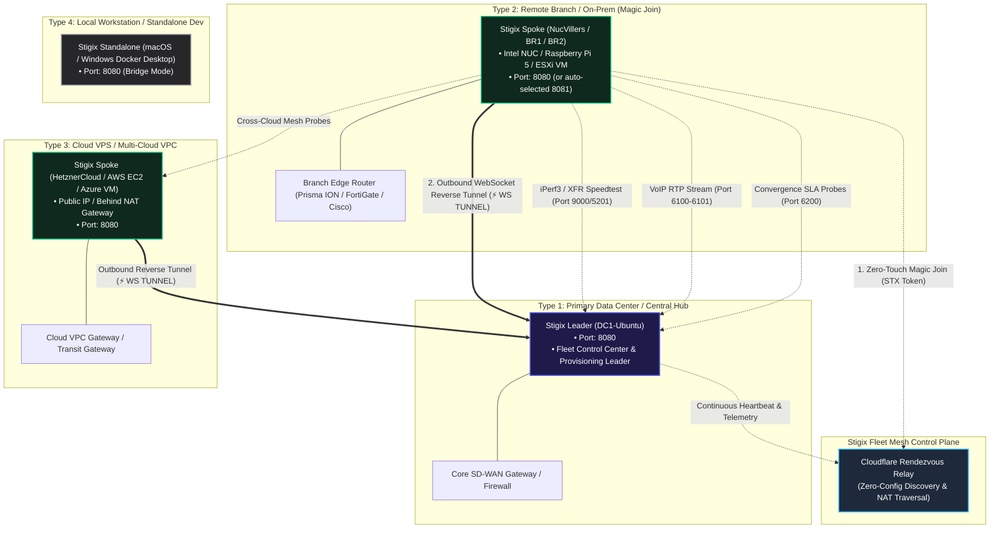

> **Last Updated:** 2026-10-01 | **Created:** 2026-06-02 (v1.4.0-patch.145)

# Stigix Deployment & Topology Guide

This guide provides network architects, system engineers, and DevOps operators with a comprehensive blueprint for deploying **Stigix** across diverse infrastructure environments. 

Stigix operates entirely in **containerized Docker environments**. All deployment models utilize a **unified container image** (`jsuzanne/stigix:latest` or `jsuzanne/stigix:stable`) that simultaneously provides traffic generation, active SLA probes, echo responders, security audits, and an AI Copilot orchestrator.

---

## 🗺️ High-Level Architecture & Deployment Archetypes

Every Stigix instance participates in an encrypted, bidirectional **Fleet Control Plane Mesh**. Depending on the infrastructure role, an instance operates as either a **Leader (Hub Orchestrator)** or a **Spoke (Branch / Cloud Node)**.



---

## 🎯 The 5 Deployment Archetypes & Use Cases

| Deployment Type | Recommended Hardware / Host | Network Mode | Typical Role & Objective | Primary Onboarding Method |
|---|---|---|---|---|
| **Type 1: Central Leader (Hub)** | Linux VM (ESXi/Proxmox) or Bare-Metal | `host` | Central Dashboard, Fleet Management, Global Provisioning, High-Throughput Target | Standard Docker Compose (`docker compose up -d`) |
| **Type 2: Branch Spoke (On-Prem)** | Intel NUC, Mini PC, Raspberry Pi 5 | `host` | SD-WAN Branch validation, IoT MAC emulation, VoIP & SLA Probes | **1-Line Magic Join** (`STX-...` token) |
| **Type 3: Cloud Spoke (Multi-Cloud)** | Hetzner, AWS EC2, Azure VM, GCP | `host` or `bridge` | Direct Internet Access (DIA) audits, Cloud Gateway latency, Cross-Cloud Mesh | **1-Line Magic Join** or Docker Compose |
| **Type 4: Standalone / Local Dev** | macOS / Windows (Docker Desktop) | `bridge` | UI testing, API exploration, AI Copilot FastMCP testing | Docker Compose (`ports: 8080:8080`) |
| **Type 5: Air-Gapped / Isolated Lab** | Linux VM / Physical Server | `host` | Completely private lab environments with no external internet access | Static Leader Configuration (`STIGIX_CONTROLLER_URL`) |

---

## 🚀 Step-by-Step Deployment Procedures

### 🔹 Type 1: Central Leader (Hub / Data Center)

The Leader acts as the single pane of glass for your fleet. It coordinates global configuration provisioning, collects real-time telemetry, and hosts the central Web Dashboard.

#### Step 1: Prepare the Directory and Environment
```bash
mkdir -p ~/stigix/config && cd ~/stigix
```

#### Step 2: Create `docker-compose.yml`
```yaml
services:
  stigix:
    image: jsuzanne/stigix:stable
    container_name: stigix
    restart: unless-stopped
    network_mode: host
    environment:
      - PORT=8080
      - STIGIX_SITE_NAME=DC1-Ubuntu
      - STIGIX_REGISTRY_MODE=leader
      - JWT_SECRET=generate-or-paste-a-secure-random-secret
    volumes:
      - ./config:/app/web-dashboard/config
```

#### Step 3: Start the Leader
```bash
docker compose up -d
```
Access the Leader UI at `http://<LEADER_IP>:8080` (Default credentials: `admin` / `admin`).

---

### 🔹 Type 2: Remote Branch Spoke (Zero-Touch « Magic Join »)

This is the fastest, recommended way to onboard branch appliances, Intel NUCs, or edge Linux boxes. It automatically handles reverse tunnel negotiation, port conflict resolution, and realm adoption without manual editing.

```text
┌───────────────────────────┐      1. Generate Token (Web UI)      ┌───────────────────────────┐
│     Stigix Leader (DC1)   │ ───────────────────────────────────> │   Operator / Administrator│
└───────────────────────────┘                                      └─────────────┬─────────────┘
                                                                                 │
                                                                   2. Paste 1-line command
                                                                                 ▼
┌───────────────────────────┐      3. Auto-registers & connects     ┌───────────────────────────┐
│ Cloudflare Rendezvous     │ <─────────────────────────────────── │   Branch Node (NUC/Spoke) │
└─────────────┬─────────────┘                                      └───────────────────────────┘
              │
              └──────────────> 4. Establishes ⚡ WS Reverse Tunnel to Leader
```

#### Step 1: Generate the Token on the Leader
1. On the Leader Web UI, click the **`[ 🔗 Add Node ]`** (Magic Join) button in the navigation header.
2. Enter a **Site Name / Hint** (e.g. `NucVillers OnPrem` or `BR2-Branch`).
3. Select Token Validity (e.g. `1 Hour`).
4. Click **Copy** to grab the one-line command.

#### Step 2: Run the Command on the Target Node
Execute the command in the terminal of the remote host:
```bash
curl -fsSL https://raw.githubusercontent.com/jsuzanne/stigix/v2/install.sh | sudo bash -s -- STX-eyJhbGciOi...
```

#### What Happens Automatically:
1. **Connectivity Probe**: The script probes the candidate Leader IP endpoints.
2. **Cloudflare Fallback**: If the Leader is across NAT / Internet, it automatically announces to the Cloudflare Rendezvous Relay.
3. **Port Conflict Detection**: If port `8080` is already occupied, it automatically selects an alternative free port (e.g. `8081`).
4. **Container Launch**: Pulls `jsuzanne/stigix:stable` and starts the container in `network_mode: host`.
5. **Reverse Tunnel**: Establishes an outbound WebSocket reverse tunnel (`⚡ WS TUNNEL`).
6. **Fleet Integration**: The node appears on the Leader's Fleet Overview within seconds with status `🟢 Online` and `🔵 LEARNED`.

---

### 🔹 Type 3: Cloud VPS / External Spoke (AWS, Hetzner, Azure, GCP)

Deploying a Stigix node in a public cloud provider provides a deterministic remote target for testing SaaS Direct Internet Access (DIA), SASE/SSE cloud inspection, and cross-region cloud interconnects.

#### Step 1: Open Inbound Firewall Ports (Cloud Security Group)
Ensure the following ports are permitted in your Cloud Security Group / Ingress Firewall:
- **`8080` (or custom `$PORT`) TCP**: Web Dashboard & WebSocket Reverse Tunnel.
- **`9000` TCP / UDP**: XFR Bandwidth Generator.
- **`5201` TCP / UDP**: iPerf3 Server.
- **`6100-6101` UDP**: VoIP RTP Echo.
- **`6200` UDP**: SLA Convergence Probes.

#### Step 2: Deploy via Magic Join or Docker Compose
Using Docker Compose on the Cloud VPS:
```yaml
services:
  stigix:
    image: jsuzanne/stigix:stable
    container_name: stigix
    restart: unless-stopped
    network_mode: host
    environment:
      - PORT=8080
      - STIGIX_SITE_NAME=HetznerCloud
      - STIGIX_REGISTRY_MODE=peer
    volumes:
      - ./config:/app/web-dashboard/config
```
```bash
docker compose up -d
```

---

### 🔹 Type 4: Standalone / Local Dev (macOS & Windows)

Ideal for engineers exploring the Stigix UI, integrating with the AI Copilot via MCP, or testing APIs locally on a laptop.

```yaml
services:
  stigix:
    image: jsuzanne/stigix:stable
    container_name: stigix
    restart: unless-stopped
    ports:
      - "8080:8080"   # Web Dashboard & API
      - "9000:9000"   # XFR Speedtest
      - "5201:5201"   # iPerf3
      - "6100:6100/udp" # VoIP Simulation
      - "6200:6200/udp" # SLA Probes
    environment:
      - STIGIX_SITE_NAME=LocalMacDev
      - STIGIX_REGISTRY_MODE=standalone
    volumes:
      - ./config:/app/web-dashboard/config
```

> [!NOTE]
> On macOS and Windows, Docker runs inside a lightweight Linux VM (Bridge Mode). Advanced Layer 2 IoT MAC address spoofing is disabled in Bridge Mode, but all Layer 3-7 application tests, speedtests, VoIP, and AI Copilot tools operate with full functionality.

---

### 🔹 Type 5: Air-Gapped / Isolated Private Lab

In highly secure or isolated network testbeds with **no public Internet access** (no Cloudflare Rendezvous):

#### On the Leader (`192.168.10.100`):
```yaml
services:
  stigix:
    image: jsuzanne/stigix:stable
    container_name: stigix
    network_mode: host
    environment:
      - PORT=8080
      - STIGIX_SITE_NAME=AirGappedLeader
      - STIGIX_REGISTRY_MODE=leader
```

#### On all Spoke Nodes:
Point `STIGIX_CONTROLLER_URL` directly to the private Leader IP:
```yaml
services:
  stigix:
    image: jsuzanne/stigix:stable
    container_name: stigix
    network_mode: host
    environment:
      - PORT=8080
      - STIGIX_SITE_NAME=SpokeBranch1
      - STIGIX_CONTROLLER_URL=http://192.168.10.100:8080
```

---

## ⚡ Key Fleet Operations & Management Workflows

### 1. Remote View (Seamless Remote Node Control)
From the Leader's **Fleet Overview**, clicking the **`⚡ Connect`** (Remote View) button instantly loads the remote node's full interface inside the Leader dashboard:
* **No Direct Inbound IP Required**: The Leader tunnels all API, telemetry, and control requests over the established WebSocket reverse tunnel (`/api/gateway/:peerId/*`).
* **Dynamic Network Status Bar**: The top status bar dynamically shows the remote peer's public IP, gateway IP, country flag, and active probe health.

### 2. Multi-Port & Collision Handling
If a host already runs services on port `8080`, Stigix automatically detects the collision and increments the port (e.g. `8081`, `8082`). The reverse tunnel preserves this custom port and registers it with the Leader automatically.

### 3. Upgrading Fleet Instances
To upgrade an instance to the latest published Docker image:
```bash
cd ~/stigix && docker compose pull && docker compose up -d
```

### 4. Headless & CLI Management
Every container contains the full `stigix-cli` interactive and headless tool:
```bash
docker exec -it stigix stigix-cli
```

---

## 📜 Revision History

| Date | Stigix Version | Author / Trigger | Summary of Changes |
|---|---|---|---|
| 2026-10-01 | `v2.0.137` | Stigix Core Team | Rewrote deployment guide with 5 core Docker topology archetypes, Zero-Touch Magic Join workflow, Remote View gateway operations, and multi-port collision handling. |
| 2026-06-02 | `v1.4.0-patch.145` | Stigix Core Team | Initial document creation. |
