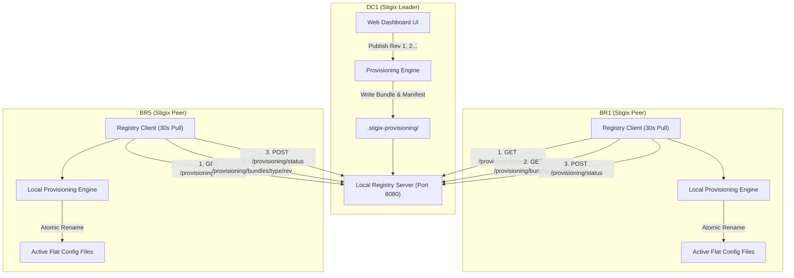
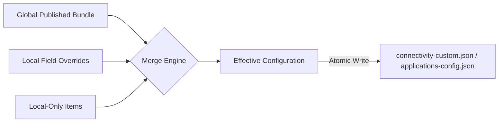

# 🌐 Stigix Global Configuration Provisioning & Peer Onboarding Guide

This document details the architecture, configuration, and workflows of the **Multi-Instance Control Plane**, focusing on **Direct Controller Peer Onboarding** and **Centralized Global Configuration Provisioning with Local Overrides**.

---

## 📑 Table of Contents
1. [Overview & Control Plane Architecture](#1-overview--control-plane-architecture)
2. [Direct Controller Peer Onboarding](#2-direct-controller-peer-onboarding)
3. [Centralized Global Configuration Provisioning](#3-centralized-global-configuration-provisioning)
4. [Pull Sync Protocol & API Reference](#4-pull-sync-protocol--api-reference)
5. [Local Overrides & Orphan Protection](#5-local-overrides--orphan-protection)
6. [User Interface & Status Badges](#6-user-interface--status-badges)

---

## 1. Overview & Control Plane Architecture

In modern SD-WAN and SASE testing environments, Stigix instances operate across multiple remote branches (e.g., `DC1`, `BR1`, `BR5`, `AWS-Hub`). The Control Plane operates in a **Hybrid Leader/Peer** topology:



### Key Capabilities
- **Direct Peer Onboarding**: Single `curl | bash` command to join remote Linux hosts to the Leader.
- **Centralized Provisioning**: Define applications and probes centrally on the Leader, then publish revisioned bundles to all branch peers.
- **Pull-Mode Distribution**: Peers pull published bundles over lightweight HTTP every 30 seconds.
- **Local Overrides**: Branch operators can customize probe targets, timeouts, or application weights without being overwritten by central pushes.
- **Zero-Downtime Hot Reloading**: Active runtime config files (`applications-config.json`, `connectivity-custom.json`) are updated atomically (`temp file -> rename`), triggering standard engine `fs.watch` hot-reloads seamlessly.

---

## 2. Direct Controller Peer Onboarding

Joining a new remote Linux node (e.g., Ubuntu/Debian branch server) to a Stigix Leader requires **zero manual configuration files**.

### 🚀 One-Command Onboarding
On the Leader instance UI (**Settings → Target Controller / Registry**), copy the onboarding command:

```bash
curl -sSL http://<LEADER_IP>:8080/onboard.sh | bash
```

### What `onboard.sh` does automatically:
1. Detects system architecture (`x86_64` / `arm64`) and checks Docker / Docker Compose.
2. Downloads the official Stigix Docker Compose definition from the Leader.
3. Sets `STIGIX_REGISTRY_MODE=peer` and `STIGIX_REGISTRY_URL=http://<LEADER_IP>:8080`.
4. Starts the Stigix All-in-One container.
5. Registers the instance with the Leader and initiates target discovery.

### Target Controller UI Views
- **Leader View**:
  - Displays all registered peers with IP addresses, capabilities, last-seen timestamps, and **Provisioning Rollout Compliance**.
  - Provides a 1-click **Onboarding Command Box** with HTTP-safe clipboard copying (`navigator.clipboard` + `execCommand` fallback for LAN HTTP contexts).
  - Includes a collapsed **Danger Zone** for advanced controls (flush target cache, reset leader state).
- **Peer View**:
  - Displays current Leader Connection status with a live **Reachability Test** ping button.
  - Displays **Central Global Provisioning** status card with Opt-in/Opt-out toggle and sync indicators.

---

## 3. Centralized Global Configuration Provisioning

Global Configuration Provisioning allows network administrators to manage shared configurations from the Leader while preserving branch independence.

### Managed Catalogues (Phase 1 MVP)
1. **Applications Catalogue** (`config/applications-config.json`): Shared SaaS & web application target definitions and weights.
2. **Connectivity Probes** (`config/connectivity-custom.json`): Shared HTTP, PING, DNS, UDP, and Cloud synthetic probes.

### Internal Directory Structure (`.stigix-provisioning/`)
On each node, provisioning state is maintained in `config/.stigix-provisioning/`:
```text
config/.stigix-provisioning/
├── state.json                   # Local opt-in state & applied revision manifest
├── manifest.json                # Published bundle manifest (Leader)
├── global/
│   ├── applications/
│   │   ├── rev-1.json           # Immutable published application bundles
│   │   └── rev-2.json
│   └── connectivity-probes/
│       ├── rev-1.json           # Immutable published probe bundles
│       └── rev-2.json
├── local-overrides/
│   ├── applications.json        # Branch field-level application overrides
│   └── connectivity-probes.json # Branch field-level probe overrides
└── backups/                     # Pre-apply atomic file backups
```

---

## 4. Pull Sync Protocol & API Reference

Peers poll the Leader's Local Registry HTTP server (default port `8080`) during their 30-second discovery cycle.

### API Endpoints

| Endpoint | Method | Role | Description |
| :--- | :---: | :---: | :--- |
| `/api/registry/provisioning/manifest` | `GET` | Peer ➔ Leader | Returns published bundle revisions, counts, and SHA-256 checksums. |
| `/api/registry/provisioning/bundles/:type/:revision` | `GET` | Peer ➔ Leader | Downloads specified immutable global revision bundle. |
| `/api/registry/provisioning/status` | `POST` | Peer ➔ Leader | Reports peer's applied revision and compliance status to Leader. |
| `/api/provisioning/publish/:type` | `POST` | Admin ➔ Leader | Publishes current Leader configuration as new immutable revision. |
| `/api/provisioning/rollback/:type/:revision` | `POST` | Admin ➔ Leader | Rolls back Leader published bundle to prior revision. |
| `/api/provisioning/config` | `GET/POST` | UI ➔ Local | Enables/disables global provisioning sync on peer (`enabled: true/false`). |

---

## 5. Local Overrides & Orphan Protection

The provisioning engine guarantees that central updates never erase local site adaptations.

### The Effective Merging Formula

$$\text{Effective Configuration} = \text{Global Published} + \text{Local Overrides} + \text{Local-Only Items}$$



### Deterministic ID Normalization
Items are uniquely tracked across Leader revisions using stable deterministic IDs:
- **Applications**: `app-` + MD5 hash of `domain:endpoint`
- **Probes**: `probe-` + MD5 hash of `type:name` (e.g. `probe-75543e7fc1` for `HTTP:Google Search`). Stable across target, timeout, and frequency edits.

### Local Override Behavior
- **Field-Level Isolation**: When a peer operator edits a probe's timeout (e.g., changing `5000ms` to `3000ms` on `BR5`), only the changed field (`timeout: 3000`) is saved to `local-overrides/connectivity-probes.json`.
- **Revision Resilience**: When the Leader publishes `rev 2` (e.g., updating the probe URL from `https://google.com` to `https://www.google.fr`), the peer pulls `rev 2`, applies the new URL, **and preserves the local `3000ms` timeout**.
- **Orphan Protection (`⚠️ Orphaned`)**: If the Leader deletes a global probe that has local overrides on a peer, the peer converts the probe to an **Orphaned Local Probe** (`_source: 'orphaned'`). The local site monitoring continues uninterrupted, and the local operator can choose to keep or delete it.

---

## 6. User Interface & Status Badges

### Source Badges
In **Connectivity Performance** (`ConnectivityPerformance.tsx`) and **Applications Catalogue** (`Settings.tsx`), items display clear origin badges:

- **`🌐 Global`** (Green): Pure global item published by Leader.
- **`✏️ Overridden`** (Amber): Global item with site-specific local field overrides.
- **`📍 Local`** (Blue): Item created locally on the peer node.
- **`⚠️ Orphaned`** (Red): Global parent deleted on Leader; preserved locally.

### Publishing & Opt-In Controls
- **Leader View**: **Settings → Target Controller → Central Global Provisioning**
  - **`[ Publish Apps ]`**: Publishes next application revision.
  - **`[ Publish Probes ]`**: Publishes next probe revision.
- **Peer View**: **Settings → Target Controller → Central Global Provisioning**
  - **`[ Global Provisioning: ON / OFF ]`**: Toggle switch to enable or disable automatic Leader sync.

---

*For further details, refer to the PRD specifications in `PRD/STIGIX_GLOBAL_CONFIGURATION_PROVISIONING_SPEC.md` and `PRD/STIGIX_DIRECT_CONTROLLER_PEER_INSTALLATION_SPEC.md`.*
