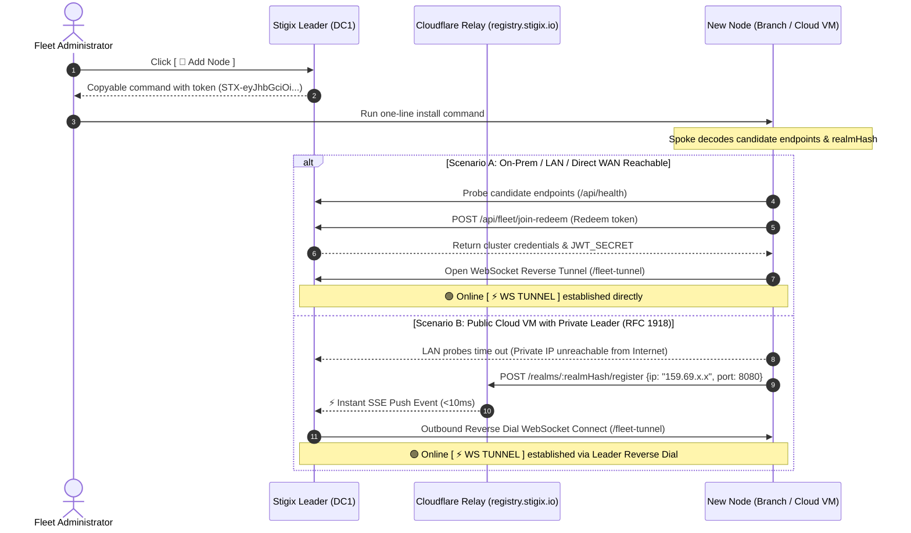

> **Last Updated:** 2026-10-01 | **Created:** 2026-10-01 (v2.0.120)

# Stigix « Magic Join » & Multi-Tenant Security Architecture

## 1. Overview & Vision

Deploying a distributed SD-WAN and SASE validation fleet across multiple sites, cloud providers, and branches has traditionally required manual configuration, IP parameter handling, and port forwarding.

**Stigix « Magic Join »** delivers an instantaneous, zero-touch onboarding experience:
* **1 Single Action on Leader**: Generate a signed, single-use join token.
* **1 Single Copy-Pasted Command on Target Host**: No manual IP input, no questionnaire, no `.env` editing.
* **Under 15 Seconds to Live Telemetry**: Automatic candidate probing, cryptographic negotiation, security realm synchronization, and persistent WebSocket reverse tunnel establishment (`⚡ WS TUNNEL`).

---

## 2. The Universal Onboarding Workflow



---

## 3. Multi-Tenant Cryptographic Isolation

To allow thousands of independent customer labs, partner POCs, and enterprise environments to co-exist securely across shared public infrastructure (e.g. `registry.stigix.io`), Stigix employs a **dual-layer isolation architecture**.

```text
               Public Cloudflare Rendezvous Relay (registry.stigix.io)
                                         │
         ┌───────────────────────────────┴───────────────────────────────┐
         ▼                                                               ▼
 📁 Realm [A89F...21] (Customer Lab A)                           📁 Realm [9B02...7E] (Customer Lab B)
 ├── Leader DC1 listens on /realms/A89F...21/stream              ├── Leader DC2 listens on /realms/9B02...7E/stream
 ├── Spoke Hetzner announces to /realms/A89F...21/               ├── Spoke AWS announces to /realms/9B02...7E/
 └── Shared Secret: JWT_SECRET_A                                 └── Shared Secret: JWT_SECRET_B
         │                                                               │
         └── 100% Cryptographically Isolated                            └── Zero Cross-Visibility / Zero Collision
```

### Layer 1: Realm Isolation via `realmHash`
Every Magic Join token embeds a cryptographic realm identifier:

$$\text{realmHash} = \text{SHA-256}(\text{PRISMA\_SDWAN\_TSGID} \lor \text{STIGIX\_CLUSTER\_KEY} \lor \text{STIGIX\_POC\_ID})$$

* **Dedicated Event Channels**: The Leader opens an idle Server-Sent Events (SSE) listener strictly on its own realm: `GET /realms/:realmHash/stream`.
* **Zero Cross-Talk**: The Cloudflare Relay worker maintains an in-memory subscriber map (`Map<realmHash, Set<Stream>>`). An announcement from Customer B's VM will **never** be delivered to Customer A's Leader.

### Layer 2: Handshake Authentication via Cluster `JWT_SECRET`
Each independent cluster Leader maintains a unique 256-bit cryptographic secret (`JWT_SECRET`):
* **Automatic Propagation**: During token redemption (`/api/fleet/join-redeem`), the Leader securely provisions its `JWT_SECRET` to the new spoke node.
* **Handshake Verification**: When establishing the `/fleet-tunnel` WebSocket reverse connection, both parties authenticate using HMAC-SHA256 signatures derived from this shared cluster secret.
* **Intrusion Prevention**: Even if an unauthorized party discovers a `realmHash`, any connection attempt without the matching `JWT_SECRET` is immediately rejected with `invalid_token`.

---

## 4. Zero-Inbound Private Leader (Cloud Rendezvous Relay)

When the Stigix Leader resides entirely within an isolated private network (e.g. On-Premises Data Center `192.168.122.0/24`) without any public IP address or open inbound firewall ports:

1. **Passive SSE Push Listener**: On startup, the Leader connects outbound to `https://registry.stigix.io/realms/:realmHash/stream`. This connection is held open passively (0% CPU, 0 polling queries, 0 KV writes).
2. **Instant Announcement**: When a remote Cloud VM (e.g. on Hetzner or AWS) runs the Magic Join command, its direct RFC 1918 probes fail, prompting it to issue a single `POST /realms/:realmHash/register` request.
3. **Sub-10ms Push Notification**: Cloudflare pushes the event to the waiting Leader in under 10 milliseconds.
4. **Outbound Reverse Dialing**: The private Leader initiates an outbound connection to `http://<cloud_vm_ip>:8080/fleet-tunnel`.
5. **Data Path Directness**: Cloudflare exits the data path entirely. All subsequent telemetry, bandwidth tests, and remote management flow point-to-point over the WebSocket reverse tunnel.

---

## 5. Security & Privacy Commitments

| Aspect | Guarantee |
|---|---|
| **Zero Sensitive Data on Cloudflare** | Only an ephemeral JSON record (`ip`, `port`, `timestamp`) is processed in-memory. Configurations, passwords, VoIP RTP streams, and traffic stats **never** touch Cloudflare. |
| **No Pre-Shared Secret Required on Spoke** | The operator running the install command needs no credentials; the signed token contains all bootstrap parameters. |
| **Single-Use & Time-Limited** | Join tokens default to single-use (`max_uses: 1`) and expire after 1 hour (`ttl: 3600s`). |
| **Instant One-Click Revocation** | Administrators can revoke pending tokens at any time from the Leader UI (*Add Node ➔ Token History*). |

---

## 6. Verification & Troubleshooting

### Check Cluster JWT Secret
To verify that all nodes within a cluster share the identical security realm:
```bash
# Run on Leader (e.g. DC1)
docker exec stigix printenv JWT_SECRET

# Run on Spoke (e.g. BR5, Hetzner)
docker exec stigix printenv JWT_SECRET
```
*Both outputs must match exactly.*

### Test Cloudflare Rendezvous Endpoint
```bash
curl -s https://registry.stigix.io/health
# Response:
# {"status":"ok","service":"stigix-rendezvous-relay","version":"2.0.0"}
```

---

## 📜 Revision History

| Date | Stigix Version | Author / Trigger | Summary of Changes |
|---|---|---|---|
| 2026-10-01 | `v2.0.120` | Stigix Core Team | Initial documentation of Magic Join zero-touch onboarding, multi-tenant realm isolation, and Cloudflare SSE rendezvous relay. |
