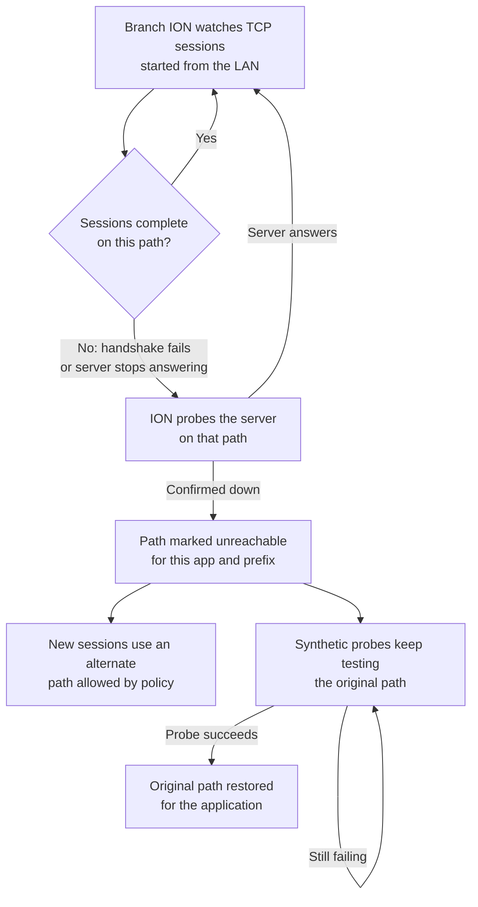
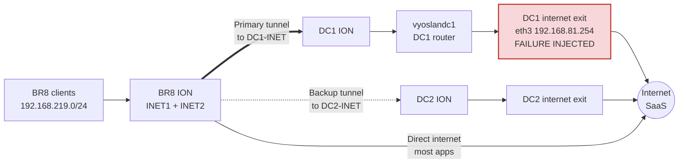

# When Routing Can't See the Failure: Application-Aware Failover with Prisma SD-WAN

Sep 25, 2026 · Jean-Louis SUZANNE, Technical Sales Manager, Palo Alto Networks

## Executive summary

Prisma SD-WAN rerouted a branch's backhauled internet traffic to a backup data center in about 3 minutes, in a failure where every route, link and tunnel stayed up. A network relying only on Layer 3 signals would have kept sending that traffic into a black hole until someone intervened.

Three minutes is not fast, and this paper says so plainly. But the alternative is not a faster failover: it is no failover at all. Without session awareness, the branch keeps sending these applications to a dead exit until an engineer diagnoses the problem and changes the configuration, which typically takes far longer.

The failure tested here is common and hard to catch: a data center's internet breakout stops working while the data center itself remains reachable. Routing protocols, BFD and link state only verify the next hop. None of them checks whether an application session actually gets established end to end.

Prisma SD-WAN does. Its **Application Unreachability Detection** watches TCP session establishment per application and per destination prefix. When sessions keep failing on a path, that path is excluded for the application, new sessions move to an alternate path, and reachability probes bring traffic back once the original path works again.

| Scenario | Failover to backup DC | Failback after repair |
| --- | --- | --- |
| Hard failure: DC1 internet interface shut down | \~3 min | Automatic, driven by probes |
| Silent failure: 100% packet loss, interface up | \~5 min 20 s | Automatic, \~2 min after repair |

In both cases, direct internet traffic from the branch was never affected. Only the applications backhauled through DC1 were impacted, and only until the automatic failover.

All tests were run and measured with [Stigix](https://github.com/jsuzanne/stigix), a network test platform for SD-WAN labs.

## The problem: a failure behind a healthy next hop

Many enterprises backhaul part of their branch internet traffic to a data center. It goes through a central security stack and a central internet breakout. Microsoft 365 authentication and mail, or sensitive SaaS applications, are typical examples.

In this design, the branch sees the data center as the next hop. The data center then forwards the traffic to its own internet exit. If that exit fails, the branch has no direct way to notice:

- The branch's WAN circuits are up.
- The SD-WAN tunnels to the data center are up and pass keepalives.
- The routes toward the data center, including any default route learned from it, are still valid.

From the branch, everything looks healthy. Yet every new connection to a backhauled application fails. This is a "grey failure": the network is up, but the service is down.

## Why Layer 3 mechanisms are blind to it

Traditional failover mechanisms answer one question: is my next hop reachable? None of them asks whether the application session behind that next hop succeeds.

| Mechanism | What it verifies | Detects a dead breakout behind DC1? |
| --- | --- | --- |
| Interface / link state | The local physical or logical link is up | No: the branch links are up |
| BFD | The neighbor answers, in milliseconds | No: DC1 answers normally |
| Routing protocol (BGP, OSPF) | The route is still advertised | No, unless the DC withdraws its default route on failure |
| SD-WAN tunnel keepalives | The tunnel to DC1 is up | No: the tunnel stays up |
| Prisma SD-WAN Application Unreachability Detection | TCP sessions for this app and prefix complete on this path | **Yes**: sessions stop completing |

A routed design can partly cover this case with extra engineering: conditional default-route advertisement, or IP SLA tracking toward a few internet targets. These still test a handful of probe destinations, not the applications themselves. They also require careful design and testing at each data center.

The silent-failure test in this paper is exactly the case where these routing signals never fire. The interface stays up, routes stay in place, and only the applications fail.

## How Prisma SD-WAN handles it: Application Unreachability Detection

Prisma SD-WAN judges a path by whether application sessions succeed on it, not only by whether the path is up. This capability is called [Application Unreachability Detection](https://docs.paloaltonetworks.com/prisma-sd-wan/administration/prisma-sd-wan-stacked-policies/prisma-sd-wan-applications/configure-system-application-overrides), and it is enabled by default for TCP applications.

The cycle above has four stages:

1. **Detection.** For TCP applications, the ION pairs each request leaving the LAN with its response from the WAN: a SYN with its SYN-ACK, or an application request with its acknowledgment. A SYN with no SYN-ACK is an *initiation failure*. A request left unanswered is a *transaction failure*.
2. **Verification.** The ION then probes the same destination prefix and port, on the same path. The path is declared unreachable only if the probe gets no answer and no other client has a successful session to that application and prefix on that path.
3. **Exclusion and failover.** The path is marked unreachable for that application and destination prefix. New flows matching them skip that path, and path selection continues with the remaining candidates, such as the backup data center group.
4. **Recovery.** The ION keeps probing the excluded path. As soon as a probe succeeds, the path is usable again and new sessions return to it.

Two details matter in practice. Reachability is tracked per application, per destination prefix and per path, so one broken service never drags a whole link down. And if no alternate path is available or allowed by policy, the flow stays on its path rather than being dropped.

[Application reachability probes](https://docs.paloaltonetworks.com/prisma-sd-wan/administration/prisma-sd-wan-sites-and-devices/prisma-sd-wan-ports-and-interfaces/configure-application-reachability-probes) are enabled by default on ION devices, except the ION 1000. They are sourced from a LAN interface you designate, or from the controller port. Since release 6.3.2, the same approach also covers UDP DNS traffic.

### Where it fits in path selection

According to Palo Alto's [Dynamic Path Selection](https://docs.paloaltonetworks.com/content/dam/techdocs/en_US/supporting/prisma-sd-wan/Prisma-SD-WAN-Dynamic-Path-Selection.pdf) guide, each new flow goes through a series of filters before a path is chosen:

1. **Policy:** paths allowed by the network and security rules, including active and backup data center groups.
2. **Link status:** physical link, VPN state and Layer 3 reachability, such as BFD and internet checks.
3. **Link quality:** latency, jitter and loss against thresholds (by default 150 ms, 50 ms and 3%, applied to real-time media).
4. **Application performance:** Layer 7 reachability, path affinity and per-application thresholds.
5. **Capacity:** the path with the most available bandwidth wins.

The failure in our test passed steps 1 to 3 unnoticed: links, tunnels, BFD and quality all stayed green. Only step 4, application reachability, caught it. This is the layer that routing-only designs do not have.

Path selection runs again whenever a new flow starts, a path goes up or down, an application becomes unreachable on a path, a threshold is exceeded, or traffic becomes asymmetric.

## The lab scenario

Branch BR8 sends most of its internet traffic directly, and backhauls a few applications to data center DC1 for central breakout. We broke DC1's internet exit and watched how BR8 reacted.

The failure sits one hop behind DC1. BR8's circuits, its tunnels to DC1 and all routes stay up throughout the test. Only the internet exit behind DC1 stops working.

**Topology.** BR8 is internet-only, with two circuits (BR8-INET1 and BR8-INET2) and no MPLS. It builds SD-WAN tunnels to DC1-INET (preferred) and DC2-INET (backup). The path policy sends backhauled applications to DC1, with DC2 as the alternate.

**Backhauled applications observed on BR8:**

| Application | Destinations | Normal path |
| --- | --- | --- |
| Exchange Online (outlook.office365.com) | 52.98.227.162, 52.97.201.34 | BR8-INET2 → DC1-INET |
| Microsoft Entra ID (sign-in) | 40.126.31.0 | BR8-INET2 → DC1-INET |
| Microsoft Teams | 52.123.129.14 | BR8-INET2 → DC1-INET |
| Custom app hosted on Cloudflare | 172.67.212.159, 104.21.53.116 | BR8-INET2 → DC1-INET |

All other internet traffic, such as Google, AWS or GitHub, leaves BR8 directly on its own circuits.

**The two failures injected on vyoslandc1, interface eth3 (DC1 INTERNET EXIT):**

- **Phase A, hard failure:** eth3 administratively shut down.
- **Phase B, silent failure:** 100% packet loss on eth3 egress, interface left up. Routes and link state do not change. This is the case Layer 3 mechanisms cannot see.

## Test results

Both failures were detected and bypassed automatically: backhauled traffic moved to DC2's internet exit, then returned to DC1 once the exit was repaired. All times below are UTC, on 25 September 2026, taken from the Prisma SD-WAN Flow Browser.

|  | Phase A: hard failure | Phase B: silent failure |
| --- | --- | --- |
| Failure injected | eth3 shut down | 100% loss on eth3, interface up |
| First path change | \~60 s, to BR8-INET1 → DC1-INET | \~140 s, to BR8-INET1 → DC1-INET |
| Failover to DC2 internet exit | **\~3 min** | **\~5 min 20 s** |
| Failback to DC1 after repair | Automatic, probe-driven | Automatic, \~1 min 50 s after repair |
| Impact on direct internet traffic | None | None |

### Phase A: hard failure

| Time | Event |
| --- | --- |
| \~06:51:15 | eth3 shut down on vyoslandc1 |
| 06:51–06:52 | New sessions still sent via BR8-INET2 → DC1-INET; every handshake fails (2 SYN packets, 0 bytes back) |
| 06:52:14.4 | Sessions moved to BR8-INET1 → DC1-INET, still toward DC1, still failing |
| **06:54:15.6** | **DC1 paths excluded; sessions moved to DC2-INET and succeed immediately** |
| 06:54–07:02 | Stable on DC2, load-shared across both BR8 circuits |
| \~07:02 | eth3 restored |
| **07:02:27.1** | **Probes succeed; sessions back on BR8-INET2 → DC1-INET** |

### Phase B: silent failure

| Time | Event |
| --- | --- |
| 07:05:54 | 100% loss applied on eth3; first failing sessions via BR8-INET2 → DC1-INET |
| 07:08:14.5 | Sessions moved to BR8-INET1 → DC1-INET, still toward DC1, still failing |
| **07:11:13.7** | **DC1 paths excluded; sessions moved to DC2-INET; first full responses at 07:11:22.8** |
| 07:11–07:14 | Stable on DC2 |
| before 07:14:31 | 100% loss removed |
| 07:14–07:16 | New sessions stay on DC2; DC2 now shown as the preferred path |
| **07:16:19.8** | **Probes succeed; sessions back on BR8-INET1 → DC1-INET** |

### Reading the results

**Convergence time grows with the number of paths to the failed data center.** Reachability is tracked per path, and BR8 has two paths to DC1, one per internet circuit. Each had to be declared unreachable in turn before DC2 was selected:

|  | Path 1 unreachable (BR8-INET2 → DC1-INET) | Path 2 unreachable (BR8-INET1 → DC1-INET) | Total before DC2 |
| --- | --- | --- | --- |
| Phase A: hard failure | \~60 s | \~2 min later | \~3 min |
| Phase B: silent failure | \~2 min 20 s | \~3 min later | \~5 min 20 s |

A branch with a single internet circuit would have only one path to rule out, so failover should be faster. We did not test that configuration.

**The silent failure took longer to confirm.** A plausible reason: a shut interface produces explicit errors quickly, while a silent drop only produces timeouts. The ION must wait for handshakes to time out before it can conclude. We did not verify this directly.

**Failback is driven by probes, not by routing.** After each repair, the ION's probes on the DC1 path succeeded first, then traffic returned. BR8's tunnels to DC1 stayed up in both phases, so the decision came from session outcomes, not from a tunnel going down.

## Lessons and design recommendations

Session awareness turns an outage that routing cannot see into a bounded, self-healing event of a few minutes. To get the most out of it:

1. **Always give backhauled applications an alternate path.** Unreachability Detection can only fail over if the path policy allows another path. Here, DC2's internet exit was that alternate. Direct internet from the branch is another option for SaaS.
2. **Keep Unreachability Detection on for backhauled TCP applications.** It is enabled by default. Check that application overrides and custom application definitions have not disabled it.
3. **Designate a probe source interface.** On the ION 1000, a LAN port must be configured for application probes. On platforms without a dedicated controller port, such as the ION 1200, 3200, 5200 and 9200, a source interface should be configured.
4. **Set the right expectations.** Tunnel and link failures are detected in seconds. In earlier tests on this lab, a tunnel failure triggered a path decision in under 2 seconds. Failures behind a data center, like a dead breakout, take minutes: about 3 minutes for a hard failure and 5 minutes for a silent one here. Slow, but automatic: in a routing-only design, the same failure has no automatic recovery at all. Expect the delay to grow with the number of branch circuits, since each path to the failed data center is ruled out in turn.
5. **Combine both layers for critical applications.** If minutes are too long, pair session awareness with data-center-side signals, such as a default route withdrawn when the breakout fails. The routing signal gives speed when it fires; session awareness covers the cases where it never does.
6. **Test grey failures, not only cable pulls.** Shutting an interface is the easy case. Packet loss with the interface up is closer to real-world provider failures, and it behaved differently.
7. **Keep test tooling out of the path under test.** In this lab, the router hosting the breakout answered its management traffic through that same breakout. Cutting the exit also cut remote control of the router. Management must use an independent path.

## Methodology and sources

The test ran on a Prisma SD-WAN lab with [Stigix](https://github.com/jsuzanne/stigix) ([github.com/jsuzanne/stigix](https://github.com/jsuzanne/stigix)). Stigix generated continuous application traffic from BR8 and injected failures on the VyOS routers. The Claude AI assistant, connected to Stigix through the Model Context Protocol (MCP), ran the injections, polled the Prisma SD-WAN Flow Browser and rebuilt the timelines. Jean-Louis SUZANNE supervised the test and performed the repair steps on the router console.

**Measurement notes:**

- Path changes and their timestamps come from Flow Browser decisions, to the millisecond. Phase A's start time is accurate to about ±10 s.
- Failing sessions are identified by their handshake: 2 packets sent, 0 bytes returned.
- The traffic generator pauses a failing application for 5 minutes. The Cloudflare-hosted application, which kept a steady rate of new sessions, served as the reference for all timings.
- Phase A's exact repair time was not recorded, so its failback delay is not quantified.

**Sources:**

- Palo Alto Networks, [Prisma SD-WAN Dynamic Path Selection](https://docs.paloaltonetworks.com/content/dam/techdocs/en_US/supporting/prisma-sd-wan/Prisma-SD-WAN-Dynamic-Path-Selection.pdf): path selection pipeline and Layer 7 reachability logic.
- Palo Alto Networks, [Configure System Application Overrides](https://docs.paloaltonetworks.com/prisma-sd-wan/administration/prisma-sd-wan-stacked-policies/prisma-sd-wan-applications/configure-system-application-overrides): Unreachability Detection behavior.
- Palo Alto Networks, [Configure Application Reachability Probes](https://docs.paloaltonetworks.com/prisma-sd-wan/administration/prisma-sd-wan-sites-and-devices/prisma-sd-wan-ports-and-interfaces/configure-application-reachability-probes): probe behavior and source interfaces.
