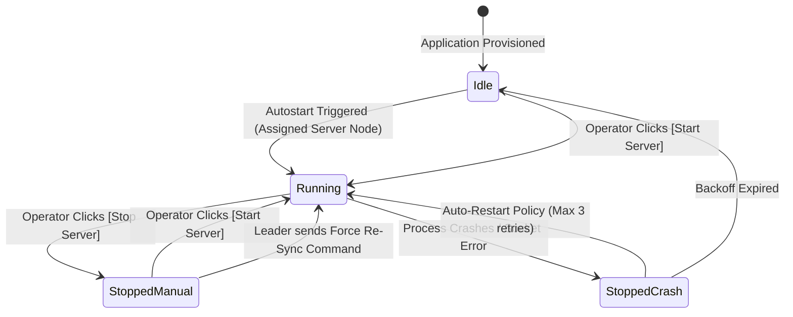

# 📄 PRD — Stigix Custom Apps Fleet Mesh, Autostart Orchestration & EICAR Threat Correlation

> **Status:** Approved / In Design  
> **Target Release:** v2.2.0  
> **Author:** Antigravity AI & Core Maintainers  
> **Last Updated:** 2026-10-08  

---

## 1. Executive Summary

The **Stigix Custom Apps Fleet Mesh & Threat Correlation Engine** transforms Custom TCP/UDP Applications from isolated, manually configured node pairs into an **autonomous, self-discovering application mesh** across the entire SD-WAN and SASE topology.

By decoupling the **Centralized Blueprint (Desired State)** from **Live Telemetry (Actual Runtime State)** over the WebSocket Control Plane, the engine enables zero-touch multi-site traffic generation, resilient operator chaos overrides, and dynamic cross-module threat correlation with the EICAR Security Suite.

```
                  ┌────────────────────────────────────────────────────────┐
                  │                 STIGIX LEADER (DC1)                    │
                  │   Central Provisioning • Live Fleet Mesh Registry     │
                  └───────────────▲────────────────────────▲───────────────┘
                                  │                        │
               WebSocket Reverse  │                        │ WebSocket Reverse
               Control Plane      │                        │ Control Plane
                                  │                        │
       ┌──────────────────────────▼──────────┐  ┌──────────▼─────────────────────────┐
       │             SPOKE (BR2)             │  │             SPOKE (BR8)             │
       │   Server Listener: :8083 & :8098    │  │   Auto-Mesh Client (Targeting BR2)  │
       │   Publishes: `server:running`       │  │   Security UI: Discovers BR2 EICAR  │
       └─────────────────────────────────────┘  └─────────────────────────────────────┘
```

---

## 2. Field Problem & Value Proposition

### 2.1 The Field Problem
1. **Manual IP Binding Friction:** In multi-site SD-WAN / SASE demo labs (DC1, BR1, BR2, BR5, BR8), operators have to manually discover and type target IP addresses in every client generator.
2. **Ambiguous Security Verdicts (False Positives):** Running EICAR security tests against arbitrary custom ports where listeners are offline triggers `TCP RST / Connection Refused`, which mimics firewall threat blocks and corrupts audit verdicts.
3. **Fragile Automation vs Chaos Testing:** Simple autostart scripts often override operator actions (e.g. restarting a server that the operator intentionally stopped to simulate an outage).
4. **Visibility Blindspots:** Fleet administrators cannot easily tell whether an active WebSocket tunnel is **Inbound (received)** or **Outbound (dialed)**, complicating NAT/firewall traversal diagnostics.

### 2.2 Value Proposition
* **Zero-Touch Traffic Generation:** Create an application on the Leader once with `Auto-Mesh` enabled; all branch clients automatically discover and generate traffic towards active server nodes.
* **Resilient Chaos & Manual Overrides:** Operators can manually stop a server on any peer to test SD-WAN failover; clients cleanly detach from that specific peer while maintaining traffic to remaining healthy servers.
* **100% Reliable EICAR Threat Discovery:** The Security module dynamically lists and tests custom EICAR listeners *only when verified as actively running*, eliminating false positives.
* **Bidirectional Tunnel Directionality:** Instant visual clarity on WebSocket tunnel orientation (`INBOUND` vs `OUTBOUND`) on both Leader and Spoke dashboards.

---

## 3. Goals & Non-Goals

### 3.1 Goals
* **G1 (Tunnel Directionality):** Display explicit `INBOUND` / `OUTBOUND` indicators in Fleet Overview and Target Controller.
* **G2 (Dynamic Mesh Discovery):** Broadcast active server listener state (`app_id`, `port`, `protocol`, `ip`, `status`) from spokes to the Leader and reflect to all peers.
* **G3 (Intelligent Autostart & Fallback):** Support `server_nodes` assignment and `auto_mesh` vs `constrained_target` client resolution.
* **G4 (Operator Override Respect):** Explicit manual stop (`stopped_by_operator`) must suppress automatic restarts until explicit operator resume or node reboot.
* **G5 (EICAR Cross-Module Correlation):** Automatically surface live Custom TCP EICAR responders in the Security module with 1-click test execution.

### 3.2 Non-Goals
* ❌ Requiring direct peer-to-peer control connections (all control plane communication remains strictly Hub-and-Spoke via the Leader WebSocket reverse tunnel).
* ❌ Modifying low-level kernel routing tables (all traffic remains user-space socket generation).

---

## 4. Architecture & Dual-Plane Model

The system separates configuration declaration from runtime execution:

```
┌─────────────────────────────────────────────────────────────────────────────────┐
│ 1. CONFIGURATION PLANE (Desired State / Blueprint)                              │
│    - Stored in `custom-tcp-applications.json` on Leader                         │
│    - Synchronized to Spokes via Provisioning Bundle Push                        │
│    - Defines: app schema, ports, payload generators, and autostart policies     │
└────────────────────────────────────────┬────────────────────────────────────────┘
                                         │
                                         ▼
┌─────────────────────────────────────────────────────────────────────────────────┐
│ 2. TELEMETRY & RUNTIME MESH PLANE (Actual State / Reality)                      │
│    - Ephemeral in-memory registry managed by `local-registry-server.ts`         │
│    - Reflected over WebSocket reverse tunnels (`/fleet-tunnel`)                 │
│    - Tracks: live PIDs, active listeners, runtime socket status, throughput    │
└─────────────────────────────────────────────────────────────────────────────────┘
```

---

## 5. WebSocket Control Plane Event Schemas

All messages flow over existing authenticated `/fleet-tunnel` WebSocket connections.

### 5.1 Spoke ➔ Leader: `custom_app:server_state`
Sent by a spoke node when a custom application server listener starts, stops, or crashes:

```json
{
  "type": "custom_app:server_state",
  "node_id": "BR2-Ubuntu",
  "app_id": "app-sap-erp",
  "role": "server",
  "status": "running",
  "port": 8083,
  "protocol": "tcp",
  "ip": "192.168.202.100",
  "is_eicar_responder": false,
  "pid": 58492,
  "timestamp": 1791452400000
}
```

### 5.2 Leader ➔ All Spokes: `custom_app:mesh_update`
Broadcasted by the Leader to reflect global active server availability across the fleet:

```json
{
  "type": "custom_app:mesh_update",
  "active_servers": [
    {
      "node_id": "DC1-Ubuntu",
      "app_id": "app-sap-erp",
      "port": 8083,
      "ip": "192.168.203.100",
      "is_eicar_responder": false,
      "status": "running"
    },
    {
      "node_id": "BR2-Ubuntu",
      "app_id": "app-sase-eicar",
      "port": 8098,
      "ip": "192.168.202.100",
      "is_eicar_responder": true,
      "eicar_mode": "http",
      "status": "running"
    }
  ]
}
```

---

## 6. Autostart & Lifecycle State Machine (FSM)

To guarantee that manual operator interventions are respected and never overridden by loops, each node maintains the following state machine per application:



### 6.1 State Resolution Rules
1. **`StoppedManual` (Override):** An explicit stop by an operator marks the state as `stopped_by_operator`. Provisioning bundle updates will **not** restart this listener.
2. **`Auto-Mesh Client Behavior`:**
   - If active server count > 0: Client spawns worker threads towards each active IP:port.
   - If a specific server stops: Client terminates only the connection worker targeting that server; all other connections continue unaffected.
   - If active server count == 0: Client enters graceful standby mode (`Standby: Waiting for Active Server`).

---

## 7. Cross-Module EICAR Threat Correlation

### 7.1 Dynamic Target Synthesis
When the Security module (`Security.tsx`) initializes or receives a `custom_app:mesh_update`:
1. It queries the active mesh registry for any listener with `is_eicar_responder === true`.
2. It generates dynamic target descriptors:
   - `HTTP Responders`: `http://<node-ip>:<port>/` (or `/eicar.com.txt`)
   - `Raw TCP Responders`: `tcp://<node-ip>:<port>`
3. It displays these targets in a dedicated UI group: **`🛠️ Active Custom App Responders`** with live badges (`🟢 Live Listener on BR2`).

### 7.2 Safety & Accuracy Guarantee
- Inactive custom app servers are **never** presented as testable targets.
- Prevents false-positive security verdicts caused by closed ports.

---

## 8. UI / UX Design Specifications

### 8.1 Feature 1: Tunnel Directionality Badges
* **Leader Fleet Overview (`Fleet.tsx`):**
  - Displays `↘️ INBOUND` for spokes connected via reverse WebSocket tunnel.
  - Displays `↗️ OUTBOUND` for direct controller-initiated tunnels.
* **Spoke Target Controller (`Settings.tsx`):**
  - Banner badge: `[↗️ OUTBOUND TUNNEL SYNCED]` with tooltip explaining reverse NAT traversal.

### 8.2 Feature 2: Custom Apps Target Selector (`CustomApps.tsx`)
* **Target Assignment Pill:**
  - `🔘 [ Auto-Mesh All Active Servers (2 Active) ]`
  - `⚪ [ Constrained Target: DC1-Ubuntu (192.168.203.100) ]`
* **Live Discovery Drawer:**
  - Lists real-time active nodes hosting the application listener with latency badges.

### 8.3 Feature 3: Security Test Suite (`Security.tsx`)
* **Grouped Target Picker:**
  - Group A: `🌐 Standard Daemons (Port :8082)` — *Always available*
  - Group B: `⚡ Custom EICAR Responders (:8098, :8083)` — *Filtered to verified online servers*

---

## 9. Implementation Phasing & Roadmap

```
┌────────────────────────────────────────────────────────────────────────┐
│ PHASE 1 — WebSocket Directionality & Telemetry Plumbing                │
│ • Add `tunnel_direction` (inbound/outbound) to Fleet and Settings UI   │
│ • Implement `custom_app:server_state` and `custom_app:mesh_update`     │
└───────────────────────────────────┬────────────────────────────────────┘
                                    │
                                    ▼
┌────────────────────────────────────────────────────────────────────────┐
│ PHASE 2 — Dynamic Auto-Mesh Client & Autostart FSM                     │
│ • Implement `target_mode: auto_mesh` in custom-apps-engine             │
│ • Add Manual Override state flag to prevent aggressive auto-restarts   │
└───────────────────────────────────┬────────────────────────────────────┘
                                    │
                                    ▼
┌────────────────────────────────────────────────────────────────────────┐
│ PHASE 3 — EICAR Security Suite Dynamic Correlation                     │
│ • Expose `/api/security/custom-eicar-targets` in server.ts             │
│ • Enforce live server validation before running EICAR verification     │
└────────────────────────────────────────────────────────────────────────┘
```

---

## 10. Success Metrics
* **0 False Positives** in EICAR tests due to unreachable custom listeners.
* **0 Manual IP Configurations** needed when deploying new spoke nodes in `Auto-Mesh` mode.
* **100% Deterministic Recovery** when toggling servers manually during SD-WAN chaos drills.
