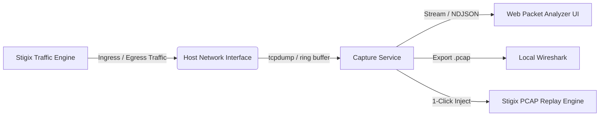

# Product Requirements Document (PRD)
## Stigix Live Packet Capture & Web Analyzer

* **Product:** Stigix (The Engine for SASE & SD-WAN Validation)
* **Component:** Network Observability & Packet Capture Module
* **Status:** Specification / Draft v1.0
* **Date:** October 2026
* **Author:** Antigravity AI & Stigix Engineering Team

---

## 1. Vision & Executive Summary

### 1.1 Context & Problem Statement
Today, Stigix excels at **active traffic generation** (Voice, Video, bulk transfers, synthetic DEM probes, Custom TCP Apps) and **trace replay** (PCAP Replay). However, whenever an anomaly occurs in a lab or customer deployment (packet loss, jitter spike, TCP connection drop after 300s, SASE firewall blocking by Prisma/Palo Alto):
* Network engineers are forced to open an SSH terminal directly to the host machine.
* Manually run complex `tcpdump` commands with specific CLI flags.
* Copy the output capture file back to their local workstation via SCP/SFTP.
* Open the `.pcap` in Wireshark locally to diagnose issues.

### 1.2 Product Goal
Provide an integrated **Packet Capture & Web Inspector** natively inside the Stigix Web Dashboard allowing users to:
1. **Capture** traffic on the active transmit/receive network interface directly from the Web UI.
2. **Inspect and filter** captured packets in-browser with a responsive, modern Wireshark-like 3-pane inspector.
3. **Close the operational loop** with the Stigix ecosystem: download `.pcap` files or inject them in **1 click into the PCAP Replay Engine**.



---

## 2. Personas & Core Use Cases

| Persona | Role | Core Value Proposition |
|---|---|---|
| **SASE / SD-WAN Architect** | Qualification & Benchmarking | Unambiguously prove whether a cloud security gateway (Prisma Access, Zscaler, FortiGate) drops or resets a flow (TCP RST, ToS/DSCP rewrite). |
| **Network Support Engineer** | Incident Troubleshooting | Quickly understand why a persistent session drops (e.g., 300-second firewall idle timeout, missing keepalives, MTU path fragmentation). |
| **QA / Automation Engineer** | Continuous Validation | Trigger automatic captures when a synthetic DEM probe breaches its SLA threshold. |

---

## 3. Functional Specifications

The module consists of three major components:

### 3.1 Backend Capture Orchestrator
1. **Interface Selection:**
   * Auto-discovery of available physical and virtual interfaces (`interfaces.txt` and system introspection).
   * Default selection: the active interface configured for traffic generation.
2. **Capture Filters (BPF - Berkeley Packet Filter):**
   * Free-form BPF input field (e.g., `tcp port 80 or tcp port 443`, `host 192.168.122.51`).
   * 1-Click Quick Presets ("Traffic Gen Only", "Custom TCP Apps Only", "DNS Only", "Voice RTP/SIP Only").
3. **Safety Guardrails & Resource Limits:**
   * **Duration Limit:** Configurable auto-stop (default: 30 seconds, maximum: 300 seconds).
   * **Packet Limit:** Automatic stop upon reaching a threshold (e.g., 5,000 packets max).
   * **Disk Quota:** Immediate abort if the capture file exceeds 50 MB.
   * **Optional Snaplen:** Option to truncate packets to the first 128 bytes (headers only) to preserve bandwidth, CPU, and user privacy.

---

### 3.2 In-Browser Packet Inspector
The user interface provides a clean, modern 3-pane layout inspired by standard protocol analyzers:

```
+---------------------------------------------------------------------------------------+
| [Interface: eth0 v] [Filter: tcp.flags.reset == 1  [Apply]] [▶ Start] [■ Stop] [⬇ Export]|
+---------------------------------------------------------------------------------------+
| No. | Time    | Source         | Destination    | Proto | Len | Info                 |
| 1   | 0.0000  | 192.168.123.102| 192.168.203.100| TCP   | 74  | 54321 → 2323 [SYN]    |
| 2   | 0.0012  | 192.168.203.100| 192.168.123.102| TCP   | 74  | 2323 → 54321 [SYN,ACK]|
| 3   | 0.0013  | 192.168.123.102| 192.168.203.100| TCP   | 66  | 54321 → 2323 [ACK]    |
+---------------------------------------------------------------------------------------+
| ▼ Frame 2: 74 bytes on wire                                                           |
| ▶ Ethernet II, Src: 52:54:00:... Dst: 52:54:00:...                                   |
| ▼ Internet Protocol Version 4, Src: 192.168.203.100, Dst: 192.168.123.102           |
| ▼ Transmission Control Protocol, Src Port: 2323, Dst Port: 54321                      |
|     Flags: 0x012 (SYN, ACK)                                                           |
+---------------------------------------------------------------------------------------+
| 0000  52 54 00 12 34 56 52 54  00 78 9a bc 08 00 45 00  RT..4VRT .x....E.            |
| 0010  00 3c 1a 2b 40 00 40 06  b2 a1 c0 a8 cb 64 c0 a8  .<.+@.@. .....d..            |
+---------------------------------------------------------------------------------------+
```

1. **Virtual Packet Table:**
   * High-performance virtualized rendering (handles thousands of frames smoothly without browser lag).
   * Protocol-based syntax highlighting (TCP in blue/green, UDP/RTP in yellow/orange, ICMP/Errors/RST in rose/red).
2. **Protocol Tree Dissection:**
   * Expandable OSI layers: Frame, Ethernet, IPv4/IPv6, TCP/UDP, Application Payload.
   * Clear display of TCP flags, acknowledgment numbers, window sizing, and ToS/DSCP headers.
3. **Hex/ASCII Dump Viewer:**
   * Synchronized byte highlighting when selecting fields in the protocol tree.

---

### 3.3 Dynamic Display Filtering
* Client-side dynamic filtering without needing to re-capture:
  * By IP: `ip.addr == 192.168.203.100` or `ip.src == ...`
  * By Port: `tcp.port == 2323`
  * By Anomaly: `tcp.flags.reset == 1`, `tcp.analysis.retransmission`
  * By Protocol: `dns`, `icmp`, `tls`, `http`

---

### 3.4 Ecosystem Synergies
* **1-Click "Send to Replay":** Automatically exports the captured trace into `/app/config/pcapsamples/` to replay it instantly across other sites via the stateful L7 replay engine.
* **Auto-Trigger on SLA Breach (Phase 3):** Option to maintain a 10 MB in-memory ring buffer. If a DEM probe drops below critical thresholds (< 40% score or > 10% packet loss), the preceding 30 seconds are frozen into a downloadable `.pcap` linked to the incident event.

---

## 4. Technical Architecture

### 4.1 Backend Engine (Node.js & Linux Native)
* **Packet Capture:** Controlled execution of `tcpdump` / `dumpcap` child process:
  ```bash
  tcpdump -i <iface> -U -s 1500 -w - [BPF_FILTER]
  ```
* **Dissection & Streaming:**
  * Real-time packet parsing via piped `tshark -T ek` (Elasticsearch NDJSON format) or native NDJSON streaming over WebSocket / Server-Sent Events (SSE).
  * Concurrent writing of raw binary `.pcap` to `/var/log/sdwan-traffic-gen/captures/`.
* **API Endpoints:**
  * `POST /api/capture/start` : Initiates a capture session with specified options.
  * `POST /api/capture/stop` : Gracefully halts the active capture session.
  * `GET /api/capture/stream` : WebSocket / SSE stream providing dissected packets.
  * `GET /api/capture/download/:id` : Downloads the raw `.pcap` file.
  * `POST /api/capture/send-to-replay` : Copies the trace into the PCAP replay catalog.

### 4.2 Frontend Architecture (React & TypeScript)
* Virtualized table component for low memory footprint and 60 FPS scrolling.
* Lightweight client-side NDJSON parser.
* Consistent dark mode theme adhering to Stigix glassmorphism and Tailwind tokens.

---

## 5. Security & Safety Guardrails

1. **Storage Safety:**
   * Strict 50 MB quota per capture file; maximum 5 capture sessions retained on disk (FIFO cleanup).
2. **Process Priority:**
   * The capture process runs with lower CPU priority (`nice`) to prevent any interference with active traffic generation or the MCP server.
3. **Data Privacy:**
   * Clear UI disclaimer alerting users that captured packets may contain sensitive payload data.
   * Default option to capture headers only (`snaplen 128` bytes).

---

## 6. Implementation Roadmap

### 🚀 Phase 1: Core Capture & Download (Quick Win - 1 to 2 days)
* Add the **Live Capture** interface to the dashboard.
* Interface dropdown, BPF filter input, 30s timer, Start/Stop controls.
* Backend `tcpdump` execution, clean termination, and direct `.pcap` download.

### 🔍 Phase 2: In-Browser Inspector & Display Filters (2 to 3 days)
* Live packet table rendering via WebSocket / SSE.
* Protocol dissection tree (Ethernet / IP / TCP / UDP).
* Client-side display filter engine.
* 1-Click "Send to PCAP Replay" button.

### ⚡ Phase 3: Automated Capture on DEM SLA Breach (Advanced)
* Background circular ring buffer (10 MB).
* Automated freeze and archive triggered upon synthetic probe health degradation.
