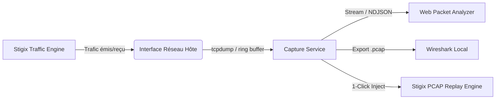

# Product Requirements Document (PRD)
## Stigix Live Packet Capture & Web Analyzer

* **Produit :** Stigix (The Engine for SASE & SD-WAN Validation)
* **Composant :** Module d'observabilité réseau & capture de paquets
* **Statut :** Spécification / Draft v1.0
* **Date :** Octobre 2026
* **Auteur :** Antigravity AI & Ingénierie Stigix

---

## 1. Vision & Résumé Exécutif

### 1.1 Contexte & Problématique
Stigix excelle aujourd'hui dans la **génération active** de trafic (Voix, Vidéo, Transferts de fichiers lourds, sondes DEM, Custom TCP Apps) et dans le **rejeu de traces** (PCAP Replay). Cependant, lorsqu'une anomalie survient en lab ou en production (perte de paquets, augmentation de gigue, rupture de session TCP à 300s, blocage par un pare-feu SASE Prisma/Palo Alto) :
* L'ingénieur doit ouvrir un terminal SSH séparé sur l'hôte.
* Lancer manuellement une commande `tcpdump` avec des arguments complexes.
* Récupérer le fichier via SCP ou SFTP sur son poste de travail.
* Ouvrir Wireshark en local pour analyser les trames.

### 1.2 Objectif Produit
Fournir une fonctionnalité intégrée de **Packet Capture & Web Inspector** native dans Stigix permettant de :
1. **Capturer** le trafic à la volée sur l'interface d'émission/réception active directement depuis l'interface Web.
2. **Visualiser et filtrer** les paquets capturés directement dans le navigateur avec un inspecteur ergonomique (type Wireshark Web réactif).
3. **Boucler la boucle** avec l'écosystème Stigix : télécharger le `.pcap`, ou l'injecter en **1 clic dans le moteur de PCAP Replay**.



---

## 2. Personas & Cas d'Usage Principaux

| Persona | Rôle | Besoin métier |
|---|---|---|
| **Architecte SASE / SD-WAN** | Qualification & Benchmarking | Prouver qu'un firewall Cloud (Prisma Access, Zscaler, FortiGate) réécrit ou bloque un flux spécifique (TCP RST, ToS DSCP modifié). |
| **Ingénieur Support Réseau** | Troubleshooting d'incident | Comprendre pourquoi une session longue s'interrompt (ex: idle timeout 300s, absence de Keepalive, MTU / fragmentation ICMP). |
| **Testeur QA / Automatisation** | Validation continue | Déclencher une capture automatique lorsqu'une sonde DEM franchit un seuil critique de SLA. |

---

## 3. Spécifications Fonctionnelles

Le module se divise en trois composants majeurs :

### 3.1 Module de Capture (Backend Orchestrator)
1. **Sélection de l'Interface :**
   * Auto-détection des interfaces physiques et virtuelles disponibles (`interfaces.txt` et introspection système).
   * Par défaut : sélection automatique de l'interface associée au générateur de trafic.
2. **Filtres de Capture (BPF - Berkeley Packet Filter) :**
   * Champ de saisie libre BPF (ex: `tcp port 80 or tcp port 443`, `host 192.168.122.51`).
   * Raccourcis en un clic ("Traffic Gen Only", "Custom TCP Apps Only", "DNS Only", "Voice RTP/SIP Only").
3. **Garde-fous de Sécurité & Performance (Safety Guardrails) :**
   * **Limite de temps :** Arrêt automatique paramétrable (par défaut : 30 secondes, max : 300 secondes).
   * **Limite de paquets :** Arrêt automatique (ex: 5 000 paquets max).
   * **Limite de taille disque :** Arrêt immédiat si le fichier dépasse 50 Mo.
   * **Snaplen optionnel :** Possibilité de tronquer les paquets aux 128 premiers octets (headers seuls) pour préserver la vie privée et économiser le CPU/disque.

---

### 3.2 Visualiseur & Inspecteur Web (In-Browser Packet Analyzer)
L'interface utilisateur proposera une vue inspirée des standards de l'analyse réseau (disposition 3 volets épurée et moderne) :

```
+---------------------------------------------------------------------------------------+
| [Interface: eth0 v] [Filter: tcp.flags.reset == 1  [Apply]] [▶ Start] [■ Stop] [⬇ Export]|
+---------------------------------------------------------------------------------------+
| No. | Time    | Source         | Destination    | Proto | Len | Info                 |
| 1   | 0.0000  | 192.168.123.102| 192.168.203.100| TCP   | 74  | 54321 → 2323 [SYN]    |
| 2   | 0.0012  | 192.168.203.100| 192.168.123.102| TCP   | 74  | 2323 → 54321 [SYN,ACK]|
| 3   | 0.0013  | 192.168.123.102| 192.168.203.100| TCP   | 66  | 54321 → 2323 [ACK]    |
+---------------------------------------------------------------------------------------+
| ▼ Frame 2: 74 bytes on wire                                                           |
| ▶ Ethernet II, Src: 52:54:00:... Dst: 52:54:00:...                                   |
| ▼ Internet Protocol Version 4, Src: 192.168.203.100, Dst: 192.168.123.102           |
| ▼ Transmission Control Protocol, Src Port: 2323, Dst Port: 54321                      |
|     Flags: 0x012 (SYN, ACK)                                                           |
+---------------------------------------------------------------------------------------+
| 0000  52 54 00 12 34 56 52 54  00 78 9a bc 08 00 45 00  RT..4VRT .x....E.            |
| 0010  00 3c 1a 2b 40 00 40 06  b2 a1 c0 a8 cb 64 c0 a8  .<.+@.@. .....d..            |
+---------------------------------------------------------------------------------------+
```

1. **Tableau des Paquets (Virtual Table) :**
   * Affichage paginé ou virtualisé (support de milliers de trames sans freeze du navigateur).
   * Coloration syntaxique par protocole (TCP en bleu/vert, UDP/RTP en jaune/orange, ICMP/Errors/RST en rose/rouge).
2. **Arborescence de Dissection (Protocol Tree) :**
   * Dépliage/repliage par couche OSI : Frame, Ethernet, IPv4/IPv6, TCP/UDP, Payload.
   * Affichage clair des flags TCP, fenêtres d'accusé, options et ToS/DSCP.
3. **Hex/ASCII Dump Viewer :**
   * Synchronisation au clic sur un champ de l'arborescence (surbrillance des octets correspondants).

---

### 3.3 Moteur de Filtrage Évolué (Display Filters)
* Filtrage dynamique côté client sans avoir à relancer une capture :
  * Par IP : `ip.addr == 192.168.203.100` ou `ip.src == ...`
  * Par Port : `tcp.port == 2323`
  * Par Anomalie : `tcp.flags.reset == 1`, `tcp.analysis.retransmission`
  * Par Protocole : `dns`, `icmp`, `tls`, `http`

---

### 3.4 Synergie avec l'Écosystème Stigix
* **Bouton "Send to PCAP Replay" :** Envoie directement la capture dans le catalogue `/app/config/pcapsamples/` pour pouvoir la rejouer instantanément via le moteur stateful replay.
* **Auto-Capture sur incident SLA (Phase future) :** Option "Trigger on SLA Breach" : garde un ring buffer circulaire de 10 Mo en mémoire ; si la sonde DEM remonte un score < 40% ou une perte > 10%, la trace des 30 dernières secondes est figée et attachée à l'événement de santé.

---

## 4. Architecture Technique

### 4.1 Backend (Node.js & Linux Native)
* **Collecte :** Exécution contrôlée de `tcpdump` en processus enfant avec streaming standard :
  ```bash
  tcpdump -i <iface> -U -s 1500 -w - [BPF_FILTER]
  ```
* **Dissection & Streaming :**
  * Approche ultra-performante : pipe direct vers `tshark -T ek` (format JSON Elasticsearch ligne par ligne) ou NDJSON vers un WebSocket / Server-Sent Events (SSE).
  * Génération simultanée du fichier brut `.pcap` dans `/var/log/sdwan-traffic-gen/captures/`.
* **API Endpoints :**
  * `POST /api/capture/start` : Démarre une session de capture avec options.
  * `POST /api/capture/stop` : Interrompt la session courante.
  * `GET /api/capture/stream` : WebSocket / SSE pour afficher les paquets en live.
  * `GET /api/capture/download/:id` : Télécharge le fichier `.pcap` horodaté.
  * `POST /api/capture/send-to-replay` : Copie le fichier dans le dossier de replay.

### 4.2 Frontend (React & TypeScript)
* Utilisation de composants React virtualisés (`@tanstack/react-virtual` ou table CSS virtualisée déjà présente dans Stigix).
* Parseur de flux NDJSON léger en temps réel.
* Prise en charge du thème sombre natif de Stigix avec accents Tailwind et glassmorphism.

---

## 5. Contraintes & Mesures de Sécurité

1. **Isolation disque :**
   * Quota strict : 50 Mo max par capture, max 5 captures conservées (auto-nettoyage LIFO).
2. **CPU & Mémoire :**
   * Le process de capture doit être plafonné (nice priority) pour ne jamais impacter la génération de trafic ou le MCP server.
3. **Confidentialité :**
   * Avertissement UI clair rappelant que les paquets peuvent contenir des en-têtes ou payloads sensibles.
   * Option par défaut de tronquage payload (`snaplen 128` octets).

---

## 6. Feuille de Route d'Implémentation (Roadmap)

### 🚀 Phase 1 : Core Capture & Téléchargement (Quick Win - 1 à 2 jours)
* Ajout de l'onglet / composant **Packet Capture** dans Stigix.
* Sélecteur d'interface, champ BPF, timer de capture (30s).
* Déclenchement de `tcpdump`, arrêt propre, et téléchargement immédiat du fichier `.pcap`.

### 🔍 Phase 2 : In-Browser Inspector & Filtres (2 à 3 jours)
* Affichage du tableau des paquets en temps réel via WebSocket / SSE.
* Volet de dissection (Ethernet / IP / TCP / UDP).
* Moteur de filtres display (IP, port, protocole, flag).
* Bouton "Export to PCAP Replay".

### ⚡ Phase 3 : Capture Automatique sur Alerte DEM (Avancé)
* Buffer tournant (Ring Buffer) de 10 Mo en tâche de fond.
* Déclencheur automatique lors des chutes de SLA du Failover Monitoring / Synthetic Probes.
