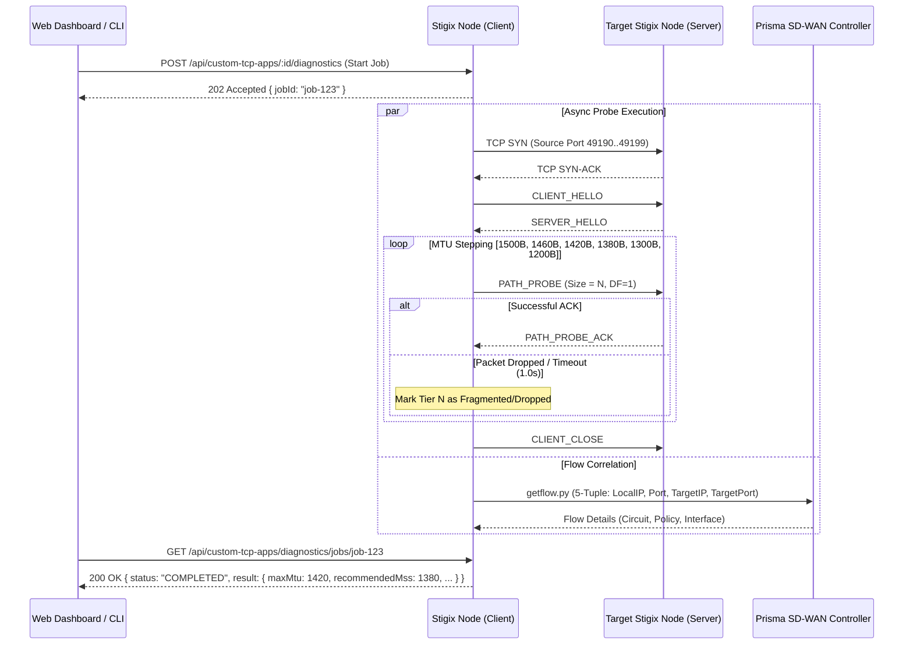

> **Last Updated:** 2026-09-18 | **Created:** 2026-09-18 (v2.0.55)

# PRD — Stigix On-Demand Path MTU Discovery, WAN Asymmetry & SD-WAN Flow Diagnostics

**Document Status:** Draft / Specification  
**Target Milestone:** Stigix V2.x  
**Component:** Custom TCP Applications (`web-dashboard`, `engines/getflow.py`, `stigix-cli`, `mcp-server`)  
**Author:** Stigix Core Engineering Team  

---

## 1. Executive Summary & Objective

In enterprise SD-WAN and hybrid multi-cloud topologies (e.g., Prisma SD-WAN, IPsec VPN tunnels, MPLS with VXLAN/GRE encapsulation), MTU mismatch and TCP MSS misconfiguration cause silent packet drops, performance degradation, and TCP retransmissions.

The **Path MTU & SD-WAN Transport Diagnostic Engine** aims to provide network engineers with an on-demand, 1-click diagnostic tool to:
1. **Detect Path MTU (PMTU)** and encapsulation overhead across any active WAN path without ICMP dependency.
2. **Calculate Recommended TCP MSS Clamping values** with instant CLI configuration snippets for Cisco IOS-XE, VyOS, and Linux iptables.
3. **Measure One-Way Delay & Path Asymmetry** ($T_{\text{forward}}$ vs $T_{\text{reverse}}$).
4. **Correlate the exact 5-tuple probe with Prisma SD-WAN Flow Browser API** to identify active WAN circuit, ION interface, backup circuit, and QoS policies.

---

## 2. Lessons Learned & Architectural Challenges

During early iterations, several fundamental architectural bottlenecks were identified:

### 2.1 The Synchronous HTTP Blocking Pitfall
* **Issue:** Running sequential stepping across 9 MTU tiers (1500B down to 1200B) inside a single synchronous Express HTTP request handler blocks the client and hits Cloudflare / reverse-proxy gateway timeouts (HTTP 502/504) if intermediate routers drop packets or if peers are slow.
* **Architecture Solution:** Migrate to an **Asynchronous Diagnostic Job Pattern** (e.g., `POST /api/diagnostics/jobs` returning `jobId`, followed by Server-Sent Events or polling `GET /api/diagnostics/jobs/:id`).

### 2.2 Uncaught Socket & Parser EventEmitter Exceptions
* **Issue:** In Node.js, `FrameParser` and `net.Socket` emit `'error'` events on protocol mismatch (e.g., target port is an HTTP service replying with `HTTP/1.1 200 OK`) or connection reset (`ECONNRESET`). Without permanent listeners, Node.js throws Uncaught Exceptions, terminating the backend process.
* **Architecture Solution:** 
  * Strict socket lifecycle management with permanent error/close hooks.
  * Non-throwing protocol negotiation with explicit support for identifying foreign (HTTP / plain TCP) services.
  * Global process exception guards in `server.ts`.

### 2.3 Mixed-Version Fleets (Heterogeneous Node Versions)
* **Issue:** In multi-branch deployments (DC1, BR1, BR5, BR8), remote destination nodes may not yet be upgraded to the latest build supporting dedicated `PATH_PROBE` binary frames.
* **Architecture Solution:** Explicit 3-tiered handshake negotiation:
  1. **Tier 1 (Native Stigix v2 `PATH_PROBE`)**: Dedicated probe frames with hardware/server timestamps for precision One-Way Delay.
  2. **Tier 2 (Universal Stigix `REQUEST` Fallback)**: Standard padded request frames compatible with any earlier Stigix custom TCP server.
  3. **Tier 3 (Foreign / Non-Stigix Detection)**: Cleanly report unreachable/foreign endpoint without stalling.

---

## 3. Detailed Technical Architecture

### 3.1 Framing & Protocol Design

```text
Stigix Binary Frame Format:
+--------------------------+--------------------------------------------------+
| 4-Byte UInt32BE (Length) | UTF-8 JSON Payload                               |
+--------------------------+--------------------------------------------------+
```

#### Modern Probe Frame (`PATH_PROBE`):
```json
{
  "type": "PATH_PROBE",
  "probeId": "PRB-A1B2C3D4",
  "clientSessionId": "diag-9f8e7d",
  "seq": 1,
  "stepBytes": 1500,
  "sentTs": 1758231000123,
  "padding": "XXXXX..."
}
```

#### Probe Acknowledgment (`PATH_PROBE_ACK`):
```json
{
  "type": "PATH_PROBE_ACK",
  "probeId": "PRB-A1B2C3D4",
  "clientSessionId": "diag-9f8e7d",
  "seq": 1,
  "stepBytes": 1500,
  "clientSentTs": 1758231000123,
  "serverRecvTs": 1758231000145
}
```

### 3.2 Asynchronous Job Execution Flow



---

## 4. MTU Stepping & Recommendation Algorithm

1. **Standard MTU Tiers**:
   `[1500, 1492 (PPPoE), 1460, 1420 (IPsec Standard), 1400, 1380 (SD-WAN/GRE), 1350, 1300, 1200]`
2. **Binary Search / Early Stop**:
   If 1500B passes $\to$ Full standard MTU available, skip smaller tiers.
   If smaller tier fails $\to$ Mark failure threshold and proceed downwards.
3. **Recommended MSS Calculation**:
   $$\text{MSS}_{\text{recommended}} = \text{MTU}_{\text{max}} - 40\text{ bytes (IP + TCP headers)}$$
4. **Configuration Generator Matrix**:
   * **VyOS:** `set firewall options interface <LAN_INTF> adjust-mss <MSS>`
   * **Cisco IOS-XE:** `interface <LAN_INTF>\n ip tcp adjust-mss <MSS>`
   * **Linux iptables:** `iptables -t mangle -A FORWARD -p tcp --tcp-flags SYN,RST SYN -j TCPMSS --set-mss <MSS>`

---

## 5. Flow Browser Correlation Matrix

Using deterministic 5-tuple socket binding (`localPort: 49190..49199`), the engine queries Prisma SD-WAN Flow Browser via `engines/getflow.py`:
* **Matched Circuit:** Active WAN Underlay / Overlay Circuit Name & ID.
* **ION Interface:** Outbound physical/subinterface on ION appliance.
* **Path Policy:** Active Traffic Steering / SLA Policy applied to the flow.
* **Path Evolution:** Path state transitions (e.g., `INET ➔ BACKUP_MPLS`).

---

## 6. Delivery Plan & Phases

| Phase | Description | Deliverables |
|---|---|---|
| **Phase 1** | Background Job Manager & Safe Sockets | Async worker queue, zero-crash EventEmitter wrappers, test suites with mock servers. |
| **Phase 2** | Backward-Compatible Stepping Engine | Tiered fallback matrix, strict timeout boundaries, multi-version unit tests. |
| **Phase 3** | Prisma SD-WAN Flow Browser Sync | Real-time 5-tuple lookup with retry backoff and caching. |
| **Phase 4** | Web UI & CLI Integration | `PathProbeModal` with live progress streaming, `stigix-cli custom-app diagnose`, MCP tool. |

---

## 7. Sign-off & Future Re-engagement

This PRD serves as the authoritative blueprint. Development will resume according to the asynchronous job pattern to ensure zero impact on existing web dashboard stability.
