> **Last Updated:** 2026-10-03 | **Created:** 2026-10-03 (v2.0.145)

# 📄 PRD — Stigix PCAP Stateful Replay Engine

## 1. Executive Summary

The **Stigix PCAP Stateful Replay Engine** lets network and security engineers import real application and threat packet captures (`.pcap`, `.pcapng`) and replay them as live, bidirectional traffic between Stigix instances: across SD-WAN overlays, through Prisma SASE, and towards Stigix Cloud Targets.

### 1.1 The Field Problem
In PoCs, Ultimate Test Drive (UTD) labs, and SASE validation sessions, SEs and TMEs struggle to populate **App-ID**, **Threat Prevention**, and **IoT Device Security** with realistic traffic. Today's workaround is a dedicated Linux VM running `tcpreplay` into an NGFW **TAP interface**. This works, but it is:
* **Out-of-band:** a TAP sees traffic but nothing is enforced; SD-WAN path selection and SASE policies are never exercised.
* **Not routable:** raw replays do not survive NAT, stateful firewalls, or SD-WAN overlays.
* **Not deployable at customer branches:** it requires physical/virtual TAP wiring.

### 1.2 Value Proposition
* **Bring Your Own App (BYO-App):** replay a short capture of a proprietary or legacy application (SAP GUI, Oracle TNS, Citrix ICA, DICOM, HL7, Modbus) across the Stigix mesh.
* **Real App-ID and Threat signatures in-band:** exact L7 payloads traverse the real enforcement path (SD-WAN + NGFW/SASE), not a TAP.
* **Realistic SD-WAN chaos validation:** real kernel TCP sessions react naturally to VyOS-injected latency, loss, and failover.

---

## 2. Goals & Non-Goals

### 2.1 Goals (Phase 1)
* Replay **TCP and UDP** request/response conversations between two Stigix instances using real OS sockets.
* Trigger the **same App-ID** on Palo Alto NGFW / Prisma Access as the original capture, for cleartext protocols.
* Produce a **security verdict** (Enforced / Bypass / Inconclusive) for threat captures, consistent with existing Stigix C2 scenarios.
* Stay **NAT, firewall, and SD-WAN friendly** (no raw packet injection).

### 2.2 Non-Goals (Phase 1)
* ❌ Decrypting TLS captures without session keys.
* ❌ Preserving original L2 identity (MAC) or original IPs. This is addressed by IoT Simulator integration (Section 7) and Phase 2 raw replay.
* ❌ Line-rate / multi-gigabit stress testing (Phase 2).
* ❌ Non-TCP/UDP protocols (SCTP, GRE, multicast, OSPF): Phase 2.
* ❌ Live browsing and auto-download of large public datasets (see Section 9).
* ❌ Replaying captures against third-party servers. **Both ends must be Stigix instances.**

---

## 3. How Replay Works (Phase 1: Stateful L7 Socket Replay)

The capture is treated as a **script**: the parser extracts the ordered application turns, then two Stigix instances play the client and server roles with real sockets. **`tcpreplay` is not used in Phase 1.**

### 3.1 Parsing Pipeline (Leader)
1. Stream-read the capture (`dpkt` / `scapy.PcapReader`) without loading it fully into memory.
2. Identify flows (5-tuple) and their roles (client = SYN initiator; for UDP, first sender).
3. Reassemble TCP segments in sequence order; drop pure ACKs, retransmissions, and empty SYN/FIN.
4. Merge consecutive same-direction segments into **turns**.
5. Record per turn: direction, byte count, payload, and inter-turn delay from the original capture.
6. Emit a compressed replay profile (`.stx-replay`, gzip).

### 3.2 Byte-Accurate State Machine
TCP is a **byte stream**: a single `recv()` may return only part of a turn. Each side therefore reads **until the expected byte count is reached** (or a timeout fires) before moving to the next turn:

```python
def read_exact(sock, n, timeout):
    sock.settimeout(timeout)
    buf = bytearray()
    while len(buf) < n:
        chunk = sock.recv(min(65536, n - len(buf)))
        if not chunk:
            raise ConnectionClosed(received=len(buf), expected=n)
        buf.extend(chunk)
    return bytes(buf)

# Server side
for turn in profile.turns:
    if turn.sender == "client":
        read_exact(conn, turn.length, timeout=turn_timeout)
    else:
        if turn.delay_ms:
            sleep(turn.delay_ms / 1000)   # optional "original timing" mode
        conn.sendall(turn.payload)
```

### 3.3 Turn Triggers
| Trigger | Meaning | Example |
| :--- | :--- | :--- |
| `after_peer_turn` (default) | Send once the previous peer turn is fully received | Request → Response |
| `on_connect` | Server speaks first right after the handshake | SSH / FTP / SMTP banner |
| `after_delay` | Send after a recorded delay, without waiting for the peer | Server push, heartbeat |

### 3.4 Ports
* **Server port:** same as the capture by default (preserves `application-default` service matching). Overridable if already in use.
* **Client port:** OS-assigned ephemeral port, like any real client.

### 3.5 UDP
UDP turns are sent as datagrams preserving original boundaries. Each side waits for the expected datagram(s) with a timeout. This covers DNS, NTP, SSDP, mDNS (unicast), CoAP, syslog, and most IoT telemetry.

---

## 4. Architecture

```mermaid
sequenceDiagram
    autonumber
    participant UI as Stigix Dashboard (Leader)
    participant Parser as PCAP Parser (Leader)
    participant Store as Replay Profile Store
    participant NodeB as Target Node (Server role)
    participant NodeA as Source Node (Client role)
    participant SASE as SD-WAN / NGFW / Prisma Access

    UI->>Parser: Upload capture.pcap
    Parser->>Parser: Flow detection, TCP reassembly, turn extraction
    Parser->>UI: Preview (flows, ports, turns, bytes, warnings)
    UI->>Store: Save selected flows as profile (sha256)
    UI->>NodeB: Assign server role (profile id + hash)
    UI->>NodeA: Assign client role (target, profile id + hash)
    NodeB->>Store: Fetch profile on demand (verify sha256)
    NodeA->>Store: Fetch profile on demand (verify sha256)

    rect rgb(20, 30, 45)
    Note over NodeA,NodeB: Live replay
    NodeA->>SASE: TCP SYN to server port
    SASE->>NodeB: Forward
    NodeB-->>NodeA: SYN-ACK
    NodeA->>SASE: Client turn 1
    Note over SASE: App-ID / Threat inspection
    SASE->>NodeB: Deliver turn 1
    NodeB->>NodeA: Server turn 2
    NodeA->>UI: Telemetry + verdict
    end
```



### 4.1 Profile Distribution
Profiles can weigh several MB, so they are **not** embedded in the 30s Central Provisioning pull cycle. Provisioning only carries **references** (`profile_id`, `sha256`, size). Nodes download the profile on demand from the Leader through the existing gateway / reverse tunnel, verify the hash, and cache it locally.

---

## 5. Deployment Topologies

```text
A. East-West (private mesh / SD-WAN overlay)
   [ BR8 - client role ] ──── SD-WAN overlay ────► [ DC1 - server role ]

B. North-South (SASE egress)
   [ BR8 - client role ] ─── Prisma Access ───► [ Stigix Cloud Target - public IP (Hetzner / AWS) ]
```

* **East-West:** both instances in private address space.
* **North-South:** the server role runs on a self-owned Stigix Cloud Target. This is legal and compliant because both endpoints belong to the operator. If Prisma Access blocks a threat payload, it never reaches the cloud host.
* **Hard rule:** the client role may only target endpoints that are registered Stigix instances (registry or manual peers). Arbitrary destinations are rejected.

---

## 6. Security Verdict Model

For threat captures, the client must distinguish **blocked by security** from **network failure**. The verdict model is aligned with existing Stigix C2 scenarios:

| Observation | Verdict |
| :--- | :--- |
| All turns completed, payload received intact | **Bypass** (threat not blocked) |
| TCP RST / connection closed right after the malicious turn, while a control replay on the same path succeeds | **Enforced** |
| HTTP block page detected in the server turn (status / signature) | **Enforced** |
| Timeout before the malicious turn, or control replay also fails | **Inconclusive** |

* **Control replay:** before each threat replay, a benign profile is replayed on the same source/target/port to prove the path works.
* Each threat profile declares its **malicious turn index** so the verdict can tell "blocked at the exploit" apart from "blocked at the handshake".

---

## 7. IoT Device Security Integration (Key Requirement)

### 7.1 The Problem
Palo Alto IoT Security identifies devices by **MAC, DHCP fingerprint, IP, and behavior**. If every replayed flow leaves from the Stigix host IP, the firewall sees **one device** with incoherent behavior (camera + PLC + printer). Phase 1 socket replay alone therefore does **not** satisfy the UTD IoT use case.

### 7.2 The Approach
Bind replay flows to **virtual devices from the existing Stigix IoT Simulator** (Scapy DHCP/ARP, per-device MAC, DHCP fingerprint). Each replayed flow originates from the IP of its virtual device.

Two implementation options, to be validated in a spike:

| Option | How | Pros | Cons |
| :--- | :--- | :--- | :--- |
| **macvlan per device** | Create a macvlan sub-interface per virtual device (own MAC + DHCP IP); bind kernel sockets to it | Real kernel TCP stack, byte-accurate replay reused as-is | Requires host networking + `NET_ADMIN`; macvlan limits on some hypervisors / Wi-Fi |
| **Userspace TCP (Scapy)** | Forge TCP on the virtual IP from the simulator's existing Scapy engine | No extra interfaces | Must implement handshake, retransmit, windowing; fragile under loss |

**Recommendation:** macvlan first (Linux host mode only, same constraint as the IoT Simulator today), userspace TCP as fallback.

---

## 8. TLS / HTTPS Handling

### 8.1 Cleartext Protocols
Exploits over HTTP, Modbus, S7, DNP3, BACnet, MQTT, DICOM, HL7, DNS, SMB, LDAP: replayed with full payload fidelity, no certificate involved.

### 8.2 Encrypted Captures
**A TLS payload cannot be extracted from a capture without the session keys.** Supported cases:

| Capture | Behavior |
| :--- | :--- |
| TLS **with** `SSLKEYLOGFILE` provided | Decrypt at parse time, extract cleartext turns, replay inside a fresh TLS session between the two Stigix nodes |
| TLS **without** keys | Replay only the **ClientHello metadata (SNI, ALPN)** in a fresh TLS session with filler payload. Often enough for SNI-based App-ID; flagged as **partial fidelity** |
| QUIC / encrypted UDP | Not supported in Phase 1 (flagged at parse time) |

### 8.3 Prisma Access SSL Decryption Pitfall
When Prisma decrypts traffic towards a Stigix Cloud Target, it validates the **target's server certificate**. A self-signed certificate is treated as untrusted and re-signed with **Forward-Untrust-CA**, causing client-side failures. Requirements:
* Cloud Targets serving TLS replays must present a **publicly trusted certificate** (e.g. Let's Encrypt on a DNS name), **or**
* The decryption policy must exclude the target, **or**
* The client explicitly trusts Forward-Untrust-CA (lab-only option, clearly labeled).

The client trusts **Forward-Trust-CA** through the existing Stigix CA bundle (`config/certs/ca-bundle.pem`).

---

## 9. PCAP Library (Curated) & Public Sources

### 9.1 Why Not a Live "Browse & Download" Hub
* **Size:** several public datasets weigh tens of GB (e.g. CIC-IDS2017).
* **Licensing:** some require registration (CIC) or academic-use agreements (UNSW).
* **Live malware:** some malware captures contain real binaries. Storing them on nodes can trigger host EDR, and Prisma will likely block the download itself.

### 9.2 Approach
* **Stigix Curated Library:** short, trimmed, sanitized, license-compliant profiles (already converted to `.stx-replay`) shipped or downloadable from the Stigix repo, each with a source attribution, license, and expected App-ID / Threat ID.
* **Reference Sources Page:** links to public repositories for users who want to fetch and upload their own captures:

| Source | Focus |
| :--- | :--- |
| [NETRESEC PcapFiles](https://www.netresec.com/?page=PcapFiles) | Index of public captures: malware, SCADA, forensics |
| [UNSW IoT Analytics](https://iotanalytics.unsw.edu.au/) | Traces from physical IoT devices |
| [Aalto University IoT Captures](https://research.aalto.fi/en/datasets/iot-devices-captures/) | IoT device setup captures |
| [ICS_PCAPS (tjcruz-dei)](https://github.com/tjcruz-dei/ICS_PCAPS) | Modbus / industrial captures |
| [Stratosphere IPS](https://www.stratosphereips.org/) | Malware / botnet traffic |
| [CIC Datasets (UNB)](https://www.unb.ca/cic/datasets/index.html) | IDS/IPS benchmark datasets |
| [IEEE DataPort](https://ieee-dataport.org/datasets) | Research datasets (search "pcap", "iot") |

---

## 10. Storage & Sizing

* Pure ACKs, retransmissions, and headers are dropped; payloads are gzip-compressed. Actual ratios depend on the protocol and **must be measured during M1** (no committed figures).
* **Upload limit:** 100 MB per capture in Phase 1 (configurable).
* **Parser memory:** streaming, bounded buffers; target < 128 MB RSS during parsing (to be validated).
* **Multi-flow captures:** the preview lists all flows (5-tuple, protocol, bytes, turns, detected App) and lets the user **select which flows** become a profile.

---

## 11. Data Model

```json
{
  "id": "rp-sap-po-create",
  "name": "SAP GUI - Purchase Order Creation",
  "category": "enterprise",
  "source": { "file": "sap_po_create.pcap", "sha256": "…", "license": "customer-provided" },
  "fidelity": "full",
  "expected": { "app_id": "sap", "threat_id": null },
  "flows": [
    {
      "flow_id": 1,
      "transport": "tcp",
      "server_port": 3200,
      "tls": { "mode": "none" },
      "malicious_turn": null,
      "turns": [
        { "seq": 1, "sender": "client", "trigger": "after_peer_turn", "length": 128,  "delay_ms": 0,  "payload_ref": "chunk-0001" },
        { "seq": 2, "sender": "server", "trigger": "after_peer_turn", "length": 1024, "delay_ms": 12, "payload_ref": "chunk-0002" }
      ]
    }
  ],
  "replay_settings": {
    "loop": true,
    "concurrency": 2,
    "interval_ms": 500,
    "timing": "as_fast_as_possible",
    "turn_timeout_ms": 5000
  }
}
```
* Payloads are stored as compressed binary chunks referenced by `payload_ref`, not inline base64, to keep manifests small.
* `fidelity`: `full` | `partial_tls_metadata` | `unsupported`.
* `timing`: `as_fast_as_possible` | `original` (honor recorded inter-turn delays).

---

## 12. Known Limitations

| Limitation | Impact | Mitigation |
| :--- | :--- | :--- |
| **IPs embedded in payloads** (FTP PORT, SIP/SDP, SMB, H.323) | NGFW ALGs/decoders may see inconsistent addresses | Flag at parse time; optional payload IP rewrite (best effort, length-preserving) |
| **Dynamic protocol fields** (session IDs, nonces, signatures) | None between two Stigix nodes (both sides replay the script), but strict protocol decoders could flag anomalies | Document; prefer short captures from session start |
| **Mid-stream captures** (no SYN) | Role detection unreliable | User selects client/server manually |
| **TLS without keys** | Partial fidelity only | See Section 8.2 |
| **Original MAC/IP not preserved** | IoT identity lost without simulator binding | Section 7 |

---

## 13. Risks & Data Protection

* **Sensitive data in customer captures:** captures often contain credentials, tokens, emails, and internal hostnames.
  * Parse-time **sensitive data scan** (cleartext credentials, auth headers, emails, card-number patterns) with a mandatory review step before saving.
  * **Scrubbing enabled by default** (length-preserving replacement, protocol magic bytes kept).
  * Raw uploaded `.pcap` files are **deleted after parsing** by default; only the profile is kept.
* **Profile propagation:** profiles are fetched only by nodes assigned to them (not broadcast to the whole mesh).
* **Abuse prevention:** client role restricted to registered Stigix targets (Section 5).

---

## 14. Success Criteria

* ✅ **App-ID parity:** for a reference set of 10 cleartext captures, the App-ID logged by the NGFW/Prisma during replay matches the App-ID of the original capture.
* ✅ **Threat parity:** for 5 reference threat captures, the same Threat ID is logged and the Stigix verdict is **Enforced**.
* ✅ **Resilience:** replays complete under 150 ms added latency and 2% loss injected via VyOS, with no state machine desynchronization.
* ✅ **IoT identity (M4):** 5 replayed device profiles appear as **5 distinct devices** in IoT Security.

---

## 15. Two-Phased Roadmap

### Phase 1: Stateful L7 Socket Replay
Kernel TCP/UDP sockets, byte-accurate state machine, verdict model, curated library, IoT Simulator binding.

### Phase 2: Raw Line-Rate Replay
`tcprewrite` + `tcpreplay` (or AF_XDP) for line-rate stress, L2 fidelity (original MAC/IP preserved), non-TCP/UDP protocols, and TAP/SPAN-style lab feeds. Same profile store and UI with a **Replay Mode** switch.

---

## 16. Implementation Milestones

| Milestone | Scope | Deliverables |
| :--- | :--- | :--- |
| **M1 — Parser** | Streaming parser, flow detection, TCP reassembly, UDP turns, TLS keylog support, sensitive data scan | CLI producing `.stx-replay` profiles + measured size ratios |
| **M2 — Replay Runtime** | Byte-accurate client/server state machine (TCP + UDP), triggers, timeouts, telemetry | Runtime integrated with Custom TCP Apps engine |
| **M3 — UI & Distribution** | Upload, flow selection preview, source/target assignment, on-demand profile fetch with sha256 | Replay tab in Custom Apps |
| **M4 — IoT Binding (spike → build)** | macvlan per virtual device vs userspace TCP | Replays sourced from IoT Simulator device identities |
| **M5 — Security Verdicts & Curated Library** | Control replay, malicious turn tracking, Enforced/Bypass/Inconclusive, first curated profiles | Threat replay presets with expected Threat IDs |
| **M6 — Phase 2 Hook** | `tcpreplay` raw mode behind a Replay Mode switch | Line-rate / L2-fidelity replay |

---

## 📜 Revision History

| Date | Stigix Version | Author / Trigger | Summary of Changes |
|---|---|---|---|
| 2026-10-03 | `v2.0.145` | Stigix Core Team | Technical review: byte-accurate state machine, UDP in Phase 1, security verdict model, IoT Simulator binding (macvlan / userspace TCP), corrected TLS strategy (keylog / SNI-only, Forward-Untrust pitfall), curated library instead of live hub, on-demand profile distribution, goals/non-goals, limitations, risks, success criteria. |
| 2026-10-03 | `v2.0.145` | Stigix Core Team | Added public PCAP sources, UTD lab field context, Cloud Target topology, and TLS section. |
| 2026-10-03 | `v2.0.145` | Stigix Core Team | Initial PRD for PCAP Stateful Replay Engine (L7 Socket & Line-Rate roadmap). |
