> **Last Updated:** 2026-10-03 | **Created:** 2026-10-03 (v2.0.145)

# 📄 PRD — Stigix PCAP Stateful Replay Engine

## 1. Executive Summary & Business Vision

The **Stigix PCAP Stateful Replay Engine** allows network and security engineers to import real-world application packet captures (`.pcap`, `.pcapng`) directly into Stigix and replay them as live, bidirectional, stateful application traffic between Stigix instances across SD-WAN overlays, SASE tunnels, and hybrid clouds.

### The Value Proposition
* **"Bring Your Own Enterprise App" (BYO-App):** Customers and partners can capture 30 seconds of proprietary or legacy enterprise traffic (e.g. SAP GUI, Oracle DB, Citrix ICA, SWIFT, DICOM Medical Imaging, SCADA/Modbus) and replay it instantly across Stigix mesh nodes.
* **100% Deterministic Palo Alto App-ID Triggering:** Replays exact binary L7 payloads, ensuring firewalls and Prisma SASE recognize the real application signature (`sap-netweaver`, `citrix`, `oracle`, etc.) instead of generic HTTP/TCP.
* **Realistic SD-WAN Failover & QoS Validation:** Validates how SD-WAN underlay impairments (packet loss, latency jitter, bandwidth throttling) impact real business applications with natural TCP window backoff and retransmissions.

---

## 2. Storage, Memory & Payload Optimization Strategy

### ❓ The Challenge: *"If a PCAP is 1GB, does it generate a 1GB JSON?"*

In standard network packet captures:
1. **Network Header Overhead:** Ethernet (14B), IP (20B), and TCP headers (20–32B) represent 10–15% of the total capture size.
2. **Empty TCP ACKs & Handshakes:** Pure acknowledgment packets (without data payload) often make up **35% to 50% of total packets** in a TCP stream.
3. **Application Payload Size:** For interactive enterprise transactions (SAP, SQL, CRM, API), real application captures are typically between **500 KB and 50 MB**.

### Stigix Storage & Parsing Architecture

```
[ Raw PCAP File (.pcap / .pcapng) ]
               │
               ▼ (Streaming Parser: scapy.PcapReader / dpkt)
┌─────────────────────────────────────────────────────────────┐
│ 1. Filter out pure TCP ACKs, SYN/FIN without payload        │
│ 2. Reassemble TCP Segments into logical L7 Application Turns│
│ 3. Extract metadata (Server Port, Timers, Byte Counts)      │
└──────────────────────────────┬──────────────────────────────┘
                               ▼
┌─────────────────────────────────────────────────────────────┐
│ Optimized Binary Archive / Compressed Profile (.stx-pcap)   │
│  • Gzip-compressed binary payloads (60–80% size reduction)  │
│  • Chunked stream loading (Zero RAM explosion on Leader)    │
│  • Memory usage capped at < 64 MB per stream                 │
└──────────────────────────────┘
```

#### Size Comparison & Safety Limits:
| Input File | Typical Payload | Stigix Replay Profile | Memory Footprint |
| :--- | :--- | :--- | :--- |
| **5 MB** (ERP Transaction) | ~3.8 MB payload | **~900 KB** (Compressed) | ~4 MB RAM |
| **50 MB** (Large Database Query) | ~42 MB payload | **~12 MB** (Compressed) | ~18 MB RAM |
| **1 GB** (Large File Transfer) | ~900 MB payload | **Chunked Binary Stream** | ~32 MB Stream Buffer |

* **Recommended Capture Limit:** 100 MB for standard stateful interactive replays (covers 99.9% of application transaction testing).
* **Streaming Engine:** For captures > 50 MB, the engine reads and streams chunks on-demand without loading the full file into Node.js/Python heap memory.

---

## 3. Two-Phased Architectural Roadmap

### Phase 1: Stateful L7 Socket Replay (Current Focus)
* **Technology:** Pure Python Sockets + Asyncio State Machine on top of the existing `Custom TCP Apps` framework.
* **Mechanism:** 
  * Stigix Leader extracts the conversation turns (`Client Request ➔ Server Response`).
  * Target Node acts as a **Smart Stateful Listener** (waits for client request, answers with matching pre-recorded response).
  * Source Node acts as a **Stateful Client** (connects to Target, sends requests, awaits responses, records RTT/throughput).
* **Benefits:** 100% NAT/Firewall friendly, zero packet reset (`TCP RST`) issues, natural TCP congestion response under SD-WAN latency and packet loss.

### Phase 2: Raw Line-Rate Stress Replay (Future Evolution)
* **Technology:** `tcprewrite` + `tcpreplay` / AF_XDP raw sockets.
* **Mechanism:** Layer 2/Layer 3 packet-level injection directly into network interfaces.
* **Benefits:** Line-rate multi-gigabit throughput (1–10+ Gbps) for bandwidth saturation, DDoS simulation, and non-TCP/L2 protocol replay.

---

## 4. Phase 1 Technical Architecture (L7 Stateful Replay)

```mermaid
sequenceDiagram
    autonumber
    participant UI as Stigix Dashboard (Leader)
    participant Engine as PCAP Analyzer Engine
    participant Leader as Stigix Central Provisioning
    participant NodeA as Source Node (Client BR8)
    participant NodeB as Target Node (Server DC1)
    participant SASE as Prisma SD-WAN / NGFW

    UI->>Engine: Upload app_capture.pcap
    Engine->>Engine: Detect Client/Server IPs, Port (e.g. 3200), & Extract L7 Turns
    Engine->>UI: Return Profile Preview (Port, Turns, Total Bytes)
    UI->>Leader: Save Profile & Target Assignment (Source: BR8, Target: DC1)
    Leader->>NodeB: Deploy Smart Listener on Port 3200 (with Server Response Table)
    Leader->>NodeA: Deploy Stateful Client Generator (Target: DC1:3200)
    
    rect rgb(20, 30, 45)
    Note over NodeA,NodeB: Live Stateful Replay Execution
    NodeA->>SASE: TCP SYN (Port 3200)
    SASE->>NodeB: Forward SYN
    NodeB-->>NodeA: TCP SYN-ACK
    NodeA->>SASE: Send Payload 1 (SAP Request - 120B)
    Note over SASE: Inspect App-ID: "sap-netweaver"
    SASE->>NodeB: Deliver Payload 1
    NodeB->>SASE: Send Payload 2 (Pre-recorded SAP Response - 450B)
    SASE->>NodeA: Deliver Payload 2
    NodeA->>UI: Stream Live RTT, TPS, & Bytes Telemetry
    end
```



---

## 5. Data Model & Conversation Schema

When a PCAP is analyzed, it produces a structured replay manifest:

```json
{
  "id": "pcap-sap-ecc-01",
  "name": "SAP ECC Purchase Order Creation",
  "category": "Enterprise ERP",
  "original_file": "sap_po_create.pcap",
  "target_port": 3200,
  "protocol": "tcp_stateful_stream",
  "total_turns": 4,
  "total_bytes_client": 1420,
  "total_bytes_server": 8940,
  "conversation": [
    {
      "step": 1,
      "sender": "client",
      "wait_trigger": "immediate",
      "expected_bytes": 128,
      "payload_base64": "gAAAAABnd8...=="
    },
    {
      "step": 2,
      "sender": "server",
      "wait_trigger": "on_client_receive",
      "response_bytes": 1024,
      "payload_base64": "hBBBBABnd8...=="
    },
    {
      "step": 3,
      "sender": "client",
      "wait_trigger": "immediate",
      "expected_bytes": 256,
      "payload_base64": "jCCCCABnd8...=="
    },
    {
      "step": 4,
      "sender": "server",
      "wait_trigger": "on_client_receive",
      "response_bytes": 7916,
      "payload_base64": "kDDDDABnd8...=="
    }
  ],
  "replay_settings": {
    "loop": true,
    "concurrency": 2,
    "interval_ms": 500
  }
}
```

---

## 6. User Interface & Workflow Specification

### A. Upload & Analysis Wizard
1. **Drag & Drop Zone:** Accepts `.pcap`, `.cap`, `.pcapng`.
2. **Auto-Inspection Summary:**
   * Detected Application Name & Detected Server Port (e.g. `3200`).
   * Total Conversations & Total Streams detected.
   * Client Bytes vs. Server Bytes breakdown.
   * Option to override target port if default port is in use.

### B. Deployment & Control Panel
* **Source & Target Selector:** Dropdown to pick which Stigix node plays the Client and which plays the Server (e.g. Source: `BR8-Ubuntu`, Target: `DC1-Ubuntu`).
* **Traffic Flow Controls:**
  * **Cadence Slider:** Interval between replay sessions (0.1s to 5s).
  * **Concurrency Slider:** Number of parallel client threads (1 to 10 workers).
  * **Loop Mode:** Single-shot verification vs. continuous background generation.
* **Live Observability Cards:**
  * Active Sessions, Real-Time App Latency (RTT p50/p95), Goodput vs. Throughput, and Error/Timeout counters.

---

## 7. Security, App-ID, & NAT Considerations

1. **Firewall & NAT Traversal:**
   * Because Phase 1 creates authentic OS-level TCP sockets, outbound requests from the Client node are dynamically translated by edge NAT/PAT without session desynchronization.
2. **Layer 7 App-ID Inspection:**
   * Next-Generation Firewalls (Palo Alto Networks NGFW / Prisma Access) inspect initial client packets and server responses. Because the exact binary application headers are preserved, App-ID decoder engines match the signatures seamlessly.
3. **Payload Sanitization (Optional Flag):**
   * An optional "Scrub Identifiable PII" toggle allows users to mask cleartext email addresses or passwords with random bytes while preserving binary protocol magic headers.

---

## 8. Implementation Milestones

| Milestone | Scope | Deliverables |
| :--- | :--- | :--- |
| **M1 — Parser Engine** | Python backend PCAP reassembly & streaming parser (`dpkt`/`scapy`). | CLI extractor script generating `.stx-pcap` JSON manifests. |
| **M2 — Stateful Server/Client Runtime** | Asynchronous Python state machine integrated into `custom-tcp-apps`. | Dynamic listener on Target node and loop generator on Source node. |
| **M3 — Web Dashboard UI** | Drag & Drop upload modal, stream inspection card, and live controls. | Replay management UI integrated into Custom Apps tab. |
| **M4 — Central Provisioning** | Mesh distribution of replay profiles across Leader and Spokes. | Automatic deployment of server listeners and client workloads. |
| **M5 — Phase 2 Raw Replay Hook** | Interface hooks to optionally trigger `tcpreplay` for line-rate stress. | Advanced toggle for raw line-rate packet injection. |

---

## 📜 Revision History

| Date | Stigix Version | Author / Trigger | Summary of Changes |
|---|---|---|---|
| 2026-10-03 | `v2.0.145` | Stigix Core Team | Initial PRD for PCAP Stateful Replay Engine (L7 Socket & Line-Rate roadmap). |
