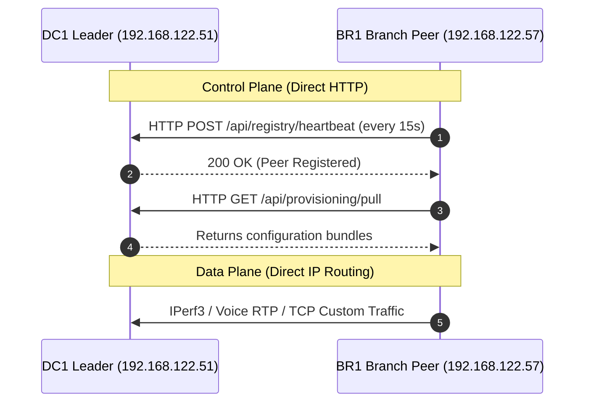
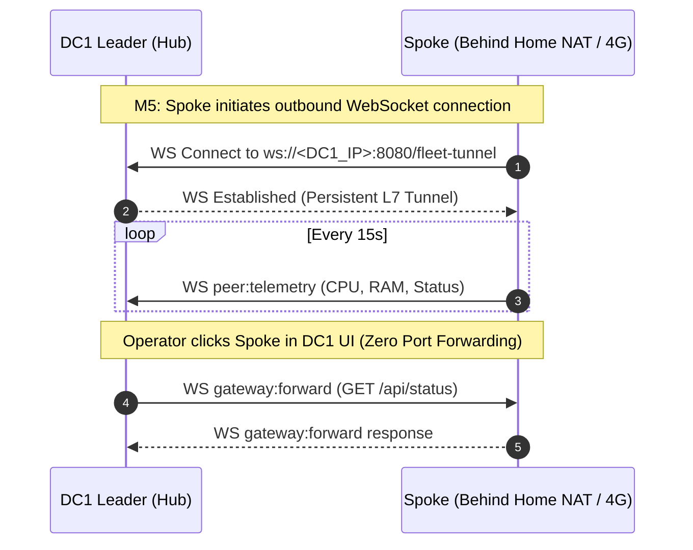
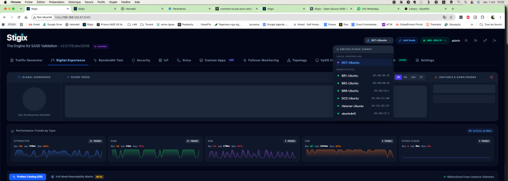
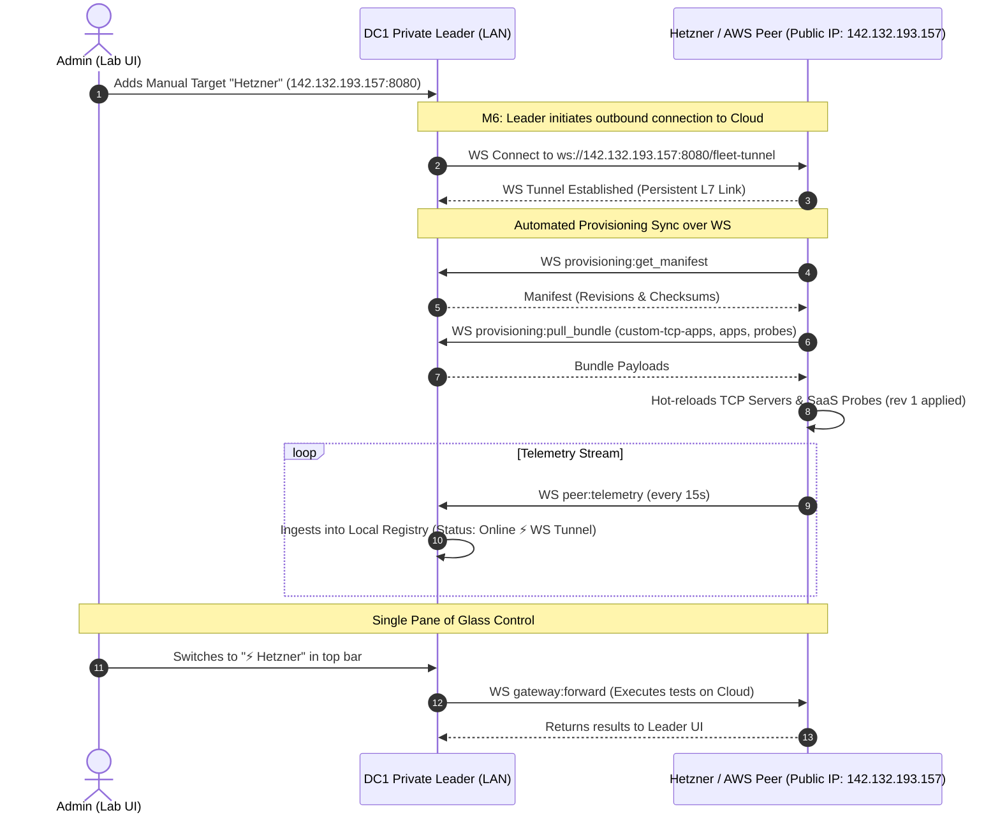
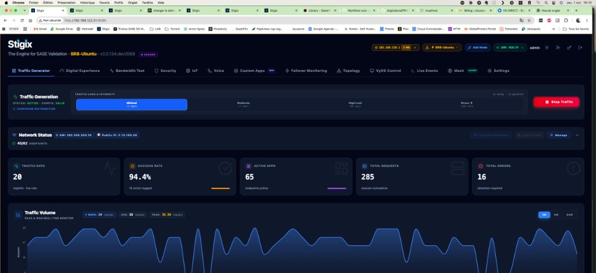

> **Last Updated:** 2026-10-01 | **Created:** 2026-09-30 (v2.0.111)

# Stigix Private & Hybrid Deployment Topologies Guide

This guide provides a comprehensive, pedagogical overview of all deployment scenarios supported by Stigix. It explains how the **Control Plane** (Fleet Gateway WebSocket Tunnels, Local Registry, and Global Provisioning) and the **Data Plane** (Traffic Generator, DEM, VoIP, IPerf, and Security) operate across private labs, enterprise LAN/WANs, and multi-cloud environments (AWS, GCP, Azure, Hetzner) **without requiring inbound firewall ports or public IP addresses on the Leader**.

---

## 🎯 Architecture Overview & Key Concepts

Stigix distinguishes between two communication layers:

```
┌─────────────────────────────────────────────────────────────────────────────┐
│                       STIGIX COMMUNICATION LAYERS                           │
├─────────────────────────────────────────────────────────────────────────────┤
│                                                                             │
│  1. CONTROL PLANE (Layer 7 — WebSocket & HTTP RPC)                          │
│     • Fleet Gateway Tunnels (M5 Inbound & M6 Outbound Reverse Dial)          │
│     • Telemetry streaming (CPU, RAM, interface status every 15s)            │
│     • Single Pane of Glass Proxy UI (1-click remote node control)           │
│     • Global Provisioning Sync (Apps, Custom TCP, Probes, SLA, Security)   │
│                                                                             │
│  2. DATA PLANE (Layer 3/4 — IP Synthetic & Security Traffic)                │
│     • IPerf3 throughput tests & Bandwidth Stress                            │
│     • Real-Time VoIP SIP/RTP audio streams                                  │
│     • Synthetic DEM SaaS probes (Office 365, Salesforce, AWS)               │
│     • EICAR & Security malware inspection flows                             │
│     • Custom TCP Application daemons (SAP, POS, HL7, Banking)               │
│                                                                             │
└─────────────────────────────────────────────────────────────────────────────┘
```

---

## 🌐 The 4 Deployment Topologies

```mermaid
flowchart TB
    subgraph S1["Scenario 1: On-Premise LAN / MPLS"]
        L1["Leader (DC1: 192.168.1.10)"] ---|"Direct HTTP / LAN"| P1["Spokes (BR1, BR2)"]
    end

    subgraph S2["Scenario 2: Remote Branch behind NAT/CGNAT"]
        P2["Spoke behind NAT (Home / 4G)"] -->|"M5: Spoke dials Leader WS"| L2["Leader (DC1: Port 8080 Open)"]
    end

    subgraph S3["Scenario 3: Private Leader + Cloud Peers (Zero Inbound)"]
        L3["Leader (Private RFC1918 LAN - 0 Inbound Ports)"] -->|"M6: Leader dials Cloud WS"| P3["Cloud Peer (Hetzner, AWS, GCP)"]
    end

    subgraph S4["Scenario 4: Public SaaS Leader"]
        L4["Leader (Public FQDN / Cloudflare)"] <-->|"Cloudflare Worker Registry"| P4["Global Mesh Nodes"]
    end
```



---

### Scenario 1: Private Leader + Private Spokes (Standard On-Premise / LAN / MPLS)

#### Use Case
You are running Stigix inside an enterprise data center or private lab where all nodes reside on the same Layer 2/3 network (e.g. `192.168.122.0/24`, `192.168.123.0/24`) or are interconnected via MPLS/corporate VPN.



* **Control Plane**: Spokes send direct HTTP heartbeats to `http://<LEADER_IP>:8080/api/registry`.
* **Data Plane**: Full bidirectional routing between all nodes.
* **Configuration**:
  * **Leader**: Select `Role: Forced Leader` or set `STIGIX_REGISTRY_MODE=leader`.
  * **Spoke**: In `Settings -> Target Controller`, set *Leader IP / FQDN* to `http://192.168.122.51:8080/api/registry`.

> **📸 Figure 1 — Stigix Mesh Overview (Leader perspective)**
> The Mesh dashboard shows all fabric nodes in real time: their IP, status badge (`⚡ WS TUNNEL` or `Online`), Global Experience Score, traffic rate, Voice MOS, config sync revision, and last heartbeat. In a standard LAN deployment all nodes appear `Online` with direct HTTP reachability.


---

### Scenario 2: Private Leader + Remote Spokes behind NAT / CGNAT (Inbound Tunnel M5)

#### Use Case
The Leader resides in a central data center (with port 8080 reachable from branches), while branch nodes are deployed in home offices, retail shops, or LTE/5G routers behind strict NAT or CGNAT where **no inbound ports can be opened on the branch**.



* **Control Plane**: Spoke opens an outbound WebSocket connection to the Leader. Once open, the Leader can proxy UI requests and inspect logs in real time.
* **Data Plane**: Spoke can generate traffic toward the Leader; Leader cannot originate direct IP traffic into the Spoke unless routed through an SD-WAN overlay tunnel.
* **Configuration**:
  * **Spoke**: In `Settings -> Target Controller`, configure the Leader URL. The WebSocket client connects automatically.

> **📸 Figure 2 — Target Controller Settings (Spoke configuration)**
> In `Settings → Target Controller`, the Spoke specifies the Leader URL. Once saved, it automatically initiates the M5 WebSocket tunnel — no port-forwarding needed on the branch side. Notice the `AUTO-DETECT` role switch that lets Stigix choose Leader vs. Peer dynamically.



---

### Scenario 3: Private Leader + Multi-Cloud Peers (Outbound Reverse Dial M6 — Zero Inbound on Leader)

#### Use Case
**This is the most powerful and secure hybrid deployment.**
* Your Leader resides in your **Private Home LAN / Lab** (e.g. `192.168.122.51`) behind a standard internet router. **You do NOT want to open any port on your firewall or expose your lab to the Internet.**
* You deploy Stigix nodes on Public Cloud VPS providers (**Hetzner, AWS EC2, GCP Compute Engine, Azure VM**).



#### Why this works without configuration on the Cloud Peer:
1. **Zero-Touch Cloud Setup**: Start the container on the VPS (`docker run -d -p 8080:8080 jsuzanne/stigix:v2`). No need to log into the VPS or configure Leader IP.
2. **Leader Adoption**: Add the target host in `DC1 -> Settings -> Stigix Targets`. DC1 immediately dials out to the VPS.
3. **Bi-Directional L7 Control**:
   * Hetzner streams real-time telemetry back to DC1.
   * Hetzner pulls all configuration bundles (`custom-tcp-apps`, SaaS apps, connectivity probes) over the WebSocket tunnel.
   * Hetzner status switches to **`⚡ WS Tunnel Synced`** with all green revision badges.
4. **Data Plane Behavior**:
   * Hetzner acts as an external reflector / responder for traffic originating from branches (`BR1 -> Hetzner`).
   * Hetzner can execute synthetic tests toward public SaaS/Cloud endpoints (Office 365, AWS, Salesforce) controlled directly from DC1's dashboard.

> **📸 Figure 3 — Cloud Peer Node Card (HetznerCloud target)**
> After the Leader dials out (M6), the remote Hetzner node card shows: `Online` status, Traffic IP (`142.132.193.157`), active traffic rate (↑18 / ↓13 Mbps), all enabled capabilities (Voice, Failover, Custom Apps, Speedtest, Security, Connectivity), and every config bundle revision synced (`All Synced – Matches Leader`). The **Connect via Remote View** button proxies the full Hetzner UI through the Leader — with zero inbound ports opened.


---

### Scenario 4: Public SaaS Leader + Distributed Global Mesh

#### Use Case
You deploy the Stigix Leader on a public cloud instance with a valid DNS name (e.g. `https://stigix.company.com`) or via Cloudflare Worker Registry.

* **Control Plane**: All spoke nodes globally register to the central registry.
* **Data Plane**: Full mesh testing across multi-region networks.
* **Configuration**: Nodes use Cloudflare Worker Autodiscovery (`STIGIX_REGISTRY_URL`) or direct HTTPS URLs.

---

## 📊 Feature & Protocol Compatibility Matrix

| Capability | Scenario 1 (LAN/MPLS) | Scenario 2 (NAT Spoke M5) | Scenario 3 (Cloud Peer M6) | Scenario 4 (Public SaaS) |
| :--- | :---: | :---: | :---: | :---: |
| **Inbound Ports required on Leader** | None (LAN only) | Port 8080 | **0 (Zero)** | Port 443 / 8080 |
| **Inbound Ports required on Peer** | None (LAN only) | **0 (Zero)** | Port 8080 | 0 (Zero) |
| **Telemetry Streaming (CPU/RAM/Health)** | ✅ HTTP Poll (15s) | ✅ WS Push (15s) | ✅ WS Push (15s) | ✅ HTTP / WS |
| **Single-Pane-of-Glass Remote Proxy UI** | ✅ Direct | ✅ WS Proxy | ✅ WS Proxy | ✅ Direct / WS |
| **Global Provisioning Sync** | ✅ HTTP Pull | ✅ WS Pull/Push | ✅ WS Pull/Push | ✅ HTTP Pull |
| **Custom TCP Apps Server Mode** | ✅ | ✅ | ✅ | ✅ |
| **Traffic Generation from Branch to Node**| ✅ | ✅ | ✅ | ✅ |
| **Traffic Generation from Node to Branch**| ✅ | Requires VPN | Requires VPN | Requires VPN |

---

## 🛠️ Step-by-Step Runbook: Adding a Cloud VPS Target (Scenario 3)

### Step 1: Deploy Stigix on Cloud VPS (e.g. Hetzner, AWS, GCP, Azure)
Run standard Docker on the remote server:
```bash
docker run -d \
  --name stigix \
  --restart unless-stopped \
  -p 8080:8080 \
  jsuzanne/stigix:v2
```

### Step 2: Add Target on your Private Leader (DC1)
1. Open your private Leader dashboard (`https://sdwandc1.carenaje.fr` or `http://192.168.122.51:8080`).
2. Navigate to **Settings ➔ Stigix Targets**.
3. Click **`+ ADD TARGET`**:
   * **Target Name**: `Hetzner-Cloud`
   * **Host / IP**: `142.132.193.157`
   * **Port**: `8080`
   * **Capabilities**: Check Voice, Speedtest, Security, Failover.
4. Click **Save**.

### Step 3: Verify Automated Adoption & Sync
1. Navigate to **Settings ➔ Target Controller**:
   * The Cloud node will show status **`⚡ WS Tunnel Synced`**.
   * Clicking **`TEST`** verifies the WebSocket link and displays round-trip latency (`RTT: ~18ms`).
2. Navigate to **Mesh Overview**:
   * `Hetzner-Cloud` displays with the **`⚡ WS Tunnel`** badge.
3. Use the **Instance Switcher** in the top navigation bar to select `⚡ Hetzner-Cloud` and control the remote node directly from your private lab.

### Scenario 5: Universal Zero-Touch Onboarding (Magic Join)
For frictionless onboarding across any network environment (LAN, WAN, NAT, or Multi-Cloud) without manual target configuration or `.env` editing:
* Operator clicks **`[ 🔗 Add Node ]`** on the Leader.
* Runs the single-line command on the target host: `curl -fsSL https://raw.githubusercontent.com/jsuzanne/stigix/v2/install.sh | sudo bash -s -- STX-...`
* The node automatically discovers the Leader or announces to the Cloudflare Rendezvous Relay, establishes the **`⚡ WS TUNNEL`**, and synchronizes the cluster security realm.
* For a detailed deep-dive on cryptographic realm isolation and multi-tenant security, see [MAGIC_JOIN_AND_MULTI_TENANCY.md](file:///Users/jsuzanne/Github/stigix/docs/MAGIC_JOIN_AND_MULTI_TENANCY.md).

> **📸 Figure 4 — Magic Join Dialog (Zero-Touch Onboarding)**
> The leader generates a **cryptographic single-use token** (burn-on-redeem, 1 use max). The dialog displays the complete `curl` command to paste on any remote Linux/Docker host. Discovered Leader endpoints are listed automatically — both the private LAN address and the public relay. Token TTL is configurable (1 Hour default).


---

> **📸 Figure 5 — Traffic Generator (Data Plane in Action)**
> Once the fabric is wired up, the Traffic Generator tab on any node shows the full data plane in action: live traffic rate (20 req/s), 94.4% success rate across 65 active custom TCP application endpoints, and a real-time SaaS WAN graph. This view is available from any node via the Single Pane of Glass remote proxy — no direct access to the branch required.



---

## 🛡️ Inbound / Outbound Firewall Matrix & Security Groups

When deploying Stigix Spoke nodes on Cloud platforms (**AWS, GCP, Azure, Hetzner, Scaleway, Oracle Cloud**) or behind corporate perimeter firewalls, configure the following rules:

| Port | Protocol | Direction | Service / Capability | Mandatory? | Notes |
| :--- | :--- | :--- | :--- | :---: | :--- |
| **`8080`** (or `$PORT`) | **TCP** | **Inbound (Ingress)** | **Web Dashboard & WebSocket Fleet Tunnel** | **Yes (Spoke)** | Required for Leader reverse dials (`M6`). |
| **`9000`** | TCP / UDP | Inbound (Ingress) | **XFR Target Bandwidth Generator** | Recommended | Real-time throughput, packet loss, and jitter analysis. |
| **`5201`** | TCP / UDP | Inbound (Ingress) | **iPerf3 Server** | Recommended | Multi-stream network performance benchmarking. |
| **`6100`** | UDP | Inbound (Ingress) | **Voice / RTP Audio Engine** | Optional | VoIP SIP/RTP call simulation and MOS calculation. |
| **`6200`** | TCP / UDP | Inbound (Ingress) | **Synthetic Probes Server** | Optional | Custom synthetic SaaS application tests. |
| **`443`** | TCP | **Outbound (Egress)** | **Cloudflare Registry & Probes** | **Yes (All)** | Outbound to `registry.stigix.io` & `target.stigix.io`. |

---

## 🔄 Post-Install Firewall Recovery & Reconnection Procedures

If a Spoke was installed before the cloud firewall rules (e.g. AWS Security Group, GCP Firewall) were opened:

### 1. Automatic Zero-Touch Recovery (Leader Background Loop)
The Stigix Leader uses an active WebSocket client with `reconnection: true` (exponential backoff between 5s and 20s).
* **As soon as the ingress port 8080 is opened** in your cloud console, the Leader **automatically completes the reverse dial within seconds**.
* No manual commands or container restarts are required.

### 2. Immediate Force-Sync (Trigger from Spoke)
To trigger an instantaneous re-dial without waiting for the background cycle:
```bash
# On the Spoke host (e.g. AWS / GCP / Hetzner):
cd /storage/Docker/stigix && docker compose restart
```
* **Why it works instantly:** On startup, the Spoke re-announces to Cloudflare Rendezvous Relay. The Leader's persistent SSE listener receives the event in `<10ms` and initiates the reverse dial immediately.

### 3. Verification Commands
```bash
# Check Fleet Tunnel status on the Spoke:
curl -s http://localhost:8080/api/system/tunnel-status | jq .

# CLI status check inside container:
docker exec -it stigix stigix-cli fleet status
```

---

## 📊 Cloudflare Worker Consumption & 0-Polling Free Tier Audit

Stigix is engineered to run seamlessly on the **Cloudflare Workers Free Tier (0 € / 100% Free)** forever.

### 🎯 Cloudflare Workers Free Tier Limits
* **Daily HTTP Request Quota:** **100,000 requests / day** (3,000,000 requests / month).
* **CPU Execution Limit:** 10ms per request (Stigix worker uses `<0.5ms` in-memory routing).
* **KV Operations:** 100,000 reads / day, 1,000 writes / day (Stigix Rendezvous uses **0 KV writes**, purely in-memory).
* **Cost:** **0 € (No credit card required)**.

### 🔍 Real-World Request Consumption Breakdown

| Operation Mode | Mechanism | Requests / Day / Node | Notes |
| :--- | :--- | :---: | :--- |
| **Leader Passive Listener** | HTTP GET `/stream` (SSE) | **1 request / session** | Connection remains open continuously as a Server-Sent Event stream. |
| **Spoke Magic Join Onboarding** | HTTP POST `/register` | **1 request (at install)** | Ephemeral announcement with candidate IPs. |
| **Active Mesh Telemetry** | WebSocket Fleet Tunnel | **0 requests to Cloudflare** | 100% of telemetry, DEM metrics, targets, and config sync flow through the direct P2P WebSocket mesh. |
| **Local Registry Discovery** | Node-to-Leader HTTP | **0 requests to Cloudflare** | Once paired, Spokes poll the local Leader directly (`http://<leader>:8080/instances`), completely bypassing Cloudflare. |

> **💡 Summary:** An active cluster with 20 nodes consumes **`<50 requests per day`** on Cloudflare, representing less than **0.05% of the free quota**.

---

## 📜 Revision History

| Date | Stigix Version | Author / Trigger | Summary of Changes |
|---|---|---|---|
| 2026-10-01 | `v2.0.138` | Stigix Core Team | Added annotated screenshot figures (Figures 1–5) illustrating real Stigix UI for each deployment scenario and data plane |
| 2026-10-01 | `v2.0.132` | Stigix Core Team | Added Inbound/Outbound Firewall Matrix, Post-Install Reconnection Runbook, and Cloudflare Worker Free Tier Consumption Audit |
| 2026-10-01 | `v2.0.120` | Stigix Core Team | Added Scenario 5: Magic Join Zero-Touch Onboarding and link to detailed Multi-Tenancy Architecture guide |
| 2026-09-30 | `v2.0.111` | Stigix Core Team | Initial creation of Private & Hybrid Deployment Topologies Guide covering M5/M6 WebSocket Tunnels, Zero-Inbound Leader, and Multi-Cloud Provisioning Sync |
