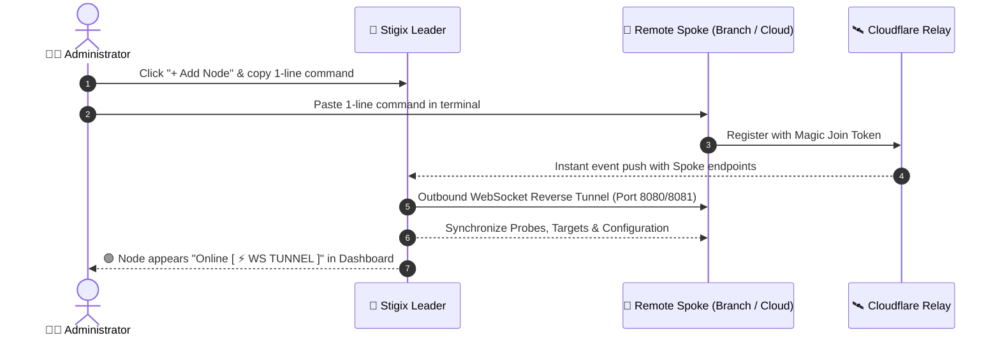

> **Last Updated:** 2026-10-01 | **Created:** 2026-01-19 (v1.1.0)

# 🚀 Stigix Quick Start & Deployment Guide

Deploy a complete, distributed Stigix SD-WAN & SASE validation mesh in **under 2 minutes**. 
This guide covers **both modern 1-line copy-paste methods (Magic Join)** and **classic manual Docker Compose deployments**.

---

## 📋 Prerequisites

* Linux (Ubuntu 20.04+, Debian 11+, CentOS, Raspberry Pi OS, Cloud VPS), macOS, or Windows with WSL2.
* Internet access.
* Root or `sudo` privileges.

---

## ⚡ Section 1: Modern 1-Click / Copy-Paste Deployment (Recommended)

### 👑 1. Deploy the Leader (Central Dashboard & Hub)

The **Leader** acts as your central dashboard, orchestrator, and telemetry aggregator.

#### Option A: 1-Line Installer (Docker already installed)
```bash
curl -fsSL https://raw.githubusercontent.com/jsuzanne/stigix/v2/install.sh | sudo bash
```

#### Option B: Auto-Docker Installer (Installs Docker + Docker Compose + Stigix automatically)
```bash
curl -fsSL https://raw.githubusercontent.com/jsuzanne/stigix/v2/install-autodocker.sh | sudo bash
```

Once installed, open your browser:
* **URL:** `http://<LEADER_IP>:8080`
* **Default Login:** `admin` / `admin`

---

### 🏢 2. Add Remote Branch Nodes (Magic Join in 1 Click)

Stigix v2 automates cluster enrollment through **Magic Join Tokens** and Cloudflare Rendezvous:



1. **On your Leader Web Dashboard:**
   * Go to the **Mesh** tab or click the **`+ Add Node`** button in the top navigation bar.
   * Enter a site name (e.g. `Branch-Paris`, `HetznerCloud`, `NUC-Lab`).
   * Click **Generate Token** and copy the 1-line command.
2. **On your Remote Machine / Cloud VPS / Branch PC:**
   * Paste the copied command:
     ```bash
     curl -fsSL https://raw.githubusercontent.com/jsuzanne/stigix/v2/install.sh | sudo bash -s -- STX-eyJhbGciOi...
     ```
3. **Done!** The node connects to the Leader, mounts a reverse WebSocket tunnel, synchronizes configuration, and appears **🟢 Online [ ⚡ WS TUNNEL ]** in your Leader dashboard.

---

### 🔀 3. Access Any Remote Node (Remote View)

Manage and inspect any remote branch node directly through your Leader web dashboard without SSH, VPNs, or exposing public management ports:

1. In the Leader dashboard, go to the **Mesh** tab.
2. Click on the remote node.
3. Click **`⚡ Connect via Remote View`**.
4. The interface displays an amber frame, proxying all live charts, traffic controls, and probe settings directly to the remote node over the WebSocket tunnel.

---

## 🐳 Section 2: Classic Manual Docker Compose Deployment

If you prefer to manage containers manually via `docker-compose.yml`:

### Step 1: Create Project Directory
```bash
mkdir -p ~/stigix/config ~/stigix/logs
cd ~/stigix
```

### Step 2: Create `docker-compose.yml`
```yaml
version: '3.8'

services:
  stigix:
    image: jsuzanne/stigix:v2
    container_name: stigix
    network_mode: host
    restart: unless-stopped
    environment:
      - PORT=8080
      - STIGIX_ROLE=both
      - JWT_SECRET=change-this-secret-in-production
    volumes:
      - ./config:/app/config
      - ./logs:/app/logs
```

> [!NOTE]
> On macOS or Windows (Docker Desktop), use `ports` mapping instead of `network_mode: host`:
> ```yaml
>     ports:
>       - "8080:8080"
>       - "9000:9000"
>       - "5201:5201"
>       - "6100:6100/udp"
>       - "6200:6200"
> ```

### Step 3: Start the Container
```bash
docker compose up -d
```

---

## 🎯 Section 3: Target-Only Mode (Lightweight Probe Endpoint)

To deploy Stigix purely as a traffic/probe target (XFR 9000, Voice RTP 6100, Probes 6200, iPerf 5201) without running the web dashboard:

```bash
curl -fsSL https://raw.githubusercontent.com/jsuzanne/stigix/v2/install.sh | sudo bash -s -- --target
```

---

## 🔄 Section 4: Fleet Upgrade

To upgrade any Stigix node (Leader or Spoke) to the latest release:

```bash
cd ~/stigix && docker compose pull && docker compose up -d
```

---

## 🛠️ Section 5: Handy Management Commands

| Action | Command (Copy & Paste) |
| :--- | :--- |
| **View Live Logs** | `docker logs -f stigix` |
| **Check Container Status** | `docker ps \| grep stigix` |
| **Restart Stigix** | `cd ~/stigix && docker compose restart` |
| **Open Built-in Console CLI** | `docker exec -it stigix stigix-cli` |
| **Stop Stigix** | `cd ~/stigix && docker compose down` |

---

## 🌐 Section 6: Network & Firewall Port Reference

| Port | Protocol | Purpose | Direction |
| :--- | :--- | :--- | :--- |
| **`8080`** (or `8081`) | TCP | Web Dashboard & WebSocket Reverse Tunnel | Inbound to Node |
| **`9000`** / **`5201`** | TCP/UDP | Speedtest / XFR & iPerf3 Bandwidth Validation | Inbound to Target |
| **`6100`** | UDP | VoIP SIP/RTP Jitter & MOS Simulation | Inbound to Target |
| **`6200`** | TCP/UDP | SD-WAN SLA Convergence Probes | Inbound to Target |
| **`443`** | TCP | Outbound Cloudflare Rendezvous Signaling | Outbound from All Nodes |

---

## 📜 Revision History

| Date | Stigix Version | Author / Trigger | Summary of Changes |
|---|---|---|---|
| 2026-10-01 | `v2.0.136` | Stigix Core Team | Added 1-line copy-paste Magic Join & Auto-Docker methods alongside classic Docker Compose and Target-only options |
| 2026-04-16 | `v1.1.0` | Stigix Core Team | Initial legacy guide creation |
