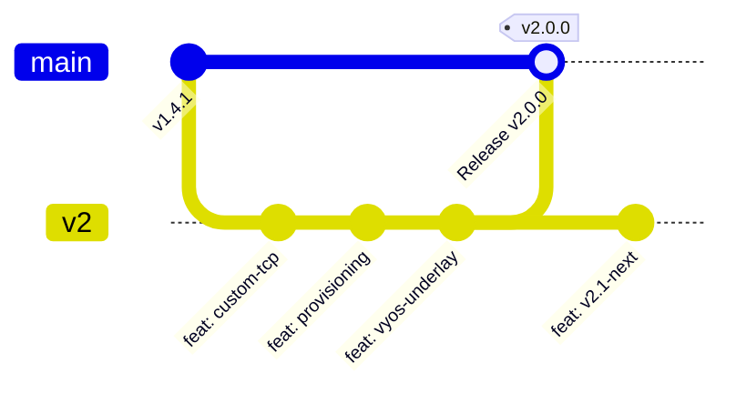

# Stigix GitFlow, Docker & Release Workflow

This document outlines the official Git branching strategy, Docker image release pipeline, tag lifecycle, and rollback procedures for **Stigix**.

---

## 1. Branching Strategy



* **`main`** *(Stable / Production)*:
  * Contains only thoroughly tested, production-ready code.
  * Every push or merge to `main` automatically builds and publishes the stable production image tagged `:latest`, `:stable`, and `:sha-<short-sha>`.
* **`v2`** *(Active Development & Next-Gen Lab)*:
  * The main development branch for active features and enhancements.
  * Every push or merge to `v2` automatically builds and publishes development images tagged `:v2`, `:sha-<short-sha>`, and an incremental development build tag.
  * **Never publishes `:latest` or `:stable`.**
* **`feature/*` / `fix/*`** *(Short-lived Feature Branches)*:
  * Optional branches for isolated work.
  * Verified via CI workflows (lint + typecheck + build without Docker registry push).

---

## 2. Docker Image & Tag Matrix

All images are published to Docker Hub under **`jsuzanne/stigix`**.

| Git Event | Docker Tags Produced | Usage / Environment |
|---|---|---|
| **Pull Request** (`main` / `v2`) | *No push (CI compilation test only)* | Code review & Pull Request verification |
| **Push on `feature/*`** | *No push (CI compilation test only)* | Isolated branch validation |
| **Push on `v2`** | `jsuzanne/stigix:v2`<br>`jsuzanne/stigix:sha-<short-sha>`<br>`jsuzanne/stigix:<version>.dev<N>` | Development, Staging & Test Lab |
| **Push on `main`** | `jsuzanne/stigix:latest`<br>`jsuzanne/stigix:stable`<br>`jsuzanne/stigix:sha-<short-sha>` | Official Production Deployment |
| **Git Tag `vX.Y.Z`** (e.g. `v2.0.0`) | `jsuzanne/stigix:2.0.0`<br>`jsuzanne/stigix:v2.0.0`<br>`jsuzanne/stigix:2.0`<br>`jsuzanne/stigix:v2.0`<br>`jsuzanne/stigix:2`<br>`jsuzanne/stigix:v2`<br>`jsuzanne/stigix:latest`<br>`jsuzanne/stigix:stable`<br>`jsuzanne/stigix:sha-<short-sha>` | Immutable Official Release & Rollback Anchor |

---

## 3. Daily Development & Promotion Workflow

### A. Daily Development on `v2`
```bash
# 1. Switch to v2 and ensure latest changes
git checkout v2
git pull origin v2

# 2. Develop, test locally, and commit
npm run build --prefix web-dashboard
git add .
git commit -m "feat(scope): describe change"
git push origin v2
```
*This triggers `build-stigix-allinone.yml` to build and publish `jsuzanne/stigix:v2`.*

---

### B. Promoting `v2` to `main` (Fast-Forward Release)
When features on `v2` are tested, documented, and ready for production:

```bash
# 1. Ensure v2 is fully synced and builds cleanly
git checkout v2
git pull origin v2
npm run build --prefix web-dashboard

# 2. Switch to main and fast-forward merge v2
git checkout main
git pull origin main
git merge --ff-only v2

# 3. Push to main (Publishes production image :latest and :stable)
git push origin main

# 4. Create annotated Git Release Tag (triggers Release build & GitHub Release)
git tag -a v2.0.0 -m "Release v2.0.0: Custom TCP Apps, Central Global Provisioning, Direct Controller, VyOS Underlay"
git push origin v2.0.0

# 5. Switch back to v2 for ongoing development
git checkout v2
```

---

## 4. Rollback Procedure

Because mutable tags like `:latest` or `:stable` move forward with every push, **production deployments can be pinned or rolled back to an immutable tag or Git SHA**.

### Method 1: Pinning an Immutable Version Tag
In [`docker-compose.yml`](../docker-compose.yml):
```yaml
services:
  stigix:
    image: jsuzanne/stigix:2.0.0   # Or specific version tag: 1.4.1-patch.41
```
Then restart the container:
```bash
docker compose up -d
```

### Method 2: Pinning a Specific Git Commit SHA
If rolling back to an exact commit before a regression:
```yaml
services:
  stigix:
    image: jsuzanne/stigix:sha-930ecf5
```
Then restart:
```bash
docker compose pull stigix
docker compose up -d
```

---

## 5. Required GitHub Secrets

Configure these secrets in GitHub under **Repository Settings → Secrets and variables → Actions**:

| Secret Name | Description |
|---|---|
| `DOCKER_USERNAME` | Docker Hub username (`jsuzanne`) |
| `DOCKER_PASSWORD` | Docker Hub Personal Access Token (PAT) with Read & Write permissions |

> [!CAUTION]
> Never commit Docker tokens or credentials to the repository. The Stigix secret scanner prevents staging of credential files.

---

## 6. Local Build & Test Commands

Before committing or pushing, you can validate the full stack locally:

```bash
# 1. Typecheck & Frontend Build
cd web-dashboard
npm ci
npm run lint
npm run build

# 2. Local Docker Image Build (from repo root)
cd ..
docker build -t jsuzanne/stigix:local -f stigix-all-in-one/Dockerfile .

# 3. Run Local Test Container
docker run --rm -d --name stigix-test -p 8080:8080 jsuzanne/stigix:local
curl -I http://localhost:8080/api/system/info
docker stop stigix-test
```
