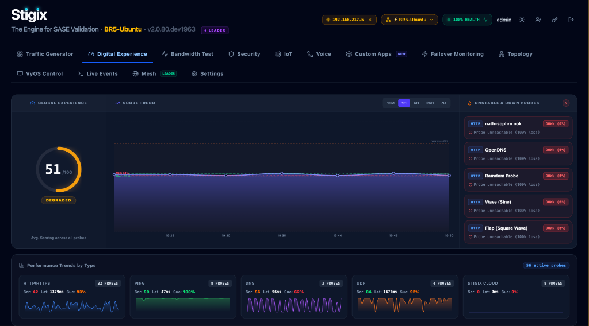

> **Last Updated:** 2026-09-28 | **Created:** 2026-09-28 (v2.0.67)

# Remote View Gateway — Implementation Reference

## Overview

This document describes the **Remote View Gateway** feature implemented in Stigix starting at v2.0.67 (M3) and extended through v2.0.73 (full read/write coverage). It is distinct from the long-term [Multi-Instance Control Plane PRD](../PRD/SPECIFICATION_MULTI_INSTANCE_CONTROL_PLANE_REVISED.md), which specifies a future agent-pull job model with durable jobs, ACKs, and fleet orchestration.

The Remote View Gateway is a lightweight, immediate solution that allows an operator on **DC1** to observe and control a remote peer (e.g. **BR8**) from within the DC1 dashboard, with no agent installed on the peer and no additional network configuration beyond existing peer-to-peer reachability.

---

## Architecture

### Data Flow

```
DC1 Browser
    │
    ▼  activePeerId = "BR8-Ubuntu"
gFetch interceptor (PeerContext.tsx)
    │  rewrites /api/* → /api/gateway/:peerId/*
    ▼
DC1 Express Gateway (/api/gateway/:peerId/*path)
    │  rawBody middleware preserves body BEFORE express.json() consumes it
    │  authenticateToken (supports ?token= query param for EventSource)
    │  http.request() pass-through proxy with JWT re-signing
    ▼
BR8 Stigix API (direct HTTP, peer-to-peer)
```

### Key Components

| Component | File | Role |
|---|---|---|
| `PeerContextProvider` | `src/PeerContext.tsx` | Provides `gFetch`, `activePeerId`, `setActivePeerId` to all children |
| `gFetch` interceptor | `src/PeerContext.tsx` | Rewrites `/api/*` → `/api/gateway/:peerId/*` when a remote peer is active; falls back to native `fetch` in local mode |
| Gateway proxy handler | `server.ts` (`/api/gateway/:peerId/*path`) | HTTP pass-through proxy with JWT re-signing, body forwarding, SSE support |
| `rawBody` middleware | `server.ts` | Captures raw request body buffer BEFORE `express.json()` consumes it; required for POST/PATCH/PUT pass-through |
| `PeerStatusSync` | `src/App.tsx` | React component running background polling loops for remote peer live state |
| `GatewayDropdown` | `src/components/GatewayDropdown.tsx` | UI dropdown to select active peer; shows `UNREACHABLE` badge for offline peers |
| `RemoteViewChip` | `src/PeerContext.tsx` | Inline amber chip in navbar; shows peer IP + exit button |
| Remote-view inset border | `src/App.tsx` | `position:fixed` amber overlay div; `pointer-events:none`; zero layout shift |

---

## Gateway Proxy — Implementation Details

### Body Forwarding (Critical)

**Problem (fixed in v2.0.68):** `express.json()` middleware consumed the request body stream before the gateway proxy could forward it. POST/PATCH/PUT requests arrived at the peer with an empty body.

**Fix:** A `rawBody` middleware captures the raw buffer on all `/api/gateway/*` routes before `express.json()` runs:

```typescript
// Applied BEFORE express.json() on gateway routes only
app.use('/api/gateway', (req, res, next) => {
    let chunks: Buffer[] = [];
    req.on('data', chunk => chunks.push(chunk));
    req.on('end', () => {
        (req as any).rawBody = Buffer.concat(chunks);
        next();
    });
});
```

The proxy then writes `req.rawBody` directly to the outbound request:

```typescript
if (rawBody?.length) {
    proxyReq.write(rawBody);
}
proxyReq.end();
```

### SSE Proxying (text/event-stream)

**Added in v2.0.72.** When the peer responds with `Content-Type: text/event-stream` (Server-Sent Events), the gateway:

1. Sets `X-Accel-Buffering: no` to disable nginx/proxy buffering.
2. Calls `res.flushHeaders()` immediately so the browser's `EventSource` receives the connection open event without waiting.
3. Pipes `proxyRes` to `res` via Node.js stream pipe (chunks flow in real-time).

```typescript
const isSSE = (proxyRes.headers['content-type'] || '').includes('text/event-stream');
if (isSSE) {
    res.setHeader('X-Accel-Buffering', 'no');
    res.setHeader('Cache-Control', 'no-cache');
    res.flushHeaders();
}
proxyRes.pipe(res, { end: true });
```

### EventSource URL Pattern for SSE Streams

`EventSource` (browser API) cannot set custom headers. Since `authenticateToken` on DC1's gateway already supports `?token=` as a query parameter (for direct SSE use), gateway-routed SSE works with:

```typescript
const gwPrefix = activePeerId ? `/api/gateway/${activePeerId}` : '';
const sse = new EventSource(`${gwPrefix}/api/tests/xfr/${id}/stream?token=${token}`);
```

In local mode (`activePeerId = null`), `gwPrefix = ''` and the URL is unchanged.

### Hop-by-Hop Headers

The following headers are stripped from both request and response to prevent proxy protocol leakage:

```typescript
const hopByHop = new Set([
    'connection', 'keep-alive', 'proxy-authenticate', 'proxy-authorization',
    'te', 'trailers', 'transfer-encoding', 'upgrade', 'host', 'authorization'
]);
```

`Content-Type`, `Content-Length`, and `x-gateway-peer` (added by the proxy) are forwarded normally.

---

## PeerStatusSync Polling Loops

`PeerStatusSync` is active only when `activePeerId !== null`:

| Loop | Interval | Endpoint | Data Delivered |
|---|---|---|---|
| **Fast** | 3 s (500 ms on failover view) | `/api/admin/live-status` | Voice streams, convergence status |
| **Fast** | 3 s | `/api/traffic/status` | Traffic running state, active rate, client count |
| **Slow** | 10 s | `/api/admin/system/dashboard-data` | System stats, overall status |
| **History** | 60 s | `/api/traffic/history?range=1h` | Traffic volume chart data |

---

## Feature Coverage Matrix (v2.0.73)

### ✅ Fully Working in Remote View

| Feature | Read | Write / Action | Notes |
|---|---|---|---|
| Digital Experience (DX) | ✅ | — | DX score, endpoints, latency |
| Traffic Generator | ✅ | ✅ | Start/Stop; stats via PeerStatusSync |
| Bandwidth Test (Speedtest) | ✅ | ✅ | History + live SSE stream via gateway; run/delete/purge |
| Security | ✅ | ✅ | Posture, URL/DNS batch tests |
| IoT | ✅ | ✅ | Device list, bad-behavior, settings, manage devices |
| Voice | ✅ | ✅ | Config, ingress; start/stop simulation |
| Custom Apps (operational) | ✅ | ✅ | Start/Stop listener & client; 1.5 s status poll |
| Custom Apps (settings/params) | ✅ | ✅ | Edit parameters; hot-applied instantly on peer |
| Failover Monitoring | ✅ | — | Live convergence results |
| Topology | ✅ | — | |
| VyOS Control | ✅ | ✅ | Run sequences |
| Settings (config, thresholds) | ✅ | ✅ | 30 s polling; writes hot-applied |
| Settings — System tab | ✅ | — | Hostname, uptime, container stats |

### ⚠️ Known Limitations

| Feature | Root Cause | Planned Fix |
|---|---|---|
| **IoT Real-time Log Stream** | Peer SSE stream not yet proxied through gateway | Replace with REST polling via `gFetch` |
| **Network Status** (GW IP, Public IP) | Reads from local system, not peer | Add dedicated endpoint in PeerStatusSync |
| **Traffic history range selector** | PeerStatusSync loop fixed to `?range=1h` | Pass `timeRange` state to PeerStatusSync |

---

## UX Conventions

### Remote View Indicators (v2.0.80)

Visual indicators with zero layout impact confirm the active remote context:

1. **Amber site name in header subtitle** (v2.0.80):
   - Displays the active remote site name (e.g. `BR5-Ubuntu`) in bold amber next to "The Engine for SASE Validation".
   - Zero additional API calls (resolved from existing peer registry state).

2. **Amber inline chip** in the navbar (`RemoteViewChip`):
   - Shows peer IP or name
   - Pulsing globe icon (`Globe` from lucide-react)
   - `✕` button to exit remote view
   - Rendered only when `activePeerId !== null`

3. **Amber inset border** (full-viewport frame):
   - `position: fixed; inset: 0; z-index: 9998; pointer-events: none`
   - `box-shadow: inset 0 0 0 2px rgba(251,191,36,0.40)`
   - Zero layout shift, no content displacement
   - Rendered as `{isRemoteView && <div ... />}` in `App.tsx`



### UNREACHABLE Peers

`GatewayDropdown` shows a red `UNREACHABLE` badge for peers that fail the health check. Selection is blocked.

### Unavailable Features

Features that cannot work in remote view display:
- **Disabled button** with tooltip (e.g. Iperf client)
- **`<RemoteUnavailable>`** inline badge for panels that would otherwise appear empty

---

## Developer Patterns

### Adding a New Component to Remote View

1. Import `usePeerContext` from `../PeerContext`.
2. Replace all `fetch('/api/...` calls with `gFetch('/api/...`.
3. Add `activePeerId` to any `useEffect` dependency array that loads data on mount.
4. For SSE streams: use the gateway prefix pattern (see EventSource section above).
5. If the feature cannot work remotely, add a visual indicator (disabled state or `<RemoteUnavailable>`).

### Common Pitfalls

**`fetch()` not caught by simple search:**

```ts
// ❌ missed by sed 's/fetch/gFetch/g'
const [a, b] = await Promise.all([
  fetch('/api/foo', ...),
  fetch('/api/bar', ...),
]);

// ❌ chained .then() — also missed
fetch('/api/baz', ...).then(r => r.json()).then(setData);
```

Always verify with:
```bash
grep -n "fetch('/api\|fetch(\`/api" src/MyComponent.tsx
```

**`gFetch` is a no-op in local mode:** When `activePeerId = null`, `gFetch` calls native `fetch` with the original URL unchanged. All remote-view code paths are transparently bypassed.

---

## Security Model

> ⚠️ **Current state is permissive.** The gateway proxy accepts any request from authenticated DC1 users and forwards it using the peer's own credentials.

| Aspect | Current Status | Planned |
|---|---|---|
| Authentication | DC1 JWT required | Add per-peer HMAC signing |
| Authorization | Any DC1 user can proxy to any peer | Role-based peer access |
| Peer credential exposure | Peer token used internally, never sent to browser | Unchanged |
| Audit log | None | Add gateway access audit trail |

---

## Relationship to PRD Phase 3

The Remote View Gateway is a **pragmatic bootstrap** satisfying observability and basic control without a full agent-pull job model:

| Capability | Remote View Gateway | PRD Phase 3 (planned) |
|---|---|---|
| Read peer state | ✅ Live polling | ✅ Enriched heartbeat telemetry |
| Trigger remote actions | ✅ Synchronous gateway proxy | ✅ Durable jobs with ACK lifecycle |
| Offline peer last-known state | ❌ | ✅ Persisted in controller |
| Multi-peer fleet view | ❌ | ✅ Consolidated fleet dashboard |
| Job scheduling | ❌ | ✅ `start_at` synchronized jobs |
| Audit trail | ❌ | ✅ Full job + result history |

---

## 📜 Revision History

| Date | Stigix Version | Author / Trigger | Summary of Changes |
|---|---|---|---|
| 2026-09-28 | `v2.0.80` | Stigix Core Team / Antigravity | Documented top-left amber site name subtitle indicator and added UI screenshot |
| 2026-09-28 | `v2.0.73` | Stigix Core Team / Antigravity | Major update: write operations coverage, body forwarding fix, SSE proxying, EventSource URL pattern, updated feature matrix, new UX indicators (chip + inset border) |
| 2026-09-28 | `v2.0.67` | Stigix Core Team / Antigravity | Initial document creation — M3 Remote View Gateway implementation reference |
