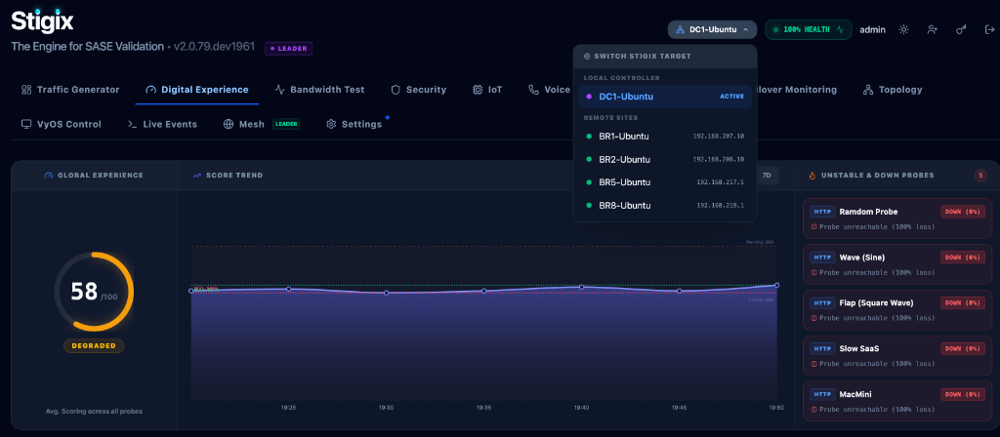

> **Last Updated:** 2026-09-30 | **Created:** 2026-09-28 (v2.0.73)

# Remote View — Operator Guide

## What Is Remote View?

Remote View allows an operator connected to a **Leader node** (e.g. DC1) to observe, monitor, and control any remote **peer node** (e.g. BR1, BR2, BR5, BR8, Hetzner Cloud, Home LAN) directly from the Leader's dashboard — without opening separate browser tabs or logging into remote instances individually.

All dashboard actions (reads and writes) are transparently routed through the Leader's gateway to the selected peer. The experience is identical to being directly connected to that peer.

---

## Prerequisites & Connectivity

- Your Stigix node must be in **Leader mode** (`LEADER` badge visible in the header).
- The target peer must be **registered** in the Leader's registry (auto-discovery or manual targets).
- **Transport & Firewall Traversal (M5 & M6)**:
  - **Inbound WebSocket Reverse Tunnels (M5)**: Spokes behind NAT/CGNAT or strict branch firewalls connect outbound to the Leader over a persistent WebSocket session (`/fleet-tunnel`). No open inbound ports or public IPs are required on the spoke.
  - **Leader Outbound Reverse Dialing (M6)**: For external Cloud Peers (e.g., Hetzner, AWS) or Home LAN nodes where the Leader is inside a private lab/LAN, the Leader dials outbound to the Cloud Peer's `/fleet-tunnel` endpoint. The Leader remains 100% private with zero inbound ports exposed.
  - **Direct HTTP Fallback**: Standard peer-to-peer HTTP is used if WebSocket tunnels are not active.

---

## Activating Remote View

1. Click the **peer selector dropdown** in the top-right area of the header (next to the Health badge).
2. Select the peer you want to manage (e.g. `BR5-Ubuntu` or `BR8-Ubuntu`).
3. The dashboard immediately switches to Remote View mode.

> **Tip:** Peers shown with a red `UNREACHABLE` badge are offline or blocked by the network. Selecting them is disabled to prevent silent empty states.

---

## Visual Indicators

When Remote View is active, clear visual cues identify the active remote context across the dashboard:

| Indicator | Location | Description |
|---|---|---|
| **Amber Site Name** | Top-left header subtitle | Displays the active remote site name (e.g., `BR5-Ubuntu`) directly in the header banner next to the subtitle. |
| **Amber Peer Chip** | Top-right navbar | Shows the remote peer IP and name. Includes a quick **✕** button to exit Remote View. |
| **Amber Inset Border** | Full viewport perimeter | A subtle 2 px amber frame around the entire dashboard window. Zero layout shift — no content is displaced. |

All remote indicators disappear immediately when you exit Remote View.

---

## What Works in Remote View

All standard dashboard features are fully operational against the remote peer:

| Feature | Read | Write / Action |
|---|---|---|
| **Digital Experience** (DX score, probes, latency) | ✅ | ✅ Add / Edit / Delete synthetic probes |
| **Traffic Generator** (stats, volume chart) | ✅ | ✅ Start / Stop |
| **Bandwidth Test (Speedtest)** | ✅ History + live stream | ✅ Run test, delete, purge |
| **Security** (posture, URL/DNS/threat tests) | ✅ | ✅ Run batch tests |
| **IoT** (device list, bad-behavior, settings) | ✅ | ✅ Manage devices |
| **Voice** (config, ingress status) | ✅ | ✅ Start / Stop simulation |
| **Custom TCP Apps** (operational view) | ✅ | ✅ Start/Stop listener & client |
| **Custom TCP Apps** (settings / parameters) | ✅ | ✅ Edit parameters (hot-applied instantly) |
| **Failover Monitoring** | ✅ Live convergence results | ✅ Start / Stop test, manage endpoints |
| **Topology** | ✅ | — |
| **VyOS Control** | ✅ | ✅ Run sequences |
| **Settings** (config, thresholds) | ✅ (30 s poll) | ✅ Save changes |
| **Settings — System tab** (hostname, uptime) | ✅ | — |

---

## Refresh Behavior

Remote View data is kept current through automatic polling:

| Data type | Refresh rate |
|---|---|
| Convergence / Voice / Traffic status | Every 3 s |
| System dashboard data (stats, status) | Every 10 s |
| Traffic volume history | Every 60 s |
| Settings (config, thresholds, interfaces) | Every 30 s |
| Custom Apps — listener/client state | Every 1.5 s |

Configuration edits you submit are **applied immediately** on the peer — the backend receives and hot-applies the change at once. The Settings UI on the peer's own dashboard will reflect the update within 30 s (its own polling cycle).

---

## Known Limitations

| Feature | Status | Notes |
|---|---|---|
| **IoT Real-time Log Stream** | ⚠️ Not available | SSE stream not yet proxied via gateway. REST polling fallback planned. |
| **Network Status** (GW IP, Public IP) | ⚠️ Shows Leader data | These fields are read from the local system, not the peer. |
| **Traffic history range selector** | ⚠️ Fixed to 1 h | Range changes are not yet forwarded to the PeerStatusSync loop. |

---

## Exiting Remote View

Click the **✕** button on the amber chip in the navbar. The dashboard instantly switches back to the Leader's own data.

---

## 📜 Revision History

| Date | Stigix Version | Author / Trigger | Summary of Changes |
|---|---|---|---|
| 2026-09-30 | `v2.0.109` | Stigix Core Team / Antigravity | Added M5/M6 WebSocket Reverse Tunneling and Leader Reverse Dialing documentation for NAT/CGNAT/Firewall traversal |
| 2026-09-28 | `v2.0.80` | Stigix Core Team / Antigravity | Added UI screenshots for Peer Context Switcher dropdown and Remote View active state (amber frame & site subtitle) |
| 2026-09-28 | `v2.0.73` | Stigix Core Team / Antigravity | Initial document creation — Remote View operator guide |
