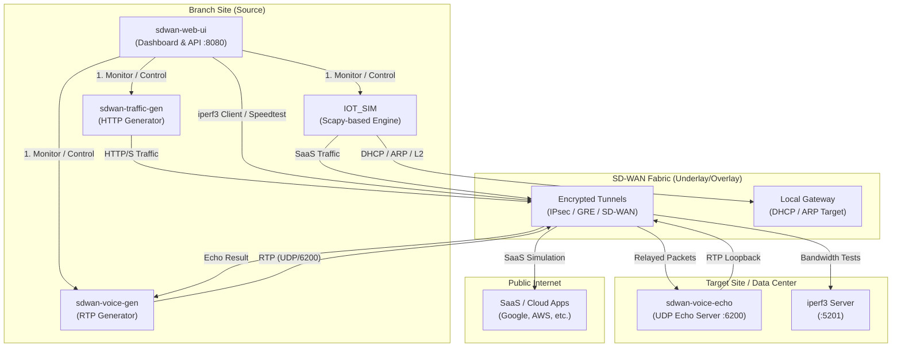

# Technical Communication Flow

This diagram illustrates the flows between the various containers and external targets.

## Protocol & Port Table

| Flow Type | Protocol | Port(s) | Source | Target |
|-----------|----------|---------|--------|--------|
| **Dashboard UI** | TCP | 8080 | User Browser | `sdwan-web-ui` |
| **Background HTTP**| TCP | 80, 443 | `sdwan-traffic-gen` | Internet / Cloud |
| **Convergence/Voice**| UDP | 6200 | `sdwan-voice-gen` | `sdwan-voice-echo` |
| **IoT L2 (DHCP)** | UDP | 67, 68 | `sdwan-web-ui/IOT` | Gateway |
| **IoT Discovery** | UDP | 1900, 5353 | `sdwan-web-ui/IOT` | Local Subnet |
| **Iperf3 Test** | TCP/UDP | 5201 | `sdwan-web-ui` | `iperf3 server` |
| **Speedtest** | TCP | 80, 443 | `sdwan-web-ui` | Public Ookla Servers |
| **API Control** | TCP | 8080 | Dashboard | Orchestrator Engine |

