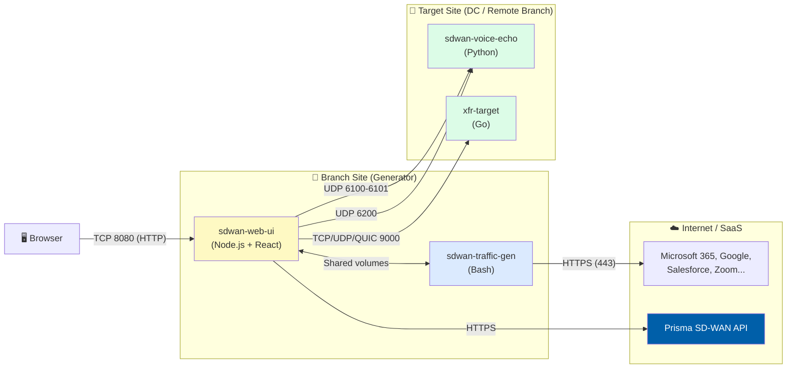

# Traffic Flow Guide — Container Architecture & Port Reference

> **Who is this for?** Anyone deploying or using Stigix who wants to understand what each container does, what traffic it sends and receives, on which ports, and how each relates to the web dashboard menus.

---

## 🗺️ System Overview

Two sets of containers exist in a typical deployment:

| Location | Containers | Role |
|----------|-----------|------|
| **Branch / Generator Site** | `sdwan-traffic-gen`, `sdwan-web-ui` | Traffic source & control plane |
| **Target / DC Site** | `sdwan-voice-echo`, `xfr-target` | Traffic destination & echo servers |



---

## 📦 Container 2 : `sdwan-traffic-gen` — Background Traffic Generator

| Attribute | Value |
|-----------|-------|
| **Image** | `jsuzanne/sdwan-traffic-gen:latest` |
| **Language** | Bash (`traffic-generator.sh`) |
| **Network Mode** | Host (uses physical interfaces directly) |
| **Dashboard Menu** | **Traffic Distribution** (app weights & enable/disable) · **Statistics** (charts & per-app stats) |

### What it does
Simulates realistic enterprise user traffic by continuously sending HTTPS requests to 60+ real SaaS applications (Microsoft Teams, Salesforce, Zoom, etc.). Each request uses a random network interface and a weighted app selection algorithm.

### Traffic it sends

| Destination | Protocol | Port | Description |
|------------|----------|------|-------------|
| Microsoft 365, Google Workspace, Salesforce... | HTTPS | **443** | Weighted SaaS application traffic |

### How the full chain works

**Full chain — Start/Stop Traffic:**
```
User clicks "Start Traffic" in the header or Traffic Distribution tab
    ↓ Browser (React) → POST /api/traffic/start
    ↓ server.ts (Node.js backend) writes control signal to shared Docker volume
    ↓ sdwan-traffic-gen (Bash loop) reads the control signal from shared volume
    ↓ Selects: random interface (eth0/eth1) + random user-agent + weighted SaaS app
    ↓ Runs: curl --interface eth0 --max-time 10 https://teams.microsoft.com  [HTTPS:443]
    ↓ Writes result to traffic.log + stats.json (shared volume)
    ↓ server.ts reads stats.json on each browser poll → GET /api/stats
    ↓ Browser receives live stats via Socket.IO → updates charts
```

### Key config files (shared volume)
| File | Purpose |
|------|---------|
| `config/applications-config.json` | App list, weights, enabled/disabled state |
| `traffic.log` | Per-request log (last 50 lines exposed to UI) |
| `stats.json` | Rolling request counters |

### Dashboard menus involved
- **Home / Traffic Distribution tab**: Start/stop, adjust app weights per category
- **Statistics tab**: Live charts of request rates, per-app breakdown, success/error rates

---

## 📦 Container 1 : `sdwan-web-ui` — Frontend + Backend + All Active Tests

| Attribute | Value |
|-----------|-------|
| **Image** | `jsuzanne/sdwan-web-ui:latest` |
| **Language** | Node.js / TypeScript backend (`server.ts`) + React 19 frontend (compiled static files) |
| **Exposed Port** | **8080** (HTTP — dashboard UI + all API endpoints) |
| **Network Mode** | Host |
| **Dashboard Menu** | **All menus** — this container IS the dashboard |

> [!IMPORTANT]
> This **single container** runs TWO things simultaneously:
> - **Frontend**: The React SPA (pre-compiled to static files, served by Express)
> - **Backend**: The Node.js/Express server (`server.ts`) that handles all logic
>
> The React frontend **never** spawns scripts directly. It only calls the backend via HTTP API.  
> It is the **backend** (`server.ts`) that spawns Python processes, issues SSH commands, and executes all measurements.

**Request chain for any active test:**
```
🖥️  Browser (React frontend)
      ↓  HTTP API call (e.g., POST /api/convergence/start)
⚙️  Node.js backend — server.ts (inside same sdwan-web-ui container)
      ↓  child_process.spawn()
🐍  Python engine (e.g., convergence_orchestrator.py)
      ↓  UDP/TCP traffic
🎯  Target container (sdwan-voice-echo / xfr-target)
```

### Sub-features and their traffic flows

---

### 🔬 Convergence Lab  (`Failover.tsx`)

**What it measures:** SD-WAN failover timing — how long traffic was interrupted when a path switched.

| Traffic Direction | Protocol | Port | Endpoint |
|------------------|----------|------|----------|
| Generator → Target | UDP | **6200** | `sdwan-voice-echo` |
| Target → Generator | UDP | **6200** | Echo reply |

**Full chain:**
```
User clicks "Start Test" in Failover tab
  → Browser → POST /api/convergence/start → server.ts
  → server.ts spawns: python3 engines/convergence_orchestrator.py
      --test-id CONV-0042 --target 192.168.x.x --src-port 30042 --pps 50
  → Python sends 50 UDP packets/second to port 6200 on target
  → sdwan-voice-echo echoes each packet back
  → Python detects gaps in sequence = blackout duration
  → Writes result to config/convergence-history.jsonl
  → (after 60s) server.ts calls getflow.py → queries Prisma flow browser
      → enriches result with SD-WAN egress path (e.g., "INET1 → DC-MPLS")
  → Browser polls /api/convergence/history every 5s → displays result + egress path
```

**Source port convention:** `30000 + Test Number` → e.g., CONV-0042 uses UDP source port **30042**. Useful for filtering in the SD-WAN flow browser.

**Thresholds (configurable in Settings → Convergence):**

| Status | Color | Condition |
|--------|-------|-----------|
| GOOD | 🟢 Green | Max blackout < T1 |
| DEGRADED | 🟡 Yellow | T1 ≤ blackout < T2 |
| BAD | 🟠 Orange | T2 ≤ blackout < T3 |
| CRITICAL | 🔴 Red | blackout ≥ T3 |

---

### 🎙️ Voice / VoIP Testing (`Voice.tsx`)

**What it measures:** VoIP quality — MOS score, jitter, packet loss, latency.

| Traffic Direction | Protocol | Port | Endpoint |
|------------------|----------|------|----------|
| Generator → Target | UDP | **6100** | `sdwan-voice-echo` (RTP stream) |
| Target → Generator | UDP | **6101** | Echo reply (RTP return path) |

**Full chain:**
```
User configures codec (G.711/G.729/Opus) and clicks "Start"
  → Browser → POST /api/voice/control {start} → server.ts
  → server.ts spawns: python3 engines/voice_orchestrator.py
      --target 192.168.x.x --codec g711 --duration 30
  → Python sends RTP-formatted UDP packets to port 6100
  → sdwan-voice-echo echoes RTP packets back on port 6101
  → Python calculates: jitter, loss %, RTT, R-value, MOS score
  → Results written to voice stats
  → Browser polls /api/voice/stats → displays MOS gauge (1-5 scale)
```

---

### ⚡ XFR Speedtest (`Speedtest.tsx`)

**What it measures:** Raw throughput (upload / download / bidirectional).

| Traffic Direction | Protocol | Port | Endpoint |
|------------------|----------|------|----------|
| Generator → Target | TCP / UDP / QUIC | **9000** | `xfr-target` |
| Target → Generator | TCP / UDP / QUIC | **9000** | Server reply |

**Full chain:**
```
User selects protocol (TCP/UDP/QUIC), direction, bitrate, target IP, clicks "Run"
    ↓ Browser (React) → POST /api/tests/xfr
                        { host, port:9000, protocol:"tcp", direction:"download", bitrate:"200M", duration:30 }
    ↓ server.ts (backend) spawns XFR client binary targeting xfr-target:9000
    ↓ XFR client sends TCP/UDP/QUIC traffic to xfr-target  [port 9000]
    ↓ xfr-target measures and reflects traffic back
    ↓ Client reports live telemetry (Mbps, RTT, loss) to server.ts
    ↓ server.ts streams telemetry via GET /api/tests/xfr/:id/stream (SSE)
    ↓ Browser receives SSE events → renders real-time throughput graph
```

---

### 🔒 Security Testing (`Security.tsx`)

**What it measures:** NGFW/SD-WAN security policy enforcement.

| Test Type | Protocol | Destination | What's being tested |
|-----------|----------|------------|---------------------|
| URL Filtering | HTTPS | **443** → Internet (e.g., `urlfiltering.paloaltonetworks.com`) | Blocked vs allowed by NGFW |
| DNS Security | UDP/TCP | **53** → DNS resolver | Sinkhole/NXDOMAIN vs resolved |
| EICAR Threat | HTTP | **8082** → `sdwan-voice-echo` | IPS/Threat Prevention block |
| EDL Test | HTTP/HTTPS/ICMP | various | Bulk IP/URL/DNS policy validation |

**Full chain — URL Filtering:**
```
User enables URL categories in Security tab, clicks "Run All"
    ↓ Browser (React) → POST /api/security/url-test-batch
                        { tests: [ { url: "https://urlfiltering.paloaltonetworks.com/test-malware", category: "Malware" } ] }
    ↓ server.ts (backend) runs: curl --max-time 10 -o /dev/null -w '%{http_code}' <url>
    ↓ If NGFW / SD-WAN blocks → curl returns HTTP 4xx or timeout → result: "blocked" ✅
    ↓ If traffic passes through → curl returns HTTP 200 → result: "allowed" ⚠️
    ↓ server.ts logs result to security-tests.json + updates statistics
    ↓ Browser polls /api/security/results → renders history table with blocked/allowed badges
```

**Full chain — DNS Security:**
```
User enables DNS test domains, clicks "Test All DNS"
    ↓ Browser (React) → POST /api/security/dns-test-batch
                        { tests: [ { domain: "test-malware.testpanw.com", testName: "Malware" } ] }
    ↓ server.ts (backend) runs: nslookup test-malware.testpanw.com  [UDP:53]
    ↓ If DNS sinkhole → response contains NXDOMAIN → result: "blocked" ✅
    ↓ If domain resolves → result: "allowed" ⚠️
    ↓ Results stored and displayed in history table
```

**Full chain — EICAR Threat Prevention:**
```
User sets target IP, clicks "Test Threat Prevention"
    ↓ Browser (React) → POST /api/security/threat-test
                        { endpoints: [ "http://192.168.x.x:8082/eicar.com.txt" ] }
    ↓ server.ts (backend) runs: curl --max-time 20 http://192.168.x.x:8082/eicar.com.txt [TCP:8082]
    ↓ sdwan-voice-echo serves the EICAR test string
    ↓ If IPS / Threat Prevention blocks the download → curl fails → result: "blocked" ✅
    ↓ If file downloads successfully → result: "allowed" ⚠️
    ↓ Temp file auto-deleted; result displayed in Security tab
```

---

### 📡 Connectivity Performance (`ConnectivityPerformance.tsx`)

**What it measures:** Branch network health from multiple angles.

| Probe Type | Protocol | Port | Destination |
|-----------|----------|------|------------|
| ICMP Latency | ICMP | — | Configured targets |
| TCP Handshake | TCP | **varies** | Configured targets |
| HTTP Response | HTTP/HTTPS | **80/443** | Configured endpoints |
| iperf3 throughput | TCP/UDP | **5201** | `sdwan-voice-echo` |
| DNS Resolution | UDP | **53** | DNS resolver |

**Full chain:**
```
User opens Connectivity Performance tab (auto-refreshes)
    ↓ Browser (React) → GET /api/connectivity/test  (on load and on interval)
    ↓ server.ts (backend) runs multiple probes in parallel:
        • ping -c 3 <target>            → ICMP RTT  [ICMP]
        • curl --connect-timeout 5 ...  → HTTP response time  [TCP:80/443]
        • TCP connect timing            → SYN→SYN-ACK roundtrip  [TCP:varies]
        • iperf3 -c <target> -t 5       → Bandwidth  [TCP/UDP:5201] to sdwan-voice-echo
        • nslookup <domain>             → DNS resolution time  [UDP:53]
    ↓ Results aggregated and returned as JSON
    ↓ Browser renders per-probe status cards with RTT trend graphs

Container resource monitoring:
    ↓ Browser (React) → GET /api/connectivity/docker-stats
    ↓ server.ts runs: docker stats --no-stream --format json
    ↓ Returns CPU%, memory, and network counters per container
```

---

### 🤖 IoT Simulation (`Iot.tsx`)

**What it generates:** Layer 2/3 device-specific traffic patterns using raw sockets.

| Traffic Type | Protocol | Layer | Description |
|-------------|----------|-------|-------------|
| Device discovery | mDNS, SSDP, ARP | L2/L3 | Announces simulated device presence |
| DHCP lifecycle | DHCP | L2/L3 | Full Discover/Offer/Request/ACK per device MAC |
| Cloud telemetry | TCP/UDP | L3 | Simulated telemetry to IoT cloud endpoints |

**Full chain:**
```
User adds IoT devices (e.g., "Philips Hue", "Cisco IP Phone"), clicks "Start All"
    ↓ Browser (React) → POST /api/iot/start-batch
    ↓ server.ts (backend) spawns: python3 engines/iot_sim.py --device philips_hue --interface eth0
        (requires host network mode for raw socket access)
    ↓ Python (Scapy) crafts Layer 2/3 packets for the selected device type:
        • ARP announcement  [L2 broadcast]
        • mDNS query (Philips Hue → _hue._tcp.local)  [UDP:5353 multicast]
        • SSDP discovery (e.g., Amazon Echo)  [UDP:1900 multicast]
        • DHCP Discover/Offer/Request/ACK cycle with device's spoofed MAC  [UDP:67/68]
        • Simulated cloud telemetry (e.g., TCP to smart home cloud endpoint)  [TCP:443]
    ↓ Packets injected directly onto the physical interface (no routing needed)
    ↓ server.ts polls simulation stats → Browser shows active device list and packet counters
```

---

### 🔧 VyOS Control (`Vyos.tsx`)

**What it does:** SSH-based control of VyOS routers for simulated network impairments.

| Connection | Protocol | Port | Description |
|-----------|----------|------|-------------|
| GUI → Router | SSH | **22** | server.ts connects via SSH to VyOS |

**Full chain — Run a Sequence:**
```
User sets up a Sequence (e.g., "Failover Simulation"):
    Step 1: interface-down eth1   (simulate WAN link failure)
    Step 2: wait 30 seconds
    Step 3: interface-up eth1     (restore link)
User clicks "Run Sequence" in CYCLE mode (repeats every 5 min)
    ↓ Browser (React) → POST /api/vyos/sequences/run/:id
    ↓ server.ts → vyos-manager.ts initiates SSH connection to VyOS on port 22
    ↓ SSH: set interfaces ethernet eth1 disable         [TCP:22]
    ↓ SSH session kept alive, waits for configured duration (30s)
    ↓ SSH: delete interfaces ethernet eth1 disable      [TCP:22]
    ↓ Action logged to vyos-config.json with timestamp and success/fail status
    ↓ (In CYCLE mode) Timer waits for next cycle → repeats automatically
    ↓ Browser polls /api/vyos/history → renders execution timeline + dot indicators
```

**Full chain — Add/Test a Router:**
```
User enters router IP, SSH username/key, clicks "Test Connectivity"
    ↓ Browser (React) → POST /api/vyos/routers/test/:id
    ↓ server.ts → vyos-manager.ts opens SSH to VyOS IP:22
    ↓ Runs: show interfaces  (VyOS CLI command)
    ↓ Returns interface list to UI → displayed in Router detail panel
```

---

## 📦 Container 3: `sdwan-voice-echo` — Target Echo Server

**Deployed at:** Remote DC, branch, or data center (NOT at the generator site)

| Attribute | Value |
|-----------|-------|
| **Image** | `jsuzanne/sdwan-voice-echo:latest` |
| **Language** | Python |
| **Network Mode** | Host |

### Services & Ports

| Port | Protocol | Service | Used by (UI Menu) |
|------|----------|---------|-------------------|
| **6100** | UDP | Voice RTP echo | Voice / VoIP Testing |
| **6101** | UDP | Voice RTP return | Voice / VoIP Testing |
| **6200** | UDP | Convergence echo | Convergence Lab |
| **5201** | TCP/UDP | iperf3 server | Connectivity Performance |
| **8082** | TCP | HTTP simulation server | Security Testing (EICAR) |

### What each service does

| Service | Behavior |
|---------|----------|
| **Voice echo (6100/6101)** | Receives RTP packets, echoes them back. Enables the generator to measure round-trip jitter, loss, and latency for MOS calculation. |
| **Convergence echo (6200)** | Receives high-frequency UDP probes (50 pps), echoes with a sequence counter. Gaps in returned sequences = failover blackouts. |
| **iperf3 (5201)** | Standard iperf3 server. Allows bandwidth measurements from the Connectivity Performance tab. |
| **HTTP server (8082)** | Serves `/ok`, `/slow`, and `/eicar.com.txt`. Used for security policy validation and SLA testing. |

---

## 📦 Container 4: `xfr-target` — XFR Throughput Server

**Deployed at:** Remote DC, branch, or data center

| Attribute | Value |
|-----------|-------|
| **Image** | `jsuzanne/xfr-target:latest` |
| **Language** | Go |
| **Network Mode** | Host |
| **Port** | **9000** (TCP / UDP / QUIC) |
| **Used by** | **XFR Speedtest** menu |

### What it does
A high-performance purpose-built throughput test server. Unlike iperf3, it supports QUIC (UDP-based) and provides deterministic source ports, making it possible to identify XFR test flows in SD-WAN traffic logs.

---

## 🗂️ Complete Port Reference

| Port | Protocol | Container | Direction | UI Menu |
|------|----------|-----------|-----------|---------|
| **443** | HTTPS | `sdwan-traffic-gen` | → Internet | Traffic Distribution / Statistics |
| **8080** | HTTP | `sdwan-web-ui` | ← Browser | All menus (dashboard) |
| **22** | SSH | `sdwan-web-ui` | → VyOS Router | VyOS Control |
| **6100** | UDP | `sdwan-voice-echo` | ← Generator | Voice / VoIP |
| **6101** | UDP | `sdwan-voice-echo` | → Generator | Voice / VoIP |
| **6200** | UDP | `sdwan-voice-echo` | ← Generator | Convergence Lab |
| **5201** | TCP/UDP | `sdwan-voice-echo` | ← Generator | Connectivity Performance |
| **8082** | TCP | `sdwan-voice-echo` | ← Generator | Security Testing |
| **9000** | TCP/UDP/QUIC | `xfr-target` | ← Generator | XFR Speedtest |
| **53** | UDP/TCP | DNS resolver | → Internet | Security Testing / Connectivity |
| **30000+** | UDP | `sdwan-voice-echo` | ← Generator | Convergence Lab (source port) |

---

## 🧩 UI Menu → Container Mapping

| Dashboard Menu | Container(s) Involved | Key Script / Engine |
|---------------|----------------------|---------------------|
| **Traffic Distribution** | `sdwan-traffic-gen` + `sdwan-web-ui` | `traffic-generator.sh` |
| **Statistics** | `sdwan-traffic-gen` + `sdwan-web-ui` | `stats.json` / Socket.IO |
| **Convergence Lab** | `sdwan-web-ui` + `sdwan-voice-echo` | `convergence_orchestrator.py` |
| **Voice / VoIP** | `sdwan-web-ui` + `sdwan-voice-echo` | `voice_orchestrator.py` |
| **XFR Speedtest** | `sdwan-web-ui` + `xfr-target` | XFR client (built-in) |
| **Security Testing** | `sdwan-web-ui` + `sdwan-voice-echo` | curl / nslookup (built-in) |
| **Connectivity Performance** | `sdwan-web-ui` | ping / curl / iperf3 (built-in) |
| **IoT Simulation** | `sdwan-web-ui` | Scapy Python engine |
| **VyOS Control** | `sdwan-web-ui` → VyOS routers | `vyos-manager.ts` (SSH) |
| **Settings** | `sdwan-web-ui` | Config file management |
| **Topology** | `sdwan-web-ui` | `getflow.py` (Prisma API) |

---

## 🔑 Key Design Principle

> The `sdwan-web-ui` container is a **single control plane** — it does not just serve the dashboard, it actively spawns Python processes, issues SSH commands, and acts as the test execution engine. All measurement traffic (Voice, Convergence, XFR, Security) is **initiated by the web-ui container**, not the traffic generator.

The `sdwan-traffic-gen` container is **only** responsible for background SaaS traffic simulation. It is completely independent and controlled via shared configuration files on disk.
