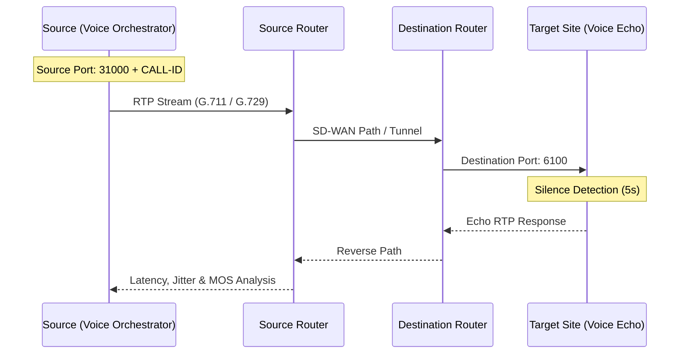

# 🎙️ Voice Simulation (RTP) Guide

The SD-WAN Traffic Generator includes a sophisticated Voice over IP (VoIP) simulation engine. Unlike standard HTTP traffic, this module simulates real-time RTP (Real-time Transport Protocol) streams to test Quality of Service (QoS) and SD-WAN path selection policies.

## 🚀 Overview

The system consists of two main components:
1.  **Voice Orchestrator**: Manages multiple simultaneous calls, handles timing between calls, and logs start/end events.
2.  **RTP Engine (`rtp.py`)**: A Scapy-based engine that forges raw Ethernet/IP/UDP/RTP packets to simulate specific audio codecs.

### 📡 Network Topology & Port Mapping

The following diagram illustrates the flow of simulated voice (RTP) calls and how ports are utilized for SD-WAN flow tracking.



## 🛠️ Configuration

### Server List (`voice-servers.txt`)
Located in your `config/` directory, this file defines where the traffic is sent.
**Format**: `target_ip:port|codec_name|weight|duration_sec`

Example:
```text
192.168.100.10:6100|G.711-ulaw|100|30
192.168.100.11:6100|G.729|50|60
```

*   **Target**: The IP and UDP port of the receiver (usually an `sdwan-voice-echo` container).
*   **Codec**: Display name for the UI.
*   **Weight**: Probability of picking this target (higher = more frequent).
*   **Duration**: How long the call lasts in seconds.

### Simulation Settings
Accessible via the **Voice** tab in the Web UI:
*   **Max Simultaneous Calls**: How many concurrent RTP streams to run (Max 10 recommended).
*   **Sleep Between Calls**: Delay before starting a new call after one ends.
*   **Source Interface**: The network interface to use (e.g. `eth0`, `eth1`). Note: In `host` networking mode, it sees all physical interfaces of the machine.

## 📡 Echo Server Setup (Targets)

Deploy the **Voice Echo Server** on your target sites. It tracks incoming calls and bounces back the RTP traffic for end-to-end path validation.

### Quick Deployment on Target
```bash
# Pull and start the echo server (Now listens on 6100 and 6101 by default)
docker run -d --name sdwan-voice-echo \
  -p 6100-6101:6100-6101/udp \
  --restart unless-stopped \
  jsuzanne/sdwan-voice-echo:stable
```

---

## 🔧 Pro Features & Networking

### 🎯 Deep Inspection & Call IDs (v1.1.0-patch.61+)
The generator embeds its internal **CALL-ID** (e.g., `CALL-0001`) directly inside the RTP payload. The Echo Server decodes this ID and logs it, allowing you to trace exactly which call is hitting which target in your logs.

### 🔗 Flow Separation & Traceability (v1.1.2+)
To provide realistic SD-WAN testing and easy flow correlation, each call now uses a **deterministic source port** (Range **31000+**) derived from the **CALL-ID**.
- **Deterministic Mapping**: 
    - `CALL-0001` → Source Port `31001`
    - `CALL-0015` → Source Port `31015`
- **SD-WAN Benefit**: You can search for `src-port 31015` in your SD-WAN Orchestrator flow browser to isolate and trace exactly which tunnels/circuits a specific call utilized.
- **Graceful Fallback**: If a deterministic port is already in use by the OS, the engine automatically falls back to a random port in the **40000-65535** range.
- **Echo Logic**: The Echo server identifies call completion using a **5-second silence timeout** per flow.

### 🧹 Clean Slate Architecture
On every restart of the `voice-gen` container:
- Stats logs are truncated (empty start).
- Call counters reset to `CALL-0001`.
- The simulation starts in `Disabled` mode for safety.
This ensures the Web UI and Console are always perfectly synchronized.

---

## 📊 Measurement Methodology & Reliability

To ensure lab-grade diagnostic results, the Voice Simulation module uses high-precision timing and industry-standard mathematical models.

### ⏱️ Latency & Round-Trip Time (RTT)
Unlike standard application-level pings, the RTP engine measures the **literal flight time** of every packet.
*   **Precision**: Uses high-resolution hardware monotonic counters (`time.perf_counter()`).
*   **Robustness**: Measurements are unaffected by system clock adjustments or "time jumps" during testing.
*   **Total Path**: Values reflect the round-trip performance of the primary link and the return path from the echo server.

### 📡 Jitter (Inter-arrival Variance)
Jitter is calculated strictly according to **RFC 3550 (Standard RTP)**:
$$J = J + (|D(i-1,i)| - J)/16$$
*   **Why it matters**: Jitter is the leading indicator of "robotic" sounding voice. Tracking the inter-arrival variance helps network engineers tune Jitter Buffers on SD-WAN edges or identify congestion on service provider links.
*   **Reliability**: Since this follows the exact RFC used by professional analyzers like Wireshark, you can cross-reference our results with packet captures for perfect correlation.

### 🧠 MOS Score (Mean Opinion Score)
The system calculates a predictive MOS score using the **Simplified ITU-T G.107 E-model**.

| MOS Score | Quality | User Experience |
| :--- | :--- | :--- |
| **4.0 - 4.4** | **Excellent** | Toll-quality audio. No perceptible delay or loss. |
| **3.6 - 4.0** | **Good** | Business-quality. Very slight delay, perfectly usable. |
| **2.5 - 3.6** | **Fair** | Noticeable distortion. Occasional robotic sound or clipping. |
| **< 2.5** | **Poor** | Severe clipping. Call dropouts likely. Unusable for business. |

**The math behind the score**:
1.  **Effective Latency**: We combine RTT and Jitter into an "effective" burden: `Effective Latency = RTT + (Jitter * 2) + 10ms`.
2.  **Delay Impairment**: Latency over 160ms begins to sharply penalize the score.
3.  **Codec Modeling**: We apply specific equipment impairment factors for the **G.711 codec**, ensuring the score reflects the codec being simulated in the lab.

---

## 🖥️ Running on Windows (Docker Desktop)

If you are testing the generator or the echo server on Windows, keep these three points in mind:

1.  **Network Mode**: `network_mode: host` is **not supported** on Windows.
    - Edit `docker-compose.yml` and comment out `network_mode: host`.
    - Windows will use its internal `bridge` networking instead.
2.  **Firewall**: Windows Defender Firewall is strict. You **must** manually create an Inbound Rule for **UDP Port 6100** to allow traffic to reach the Echo Server.
3.  **WSL2 Engine**: Ensure Docker is configured to use the **WSL2 based engine** for better Scapy performance.

---

## 📊 Monitoring & Logs

### Web UI
The **Voice Monitoring** tab shows calls in real-time. 
- **Active Calls**: Shows currently running streams.
- **Recent History**: Shows the last 500 events (Newest First).

### CLI Debugging
**Generator logs:**
```bash
docker compose logs -f sdwan-voice-gen
```
*Output example:*
```text
[CALL-0012] 📞 CALL STARTED: 192.168.203.100:6100 | G.711-ulaw | 15s
```

If you enable `DEBUG=true` in your environment, you will also see the explicit source port being used for flow tracking:
```text
[11:00:00] [CALL-0012] ⚙️ Source Port: 31012 (Flow tracking enabled)
```

**Echo Server (Target) logs:**
```bash
docker compose logs -f sdwan-voice-echo
```
*Output example (with Call ID tracing):*
```text
📞 [22:42:22] Incoming call: CALL-0012 from 192.168.217.5:54321
✅ [22:42:42] Call CALL-0012 finished (last from 192.168.217.5:54321)
```

### ⚠️ Troubleshooting
*   **Unknown in Echo logs?** Your script or container is likely from an older version or a native Python execution without the Call ID injection.
*   **Skipping call?** Check if the destination IP is pingable from the generator machine.
