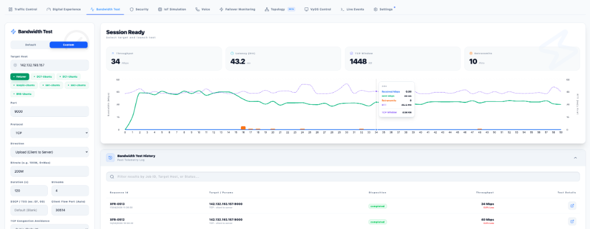
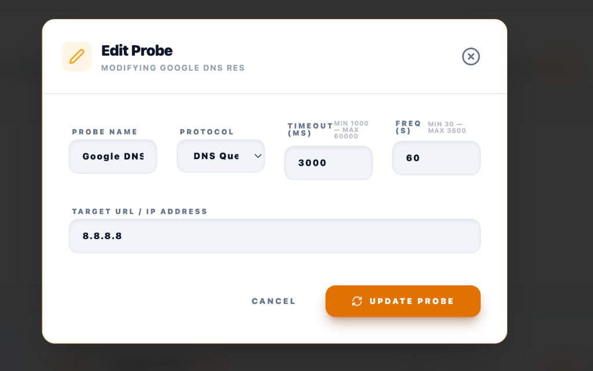
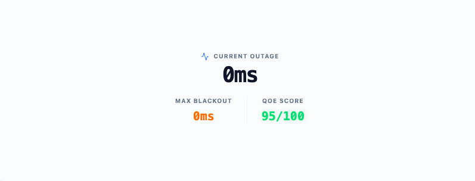

# XFR Speedtest & Throughput Testing

[](https://github.com/lance0/xfr)

The **XFR** tool is a high-performance throughput and latency testing engine integrated into the SD-WAN Traffic Generator. Designed for validating path quality, detecting maximum bandwidth, and performing bidirectional diagnostic tests — without the overhead of iperf3.

> [!NOTE]  
> XFR was chosen over iperf3 for Speedtest because it supports **fixed source ports** for deterministic flow identification in Prisma SD-WAN flow logs, and it provides richer interval telemetry such as real-time retransmits and dropped packets tracking.

---

## 📋 Table of Contents
1. [Features](#features)
2. [Deployment (Configuration Variables)](#deployment-configuration-variables)
3. [UI Walkthrough](#ui-walkthrough)
4. [Advanced Metrics](#advanced-metrics)
5. [Quick Targets](#quick-targets)
6. [Protocol Tracking (Prisma SD-WAN)](#protocol-tracking-prisma-sd-wan)

---

## ✨ Features

| Feature | Detail |
|---|---|
| **Deterministic Port Mapping** | Explicit Source port configuration (Client Flow Port) for easy identification in firewall/flow logs across TCP and UDP. |
| **Micro-Interval Telemetry** | View real-time throughput (Mbps), RTT (ms), TCP Retransmits, and UDP Packet Loss (%) natively as graphs. |
| **Congestion Control** | Easily hot-swap between TCP Congestion avoidance algorithms (Cubic, BBR, Reno) natively from the Dashboard. |
| **Quality of Service** | Embed specific DSCP / TOS markings (e.g. EF, CS1, 46) directly onto the testing flow to validate SD-WAN path prioritization limits. |
| **Directional Modes** | Upload (Client → Server), Download (Reverse), and Bidirectional testing capabilities natively. |
| **Max Bandwidth Detection** | Set bitrate to `0` or leave empty to detect peak throughput effortlessly. |

---

## 🚀 Deployment (Configuration Variables)

The XFR target uses a robust backend server spawned silently inside the `stigix` container (since version 1.2.2). The testing ceiling parameters are rigidly controlled directly within the `docker-compose.yml` environment block to prevent external abuse.

### docker-compose.yml Parameters

```yaml
services:
  stigix:
    image: jsuzanne/stigix:stable
    network_mode: host
    environment:
      # --- XFR Bandwidth Target ---
      - XFR_PORT=9000
      - XFR_MAX_DURATION=3600
      - XFR_RATE_LIMIT=2
      - XFR_ALLOW_CIDR=0.0.0.0/0
```

> [!IMPORTANT]  
> **Hard Limit Protection**: The `XFR_MAX_DURATION` acts as an absolute ceiling managed by the host. If a remote client queries a test duration exceeding this value (e.g. setting 3600s), but the server’s compose `XFR_MAX_DURATION` is defined as `60`, the server will forcibly sever the connection exactly at 60 seconds as a traffic safeguard. Adjust this to the maximum duration you are comfortable allowing testers to utilize.

### Environment Reference

| Variable | Default | Description |
|---|---|---|
| `XFR_PORT` | `9000` | TCP/UDP listening port to execute tests over. |
| `XFR_MAX_DURATION`| `3600` | Maximum host test duration in seconds (safeguard). |
| `XFR_RATE_LIMIT` | `2` | Max concurrent active testing sessions allowed. |
| `XFR_ALLOW_CIDR` | `0.0.0.0/0` | Permitted Source IP whitelist (CIDR notation). |

---

## 🖥️ UI Walkthrough

### Custom Configuration Panel

The updated configuration panel layout was redesigned to make room for granular path modeling variables:

**New Configuration Settings:**
* **DSCP / TOS:** Allows forcing traffic into specific Prisma SD-WAN QoS priority queues. You can type Hex, Decimal or explicit EF markings.
* **TCP Congestion Avoidance:** Seamlessly drop-down to benchmark Cubic vs BBR routing profiles.
* **Client Flow Port:** Native tracking feature; manually stipulate the source port you plan to emit from. Essential for identifying exactly which traffic flow corresponds to this test in your Prisma Access or Prisma SD-WAN analytics view. 

---

## 📊 Advanced Metrics

The testing framework now intelligently switches visual graphs and data endpoints depending on if a UDP or TCP payload testing flow is selected.

### TCP: Retransmit Tracking & Windowing

When testing TCP, the dashboard automatically reveals active `TCP Window` fluctuations and visualizes `TCP Retransmits` directly over the throughput tracking graph:



This visually correlates drops in speed sequentially with spikes in retransmissions! Opening the **Test Details** dialog will also provide an aggregate byte loss breakdown on test conclusion:




### UDP: Packet Loss & Jitter Tracking

When testing UDP, the framework seamlessly pivots to a metric analysis tailored for latency-sensitive traffic. The UI substitutes Windowing for real-time tracking of `Packet Loss` spikes:



---

## 🎯 Quick Targets 

Pre-configure frequently used target hosts via the `XFR_QUICK_TARGETS` environment variable:

```bash
XFR_QUICK_TARGETS="Hetzner:xxx.xxx.xxx.xxx,Lab-DC:10.0.0.5,Branch-Router:192.168.1.1"
```

These appear as **pill buttons** below the Target Host input — one click to populate the field instantly.

---

## 🔬 Protocol Tracking (Prisma SD-WAN)

If you are a Prisma Administrator utilizing the dashboard, Stigix overrides basic flow handling to support Deep Packet Tracking. 

| Protocol | Source Port Configuration | Identification Strategy |
|---|---|---|
| **UDP** | Explicit via `Client Flow Port` | Matches the specified `Client Flow Port` straight into the Prisma SD-WAN flow browser logs for pure traffic isolation identification. |
| **QUIC** | Explicit via `Client Flow Port` | Functions equivalently to the UDP engine mapping trace. |
| **TCP** | Explicit via `Client Flow Port` | Modern XFR permits direct binding to local source ports prior to execution. By enforcing the port to `30528`, you can query the Prisma Application Browser filtering by `source-port=30528` and instantly prove path performance! |

---

## 📚 External Resources

- [XFR GitHub Repository](https://github.com/lance0/xfr) — official engine documentation
