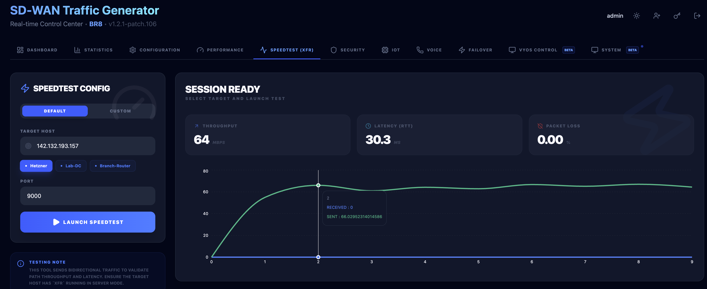
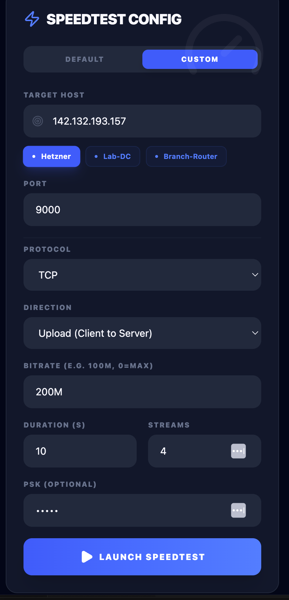

# XFR Speedtest & Throughput Testing

[](https://github.com/lance0/xfr)

The **XFR** tool is a high-performance throughput and latency testing engine integrated into the SD-WAN Traffic Generator. Designed for validating path quality, detecting maximum bandwidth, and performing bidirectional diagnostic tests — without the overhead of iperf3.

> [!NOTE]
> XFR was chosen over iperf3 for Speedtest because it supports fixed source ports (`--cport`) for deterministic flow identification in SD-WAN flow logs, and it provides richer, real-time telemetry.

---

## 📋 Table of Contents
1. [Features](#features)
2. [Deployment (Target Server)](#deployment-target-server)
3. [UI Walkthrough](#ui-walkthrough)
4. [Quick Targets](#quick-targets-reusability)
5. [Protocol Specifics](#protocol-specifics)
6. [External Resources](#external-resources)

---

## ✨ Features

| Feature | Detail |
|---|---|
| **Deterministic Port Mapping** | Source ports mapped as `40000 + sequence_id` for easy identification in firewall/flow logs (UDP only) |
| **Micro-Interval Telemetry** | Real-time throughput (Mbps), RTT (ms), and Packet Loss (%) |
| **Directional Modes** | Upload (Client → Server), Download (Reverse), and Bidirectional testing |
| **Protocol Support** | TCP, UDP, and QUIC |
| **Max Bandwidth Detection** | Set bitrate to `0` or leave blank to detect peak throughput |
| **Quick Targets** | Pre-configured pill shortcuts for frequently used hosts |

---

## 🚀 Deployment (Target Server)

The XFR target is a **separate dedicated container** deployed on the target machine (DC or branch). It is independent of the `sdwan-voice-echo` container.

### docker-compose.yml (Target Machine)

```yaml
services:
  # Voice Echo Server (Voice / Convergence / HTTP)
  voice-echo:
    image: jsuzanne/sdwan-voice-echo:latest
    container_name: sdwan-voice-echo
    network_mode: host
    restart: unless-stopped
    environment:
      - DEBUG=True
    ports:
      - "6100-6101:6100-6101/udp"
      - "6200:6200/udp"      # Convergence tests
      - "5201:5201/tcp"      # iperf3
      - "5201:5201/udp"      # iperf3
      - "8082:8082/tcp"      # HTTP Target

  # XFR Speedtest Target (replaces iperf3 for throughput testing)
  xfr-target:
    image: jsuzanne/xfr-target:latest
    container_name: xfr-target
    network_mode: "host"
    restart: unless-stopped
    environment:
      - XFR_PORT=9000            # Listening port
      - XFR_MAX_DURATION=60      # Max test duration in seconds
      - XFR_RATE_LIMIT=2         # Max concurrent sessions
      - XFR_ALLOW_CIDR=0.0.0.0/0 # Allow any source (adjust for security)
```

> [!TIP]
> Use `network_mode: host` for accurate latency measurements — container NAT adds unwanted overhead.

### Environment Variables Reference

| Variable | Default | Description |
|---|---|---|
| `XFR_PORT` | `9000` | TCP/UDP listening port |
| `XFR_MAX_DURATION` | `60` | Maximum test duration (seconds) |
| `XFR_RATE_LIMIT` | `2` | Max concurrent test sessions |
| `XFR_ALLOW_CIDR` | `0.0.0.0/0` | Source IP whitelist (CIDR notation) |

---

## 🖥️ UI Walkthrough

### Session Ready — Results View

After a test completes, the dashboard displays real-time telemetry with throughput graph, RTT, and packet loss:



**Key metrics shown:**
- **Throughput** (Mbps) — live graph + final value
- **RTT (ms)** — average round-trip time
- **Packet Loss (%)** — detected loss per interval

### Custom Configuration Panel

The configuration panel allows full control over the test target and parameters:



**Config options:**
| Field | Description |
|---|---|
| **Target Host** | IP or hostname of the `xfr-target` container |
| **Port** | Must match `XFR_PORT` on the target (default `9000`) |
| **Protocol** | TCP, UDP, or QUIC |
| **Direction** | Upload (↑), Download (↓), or Bidirectional (↕) |
| **Bitrate** | Target rate (e.g. `200M`) — leave blank for max |
| **Duration** | Test duration in seconds |
| **Streams** | Parallel streams (1–8) |
| **PSK** | Optional pre-shared key for authentication |

---

## 🎯 Quick Targets (Reusability)

Pre-configure frequently used target hosts via the `XFR_QUICK_TARGETS` environment variable on the **Traffic Generator** container:

```bash
XFR_QUICK_TARGETS="Hetzner:xxx.xxx.xxx.xxx,Lab-DC:10.0.0.5,Branch-Router:192.168.1.1"
```

These appear as **pill buttons** below the Target Host input — one click to populate the field instantly.

---

## 🔬 Protocol Specifics

| Protocol | Source Port | Notes |
|---|---|---|
| **UDP** | `40000 + sequence_id` | Fixed port for SD-WAN flow log identification |
| **QUIC** | `40000 + sequence_id` | Same deterministic mapping as UDP |
| **TCP** | OS ephemeral | Source port pinning not available for TCP |

---

## 📚 External Resources

- [XFR GitHub Repository](https://github.com/lance0/xfr) — official engine documentation
- [XFR Docker Image](https://hub.docker.com/r/jsuzanne/xfr-target) — `jsuzanne/xfr-target:latest`
