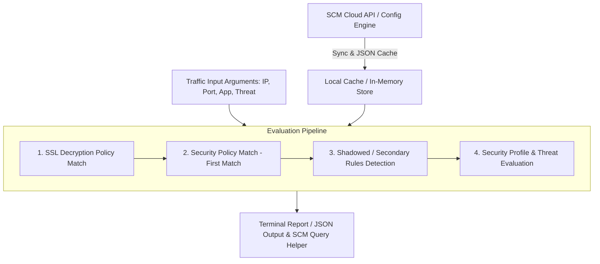

# Technical Documentation: `scm_traffic_log_viewer.py`

## 1. Overview

`scm_traffic_log_viewer.py` is a CLI-based policy evaluation and security diagnostic engine designed to simulate and analyze the enforcement of **Palo Alto Networks / Strata Cloud Manager (SCM)** security rules (Prisma Access & Prisma SD-WAN).

It correlates real network test traffic (e.g., generated via `curl`, Stigix test agents, or diagnostic probes) against cloud-managed security policies to determine:
* The **Winning Security Rule** (*First Match* engine)
* **Shadowed / Secondary Rules** (rules that would match if the primary rule was absent)
* **SSL Decryption Status** (*SSL Forward Proxy* vs *No-Decrypt*)
* The expected security action (**RESET-BOTH**, **DROP**, **ALLOW**) driven by attached Security Profiles and Threat Signatures.

---

## 2. Architecture & Evaluation Pipeline



---

## 3. Command-Line Arguments (CLI Reference)

```bash
python3 Scripts/scm_traffic_log_viewer.py [OPTIONS]
```

### Network Traffic Parameters
| Option | Type | Description | Example |
| :--- | :--- | :--- | :--- |
| `--src` | String | Source IP address (Client / Pre-NAT) | `192.168.219.1` |
| `--sport` | Integer | Local source port | `53991` |
| `--dst` | String | Destination (IP address or FQDN) | `target.stigix.io` |
| `--dport` | Integer | Destination port | `443`, `80` |
| `--protocol`| String | Transport protocol (`tcp`, `udp`, `icmp`) | `tcp` |
| `--app` | String | PAN-OS App-ID | `ssl`, `web-browsing`, `dns` |

### Threat & URL Context Parameters
| Option | Type | Description | Example |
| :--- | :--- | :--- | :--- |
| `--threat` | String | Threat identifier or keyword | `eicar`, `spyware`, `vulnerability` |
| `--category`| String | URL category or test scenario label | `EICAR Test (https://...)` |

### Diagnostic & Output Options
| Option | Description |
| :--- | :--- |
| `--json` | Outputs raw JSON data for CI/CD pipelines or `jq` parsing |
| `--list-rules` | Displays a condensed list of loaded security rules without object details |
| `--no-cache` / `--sync` | Forces a fresh synchronization with SCM APIs, updating local cache |
| `--verbose` | Shows detailed step-by-step matching criteria for every rule |

---

## 4. Report Breakdown

When executed, the script produces a structured 5-section diagnostic report:

1. **Platform & PCAP Header:**  
   Identifies the inspection platform (`PRISMA_SDWAN`, `PRISMA_ACCESS`, etc.) and PCAP capture status.
2. **Threat Event Details:**  
   * **Threat Name**: Associated signature name (e.g., *Eicar File Detected*)
   * **Threat ID**: PAN-OS Threat ID (e.g., `39040`)
   * **Severity / Category**: Severity rating and threat category (e.g., *Medium | code-execution*)
   * **Enforcement**: Configured action (`RESET-BOTH`, `DROP`, `ALLOW`)
3. **Network Mapping (Source & Destination):**  
   Details ingress/egress zones (`CORP` $\rightarrow$ `VPN`/`untrust`), interfaces (`vlan.219` $\rightarrow$ `ethernet0/1`), and NAT status.
4. **Active Security Policy (Winning Rule):**  
   The primary rule that successfully satisfied all 5-tuple parameters, application, and service requirements.
5. **Secondary / Shadowed Rules:**  
   Ordered list of subsequent rules that would have matched the criteria if the winning rule were not present.

---

## 5. Usage Examples

### Example 1: Evaluating an HTTPS EICAR Malware Stream
```bash
python3 Scripts/scm_traffic_log_viewer.py \
  --src "192.168.219.1" \
  --sport 53991 \
  --dst "target.stigix.io" \
  --dport 443 \
  --protocol tcp \
  --app "ssl" \
  --threat "eicar" \
  --category "EICAR Test (https://target.stigix.io/...)"
```

### Example 2: Listing Synchronized Security Rules (Condensed)
```bash
python3 Scripts/scm_traffic_log_viewer.py --list-rules
```

### Example 3: JSON Output for Automated Tooling
```bash
python3 Scripts/scm_traffic_log_viewer.py \
  --src "192.168.219.1" \
  --dst "target.stigix.io" \
  --dport 443 \
  --threat "eicar" \
  --json | jq '.winning_rule, .threat_details'
```

---

## 6. Best Practices & Troubleshooting

> [!NOTE]
> **Source Port Translation (NAT/PAT) & Log Search**  
> When Source NAT/PAT is active at the branch, the client's local port (`--sport`) is translated to a randomized Post-NAT port. When querying Cortex Data Lake (CDL) or SCM Log Viewer, search by **Destination IP** or **Threat ID** (`39040`) rather than the Pre-NAT source port.

> [!TIP]
> **SSL Decryption Prerequisites for Threat Detection**  
> For encrypted HTTPS traffic to be inspected and blocked by Threat Prevention:
> 1. **URL Category / FQDN Matching:** The custom URL list must include wildcards (e.g., `*.stigix.io/` and `target.stigix.io`) to properly match the TLS Server Name Indication (SNI).
> 2. **Zone Alignment:** Ensure Source and Destination zones in the Decryption rule cover the actual traffic paths.
> 3. **Traffic Path Routing:** Ensure traffic is routed through the intended inspection node (Prisma Access Remote Network tunnel vs. local Direct Internet Access breakout).
