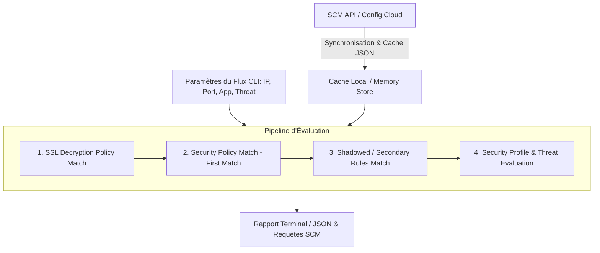

# Documentation technique : `scm_traffic_log_viewer.py`

## 1. Présentation générale

`scm_traffic_log_viewer.py` est un moteur CLI d'évaluation de politiques et d'inspection théorique de sécurité conçu pour simuler et diagnostiquer l'application des règles de sécurité **Palo Alto Networks / Strata Cloud Manager (SCM)** (Prisma Access & Prisma SD-WAN).

Il permet de corréler instantanément un flux réseau réel (testé via `curl`, sondes Stigix, etc.) avec la politique de sécurité configurée dans le Cloud, afin d'identifier :
* La **règle gagnante** (*Winning Rule* - First Match)
* Les **règles masquées** (*Shadowed Rules*)
* Le statut de la **décryption SSL** (*SSL Forward Proxy*)
* L'action de sécurité théorique appliquée (**RESET-BOTH**, **DROP**, **ALLOW**)

---

## 2. Architecture & Pipeline de Fonctionnement



---

## 3. Paramètres de la ligne de commande (CLI Arguments)

```bash
python3 Scripts/scm_traffic_log_viewer.py [OPTIONS]
```

### Paramètres de trafic réseau
| Option | Type | Description | Exemple |
| :--- | :--- | :--- | :--- |
| `--src` | String | Adresse IP source (Client / Pre-NAT) | `192.168.219.1` |
| `--sport` | Integer | Port source local | `53991` |
| `--dst` | String | Destination (IP ou FQDN) | `target.stigix.io` |
| `--dport` | Integer | Port de destination | `443`, `80` |
| `--protocol`| String | Protocole de transport (`tcp`, `udp`, `icmp`) | `tcp` |
| `--app` | String | Application PAN-OS identifiée | `ssl`, `web-browsing`, `dns` |

### Paramètres de contexte de menace & URL
| Option | Type | Description | Exemple |
| :--- | :--- | :--- | :--- |
| `--threat` | String | Identifiant ou mot-clé de menace | `eicar`, `spyware`, `vulnerability` |
| `--category`| String | Catégorie d'URL / Nom du test | `EICAR Test (...)` |

### Options avancées & Diagnostics
| Option | Description |
| :--- | :--- |
| `--json` | Sortie brute au format JSON (pour intégration CI/CD ou parsing `jq`) |
| `--list-rules` | Affiche la liste ordonnée des règles chargées sans le détail des objets |
| `--no-cache` / `--sync` | Force une ré-interrogation des API SCM pour rafraîchir le cache local |
| `--verbose` | Affiche le détail étape par étape du matching de chaque critère |

---

## 4. Structure du Rapport généré

Chaque exécution génère un rapport structuré en 5 sections :

1. **En-tête Plateforme & PCAP :**  
   Indique l'entité d'inspection (`PRISMA_SDWAN`, `PRISMA_ACCESS`, etc.) et la disponibilité des captures réseau.
2. **Détails de Menace (Event Type) :**  
   * **Threat Name** : Nom de la menace (ex: *Eicar File Detected*)
   * **Threat ID** : Identifiant PAN-OS (ex: `39040`)
   * **Severity / Category** : Sévérité et type de payload (ex: *Medium / code-execution*)
   * **Enforcement** : Action configurée (`RESET-BOTH`, `DROP`, `ALLOW`)
3. **Cartographie Réseau (Source & Destination) :**  
   Affiche les zones d'entrée/sortie (`CORP` $\rightarrow$ `VPN`/`untrust`), les interfaces (`vlan.219` $\rightarrow$ `ethernet0/1`) et le statut NAT.
4. **Active Security Policy (Winning Rule) :**  
   La première règle validant l'intégralité des 5 tuples et profils.
5. **Secondary / Shadowed Rules :**  
   Liste ordonnée de toutes les règles suivantes qui auraient également matché le trafic si la règle gagnante n'existait pas.

---

## 5. Exemples d'utilisation

### Exemple 1 : Évaluation d'un flux malveillant EICAR (HTTPS)
```bash
python3 Scripts/scm_traffic_log_viewer.py \
  --src "192.168.219.1" \
  --sport 53991 \
  --dst "target.stigix.io" \
  --dport 443 \
  --protocol tcp \
  --app "ssl" \
  --threat "eicar" \
  --category "EICAR Test"
```

### Exemple 2 : Lister les règles de sécurité synchronisées (format condensé)
```bash
python3 Scripts/scm_traffic_log_viewer.py --list-rules
```

### Exemple 3 : Exportation JSON pour traitement avec `jq`
```bash
python3 Scripts/scm_traffic_log_viewer.py \
  --src "192.168.219.1" \
  --dst "target.stigix.io" \
  --dport 443 \
  --threat "eicar" \
  --json | jq '.winning_rule, .threat_details'
```

---

## 6. Bonnes pratiques & Dépannage

> [!NOTE]
> **Corrélation des ports avec Cortex Data Lake (CDL)**  
> Si du Source NAT/PAT est configuré sur l'équipement de branche, le port source passé en CLI (`--sport`) correspond au port **Pre-NAT**. Pour retrouver le log réel dans la console SCM, effectuez la recherche par **Destination IP** ou par **Threat ID** (`39040`).

> [!TIP]
> **Vérification de la décryption SSL**  
> Pour qu'une menace chiffrée (HTTPS) soit bloquée au niveau de l'inspection Threat Prevention :
> 1. La **URL Category** doit inclure le sous-domaine complet (ex: `target.stigix.io` ou `*.stigix.io/`).
> 2. Les **Zones Source/Destination** de la règle de décryption doivent correspondre au flux d'entrée.
> 3. Le trafic doit être acheminé vers le composant d'inspection approprié (Prisma Access Remote Network vs sortie DIA locale).
