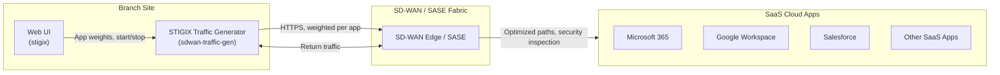
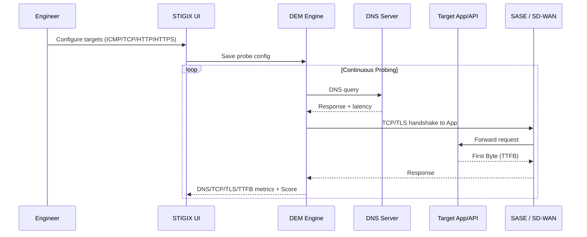
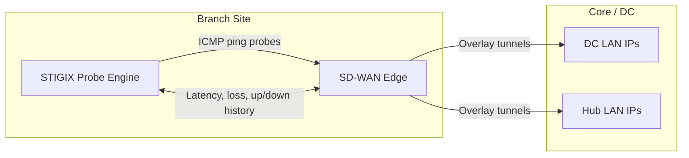
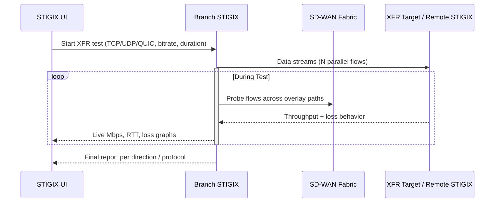
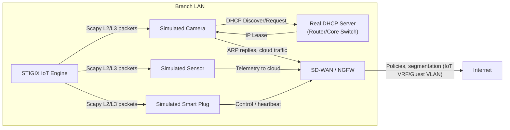
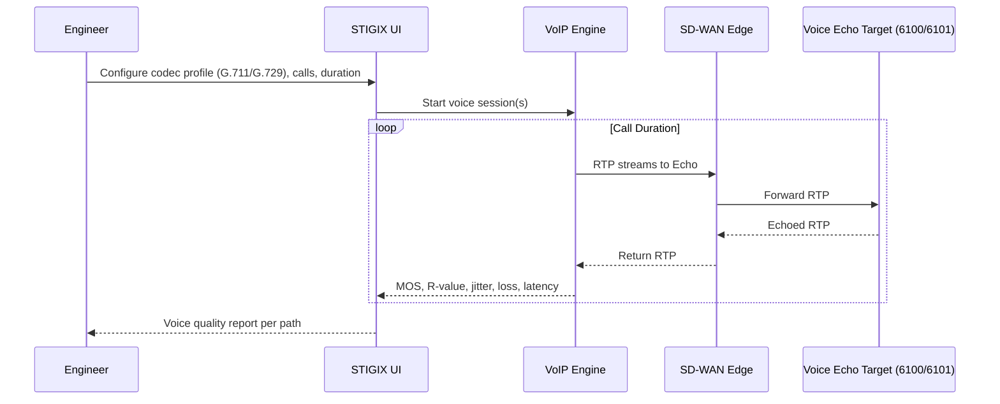
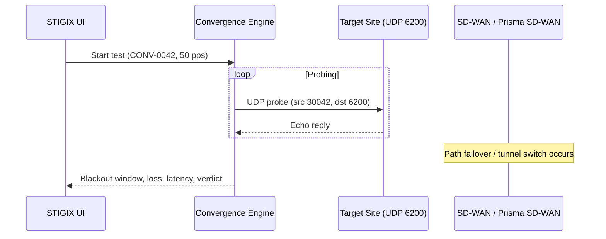
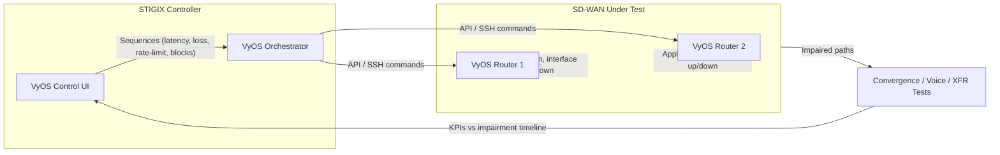

# STIGIX – SD-WAN & SASE Use Cases

## Use Case 1 – SaaS Traffic Generation

Generate and monitor realistic background traffic to popular SaaS applications with weighted distribution and live dashboards.



## Use Case 2 – Digital Experience Monitoring (DEM)

Measure DNS, TCP, TLS, and TTFB for configured targets and compute a synthetic experience score.



## Use Case 3 – SD-WAN Overlay Availability

Continuously ping remote Branch and DC LAN IPs to validate overlay health and keep history.



## Use Case 4 – Inter-Site Bandwidth Speedtest

Run TCP/UDP/QUIC bandwidth tests between instances (Branch↔DC, Branch↔Branch) with live throughput.



## Use Case 5 – Security Testing (URL / DNS / Threat / EDL)

Validate URL filtering, DNS security, Threat Prevention, and EDLs with scheduled tests and history.

```mermaid
flowchart TB
    subgraph Branch["Branch / Lab Site"]
        UI["STIGIX Security UI"]
        Engine["Security Test Engine"]
        Edge["NGFW / SASE Edge"]
    end

    subgraph Internet["Internet / Test Targets"]
        URLSet["66 URL Categories"]
        DNSSet["24 DNS Test Domains"]
        EICAR["EICAR Test File Endpoint"]
        EDLHost["EDL Source URLs"]
    end

    UI -->|"Schedules, policies"| Engine
    Engine -->|"HTTP(S) URL tests"| Edge
    Engine -->|"DNS queries"| Edge
    Engine -->|"EICAR download attempt"| Edge
    Engine -->|"EDL sync / lookups"| Edge

    Edge -->|"Allow/Block/Sinkhole decisions"| Internet
    Edge -->> Engine: Logs, verdicts
    Engine -->> UI: History, scores, export
```

## Use Case 6 – IoT Simulation

Simulate cameras, sensors, and smart plugs with real DHCP/ARP/L2 behavior to test segmentation, security, and failover.



## Use Case 7 – VoIP Simulation

Generate RTP calls (G.711/G.729) against a voice echo target to measure MOS, jitter, loss, and latency.



## Use Case 8 – Convergence & VyOS Impairment

Measure sub‑second failover with Convergence Lab and orchestrate controlled impairments on VyOS.

### 8.1 Convergence Lab



### 8.2 VyOS Control


